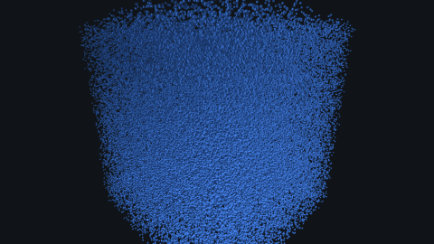
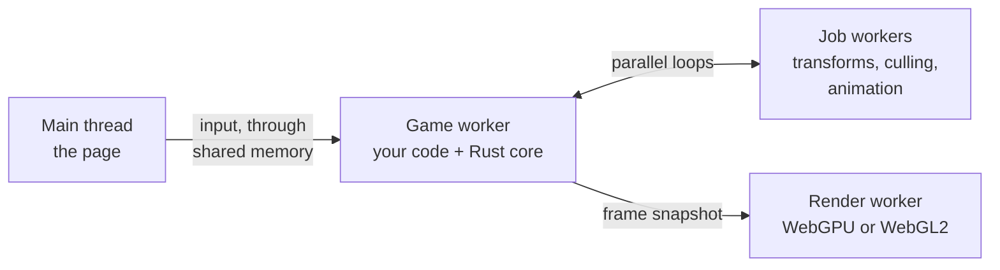

<p align="center">
  
</p>

<h1 align="center">sokko3d</h1>

<div align="center">

[](https://github.com/sokko3d/sokko3d/actions/workflows/ci.yml)
[](#community-and-license)
[](#roadmap)
[](docs/concepts/backends.md)
[](docs/concepts/architecture.md)
[](docs/index.md)

</div>

<p align="center">
  <strong>A browser 3D engine for games and heavy 3D apps. Its Rust core runs on worker threads,
  it draws with WebGPU or WebGL2, and you write your game in TypeScript with three.js-style names.</strong>
</p>

<p align="center">
  Pre-alpha: the design is done, and the first milestone, a proof of speed, is in progress.
  Nothing is on npm yet.
</p>

<p align="center">
  <a href="#quickstart">Quickstart</a>
  · <a href="#features">Features</a>
  · <a href="#how-it-works">How it works</a>
  · <a href="#where-it-runs">Where it runs</a>
  · <a href="docs/index.md">Docs</a>
  · <a href="#porting-from-threejs">Porting from three.js</a>
  · <a href="#roadmap">Roadmap</a>
</p>

<p align="center">
  <sub>⭐ If you want to see this engine built, a star helps other people find it.</sub>
</p>

<p align="center">
  
  <br />
  <sub>Benchmark scene S1: 100,000 boxes that game code moves every frame, drawn by sokko3d with WebGPU.</sub>
</p>

## What is sokko3d?

sokko3d is a browser 3D engine that aims to replace three.js where CPU time limits a scene. That happens with many moving objects, deep scene graphs, animation and culling. The engine's core is Rust compiled to WebAssembly, and it runs on worker threads, so the page's main thread stays free.

It draws with WebGPU, and with WebGL2 where WebGPU is missing, from the same game code. That matters most on phones, where many devices still have no WebGPU. Where the GPU is the limit, sokko3d aims to match three.js, because both engines use the same browser graphics APIs.

## Quickstart

Nothing is on npm yet, but the benchmark scenes run from a clone of this repository. First install the tools that [Development](#development) lists.

```sh
git clone https://github.com/sokko3d/sokko3d.git
cd sokko3d
bun install
bun run build
bun run dev
```

Then open one of these pages in Chrome:

| Page | What it shows |
| --- | --- |
| `http://localhost:5173/bench/pages/sokko3d/s1.html?demo` | S1: 100,000 boxes, each moved every frame by game code |
| `http://localhost:5173/bench/pages/sokko3d/s2.html?demo` | S2: a scene graph of 5,096 objects |
| `http://localhost:5173/bench/pages/threejs/s1.html?renderer=webgl&demo` | S1 in three.js, to compare |

`bun run bench:run` measures S1 in both engines and prints a table of CPU time per frame.

This is what a complete sokko3d project will look like. The page starts the engine:

```ts
// page.ts (main thread)
import { createEngine } from '@sokko3d/engine';

await createEngine({
  canvas: document.querySelector('canvas')!,
  game: new URL('./game.ts', import.meta.url),
});
```

Your game runs in a worker:

```ts
// game.ts (game worker)
import { defineGame } from '@sokko3d/engine';

export default defineGame(async ({ scene, geometry, materials }) => {
  const camera = scene.createPerspectiveCamera({ fov: 60, position: [0, 1.5, 4], target: [0, 0, 0] });
  scene.setActiveCamera(camera);
  scene.createDirectionalLight({ direction: [-1, -2, -1], intensity: 3, castShadows: true });

  const cube = scene.createMesh({
    mesh: geometry.box({ width: 1, height: 1, depth: 1 }),
    material: materials.standard({ color: '#4a8cff', roughness: 0.5 }),
    castShadows: true,
    dynamic: true, // it moves every frame
  });

  return {
    onUpdate(dt) {
      cube.rotateY(dt * 0.8);
    },
  };
});
```

The first release, 0.1, will add the `@sokko3d/engine` package and the `sokko3d dev` command, a dev server that sends the right headers. Until then, [Development](#development) shows how to work on the engine itself.

## How it works



1. **Your game code runs in a worker.** It reads and writes scene data in shared arrays, with no copies and no messages, so the page's main thread stays free for the page. See [Architecture: threads and the frame](docs/concepts/architecture.md).
2. **The Rust core works in parallel.** Job workers update transforms, sample animation and cull objects over flat arrays with SIMD, then record binary draw lists. See [Handles and objects](docs/concepts/handles.md).
3. **One worker owns the GPU.** The render worker replays the draw lists and runs no game code, so a garbage-collection pause in your code cannot delay a frame. See [GPU tiers and backends](docs/concepts/backends.md).
4. **Presets hold the frame rate on phones.** Four quality presets and dynamic resolution adjust the work to the device, and a frame-budget governor steps settings down before frames drop.

## Features

- **One copy of scene data.** Positions and rotations live in shared typed arrays that your TypeScript writes directly. There are no mirrored objects and no per-frame sync.
- **GPU-driven drawing on WebGPU.** The GPU culls the scene and fills in the draw counts, so CPU time per frame should stay almost flat from 1,000 to 100,000 objects.
- **A lean WebGL2 path for phones.** Job workers cull in parallel, static data stays on the GPU, and multi-draw sends many groups in one call.
- **Static and dynamic objects.** Objects that rarely move cost nothing in frames where they stay still. See [Static and dynamic objects](docs/concepts/static-dynamic.md).
- **Instance batches.** Thousands of copies of one mesh are one engine object and one set of typed arrays, with culling per instance.
- **WGSL everywhere.** You write shaders once in WGSL, and the build translates them for WebGL2. A surface function changes a material's look and keeps the engine's lighting, shadows and fog.
- **Made for coding agents.** Two agent skills teach agents the engine, and agents look up docs pages by ID. Status labels mark planned APIs, and every error message says how to fix the problem.
- **Measured against three.js.** Every performance claim comes with a benchmark against a three.js version of the same scene, and image tests compare frames on each GPU tier.

<details>
<summary><strong>Everything else in the design, by version</strong></summary>

<br />

| Version | Adds |
| --- | --- |
| 0.1 | Clustered forward lighting with MSAA, cascaded shadows, fog, quality presets, dynamic resolution, render layers, orbit and map camera controls, debug drawing, WGSL imports from an engine shader library, and a headless test runner |
| 0.2 | glTF with KTX2 textures and meshopt compression, the `sokko3d assets` optimizer, skeletal and morph animation, raycasting, pointer events on objects, environment lighting, skies, post-processing with custom effects, custom render passes, sprites, points, wide lines, HTML labels, large-world mode, and occlusion culling on both GPU paths |
| 0.3 | The docs site and `sokko3d docs`, starter templates, an MCP server, an in-page inspector, an ESLint plugin, and the three.js porting tools |

</details>

## Why it is faster

three.js keeps each object as a JavaScript object and walks the scene graph object by object in every frame. That work grows with the object count and runs on the page's main thread. sokko3d keeps scene data in flat arrays inside WebAssembly memory, processes them in bulk on job workers, and lets your code write straight into them:

```ts
const rocks = scene.createInstances(rockMesh, 10_000, { dynamic: true });

// In onUpdate: one typed-array loop, no allocation, no per-object calls.
const p = rocks.positions; // Float32Array, 3 floats per row
for (let i = 0; i < rocks.count; i++) p[i * 3 + 1] += 0.5 * dt;
```

On WebGPU, the GPU then culls and counts the draws itself, and the CPU replays the same prerecorded render bundles each frame. The targets below are what the first milestone measures against three.js best practice (instanced meshes, frustum culling, and the faster of its two renderers):

| Measure | Target |
| --- | --- |
| The engine's own CPU time per frame on its busiest thread, 100,000 moving instances, desktop Chrome on WebGPU | At most 50% of three.js's |
| CPU time per frame at phone scale, on WebGPU and WebGL2 phones and tablets | At most 100% of three.js |
| Core download size | At most 600 KB after Brotli compression |

An engine's own time leaves out the game code that moves the instances, which runs alike in both engines. "Phone scale" is the largest instance count at which three.js still holds 30 frames per second on that device. The milestone is not finished, so the table lists targets. This section will show the measured numbers when it ends.

## Where it runs

sokko3d picks its GPU path at startup from feature tests. It never checks browser or GPU names, because some browsers hide them.

| Device and browser | GPU path |
| --- | --- |
| Chrome and Edge 113+ on Windows, macOS and ChromeOS | WebGPU |
| Safari 26 on macOS, iOS and iPadOS | WebGPU |
| Firefox 141+ on Windows, and 147+ on Apple silicon Macs | WebGPU |
| Chrome 121+ on Android 12+ with ARM, Qualcomm or Intel GPUs | WebGPU |
| Chrome 146+ on devices with only OpenGL ES 3.1 or Direct3D 11 | WebGPU compatibility mode |
| iPhones on iOS 16.4 to 18 | WebGL2 |
| Android phones without WebGPU, such as those with Samsung Xclipse GPUs | WebGL2 |
| Firefox on Android and Linux | WebGL2 |

The minimum versions are Safari 16.4, Chrome and Edge 91, and Firefox 89. Worker threads need two HTTP headers on your page, and [Hosting and cross-origin isolation](docs/getting-started/hosting.md) shows them for common hosts. Without the headers, sokko3d runs single-threaded. Desktop apps can use Electron, which ships the same Chromium on every system.

## Porting from three.js

The API uses three.js names where the ideas match. A few of the 147 entries in the mapping:

| three.js | sokko3d | Since |
| --- | --- | --- |
| `WebGLRenderer` / `WebGPURenderer` | `createEngine({ canvas, game })` on the page; scene code moves into `defineGame()` in a worker | 0.1 |
| `MeshStandardMaterial` | `materials.standard({ color, map, metalness, roughness, ... })` | 0.1 |
| `InstancedMesh` with `setMatrixAt` | `scene.createInstances(mesh, count, { dynamic })`, then write the batch's typed arrays | 0.1 |
| `OrbitControls` | `createOrbitControls(ctx, camera, { ... })` from `@sokko3d/controls` | 0.1 |
| `GLTFLoader` | `await assets.loadGltf(url)`, then `scene.instantiate(prefab)` | 0.2 |
| `Raycaster` | `camera.screenToRay(x, y, ray)`, then `scene.raycast(...)` | 0.2 |

The full [three.js to sokko3d mapping](docs/porting/threejs-mapping.md) covers renderers, materials, loaders, animation, post-processing and more. The [porting skill](skills/sokko3d-port-threejs/SKILL.md) walks a coding agent through a port, and its scanner lists every three.js feature an app uses.

## For AI agents

sokko3d is built so that a coding agent can create, run, test and debug a game with nobody watching.

- Two agent skills come with the engine. [sokko3d-develop](skills/sokko3d-develop/SKILL.md) builds and speeds up sokko3d projects, and [sokko3d-port-threejs](skills/sokko3d-port-threejs/SKILL.md) ports three.js and React Three Fiber apps. Claude Code loads them from `.claude/skills/` in this repository.
- Every docs page has an ID, such as `concepts/architecture`, and a status. Agents never use an API whose page is `planned`.
- [AGENTS.md](AGENTS.md) holds the rules for people and agents working on the engine.

## Examples

Each example names the first version with its API.

Thousands of moving objects in one batch (0.1):

```ts
const drones = scene.createInstances(droneMesh, 5_000, { dynamic: true, colors: true });
const velocity = new Float32Array(drones.count * 3); // your own data, one row per drone

// In onUpdate:
const p = drones.positions;
for (let i = 0; i < p.length; i++) p[i] += velocity[i] * dt;
```

A dissolve effect as a surface function, which keeps the engine's lighting (0.1):

```ts
const dissolve = materials.shader({
  alphaMode: 'mask', alphaCutoff: 0.5,
  uniforms: { progress: 0, edgeColor: '#ff6a00' },
  textures: { noise: await assets.loadTexture('/tex/noise.ktx2', { colorSpace: 'linear' }) },
  surface: /* wgsl */ `
    fn surface(input: SurfaceInput) -> Surface {
      var s = defaultSurface(input);
      let n = textureSample(noise, noiseSampler, input.uv).r;
      s.alpha = step(material.progress, n);
      let edge = 1.0 - smoothstep(0.0, 0.05, n - material.progress);
      s.emissive = material.edgeColor * edge * 4.0;
      return s;
    }`,
});
```

Picking an object under the pointer (0.2):

```ts
// Create both once, outside the frame loop.
const ray = { origin: [0, 0, 0], direction: [0, 0, -1] };
const hit = { object: null, point: [0, 0, 0], normal: [0, 0, 0], distance: 0, instance: -1 };

// In onUpdate:
if (input.wasPressed('Mouse0')) {
  camera.screenToRay(input.pointer.x, input.pointer.y, ray);
  if (scene.raycast(ray.origin, ray.direction, { layers: PICKABLE }, hit)) select(hit.object);
}
```

## Documentation

- [Documentation home](docs/index.md), with every page, its status and its version
- [Architecture: threads and the frame](docs/concepts/architecture.md)
- [Handles and objects](docs/concepts/handles.md)
- [Static and dynamic objects](docs/concepts/static-dynamic.md)
- [GPU tiers and backends](docs/concepts/backends.md)
- [Hosting and cross-origin isolation](docs/getting-started/hosting.md)
- [three.js to sokko3d mapping](docs/porting/threejs-mapping.md)

## Roadmap

Each milestone ends in a gate that must pass before the next one starts.

| Milestone | What it builds | Its gate |
| --- | --- | --- |
| M0, proof of speed (in progress) | The threaded core, both GPU backends with instanced meshes and one light, and benchmarks against three.js on a laptop, an Android phone and an iPad | The speed targets above are met |
| M1, core renderer (release 0.1) | Cameras, materials, clustered lights, shadows, fog, quality presets, dynamic resolution, camera controls and the first TypeScript API | Image tests pass on all three GPU tiers |
| M2, content (release 0.2) | glTF loading, the asset optimizer, animation, raycasting, environment lighting, post-processing, sprites, lines and large worlds | The showcase scenes hold their frame rates |
| M3, developer experience (release 0.3) | The docs site, the `sokko3d` command, templates, agent tooling and the porting tools | A coding agent builds each template game from the docs alone |
| M4, release 1.0 | The API freeze, a pass on many devices, size budgets and public benchmarks | All budgets met |

## Development

Requirements:

- [Bun](https://bun.sh/) 1.3.14 or newer
- The Rust toolchain through [rustup](https://rustup.rs/). The repository pins a nightly compiler, and rustup installs it on the first build.
- Node.js 24 or newer, which runs the browser tests
- Google Chrome, which the browser tests drive on your real GPU
- [mkcert](https://github.com/FiloSottile/mkcert), only to test on phones and tablets over HTTPS

```sh
git clone https://github.com/sokko3d/sokko3d.git
cd sokko3d
bun install              # installs the tools and the git hooks
bun run build            # builds both WebAssembly files and prints their sizes
bun run test             # unit tests for the engine, the docs and the repository tools
bun run test:browser     # image tests on WebGPU and WebGL2 in Chrome
bun run dev              # serves the test and benchmark pages with the isolation headers
bun run bench:run        # measures S1 in sokko3d and three.js in Chrome and prints a table
```

[AGENTS.md](AGENTS.md) has the rules, the commands and the commit checks that keep the docs in line with the code.

## Community and license

⭐ **If you want to see sokko3d built, a star helps other people find it.** It is the main way an open source project gets found.

Questions and bug reports are welcome in [GitHub Issues](https://github.com/sokko3d/sokko3d/issues).

Copyright (C) 2026 [Ramesh Nair](https://hiddentao.com).

sokko3d is licensed under either of the [Apache License 2.0](LICENSE-APACHE) or the [MIT license](LICENSE-MIT), at your option. Unless you explicitly state otherwise, any contribution you intentionally submit for inclusion in the work, as defined in the Apache-2.0 license, shall be dual licensed as above, without any additional terms or conditions.
