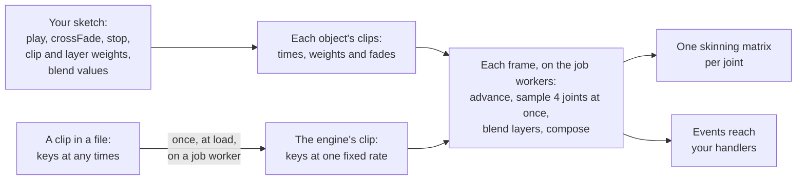

# Animation

> Ships in null3D 0.2. The API is experimental, so it can still change between versions.



Characters animate on the job workers, in the engine's WebAssembly core. Each frame, the job workers advance every animated object's clips, sample them, blend them, and compose the joints into skinning matrices. Your sketch's thread does none of this work, and a crowd spreads across every job worker. Your sketch has no update call to make.

## Models from glTF files

`assets.loadGltf` reads a model's skins, its clips and its morph targets. Each copy that `scene.instantiate` makes gets an animator on its group, which plays the model's clips. `prefab.clips` lists their names.

```ts
const knight = await assets.loadGltf('/models/knight.glb');
const hero = scene.instantiate(knight, { position: [0, 0, 0] });
hero.animator().play('Idle');
```

The engine builds one skeleton for the whole model. Its joints are every node that a skin names or a clip moves, every node below those, and every node above them. These nodes become joints, not objects, so `copy.find` does not find them. So each copy in a crowd costs one object per mesh, and its joints cost no objects.

- A skinned mesh goes in the copy's group, and its joints move its vertices, as glTF asks.
- A mesh without a skin on a node that a clip moves, or below a joint, moves with its node's joint. A sword in a hand, a helmet on a head and a box that a clip spins all follow their joints.
- A node that no clip moves keeps its place. One below a joint goes in the copy's group, where the joints rest.
- A light on a node that a clip moves is left out, and development builds warn about it.

A clip without a name takes the name three.js gives it: `animation_0`, `animation_1` and on, in the file's order. When two clips share a name, the second becomes `Name 2`, the third `Name 3`, and so on.

The loader hands every clip to the job workers, which resample them between frames. A model's clips are ready when `loadGltf` resolves. On the engine's test page, the KayKit Knight's 76 clips took 16 ms on two job workers. In the single-threaded mode, the sketch's thread resamples them a few milliseconds at a time.

`scene.clone(copy)` gives the clone an animator of its own, with no clip playing. `scene.createInstances(prefab, count)` draws a model's meshes in their rest pose: instance batches do not animate.

A model's morph targets load with their default weights, and its clips animate the weights, as [Morph targets](#morph-targets) says. A node's own `weights` replace its mesh's, as three.js reads them.

## Seeing the skeleton

`debug.skeleton(object)` draws the joints of an animated object, such as a copy's group, in the frame's pose. It draws a line from each joint of a skin to its parent joint. As in three.js's `SkeletonHelper`, a line is blue at the joint and green at its parent. Pass a color to draw every line in that color. Call it in `onUpdate`, as every debug drawing call. Only development builds draw it.

```ts
return {
  onUpdate() {
    debug.skeleton(hero);
  },
};
```

## Playing clips

An object that a model with animations created has an animator. `object.animator()` returns it, and `animator.clips` lists the names of the clips it can play.

```ts
const anim = hero.animator();
anim.play('idle');
anim.onEvent('footstep', () => page.post('sound', 'step'));

return {
  onUpdate() {
    const moving = input.isDown('KeyW');
    if (moving !== wasMoving) anim.crossFade(moving ? 'run' : 'idle', 0.25);
    wasMoving = moving;
  },
};
```

`play(name, options)` starts a clip. It takes these options:

| Option | Default | What it does |
| --- | --- | --- |
| `fade` | 0 | Seconds over which the clip fades in, while the other clips of its layer fade out. With 0, the clip takes over at once. |
| `loop` | `true` | `false` plays the clip once and holds its last frame. |
| `speed` | 1 | The rate of the clip's time. A negative speed plays the clip backward from its end. |
| `layer` | 0 | The layer, from 0 to 3. |
| `additive` | `false` | `true` adds the clip's change on top of the other layers. |
| `time` | the first frame | Seconds into the clip at which it starts. A repeating clip wraps the time into its length. A clip that plays once holds the time within its length. |
| `weight` | 1 | The clip's own weight, 0 or more. A play with a weight joins the other clips of its layer instead of fading them out, as [Clip weights](#clip-weights) shows. |

`crossFade(name, duration)` is `play` with a fade of `duration` seconds. A cross-fade always takes over its layer, with a weight too. A clip that already plays on its layer keeps its time when you play it again, and fades back in from its current weight. So calling `play` with the same clip again does no harm. A clip that played once and reached its end starts again.

A plain play fades out only the plain clips of its layer, and an additive play only the additive clips. So a walk keeps playing when a breath starts on its layer as an additive clip.

Keep the options of the plays that a game repeats in frozen constants. The animator reads a frozen options object once and keeps what it read, so a clip switch allocates nothing. From an object that is not frozen, the animator reads at every play. The browser then makes a new 12-byte number for each fraction it reads. The same holds for the points of `playBlend`.

```ts
const TO_RUN = Object.freeze({ fade: 0.3, weight: 0.75 });
const GAIT = Object.freeze({ walk: 1.4, run: 4 });
const SMOOTH = Object.freeze({ fade: 0.2 });

anim.play('run', TO_RUN);
anim.playBlend(GAIT, SMOOTH);
```

A crowd whose characters all start a clip at once steps in time. Give each character a start time of its own:

```ts
for (const [k, knight] of knights.entries()) {
  knight.animator().play('walk', { time: k * 0.37 });
}
```

`stop(name, { fade })` fades a clip out on every layer. `stop()` with no name stops every clip. A clip that stops at once, or fades out fully, leaves the pose. With no clip playing, the object holds its rest pose.

`setTimeScale(scale)` sets the rate of every clip of the object. Set it to 0 to pause the object's animation.

## Clip weights

Each clip has a weight of its own, as a three.js action has. A play with a `weight` joins the clips that already play on its layer, and the layer blends them by their weights. Where the weights add up to less than 1, the rest pose makes up the remainder, as three.js's mixer does.

```ts
const anim = knight.animator();
anim.play('walk', { weight: 0.7 });
anim.play('run', { weight: 0.3 });

return {
  onUpdate() {
    const run = Math.min(speed / 4, 1);
    anim.setWeight('walk', 1 - run);
    anim.setWeight('run', run);
  },
};
```

`setWeight(name, weight)` sets the weight of a clip that plays, on every layer that plays it. It writes the weight into engine memory, so you can change it every frame at no cost. A clip at weight 0 leaves the pose. It keeps playing, and its time moves on, as in three.js. A fade multiplies the weight: a clip at weight 0.5 that fades in reaches 0.5. In development builds, `setWeight` on a clip that does not play throws E1218.

Clips that blend by weight keep their own times. A walk and a run of different lengths then step at different moments, and the feet slide. A 1D blend keeps their steps together.

## 1D blends

A 1D blend mixes clips by one value, such as the character's speed. `playBlend(points, options)` gives each clip a point on a line. At a clip's point, that clip plays in full. Between two points, the two clips around the value share it. Past the first or the last point, that point's clip plays in full. `setBlend(value, layer)` moves the value. It writes engine memory, so you can call it every frame at no cost.

```ts
const anim = knight.animator();
anim.playBlend({ idle: 0, walk: 1.4, run: 4 }, { fade: 0.2 });

return {
  onUpdate() {
    anim.setBlend(speed);      // 2.7 m/s: walk and run share the pose half and half
  },
};
```

The clips of a blend share one phase, as PlayCanvas's blend trees and Godot's cyclic blend spaces keep them. Each clip's time moves at its length over the length of the blend's clips, averaged by their weights. At 2.7 m/s above, a walk of 1.07 s and a run of 0.73 s each take 0.9 s for a cycle. So both feet land together, whatever the value.

`playBlend` takes these options:

| Option | Default | What it does |
| --- | --- | --- |
| `value` | the layer's value | The blend value to start from. Each layer's value starts at 0. |
| `fade` | 0 | Seconds over which the blend fades in, while the other clips of its layer fade out. |
| `loop` | `true` | `false` plays the clips once and holds their last frames. |
| `speed` | 1 | The rate of the blend: 1 moves it through one cycle in the averaged length. A negative speed plays it backward. |
| `layer` | 0 | The layer, from 0 to 3. |
| `phase` | the layer's phase | The share of the cycle, from 0 to 1, at which the clips start. |

A blend holds 1 to 8 clips, each at a point of its own. Without a `phase`, a blend starts at the phase of the layer's blend. Failing that, it takes the phase of the first of its clips that the layer plays. So a switch from a walk to a blend with the walk keeps the step. `play` or `crossFade` on the layer ends the blend. Each of its clips then keeps the weight and the rate it had, and fades out. A call to `setWeight` on a clip of a blend multiplies its share of the blend.

## Layers and joint masks

Each animator has four layers, numbered 0 to 3. Layer 0 blends its clips with the rest pose. Each layer above replaces the pose of the layers below, by the layer's weight.

`setLayerMask(layer, joints)` limits a layer to some joints: each named joint and every joint below it. Pass the name of a joint, or an array of names. `null` gives the layer every joint again.

```ts
anim.play('walk');
anim.play('wave', { layer: 1, fade: 0.2 });
anim.setLayerMask(1, 'Spine');   // the spine, the arms and the head wave; the legs walk
anim.setLayerWeight(1, 0.8);
```

`setLayerWeight(layer, weight)` takes a weight from 0 to 1, and each layer starts at 1. It writes the weight into engine memory, so you can change it every frame at no cost. A layer whose clips fade in or out replaces less of the pose below while they fade.

## Additive clips

An additive clip adds its change from its first frame to the pose of the layers. A clip that leans the spine forward then leans any pose forward, whether the character walks or stands. Breathing, aiming and flinching are typical additive clips.

```ts
anim.play('walk');
anim.play('breathe', { layer: 2, additive: true });
anim.setLayerWeight(2, 0.5);     // half the breath
```

The engine works out the additive form of a clip the first time you play it as additive. It keeps that form for every later play. The clip's layer weight and joint mask scale the change.

## Events

`onEvent(name, handler)` calls `handler` each time a playing clip reaches an event of that name. It returns a function that removes the handler. The handler gets the event's `name`, its `clip` and its `layer`. The animator passes the same object to every handler, so copy what you keep.

Events come from the clip's data. The animator also reports two events of its own:

- `'loop'` fires each time a repeating clip starts again.
- `'finished'` fires once when a clip that plays once reaches its end.

Each event fires once each time the clip's time passes it, however long the frame was. An event at a clip's last frame fires as the clip loops, as one at its first frame does. Backward clips fire events too, in their order of play.

Handlers run on your sketch's thread at the start of the next frame, before `onFixedUpdate` and `onUpdate`. So your update code sees what the clips reached in the frame before, as three.js code sees events after `mixer.update`. A clip that a handler plays starts in that frame.

## Clips

A clip moves the joints of one skeleton. Each track of a clip moves one joint's translation, rotation or scale.

When the engine loads a clip, it stores the keys at one fixed rate for the whole clip. The key before any time is then a direct index, with no search.

- A clip whose keys all lie on one grid of at most 30 keys per second keeps that grid exactly. Files exported at 24, 25 or 30 frames per second lose nothing.
- Other clips get 30 keys per second, spaced so that the last key falls on the clip's end. A clip exported at 60 keys per second keeps every second key.
- Rotations take 8 bytes per key: four 16-bit integers. Translations and scales take 12 bytes per key.
- A track whose value never changes is stored once.

A track moves in a straight line from key to key. A step track jumps instead: it holds each key's value until the next key.

A cubic spline track, as glTF stores one, keeps an in-tangent and an out-tangent with each key. The engine follows the curve through the keys, as three.js's `GLTFLoader` does, and stores it at 30 keys per second. When the file's keys lie on a coarser grid, the engine keeps them and adds keys between them on a finer grid. Keys every half second, for example, get 14 keys between each two.

## Blending

An object blends up to eight clips in a frame, each at its own time and weight. Two layers that each cross-fade between two clips, with an additive clip on top, fit with room to spare. So does a three-clip blend that cross-fades to another while a second layer cross-fades between two clips. When all eight are busy, a new clip takes the place of a clip that fades out, the one that counts least. Only when no clip fades out does it take the place of the clip that counts least at that moment.

Within a layer, the engine blends clips as three.js's `AnimationMixer` does, joint by joint:

- A clip counts only for the joints and channels it has tracks for. A clip that moves only an arm leaves the legs to the other clips.
- Each clip moves the blend so far by its share of the weights so far.
- In layer 0, where the weights add up to less than 1, the joint's rest pose makes up the remainder.

Rotations between keys and rotations in a blend use a corrected form of normalized linear interpolation. It stays within 0.0001 radians of three.js's spherical interpolation for rotations up to 2 radians apart. On the engine's test skeleton, poses match three.js's within 0.00003, and skinning matrices within 0.0002. Fades, masked layers and additive clips match three.js's results within 0.0002. Start times, clip weights and blends match within 0.0004.

Seven glTF sample models play their clips as three.js plays them. Each joint's skinning matrix matches three.js's within 0.0004 in its rotation and scale, and within 0.0004 of the model's size in its position. Fox's run is the exception: its keys follow no single grid, so the engine stores it at 30 keys per second. The joints that turn fastest then cut corners by up to 0.005.

## Skinned meshes

A skinned mesh's vertices follow the joints of an animated object. Each vertex names up to four joints, with a weight for each. Its skinned place is the sum of its joints' skinning matrices applied to it, each times its weight. The mesh's own world matrix then places it, as three.js draws a `SkinnedMesh`.

On WebGPU, a compute pass skins each skinned mesh once per frame, before the shadow passes and the scene passes. Those passes then draw the skinned vertices as a plain mesh, so every material skins, custom materials included. A skinned mesh that no view draws in a frame, neither the camera nor a shadow cascade, is not skinned in that frame.

On WebGL2, which has no compute shaders, the vertex shader of each pass that draws a skinned mesh skins it, as three.js does. The shadow passes skin it again. On the phones and tablets that the engine was measured on, this was faster than skinning once per frame with transform feedback. Every material skins there too, custom materials included. Skinned meshes that share a mesh and a material still draw in one instanced draw, so a crowd costs few draw calls. Each frame uploads every animated object's skinning matrices to one float texture, 48 bytes per joint.

A skinned mesh culls with a sphere that its pose moves. The engine keeps a sphere for each joint around the vertices it moves. Each frame it moves those spheres with the pose and takes the sphere around them all. So a limb that swings out never leaves the mesh's bounds. The work is one matrix product per joint, however many vertices the mesh has. Skinned meshes cast and receive shadows that follow their poses.

### Limits of skinning

- On WebGPU, each skinned copy keeps its skinned vertices in GPU memory, even when copies share a mesh. Positions, normals and tangents take 32-bit floats, and the other attributes keep their types. A knight of the S5 benchmark takes about 28 bytes per vertex, so its 500 knights of about 5,000 vertices take about 69 MB. A morphed mesh takes the same room, as the skinning pass morphs it there.
- Those vertices fill at most 8 GPU buffers, each as large as the device lets a shader read. That is 1 GiB in all at WebGPU's default limit of 128 MiB per buffer.
- Skinned meshes fill at most 32 mesh buffers. Each mesh buffer holds meshes with one set of vertex attributes, up to that same size.
- A scene past either limit draws nothing in its frames, and gives [E1501](../errors/E1501.md), which names the limit. The canvas keeps the last whole frame, and the scene draws again once it fits.
- WebGL2 skins in the vertex shader, so it has neither limit.
- The engine's animation table holds 65,536 joints in all, for every animated object.

## Morph targets

A morph target is another shape of a mesh, such as a smile or a blink. Each object of a mesh with targets blends them in by its own weights. A weight of 0 leaves a target out, 1 adds all of it, and other numbers scale it. The call `setMorphWeight` sets a weight by the target's number or name, as three.js's `morphTargetInfluences[k]` does. The call `getMorphWeight` reads it back. A mesh from a glTF file has the file's targets and default weights. A mesh that you build takes its targets from `morphTargets` in [geometry.fromArrays](geometry.md#morph-targets).

```ts
const head = scene.instantiate(face).find('Head') as Mesh;
head.setMorphWeight('Smile', 0.6);
head.setMorphWeight(1, Math.sin(time.now) * 0.5 + 0.5);
```

A clip of a glTF file can animate a mesh's weights. While it plays, it blends its weights with the object's own, as three.js's mixer blends a property with its value from before the clips. A clip at full weight sets the weights, and a fade blends the two. The object's own weights hold when no clip animates them. The call `setMorphWeight` sets the object's own weight, so a weight that you set shows in full only where no clip animates it. Layers and joint masks work on weights too: a layer masked to a node's name takes that node's weights.

On WebGPU, the skinning pass morphs each morphed mesh once per frame, before its joints skin it. On WebGL2, the vertex shader of each pass morphs it, as three.js does. Each object then keeps only its largest weights, by the `morphTargets` quality setting: 8 on Low, 16 on Medium, 32 on High and 64 on Ultra. WebGPU keeps every weight. The first morphed mesh that a WebGL2 page draws loads the morph shaders, about 20 KB after compression, and draws once they arrive. On WebGPU, it loads the skinning pass's shaders. `createEngine`'s `preload` option loads either before the first frame ([Loading screens](../guides/loading-screens.md#loading-everything-up-front)).

A morphed object culls with a sphere that its weights grow: each target's longest move times the size of its weight. On WebGL2, a custom material draws a morphed mesh in its shape at rest.

## How it compares with three.js

| three.js | null3D |
| --- | --- |
| `new AnimationMixer(root)`, then `mixer.update(dt)` each frame | `object.animator()`; the engine advances every animator each frame |
| `mixer.clipAction(clip).play()` | `anim.play('name')` |
| `a.crossFadeTo(b, 0.3)`, `fadeIn`, `fadeOut` | `anim.crossFade('b', 0.3)`, `play` with `fade`, `stop` with `fade` |
| `action.setLoop(LoopOnce)` with `clampWhenFinished` | `play('name', { loop: false })`: it holds its last frame |
| `action.timeScale`, `mixer.timeScale` | `play` with `speed`, `anim.setTimeScale` |
| `action.time = t` before `play()` | `play('name', { time: t })` |
| `action.setEffectiveWeight(w).play()` for clips that play together | `play('name', { weight: w })`, then `anim.setWeight('name', w)` |
| A blend of actions whose weights and time scales your code works out from a speed | `anim.playBlend({ walk: 1.4, run: 4 })` and `anim.setBlend(speed)`, with the clips kept in step |
| `AnimationUtils.makeClipAdditive(clip)` and an additive blend mode | `play('name', { additive: true })` |
| Clips with tracks filtered out, for upper and lower body | Layers with `setLayerMask` |
| `mixer.addEventListener('loop' or 'finished')` | `anim.onEvent('loop' or 'finished', handler)`, and events from the clip's data |
| `gltf.animations` and `new AnimationMixer(gltf.scene)` | `prefab.clips` and `scene.instantiate(prefab).animator()` |
| `SkeletonUtils.clone(gltf.scene)` | `scene.clone(copy)`, whose copy animates on its own |
| `new SkeletonHelper(object)` | `debug.skeleton(object)` in `onUpdate` |
| `mesh.morphTargetInfluences[k] = w` | `mesh.setMorphWeight(k, w)`, or with the target's name |
| `mesh.morphTargetDictionary['Smile']` | `mesh.setMorphWeight('Smile', w)`; `mesh.mesh.morphTargetNames` lists the names in order |
| `geometry.morphAttributes.position`, with `morphTargetsRelative = true` | `geometry.fromArrays({ ..., morphTargets: { positions } })` |
| `SkinnedMesh` skinned in the vertex shader of each pass that draws it | WebGPU skins each skinned mesh once per frame, for every pass that draws it. WebGL2 skins in the vertex shader of each pass, as three.js does |

Where three.js and null3D differ:

- A three.js fade out starts from full weight. null3D fades a clip out from the weight it has, so a quick change of mind does not jump.
- three.js makes a bone object for each joint of a glTF skin, which you can find and move. null3D's joints are not objects. To move a joint from code, play a clip on a masked layer.
- A three.js action played backward starts at time 0 and wraps to the end. A null3D clip with a negative speed starts at its end.
- three.js has no layers. null3D's layer 0 blends as three.js's mixer does, and each layer above replaces the pose below.
- A three.js `play()` never stops other actions. A null3D `play` without a weight fades out the other clips of its layer. Give each clip that plays beside others a `weight`.
- three.js's `setEffectiveWeight` stops a fade. null3D's `setWeight` leaves a fade running, which multiplies the weight.
- three.js has no blend by a value. A three.js blend of walk and run keeps each clip's own rate, so their steps drift apart. A null3D blend keeps them in step.
- `action.startAt(time)`, which delays a start, has no counterpart. Call `play` at that time in `onUpdate`.

| | three.js | null3D |
| --- | --- | --- |
| Where clips are sampled | The main thread, one bone at a time | The job workers, four joints per SIMD operation, characters in parallel |
| Finding the keys | A search of each track's key times | A direct index, from the clip's fixed rate |
| Memory per rotation key | 20 bytes: four floats and a time | 8 bytes: four 16-bit integers |
| Blending | `PropertyMixer`, with spherical interpolation | The same rules, with corrected normalized interpolation |

## Errors

| Code | When |
| --- | --- |
| [E1218](../errors/E1218.md) | A clip, layer or joint that the object's animation does not have; an option out of range, such as a negative weight; `setWeight` on a clip that does not play; a blend of no clips, of more than eight, or with two clips at one point; `animator()` on an object with no clips; a morph target that the mesh does not have |
| [E1203](../errors/E1203.md) | A fade, speed, start time, weight, blend point, blend value, phase, morph weight or time scale that is NaN or infinite |
| [E1416](../errors/E1416.md) | A glTF file whose skins or clips break glTF's rules, such as key times that fall back or a skin that names a node twice, or whose skins and clips move more than 1,024 nodes |
| [E1101](../errors/E1101.md) | An animator call after its object was destroyed |
| [E1501](../errors/E1501.md) | A crowd of skinned meshes past WebGPU skinning's limits (see [Limits of skinning](#limits-of-skinning)) |

## API reference

<!-- null3d:api:start -->

### `AnimationEvent`

Interface `AnimationEvent`.

An event that a playing clip reached, which `Animator.onEvent` handlers get. The animator passes the same object to every handler of every event, so copy what you keep.

| Member | Description |
| --- | --- |
| `readonly name: string` | The event's name: one of the clip's events, 'loop' when a repeating clip starts again, or 'finished' when a clip that plays once reaches its end. |
| `readonly clip: string` | The clip's name. |
| `readonly layer: number` | The layer the clip plays on. |

### `AnimationEventHandler`

```ts
type AnimationEventHandler = (event: AnimationEvent) => void;
```

A handler of an animated object's events.

### `Animator`

Class `Animator`.

Plays an animated object's clips. It fades between them, blends them in layers with joint masks, adds additive clips on top, and calls handlers for the clips' events. The engine advances every animator on its job workers each frame, so a sketch has no update call to make. Get an object's animator with `object.animator()`.

| Member | Description |
| --- | --- |
| `readonly object: Object3D` | The object that the animator moves. |
| `readonly clips: readonly string[]` | The names of the clips that the object can play. |
| `readonly timeScale: number` | The rate of the object's animation time: 1 by default, 0 to pause every clip. |
| `describe(): string` | The object, as error messages name it. |
| `play(name: string, options?: PlayOptions): void` | Plays a clip. It fades in over `fade` seconds while the other clips of its layer fade out, or with no fade, takes over at once. With a `weight`, it joins the layer's other clips instead. A clip that already plays on the layer keeps its time and fades back in. A clip that played once and reached its end starts again. |
| `crossFade(name: string, duration: number, options?: PlayOptions): void` | Fades to a clip over `duration` seconds while the layer's other clips fade out, as three.js's `crossFadeTo` does. It is `play(name, { ...options, fade: duration })`, but a clip with a weight still takes over. |
| `setWeight(name: string, weight: number): void` | Sets the weight of a clip that plays, 0 or more, on every layer that plays it, as three.js's `setEffectiveWeight` does. A clip at weight 0 leaves the pose but keeps playing, so its time moves on. A fade multiplies the weight. It writes engine memory, so calling it every frame costs nothing. |
| `playBlend(points: Readonly<Record<string, number>>, options?: BlendOptions): void` | Plays a 1D blend of clips. Each clip counts in full at its point, such as `{ idle: 0, walk: 1.4, run: 4 }` for a blend by speed. Between two points, the two clips around the blend value share it, and `setBlend` moves the value. The clips keep one phase: each clip's time moves at its length over the length of the blend's clips, averaged by their weights. A walk and a run of different lengths then keep their steps together. The layer's other clips fade out over `fade` seconds, as with `play`. |
| `setBlend(value: number, layer = 0): void` | Sets the blend value of a layer's blend: the clip at that point counts in full, and a value between two points mixes the two clips around it. A value past the first or the last point gives that point's clip. It writes engine memory, so calling it every frame costs nothing. |
| `stop(name?: string, options?: StopOptions): void` | Stops a clip on every layer, or with no name, every clip, fading out over `fade` seconds. |
| `setLayerWeight(layer: number, weight: number): void` | Sets a layer's weight, from 0 to 1. Layer 0 blends with the rest pose below it, and each layer above replaces the pose below by its weight. Weights start at 1. It writes engine memory, so calling it every frame costs nothing. |
| `setLayerMask(layer: number, joints: string \| readonly string[] \| null): void` | Limits a layer to some joints: each named joint and every joint below it, such as 'Spine' for the upper body. `null` gives the layer every joint again. |
| `setTimeScale(scale: number): void` | Sets the rate of the object's animation time: 1 plays clips as made, 0 pauses them all. |
| `onEvent(name: string, handler: AnimationEventHandler): () => void` | Calls `handler` for each event named `name` that a playing clip reaches: an event in the clip's data, 'loop' when a repeating clip starts again, or 'finished' when a clip that plays once reaches its end. Handlers run on the sketch's thread at the start of the next frame's update, before `onFixedUpdate` and `onUpdate`. Returns a function that removes the handler. |

### `BlendOptions`

Interface `BlendOptions`.

How `Animator.playBlend` plays a 1D blend. Like `PlayOptions`, a frozen object is read once.

| Member | Description |
| --- | --- |
| `value?: number` | The blend value, which picks the mix, as `setBlend` sets it. Without it, the layer keeps its value, 0 at first. |
| `fade?: number` | Seconds over which the blend fades in while the layer's other clips fade out. The default, 0, switches at once. |
| `loop?: boolean` | True, the default, repeats the clips. False plays them once and holds their last frames. |
| `speed?: number` | The rate of the blend. 1, the default, moves it through one cycle in the length of its clips, averaged by their weights. A negative rate plays it backward. |
| `layer?: number` | The layer, a whole number from 0, the default, to 3. |
| `phase?: number` | The share of their cycle, from 0 to 1, at which the clips start: 0.5 starts each clip halfway through. Without it, the blend takes the phase of the layer's blend, or of the first of its clips that the layer plays, so the switch keeps the step. Otherwise the clips start at their first frames. |

### `PlayOptions`

Interface `PlayOptions`.

How `Animator.play` plays a clip. A play reads a frozen object once, so a game that keeps its options in frozen constants switches clips without allocating.

| Member | Description |
| --- | --- |
| `fade?: number` | Seconds over which the clip fades in while the layer's other clips fade out. The default, 0, switches at once. |
| `loop?: boolean` | True, the default, repeats the clip. False plays it once and holds its last frame. |
| `speed?: number` | The rate of the clip's time. 1, the default, plays it as made, and 2 twice as fast. A negative rate plays it backward from its end. |
| `layer?: number` | The layer, a whole number from 0, the default, to 3. Each layer above 0 replaces the pose of the layers below by its weight, on the joints of its mask. |
| `additive?: boolean` | True adds the clip's change from its first frame to the pose of the layers, as three.js's additive clips do. A breathing or aiming clip then plays on top of a walk. An additive play replaces only the additive clips of its layer, and a plain play only the plain ones. |
| `time?: number` | Seconds into the clip at which it starts, as three.js's `action.time` sets it. A repeating clip wraps the time into its length, and a clip that plays once holds it within its length. Without it, a clip starts at its first frame, and a clip that already plays keeps its time. |
| `weight?: number` | The clip's own weight, 0 or more, as three.js's `setEffectiveWeight` sets it. A play with a weight joins the other clips of its layer instead of fading them out, so a walk at 0.3 and a run at 0.7 blend. A fade multiplies the weight. Without it, a clip that starts takes 1, and a clip that already plays keeps its weight. |

### `StopOptions`

Interface `StopOptions`.

How `Animator.stop` stops clips.

| Member | Description |
| --- | --- |
| `fade?: number` | Seconds over which the clips fade out. The default, 0, stops them at once. |

<!-- null3d:api:end -->
