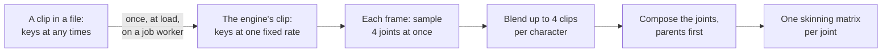

# Animation

> Planned for null3D 0.2. The animator and its calls (`play`, `crossFade`, layers, events and morph weights) are not built yet, so coding agents must not use them. Skinned meshes do not draw yet either. This page describes how the engine samples and blends clips, which the animator will use.

Characters animate on the job workers, in the engine's WebAssembly core. Each frame, the job workers sample every animated character's clips, blend them, and compose the joints into skinning matrices. Your sketch's thread does none of this work, and a crowd spreads across every job worker.

## Clips

A clip moves the joints of one skeleton. Each track of a clip moves one joint's translation, rotation or scale.

When the engine loads a clip, it stores the keys at one fixed rate for the whole clip. The key before any time is then a direct index, with no search.

- A clip whose keys all lie on one grid of at most 30 keys per second keeps that grid exactly. Files exported at 24, 25 or 30 frames per second lose nothing.
- Other clips get 30 keys per second, spaced so that the last key falls on the clip's end. A clip exported at 60 keys per second keeps every second key.
- Rotations take 8 bytes per key: four 16-bit integers. Translations and scales take 12 bytes per key.
- A track whose value never changes is stored once.

A track moves in a straight line from key to key. A step track jumps instead: it holds each key's value until the next key.

## Blending

A character can blend up to four clips in a frame, each at its own time and weight. The engine blends them as three.js's `AnimationMixer` does, joint by joint:

- A clip counts only for the joints and channels it has tracks for. A clip that moves only an arm leaves the legs to the other clips.
- Each clip moves the blend so far by its share of the weights so far.
- Where the weights add up to less than 1, the joint's rest pose makes up the remainder.

Rotations between keys use normalized linear interpolation. Rotations in a blend use a corrected form of it, which stays within 0.0001 radians of three.js's spherical interpolation. On the engine's test skeleton, poses match three.js's within 0.0001, and skinning matrices within 0.0004.

## How it compares with three.js

| | three.js | null3D |
| --- | --- | --- |
| Where clips are sampled | The main thread, one bone at a time | The job workers, four joints per SIMD operation, characters in parallel |
| Finding the keys | A search of each track's key times | A direct index, from the clip's fixed rate |
| Memory per rotation key | 20 bytes: four floats and a time | 8 bytes: four 16-bit integers |
| Blending | `PropertyMixer`, with spherical interpolation | The same rules, with corrected normalized interpolation |
