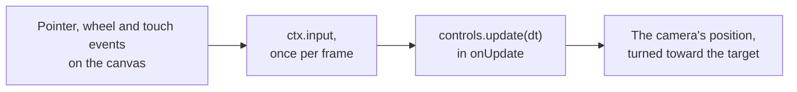

# Camera controls (@null3d/controls)

> Ships in null3D 0.1. The API is experimental, so it can still change between versions. The three.js options `zoomToCursor`, `keys`, `keyPanSpeed`, `keyRotateSpeed`, `cursor`, `minTargetRadius` and `maxTargetRadius` are not built yet, and neither are the methods `saveState` and `reset`. Fly and first-person controls come in 0.2. Coding agents must not use these parts.



The `@null3d/controls` package moves a camera with the mouse, the wheel, a trackpad and touch. Orbit controls turn the camera around a target point, as in a model viewer. Map controls pan over the ground, as in a map or a strategy game. Both take three.js's option names and defaults. For the same input, they give the camera the pose that three.js's `OrbitControls` and `MapControls` give it.

The controls run in the sketch, where the camera is. They add no DOM listeners: `controls.update(dt)` reads [`ctx.input`](input.md) once per frame and moves the camera.

```sh
bun add @null3d/controls
```

```ts
// sketch.ts
import { defineSketch } from '@null3d/engine';
import { createOrbitControls } from '@null3d/controls';

export default defineSketch((ctx) => {
  const camera = ctx.scene.createPerspectiveCamera({ fov: 45, position: [3, 2, 5] });
  ctx.scene.setActiveCamera(camera);
  const controls = createOrbitControls(ctx, camera, {
    target: [0, 1, 0],
    enableDamping: true,
    minDistance: 2,
    maxDistance: 12,
    maxPolarAngle: Math.PI * 0.49,
  });
  return {
    onUpdate(dt) {
      controls.update(dt);
    },
  };
});
```

Pass the whole sketch context, `ctx`, as the first argument. The controls read its input, the canvas size and the user's motion preference. The camera can be a perspective camera or an orthographic one. `createMapControls` takes the same arguments.

## Gestures

| Input | Orbit controls | Map controls |
| --- | --- | --- |
| Left drag, or one finger | Rotate around the target | Pan over the ground |
| Right drag | Pan | Rotate |
| Middle drag, the wheel, or a pinch on a trackpad | Dolly | Dolly |
| Two fingers | Dolly as they spread or close, and pan as they move | Dolly as they spread or close, and rotate as they move |
| Shift, Control or Meta held at the start of a drag | Swap rotate and pan | Swap rotate and pan |

- Rotate turns the camera around the target. A drag as long as the canvas is high turns it once around.
- Dolly moves the camera toward the target or away from it. Each 100 pixels of wheel scroll change the distance by about 5%. A pinch on a trackpad dollies ten times as far as its scroll, as in three.js.
- An orthographic camera zooms instead: it keeps its distance, and the view's height changes by the same factor. three.js changes the camera's `zoom` the same way.
- Pan moves the camera and the target together. Orbit controls pan in the plane of the screen. A map drag pans over the ground, and keeps the ground point under the pointer.
- The wheel does nothing during a drag.
- `mouseButtons` and `touches` change what each button and each count of fingers do, with three.js's names, such as `mouseButtons: { LEFT: 'pan', RIGHT: 'rotate' }` and `touches: { ONE: 'pan', TWO: 'dolly-rotate' }`. Null gives a button no action.

## The page

The controls read the input that the page forwards. So the page must keep the browser's own gestures off the canvas:

- Give the canvas `touch-action: none` in its CSS. Without it, the browser scrolls or zooms the page, and it cancels the touches.
- Stop the page from scrolling on the wheel, and from zooming on a trackpad's pinch: `canvas.addEventListener('wheel', (e) => e.preventDefault(), { passive: false })`.

## Options

The options and the controls' properties have three.js's names and defaults. A sketch can change a property at any time, such as `controls.enablePan = false`. The [API reference](#api-reference) describes each one.

| Options | Use |
| --- | --- |
| `target` | The point the camera orbits and looks at |
| `enabled`, `enableRotate`, `enableZoom`, `enablePan` | Turn off all input, or one gesture |
| `rotateSpeed`, `zoomSpeed`, `panSpeed` | Scale each gesture |
| `enableDamping`, `dampingFactor` | Keep the camera moving for a moment after the user lets go |
| `minDistance`, `maxDistance` | Limit the dolly |
| `minZoom`, `maxZoom` | Limit an orthographic camera's zoom. Zoom 1 shows the view's height when the controls start, and zoom 2 shows half of it. |
| `minPolarAngle`, `maxPolarAngle` | Limit how high and how low the camera goes, as angles from +Y |
| `minAzimuthAngle`, `maxAzimuthAngle` | Limit how far the camera goes around the target |
| `screenSpacePanning` | Pan in the plane of the screen, or over the ground |
| `autoRotate`, `autoRotateSpeed` | Turn the camera slowly while the user does not drag |
| `mouseButtons`, `touches` | Change what each button and each count of fingers do |

`controls.target` is an array `[x, y, z]`. Change it in place, for example with `vec3.set(controls.target, 0, 1, 0)` from the [math helpers](math.md). The next `update` turns the camera toward it.

## Each frame

Call `controls.update(dt)` once per frame in `onUpdate`, with the step that `onUpdate` receives. It returns true when the camera or the target moved.

- `update` allocates nothing.
- With damping, each frame applies a share of the motion that remains. The share suits the frame's step, so the motion takes the same time at every frame rate. At 60 frames per second, it matches three.js.
- The sketch can move the camera itself with `camera.setPosition`. The controls carry on from the new position at the next `update`.
- Auto-rotation stops while the user asks for less motion. [Accessibility](../guides/accessibility.md) explains the preference.
- If the camera has a parent, the parent must not be rotated. The controls turn the camera with `lookAt`, which assumes that.

`rotateLeft(angle)`, `rotateUp(angle)`, `pan(deltaX, deltaY)`, `dollyIn(scale)` and `dollyOut(scale)` move the camera from code, and the next `update` applies them. Use them to drive the controls with keys or a gamepad:

```ts
const { input } = ctx;
return {
  onUpdate(dt) {
    const turn = input.value('GamepadRightStickRight') - input.value('GamepadRightStickLeft');
    controls.rotateLeft(2 * turn * dt); // turns as a drag to the right does, up to 2 radians a second
    if (input.isDown('ArrowUp')) controls.pan(0, 400 * dt); // 400 pixels a second
    controls.update(dt);
  },
};
```

## Differences from three.js

- The controls take the sketch context and the camera: `createOrbitControls(ctx, camera, options)`. They need no DOM element, and have no `connect`, `disconnect`, `dispose` or `listenToKeyEvents`.
- `update` takes the frame's step in seconds, and it must run every frame.
- Actions are strings, such as `'rotate'` and `'dolly-pan'`, in place of the numbers of `THREE.MOUSE` and `THREE.TOUCH`.
- The controls send no `change`, `start` or `end` events. `update` returns true when the camera moved.
- `rotateLeft`, `rotateUp`, `pan`, `dollyIn` and `dollyOut` take effect at the next `update`, not at once.
- The controls orbit around +Y. three.js orbits around the camera's `up`, which is +Y unless a page changes it.
- three.js takes a frame's events one at a time. When two fingers move in the same frame, its pan differs from null3D's by a few percent of the move.

## Related pages

- [Input](input.md): the pointer, the wheel and the touches that the controls read.
- [Cameras](cameras.md): the camera that the controls move.
- [The three.js mapping](../porting/threejs-mapping.md): `OrbitControls` and `MapControls` beside their null3D names.

## API reference

<!-- null3d:api:start -->

### `createMapControls`

```ts
function createMapControls(ctx: SketchContext, camera: PerspectiveCamera | OrthographicCamera, options: OrbitControlsOptions = {}): MapControls
```

Creates map controls, which three.js calls `MapControls`. A left drag or one finger pans over the ground. The wheel, a pinch and a middle drag dolly the camera. A right drag or two fingers turn it. Call `controls.update(dt)` once per frame in `onUpdate`.

### `createOrbitControls`

```ts
function createOrbitControls(ctx: SketchContext, camera: PerspectiveCamera | OrthographicCamera, options: OrbitControlsOptions = {}): OrbitControls
```

Creates orbit controls, which three.js calls `OrbitControls`. A left drag or one finger turns the camera around the target. The wheel, a pinch and a middle drag dolly it. A right drag or two fingers pan. Call `controls.update(dt)` once per frame in `onUpdate`.

### `MapControls`

Class `MapControls`, which extends `OrbitControls`.

Map controls: orbit controls for a camera that looks down on a map. A left drag or one finger pans over the ground and keeps the point under the pointer there. A right drag or two fingers turn the camera. `createMapControls` makes them.

### `MouseAction`

```ts
type MouseAction = 'rotate' | 'dolly' | 'pan';
```

What a held mouse button does: turn the camera around the target, dolly it toward the target, or pan the camera and the target together.

### `MouseButtons`

Interface `MouseButtons`.

The action of each mouse button, with three.js's names for the buttons. Null gives a button no action.

| Member | Description |
| --- | --- |
| `LEFT: MouseAction \| null` | The main button. |
| `MIDDLE: MouseAction \| null` | The middle button, or a pressed wheel. |
| `RIGHT: MouseAction \| null` | The right button. |

### `OneFingerAction`

```ts
type OneFingerAction = 'rotate' | 'pan';
```

What one finger does.

### `OrbitControls`

Class `OrbitControls`.

Orbit controls: they turn a camera around a target point, dolly it toward the target, and pan both. They follow the sketch's pointer, wheel and touch input. `createOrbitControls` makes them. Call `update` once per frame in `onUpdate`.

| Member | Description |
| --- | --- |
| `readonly target: [number, number, number]` | The point the camera orbits and looks at. Change it in place, such as with `vec3.set(controls.target, x, y, z)`. |
| `enabled: boolean` | False ignores the user's input. Damping and auto-rotation still move the camera. |
| `enableDamping: boolean` | True keeps the camera moving for a moment after the user lets go. |
| `dampingFactor: number` | The share of the remaining motion that each frame applies with damping on, at 60 frames per second. |
| `enableRotate: boolean` | False stops the user turning the camera. |
| `rotateSpeed: number` | How fast drags turn the camera. |
| `enableZoom: boolean` | False stops the user dollying the camera. |
| `zoomSpeed: number` | How fast the wheel, a pinch and a dolly drag move the camera. |
| `enablePan: boolean` | False stops the user panning the camera. |
| `panSpeed: number` | How fast drags pan the camera. |
| `screenSpacePanning: boolean` | True pans in the plane of the screen; false pans over the ground. |
| `minDistance: number` | The closest the camera comes to the target. |
| `maxDistance: number` | The farthest the camera goes from the target. |
| `minZoom: number` | The smallest zoom of an orthographic camera: 1 shows the view's height when the controls start. |
| `maxZoom: number` | The largest zoom of an orthographic camera. |
| `minPolarAngle: number` | The smallest angle between the camera and +Y as seen from the target, in radians. |
| `maxPolarAngle: number` | The largest angle between the camera and +Y as seen from the target, in radians. |
| `minAzimuthAngle: number` | The smallest angle around +Y, in radians. |
| `maxAzimuthAngle: number` | The largest angle around +Y, in radians. |
| `autoRotate: boolean` | True turns the camera around the target while the user is not dragging. |
| `autoRotateSpeed: number` | How fast auto-rotation turns: 2 takes 30 seconds for one turn. |
| `readonly mouseButtons: MouseButtons` | What each mouse button does. |
| `readonly touches: TouchActions` | What one and two fingers do. |
| `update(dt: number): boolean` | Moves the camera by the frame's input, damping and auto-rotation, and turns it toward the target. Call it once per frame in `onUpdate`, with the frame's step in seconds. Returns true when the camera or the target moved. |
| `getDistance(): number` | The distance from the camera to the target. |
| `getPolarAngle(): number` | The angle between the camera and +Y as seen from the target, in radians, after the last update. |
| `getAzimuthalAngle(): number` | The camera's angle around +Y as seen from the target, in radians, after the last update. |
| `rotateLeft(angle: number): void` | Turns the camera around +Y by `angle` radians, to the camera's left. The next `update` applies it. |
| `rotateUp(angle: number): void` | Turns the camera up over the target by `angle` radians. The next `update` applies it. |
| `pan(deltaX: number, deltaY: number): void` | Pans the camera and the target as a drag of `deltaX` pixels to the right and `deltaY` pixels down would. The next `update` applies it. |
| `dollyIn(dollyScale: number): void` | Moves the camera toward the target: `dollyScale` below 1 scales the distance by it. The next `update` applies it. |
| `dollyOut(dollyScale: number): void` | Moves the camera away from the target: `dollyScale` below 1 divides the distance by it. The next `update` applies it. |

### `OrbitControlsOptions`

Interface `OrbitControlsOptions`.

Options for `createOrbitControls` and `createMapControls`, with three.js's names and defaults. The controls keep each option as a property of the same name, which a sketch can change at any time.

| Member | Description |
| --- | --- |
| `target?: Vec3Like` | The point the camera orbits and looks at. The default is (0, 0, 0). |
| `enabled?: boolean` | False ignores the user's input. Damping and auto-rotation still move the camera. The default is true. |
| `enableDamping?: boolean` | True keeps the camera moving for a moment after the user lets go, and slows it each frame. The default is false. |
| `dampingFactor?: number` | The share of the remaining motion that each frame applies with damping on, at 60 frames per second. Other frame rates get the same motion over the same time. The default is 0.05. |
| `enableRotate?: boolean` | False stops the user turning the camera. The default is true. |
| `rotateSpeed?: number` | How fast drags turn the camera. The default is 1. |
| `enableZoom?: boolean` | False stops the user dollying the camera. The default is true. |
| `zoomSpeed?: number` | How fast the wheel, a pinch and a dolly drag move the camera. The default is 1. |
| `enablePan?: boolean` | False stops the user panning the camera. The default is true. |
| `panSpeed?: number` | How fast drags pan the camera. The default is 1. |
| `screenSpacePanning?: boolean` | True pans in the plane of the screen. False pans over the ground: the plane at right angles to +Y. The default is true for orbit controls and false for map controls. |
| `minDistance?: number` | The closest the camera comes to the target. The default is 0. |
| `maxDistance?: number` | The farthest the camera goes from the target. The default is Infinity. |
| `minZoom?: number` | The smallest zoom of an orthographic camera, as three.js counts zoom: 1 shows the view's height when the controls start, and 2 shows half of it. The default is 0. |
| `maxZoom?: number` | The largest zoom of an orthographic camera. The default is Infinity. |
| `minPolarAngle?: number` | The smallest angle between the camera and +Y as seen from the target, in radians. The default is 0. |
| `maxPolarAngle?: number` | The largest angle between the camera and +Y as seen from the target, in radians. The default is π. |
| `minAzimuthAngle?: number` | The smallest angle around +Y, in radians. At 0 the camera is on the target's +Z side. With both limits set, the range must lie within -2π to 2π and span less than 2π. The default is -Infinity. |
| `maxAzimuthAngle?: number` | The largest angle around +Y, in radians. The default is Infinity. |
| `autoRotate?: boolean` | True turns the camera around the target while the user is not dragging. It stops while the user asks for less motion. The default is false. |
| `autoRotateSpeed?: number` | How fast auto-rotation turns: 2 takes 30 seconds for one turn. The default is 2. |
| `mouseButtons?: Partial<MouseButtons>` | What each mouse button does. Orbit controls rotate with the left button, dolly with the middle one and pan with the right one. Map controls pan with the left button and rotate with the right one. |
| `touches?: Partial<TouchActions>` | What one and two fingers do. Orbit controls rotate with one finger and dolly and pan with two. Map controls pan with one finger and dolly and rotate with two. |

### `TouchActions`

Interface `TouchActions`.

The action of one finger and of two fingers, with three.js's names. Null gives no action.

| Member | Description |
| --- | --- |
| `ONE: OneFingerAction \| null` | One finger on the canvas. |
| `TWO: TwoFingerAction \| null` | Two fingers on the canvas. |

### `TwoFingerAction`

```ts
type TwoFingerAction = 'dolly-pan' | 'dolly-rotate';
```

What two fingers do: they dolly as they spread or close, and pan or rotate as they move together.

<!-- null3d:api:end -->
