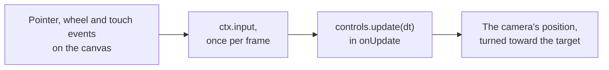

# Camera controls (@null3d/controls)

> Roadmap step 0.1, first released in null3D 0.1.0. Step 0.2 adds the fly and first-person controls. The API is experimental, so it can still change between versions. The three.js options `zoomToCursor`, `keys`, `keyPanSpeed`, `keyRotateSpeed`, `cursor`, `minTargetRadius` and `maxTargetRadius` are not built yet, and neither are the methods `saveState` and `reset`. Coding agents must not use these parts.



The `@null3d/controls` package moves a camera with the mouse, the wheel, a trackpad, touch and the keyboard. Orbit controls turn the camera around a target point, as in a model viewer. Map controls pan over the ground, as in a map or a strategy game. [Fly controls](#fly-controls) move the camera in all directions, as in a flight game. [First-person controls](#first-person-controls) walk it over the ground and look around, as in a first-person game. Each takes three.js's option names and defaults. For the same input, each gives the camera the pose that three.js's controls of the same name give it.

The controls run in the sketch, where the camera is. They add no DOM listeners: `controls.update(dt)` reads [`ctx.input`](input.md) once per frame and moves the camera.

```sh
bun add @null3d/controls
```

```ts
// sketch.ts
import { defineSketch } from '@null3d/engine';
import { createOrbitControls } from '@null3d/controls';

export default defineSketch((ctx) => {
  const camera = ctx.scene.createPerspectiveCamera({ fov: 45, position: [3, 2, 5] });
  ctx.scene.setActiveCamera(camera);
  const controls = createOrbitControls(ctx, camera, {
    target: [0, 1, 0],
    enableDamping: true,
    minDistance: 2,
    maxDistance: 12,
    maxPolarAngle: Math.PI * 0.49,
  });
  return {
    onUpdate(dt) {
      controls.update(dt);
    },
  };
});
```

Pass the whole sketch context, `ctx`, as the first argument. The controls read its input, the canvas size and the user's motion preference. The camera can be a perspective camera or an orthographic one. `createMapControls` takes the same arguments.

## Gestures

| Input | Orbit controls | Map controls |
| --- | --- | --- |
| Left drag, or one finger | Rotate around the target | Pan over the ground |
| Right drag | Pan | Rotate |
| Middle drag, the wheel, or a pinch on a trackpad | Dolly | Dolly |
| Two fingers | Dolly as they spread or close, and pan as they move | Dolly as they spread or close, and rotate as they move |
| Shift, Control or Meta held at the start of a drag | Swap rotate and pan | Swap rotate and pan |

- Rotate turns the camera around the target. A drag as long as the canvas is high turns it once around.
- Dolly moves the camera toward the target or away from it. Each 100 pixels of wheel scroll change the distance by about 5%. A pinch on a trackpad dollies ten times as far as its scroll, as in three.js.
- An orthographic camera zooms instead: it keeps its distance, and the view's height changes by the same factor. three.js changes the camera's `zoom` the same way.
- Pan moves the camera and the target together. Orbit controls pan in the plane of the screen. A map drag pans over the ground, and keeps the ground point under the pointer.
- The wheel does nothing during a drag. Scroll after the release dollies, even when the release and the scroll both come between two frames.
- `mouseButtons` and `touches` change what each button and each count of fingers do, with three.js's names, such as `mouseButtons: { LEFT: 'pan', RIGHT: 'rotate' }` and `touches: { ONE: 'pan', TWO: 'dolly-rotate' }`. Null gives a button no action.

## The page

The controls read the input that the page forwards. So the page must keep the browser's own gestures off the canvas:

- Give the canvas `touch-action: none` in its CSS. Without it, the browser scrolls or zooms the page, and it cancels the touches.
- Stop the page from scrolling on the wheel, and from zooming on a trackpad's pinch: `canvas.addEventListener('wheel', (e) => e.preventDefault(), { passive: false })`.

## Options

The options and the controls' properties have three.js's names and defaults. A sketch can change a property at any time, such as `controls.enablePan = false`. The [API reference](#api-reference) describes each one.

| Options | Use |
| --- | --- |
| `target` | The point the camera orbits and looks at |
| `enabled`, `enableRotate`, `enableZoom`, `enablePan` | Turn off all input, or one gesture |
| `rotateSpeed`, `zoomSpeed`, `panSpeed` | Scale each gesture |
| `enableDamping`, `dampingFactor` | Keep the camera moving for a moment after the user lets go |
| `minDistance`, `maxDistance` | Limit the dolly |
| `minZoom`, `maxZoom` | Limit an orthographic camera's zoom. Zoom 1 shows the view's height when the controls start, and zoom 2 shows half of it. |
| `minPolarAngle`, `maxPolarAngle` | Limit how high and how low the camera goes, as angles from +Y |
| `minAzimuthAngle`, `maxAzimuthAngle` | Limit how far the camera goes around the target |
| `screenSpacePanning` | Pan in the plane of the screen, or over the ground |
| `autoRotate`, `autoRotateSpeed` | Turn the camera slowly while the user does not drag |
| `mouseButtons`, `touches` | Change what each button and each count of fingers do |

`controls.target` is an array `[x, y, z]`. Change it in place, for example with `vec3.set(controls.target, 0, 1, 0)` from the [math helpers](math.md). The next `update` turns the camera toward it.

## Each frame

Call `controls.update(dt)` once per frame in `onUpdate`, with the step that `onUpdate` receives. It returns true when the camera or the target moved.

- `update` allocates nothing.
- With damping, each frame applies a share of the motion that remains. The share suits the frame's step, so the motion takes the same time at every frame rate. At 60 frames per second, it matches three.js.
- The sketch can move the camera itself with `camera.setPosition`. The controls carry on from the new position at the next `update`.
- Auto-rotation stops while the user asks for less motion. [Accessibility](../guides/accessibility.md) explains the preference.
- If the camera has a parent, the parent must not be rotated. The controls turn the camera with `lookAt`, which assumes that.

`rotateLeft(angle)`, `rotateUp(angle)`, `pan(deltaX, deltaY)`, `dollyIn(scale)` and `dollyOut(scale)` move the camera from code, and the next `update` applies them. Use them to drive the controls with keys or a gamepad:

```ts
const { input } = ctx;
return {
  onUpdate(dt) {
    const turn = input.value('GamepadRightStickRight') - input.value('GamepadRightStickLeft');
    controls.rotateLeft(2 * turn * dt); // turns as a drag to the right does, up to 2 radians a second
    if (input.isDown('ArrowUp')) controls.pan(0, 400 * dt); // 400 pixels a second
    controls.update(dt);
  },
};
```

## Fly controls

`createFlyControls(ctx, camera, options)` makes fly controls, which three.js calls `FlyControls`. They move the camera along its own axes and turn it about them, so the camera can loop and roll.

```ts
import { createFlyControls } from '@null3d/controls';

const controls = createFlyControls(ctx, camera, { movementSpeed: 10, rollSpeed: Math.PI / 24 });
return {
  onUpdate(dt) {
    controls.update(dt);
  },
};
```

| Input | Fly controls |
| --- | --- |
| W, S | Move forward and back |
| A, D | Move left and right |
| R, F | Move up and down |
| Arrow keys | Turn up, down, left and right |
| Q, E | Roll left and right |
| The pointer's place on the canvas | Turn: not at all at the middle, and at full speed at an edge |
| Left and right buttons | Move forward and back |

- `movementSpeed` is in world units per second. `rollSpeed` sets how fast the keys and the pointer turn the camera. At full turn, the camera turns about twice `rollSpeed` radians per second, as in three.js.
- The pointer steers whenever it moves over the canvas, and its turn holds until it moves again. With `dragToLook: true`, the pointer steers only during a drag, and the buttons do not move the camera.
- `autoForward: true` moves the camera forward all the time, unless S or the right button moves it back.
- The keys add to the pointer's turn. In three.js, the pointer's last move replaces the arrow keys' turn.

## First-person controls

`createFirstPersonControls(ctx, camera, options)` makes first-person controls. They take the place of two three.js controls. Without a pointer lock, they act as `FirstPersonControls`. While the canvas holds the [pointer lock](#pointer-lock), the mouse turns the view as `PointerLockControls` turn it.

```ts
import { createFirstPersonControls } from '@null3d/controls';

const controls = createFirstPersonControls(ctx, camera, { movementSpeed: 4, lookSpeed: 0.1 });
return {
  onUpdate(dt) {
    controls.update(dt);
  },
};
```

| Input | First-person controls |
| --- | --- |
| W or Up, S or Down | Walk forward and back over the ground |
| A or Left, D or Right | Walk left and right |
| R, F | Move up and down |
| Left drag, or one finger | Look around, and walk forward along the view |
| Right drag, or two fingers | Look around, and walk back along the view |
| Middle drag | Look around |
| The mouse, while the pointer is locked | Look around |

- The keys walk over the ground, in the direction the view faces around +Y. Two keys at once walk no faster than one.
- A drag turns the view at a speed that grows with the drag's length, in `lookSpeed` degrees per second for each pixel. While a key walks forward or back, a press only looks.
- Moves and turns start and stop smoothly: each frame applies `dampingFactor` of the change of speed that remains. The share suits the frame's step, so the motion takes the same time at every frame rate. At 60 frames per second, it matches three.js.
- A drag tips the view at most 85 degrees above or below the level. `constrainVertical` with `verticalMin` and `verticalMax` limits it further, and `lookVertical: false` keeps the view level.
- `heightSpeed`, with `heightCoef`, `heightMin` and `heightMax`, walks faster forward the higher the camera is. `autoForward` walks forward along the view all the time.
- `lookAt(x, y, z)` turns the camera toward a point.

## Pointer lock

The page asks the browser to lock the pointer to the canvas with `engine.requestPointerLock()` ([Page API](engine.md#the-running-engine)). The browser then hides the pointer and sends the mouse's movement, with no edge to stop it. Browsers lock the pointer only right after the user acts, so call it in a click or key handler on the page:

```ts
// main.ts, on the page
canvas.addEventListener('click', () => {
  engine.requestPointerLock().catch(() => {
    // E1425: the browser refused, such as on a phone, or just after the user pressed Esc
  });
});
```

While the pointer is locked, `ctx.input.pointer.locked` is true, and `pointer.dx` and `pointer.dy` give the mouse's movement ([Input](input.md#the-pointer)). First-person controls then turn the view by the movement, as three.js's `PointerLockControls` do:

- Each pixel turns the view by 0.002 radians times `pointerSpeed`.
- The view stays between `minPolarAngle` and `maxPolarAngle` from +Y.
- A drag looks around no more, and the buttons do not walk, so the sketch can use them, for example to fire.

The user ends the lock with Esc, and the page with `document.exitPointerLock()`. Destroying the engine also ends it.

To port code that moves the camera itself with `PointerLockControls`, set `movementSpeed: 0`, so the keys do not walk, and call the controls' `moveForward(distance)` and `moveRight(distance)`. As in three.js, `moveForward` walks over the ground at right angles to the camera's right, and `getDirection(out)` gives the direction of the view:

```ts
const controls = createFirstPersonControls(ctx, camera, { movementSpeed: 0 });
return {
  onUpdate(dt) {
    controls.update(dt);
    const walk = (ctx.input.isDown('KeyW') ? 1 : 0) - (ctx.input.isDown('KeyS') ? 1 : 0);
    const strafe = (ctx.input.isDown('KeyD') ? 1 : 0) - (ctx.input.isDown('KeyA') ? 1 : 0);
    controls.moveForward(walk * 5 * dt); // 5 metres a second
    controls.moveRight(strafe * 5 * dt);
  },
};
```

The [first-person and fly controls demo](https://github.com/null3d-engine/null3d/tree/main/examples/walk-and-fly) walks through a ruined temple. A click asks for the pointer lock, and Space switches between first-person and fly controls.

## Differences from three.js

- The controls take the sketch context and the camera: `createOrbitControls(ctx, camera, options)`. They need no DOM element, and have no `connect`, `disconnect`, `dispose` or `listenToKeyEvents`.
- `update` takes the frame's step in seconds, and it must run every frame.
- Actions are strings, such as `'rotate'` and `'dolly-pan'`, in place of the numbers of `THREE.MOUSE` and `THREE.TOUCH`.
- The controls send no `change`, `start` or `end` events. `update` returns true when the camera moved.
- `rotateLeft`, `rotateUp`, `pan`, `dollyIn` and `dollyOut` take effect at the next `update`, not at once.
- The controls orbit around +Y. three.js orbits around the camera's `up`, which is +Y unless a page changes it.
- three.js takes a frame's events one at a time. When two fingers move in the same frame, its pan differs from null3D's by a few percent of the move.
- Fly and first-person controls keep the camera's pose in double precision, as three.js does. At each `update` they take a pose that the sketch set, and carry on from it.
- First-person controls turn the camera with no roll. `PointerLockControls` keep a roll that the camera had.
- While the pointer is locked, the mouse's moves in one frame add up before the polar limits apply. three.js applies them after each move, so a frame whose moves reach a limit and come back can end at a different angle.
- `FirstPersonControls` and `PointerLockControls` are one set of controls, so `lock`, `unlock`, `isLocked` and the `lock` and `unlock` events have no equivalent. The page locks the pointer with `engine.requestPointerLock()`, and the sketch reads `input.pointer.locked`.
- When two fingers are down, the first finger's movement turns the view. three.js takes the movement of any finger from where the last finger touched down.

## Related pages

- [Input](input.md): the pointer, the wheel and the touches that the controls read.
- [Cameras](cameras.md): the camera that the controls move.
- [Page API](engine.md): `engine.requestPointerLock()`.
- [The three.js mapping](../porting/threejs-mapping.md): `OrbitControls`, `MapControls`, `FlyControls`, `FirstPersonControls` and `PointerLockControls` beside their null3D names.

## API reference

[The API reference](reference/controls.md) lists every export of this page with its type and description. The engine's doc comments make it.
