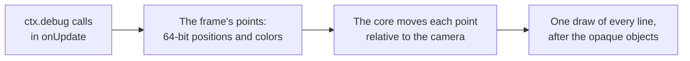
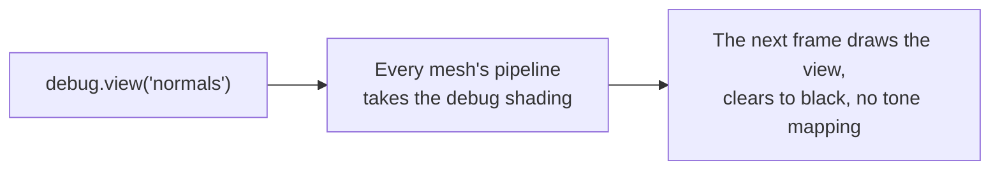
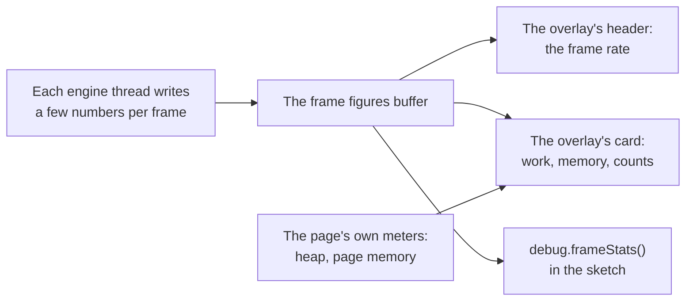

# Debug drawing and stats

> Ships in null3D 0.1. `debug.skeleton` and `@null3d/engine/stats` ship in null3D 0.2. So do the stats overlay's page switches, its options and card, and its figures of GPU time, triangles, objects and memory. The API is experimental, so it can still change between versions.

Debug drawing shows where things are in the scene: lines, boxes, spheres, arrows, axes, grids, camera frustums, lights and skeletons. Debug views draw the whole scene with one debug shading, such as its normals, its wireframe or its shadows. The overlay of `debug.stats` shows the engine's frame figures over the top-right corner of the canvas, and `debug.frameStats` gives them to the sketch. On the page, `engine.measure` measures the running engine.

## Debug drawing



`ctx.debug` draws lines over the scene for one frame. Call it in `onUpdate` in every frame that needs the drawing. Each call adds the lines of its shape. When the frame draws, the engine moves each point relative to the camera in 64-bit floats. Then it draws every line in one call, after the opaque objects. So lines stay precise far from the origin, as objects do, and objects in front of a line hide it.

```ts
export default defineSketch(({ scene, materials, geometry, debug }) => {
  const sun = scene.createDirectionalLight({ direction: [-1, -2, -1] });
  const crate = scene.createMesh({
    mesh: geometry.box(),
    material: materials.standard({ color: '#e8554e' }),
    dynamic: true,
  });
  const lookout = scene.createPerspectiveCamera({ position: [6, 2, 0], target: [0, 0, 0], far: 20 });
  return {
    onUpdate() {
      debug.grid(10, 10);
      debug.axes(crate);                                   // follows the crate as it moves and turns
      debug.box([-0.6, -0.6, -0.6], [0.6, 0.6, 0.6], '#ff0000');
      debug.arrow([0, 2, 0], [1, 0, 0], 1.5);
      debug.frustum(lookout);
      debug.light(sun, { position: [0, 3, 0] });
    },
  };
});
```

| Call | What it draws | Default color |
| --- | --- | --- |
| `line(from, to, color)` | A line between two points | Yellow |
| `box(min, max, color)` | The 12 edges of a box that lines up with the world's axes | Yellow |
| `sphere(center, radius, color)` | Three circles around the center, one in each plane of the world's axes | Yellow |
| `arrow(origin, direction, length, color)` | A line from `origin` with a head at its tip, 1 meter long unless `length` says otherwise | Yellow |
| `axes(target, size)` | The x, y and z axes, `size` meters long, at a position or on an object | Red, green and blue |
| `grid(size, divisions, options)` | A square grid on the horizontal plane, as three.js's `GridHelper` draws it | Gray, darker through the center |
| `frustum(camera, color)` | The near and far planes of a camera's view, and the edges between them | Orange |
| `light(light, options)` | A directional light: a square that faces the light, and an arrow in the direction its light travels | The light's color |
| `skeleton(object, color)` | The joints of an animated object: a line from each joint of a skin to its parent joint, as three.js's `SkeletonHelper` draws them | Blue at the joint, green at its parent |

Colors take the same forms as material colors: a hex string such as `'#ff0000'`, a number such as `0xff0000`, or three linear components from 0 to 1. Positions are in world space, in arrays such as `[x, y, z]` or typed arrays.

### Objects and cameras

`debug.axes(object)`, `debug.frustum(camera)`, `debug.light(light)` and `debug.skeleton(object)` draw at the object's place in the frame that draws them. A skeleton takes the pose that the frame's [animation](animation.md) step gave its joints. A light draws where it stands unless its `position` option gives another place, which suits a directional light, whose position does not change its light. They wait until the engine has updated the frame's transforms and poses, so they never trail a moving object by one frame. A camera's frustum takes the shape of the canvas, as its view does.

### Release builds

Debug drawing works in development builds only. In a production build, every drawing call and `debug.view` do nothing. The build holds neither the drawing code nor the shaders of the lines and the views. The calls themselves still run. So work that only feeds debug drawing still costs time: wrap it in `if (import.meta.env.DEV)`, which Vite sets to false in production builds. The stats overlay and `debug.frameStats` work in every build.

### Limits

- Lines are one pixel wide on every GPU, because WebGPU draws lines no wider. Wide lines come with [lines](lines.md) in null3D 0.2.
- A frame draws at most 131,072 lines. The engine leaves out the lines after that, and warns once in the console.
- A frame without debug drawing runs no debug pass, uploads nothing and allocates nothing.

## Debug views



`debug.view(name)` draws every mesh with one debug shading in place of its material, from the next frame on. `debug.view('lit')` draws the materials again.

```ts
export default defineSketch(({ debug, input }) => {
  const views = ['lit', 'normals', 'depth', 'overdraw', 'wireframe', 'shadows'] as const;
  let shown = 0;
  return {
    onUpdate() {
      if (input.wasPressed('KeyV')) {
        shown = (shown + 1) % views.length;
        debug.view(views[shown]);
      }
    },
  };
});
```

| View | What it shows |
| --- | --- |
| `'lit'` | The materials' own shading, as without a debug view |
| `'normals'` | Each surface's normal in world space as a color: x as red, y as green and z as blue, each from -1 to 1 as 0 to 1 |
| `'depth'` | The distance from the camera as a gray: white at the near plane, black at the far plane. A perspective camera's distance takes a logarithmic scale, so near and far objects both show. An orthographic camera's scale is linear |
| `'overdraw'` | Light that each surface adds to the pixels it covers, with no depth test. Bright pixels are covered many times, so they cost the most shading. The [8-bit path](../concepts/color-management.md#the-8-bit-path) adds the light after the sRGB encoding, so layers brighten faster there |
| `'wireframe'` | The edges of each triangle as lines one pixel wide, in the material's color |
| `'shadows'` | How much of the main directional light's shadow falls on each surface, as a gray: black in full shadow, white in full light. The gray is the factor that lit shading multiplies the sun's light by. A surface that faces away from the sun is black, as no sunlight reaches it. A surface that receives no shadows, or whose material takes no light, is white |

- A debug view clears to black and hides the background texture. It uses no tone mapping and no exposure, so its colors reach the canvas as the table gives them.
- The views ignore what a material changes: maps, vertex colors, alpha, blending, depth options and custom shaders, vertex offsets included. A mesh keeps its place and the faces it culls.
- The first frame of a view builds its GPU pipelines, so objects can be missing from a few frames after a change.
- The wireframe view keeps an edge list for each mesh once it has shown, which takes twice the GPU memory of the mesh's triangle indices.
- Debug views work in development builds only. In a release build, `debug.view` does nothing, and the build holds neither their code nor their shader. A name that the engine does not know fails with [E1213](../errors/E1213.md).

### Watch the shadow cascades from elsewhere

`debug.shadowCamera(camera)` places the main directional light's [shadow cascades](../concepts/shadows.md) from another camera. The active camera still draws the frame. Keep the active camera still, and move and turn the other one as a player would. In the `'shadows'` view, a shadow edge that crawls or shimmers then shows at once. Nothing else in the frame moves. `debug.shadowCamera()` with no camera places the cascades from the active camera again.

```ts
export default defineSketch(({ scene, debug, time }) => {
  const player = scene.createPerspectiveCamera({ position: [0, 2, 8], target: [0, 0, 0] });
  const watcher = scene.createPerspectiveCamera({ position: [0, 2, 8], target: [0, 0, 0] });
  scene.setActiveCamera(watcher);
  debug.shadowCamera(player);
  debug.view('shadows');
  return {
    onUpdate() {
      player.setPosition(Math.sin(time.now * 0.2) * 0.05, 2, 8);  // a slow sway
    },
  };
});
```

The cascades keep their boxes and their split distances from the other camera's view, so they fall where they fall in that camera's own frames. In a release build the call does nothing. three.js's cascaded shadow maps (`CSM`) take their camera as an option in the same way, so they can follow another camera than the one that renders.

## Stats overlay and frame figures



The stats overlay sits over the top-right corner of the canvas. Its header is a button with a ring gauge and the frame rate, such as `58 fps`. A click on it, or Enter or Space while it has the focus, opens a card of figures under it and closes the card again. Four calls show the overlay:

- `createEngine({ stats: true })` shows it from the first frame.
- `engine.stats(true)` on the page shows it, and `engine.stats(false)` hides it.
- The `?stats` switch in the page's address shows it, and `?stats=off` hides it. `?stats=collapsed` and `?stats=open` show it with its card closed or open. Production builds read the switch only when the Vite plugin's `urlSwitches` option is on.
- `debug.stats(true)` in the sketch shows it, and `debug.stats(false)` hides it.

Each call also takes options in place of `true`:

| Option | What it sets | Default |
| --- | --- | --- |
| `collapsed` | True starts the overlay with its card closed, so only the header shows | `false` |

```ts
const engine = await createEngine({
  canvas,
  sketch: new URL('./sketch.ts', import.meta.url),
  stats: { collapsed: true },
});
```

The page and the sketch show and hide the same overlay, and the last call wins, from either side. So the sketch's `debug.stats(false)` hides an overlay that the page showed, and the page's `engine.stats(false)` hides one that the sketch showed. Options add up: a call changes only the options that it names, and an overlay that shows again keeps them. Each `debug.stats` call sends a message to the page, so call it when the choice changes, not in every frame. The page draws the overlay and updates it four times a second. A held engine for image tests shows no overlay.

The header stays in the corner when the card opens, and the card opens under it, aligned to the right. Only the header button and the card's mode symbol take the pointer. Drags anywhere else on the overlay reach the canvas.

### The card

| Part | What it shows |
| --- | --- |
| `Frame work` | The target frame rate and its interval, such as `Target 60 fps · 16.7 ms`, after a symbol of the engine's thread mode |
| Work bars | CPU time per frame of each engine thread, and the GPU's time per frame, against the target |
| `Held back by` | Below the target frame rate, the part of the frame that holds it back |
| `Memory` | The engine's memory, the GPU's textures and buffers, and the page's JavaScript heap, as one bar with a legend |
| Whole page | The memory of the whole page and its workers, as the browser counts it |
| Counts | Draw calls, triangles and objects per frame |
| Last line | The GPU path, the quality preset and the render scale |

**The target.** The overlay judges each frame against the engine's own target: the one that the [preset check](../concepts/quality-presets.md) and the quality governor aim at. It is the display's refresh rate, at most 60 frames a second, or a lower cap such as the `?fps=` switch. So a 120 Hz display still shows a target of 60 fps. The engine still draws faster when the display allows it.

**The work bars.** Each thread has its own bar, because the threads run at the same time. The bars come in this order: `Sketch`, `Drawing`, `Jobs`, `Page`, then `GPU`. A thread that the engine's thread mode does not run has no bar. Every bar spans twice the target's interval, so the target's mark sits in the middle of each. Each bar is colored by who did the work:

- Your code: the sketch's own callbacks, the `update` phase.
- Engine: every other phase on the thread, such as commands, culling, recording, uploads and replay.
- GPU: the GPU's time, from one frame in eleven.

A bar stacks parts only where the parts add up to the time beside it. A thread's phases run one after another, so they stack. The `Jobs` bar shows the slowest job worker, with the count of job workers beside its name, such as `Jobs ×6`. The job workers share one step of the frame, and the frame waits for the slowest of them. So a sum or a mean would mislead.

**The thread modes.** The symbol before the target is a button whose tooltip explains the mode. The tooltip shows while the pointer is on the symbol or the symbol has the keyboard's focus, and a tap shows or hides it.

| Mode | Symbol | Bars |
| --- | --- | --- |
| Pipelined (the default) | Three staggered bars | The sketch worker prepares one frame while the render worker draws the one before. Each thread has its own bar, and each must fit the target on its own |
| Low latency | A clock | One thread prepares and then draws each frame. One bar, `Sketch + drawing`, stacks your code, the engine's sketch steps, then the drawing, and must fit the target |
| Single thread | A clock | Without shared memory, the page's thread prepares and draws each frame. It shows as one `Sketch + drawing` bar too |

**The colors.** A work bar's time is green below 80% of the target's interval, amber up to the interval, and red past it. The ring gauge in the header fills with the frame rate as a share of the target. It is green from 90% of the target, the share that a preset must hold in the preset check. It is amber from 75%, and red below.

**Held back by.** While the frame rate is below 90% of the target, a line under the GPU bar names the bar furthest past the target's mark: `Held back by: GPU`, `Drawing`, `Sketch`, `Sketch + drawing`, `Jobs` or `Page`. When no bar passes the mark, it reads `Held back by: outside the engine`. The rest of the page's code, or the browser, then holds the frame back.

**Figures that the browser gives.** The frame rate, the work bars, the engine's and the GPU's memory and the counts show in every browser that runs the engine. The page's JavaScript heap comes from `performance.memory`, and the whole page's memory from `performance.measureUserAgentSpecificMemory`. Some browsers have neither. Where the browser lacks one, the overlay leaves it out, and the memory total adds up what it lists. Where the GPU path has no timer queries, the GPU bar reads `not measured` and stays empty.

`debug.frameStats()` gives the sketch the engine's figures that the overlay shows. Each figure per frame is a mean over the frames of the last window, about half a second of presented frames. The figures change when a window ends. Only the page can measure its JavaScript heap and its memory, so those figures show only on the overlay.

```ts
export default defineSketch(({ debug, page, time }) => {
  debug.stats(true);
  let next = 5;
  return {
    onUpdate() {
      const stats = debug.frameStats();   // allocates nothing, so it can run every frame
      if (stats.frames > 0 && time.now >= next) {
        next = time.now + 5;
        // JSON gives a copy that keeps this window's figures, for the page to log or upload.
        page.post('stats', JSON.parse(JSON.stringify(stats)));
      }
    },
  };
});
```

| Figure | What it is |
| --- | --- |
| `frames`, `seconds` | The presented frames of the window and its length. Both are 0 before the first window ends |
| `presentedFps` | Frames per second that the engine presented |
| `completedFps` | Frames per second that the GPU finished. Below `presentedFps`, the GPU limits the frame rate |
| `cpuMs` | CPU time per frame of the busiest thread, in milliseconds |
| `threads` | Each engine thread's name, its CPU time per frame, and the time of each phase, as `engine.measure` names them |
| `gpuMs` | GPU time per frame in milliseconds, from one frame in eleven, or null without timer queries |
| `drawCalls`, `uploadBytes` | Draw calls and bytes uploaded to the GPU, per frame |
| `triangles`, `objects` | Triangles and objects drawn per frame, over every pass |
| `wasmBytes` | The size of the engine's WebAssembly memory |
| `textureBytes`, `meshBytes` | The GPU memory of the scene's textures and of its meshes, as `quality.textureMemory.bytes` and `geometry.memoryBytes` give them |
| `gpuTextureBytes`, `gpuBufferBytes` | The GPU memory of every texture and of every buffer that the engine holds, render targets and shadow maps included ([GPU memory](#gpu-memory)) |
| `textureBudgetBytes`, `droppedLevels` | The texture memory budget, and the largest mip levels that the budget dropped |
| `tier`, `preset`, `renderScale` | The GPU path, the quality preset, and the share of the canvas's size that the scene draws at |

### Triangles and objects

The engine counts every draw of every pass on the thread that draws. That covers shadow maps, the depth prepass, the passes that shade and the passes of post effects. three.js's `renderer.info` counts triangles the same way, so the two figures compare.

- A draw of triangles adds its vertices or indices over 3, times its instances. A draw of lines adds no triangles.
- A draw adds its instances to `objects`. So an object counts once in each pass that draws it. A box that casts shadows into 4 cascades counts 5 times, and 6 with the depth prepass. Each part of a mesh with several materials counts once, as each part is a mesh of its own in three.js.
- On WebGPU, the GPU culls most objects itself, and only the GPU knows how many it drew. The engine copies those counts back from the GPU on one frame in eleven. It does so while the overlay's card is open, and after the sketch's first call of `debug.frameStats()`. The counts arrive a few frames late, and each frame adds the newest of them. Until then, the WebGPU figures count only the draws that the CPU issues.

### Memory figures

| Figure | Where it comes from |
| --- | --- |
| `Engine` | The size of the engine's WebAssembly memory, which every engine thread shares. It holds the scene and grows as the scene needs, up to the memory maximum |
| `GPU textures` | The GPU bytes of every texture and render target that the engine holds, as `gpuTextureBytes` gives them |
| `GPU buffers` | The GPU bytes of every buffer that the engine holds, as `gpuBufferBytes` gives them |
| `JS heap` | The JavaScript heap of the page's own thread, from `performance.memory`, where the browser gives it |
| Whole page | The memory of the whole page and its workers, from `performance.measureUserAgentSpecificMemory`, where the browser gives it |

The memory bar's parts add up to the total beside `Memory`. The whole page's figure is not that total, so it has its own line. The browser counts a shared memory once for each thread that holds it. Every engine thread holds the engine's WebAssembly memory, so the browser's figure counts it many times. Beside the browser's figure, the overlay gives the figure with the shared memory counted once. The browser answers once every worker has run the measurement, or after about a minute. The engine's job workers never stop to run it, so in the threaded build each measurement takes about a minute. Until the first one ends, the line reads `measuring`. The page asks for one measurement at a time.

Some browsers offer the measurement but never answer it. When no answer comes within two minutes of the first request, the overlay hides the line. The page then asks no more for the rest of its life. An answer that comes later still shows.

### GPU memory

The thread that draws keeps two running totals of the GPU memory that the engine holds. It adds an object's bytes when it creates the object, and takes them away when it frees it. So the figures cost nothing to read, and nothing walks the scene to find them.

- `GPU textures` counts the scene's textures, the render targets and their multisampled copies, and the depth and shadow maps. It also counts the targets of post effects, the environment's maps and color grading tables, and the textures that copies and mip levels pass through.
- `GPU buffers` counts vertices and indices, instance rows, uniforms and storage, and the buffers of GPU culling and indirect draws. It also counts upload staging and the readbacks of GPU timings and culled counts.

A texture counts every mip level of every layer, as the GPU stores it. A compressed texture counts whole blocks of texels, a multisampled target counts each sample, and 24-bit depth counts 4 bytes per texel. The figures have these limits:

- They count the size that the engine asks for. A driver may round an object up to its own alignment, and no browser reports that.
- The canvas's own image belongs to the browser, so the figures leave it out.
- They also leave out a texture that lives only during one step, such as a capture's target.
- A phone's tiled GPU may keep a multisampled target in its tile memory alone. The figure still counts it.

### Cost

- With the overlay hidden and no call of `debug.frameStats()`, the figures cost the frame almost nothing. The engine's threads write them anyway, for `engine.measure`. The counts of triangles and objects add a few operations per draw call.
- With the card closed, the overlay costs nothing more. Its header reads the frame rate from the frame intervals that the engine records anyway. It times nothing on the GPU, reads nothing back and measures no memory.
- While the card is open, the engine times one frame in eleven on the GPU, as `engine.measure` does. On WebGPU it also copies the counts of the culled draws back on those frames. The sketch thread publishes the memory of textures and meshes every eighth frame. The thread that draws copies its two GPU memory totals each frame, and the page measures its own memory. Closing the card stops all of it.
- The sketch's first call of `debug.frameStats()` turns the same sampling on for the rest of the engine's life. Reading the figures allocates nothing, so a sketch can call it every frame.
- The overlay's code downloads at its first showing, and the figures' code at the first call of `debug.frameStats()` or the overlay's first showing. Pages that never call them download neither.
- Both work in every build, production builds included.
- The overlay lives in a shadow root with its own style sheet, so the page's styles do not change it. It works under a Content Security Policy without `'unsafe-inline'`.

### The same overlay for another engine

`@null3d/engine/stats` exports a text layout of the overlay's figures, the figure types and the page's meters. A page that draws with another engine, such as three.js, prints its own figures in the same layout. The same code measures both engines' page figures, so a comparison of the two stays fair.

```ts
import {
  MainThreadWindow,
  PageMemorySampler,
  pageHeapBytes,
  statsText,
} from '@null3d/engine/stats';

const element = document.querySelector('#stats') as HTMLElement;
const mainThread = new MainThreadWindow();
const pageMemory = new PageMemorySampler();
pageMemory.start();

// Call it twice a second with the figures that your own frame loop collected.
function showFigures(fps: number, cpuMs: number, info: { calls: number; triangles: number }) {
  element.textContent = statsText({
    heading: 'three.js WebGLRenderer',
    frames: 30,
    presentedFps: fps,
    completedFps: null,
    cpuMs,
    threads: [{ name: 'main', busyMs: cpuMs }],
    gpuMs: null,
    drawCalls: info.calls,
    uploadBytes: null,
    triangles: info.triangles,
    objects: null,
    memory: {
      wasmBytes: null,
      gpuTextureBytes: null,
      gpuBufferBytes: null,
      jsHeapBytes: pageHeapBytes(),
      page: pageMemory.page,
    },
    mainThread: mainThread.take(),
  });
}
```

## Frame measurement

`engine.measure(seconds)` on the page measures the running engine for that many seconds. It returns a `FrameMetrics` object. That holds CPU time per frame by thread and step, GPU time per frame and per pass, frame rates, uploads and draw calls. It also holds memory, load times and the frame rates of each second. Each figure that varies from frame to frame comes as `Percentiles`: the median, the 95th and 99th percentiles, the mean and the number of frames.

Each thread writes a few numbers per frame into a buffer that the page reads, so a measurement costs the frame almost nothing. GPU timing runs only while the page measures or the stats overlay samples, and only on one frame in eleven. The engine tracks every frame that the GPU finishes, all the time, because it holds new frames back while two are unfinished. [Performance guide](../guides/performance.md#measure) explains each figure and how to measure fairly.

### Example: measure a running scene

```ts
import { createEngine } from '@null3d/engine';

const canvas = document.querySelector('canvas') as HTMLCanvasElement;
const engine = await createEngine({ canvas, sketch: new URL('./sketch.ts', import.meta.url) });
await engine.firstFrame;
// Let the browser optimize the per-frame code before you measure.
await new Promise((resolve) => setTimeout(resolve, 5000));
const stats = await engine.measure(10);
console.log(`busiest thread: ${stats.cpuMs.median.toFixed(2)} ms per frame`);
console.log(`presented ${stats.presentedFps.toFixed(1)} frames per second`);
for (const part of stats.gpuPassMs ?? []) {
  console.log(`GPU, ${part.name}: ${part.ms.median.toFixed(3)} ms`);
}
```

### GPU time

`gpuMs` and `gpuPassMs` need GPU timer queries. Some WebGPU devices offer timestamp queries. On WebGL2, most desktop browsers offer `EXT_disjoint_timer_query_webgl2` and most phones do not; there `gpuMs` covers the frame as a whole, and `gpuPassMs` is empty. Without timer queries both are null. `gpuPassMs` splits `gpuMs` into the parts of the frame, in the order the GPU runs them:

| Part | What it is |
| --- | --- |
| `copies` | Copies recorded before the frame's first pass, where the browser times them |
| `compute 1`, `compute 2` and so on | Each compute pass, such as the culling pass on WebGPU, where the browser times it |
| `render 1`, `render 2` and so on | Each render pass, such as the main pass, where the browser times it |
| `between passes` | The time from the end of one pass to the start of the next, in a frame of more than one pass where the browser times every pass |

These figures time the GPU's work only. Work that the browser does outside the passes shows in `gpuLatencyMs` and in the frame rates.

## API reference

[The API reference](reference/debug.md) lists every export of this page with its type and description. The engine's doc comments make it.
