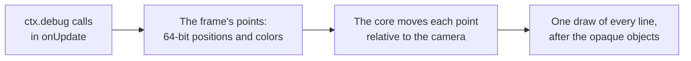
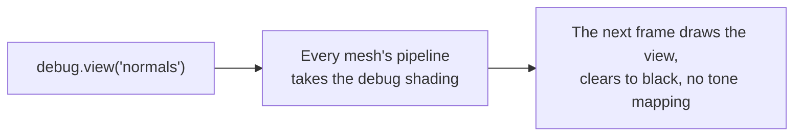
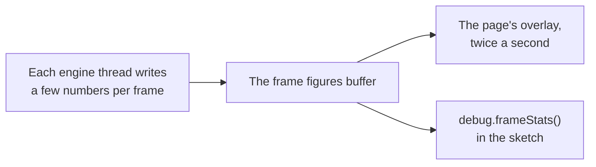

# Debug drawing and stats

> Ships in null3D 0.1, and `debug.skeleton` in null3D 0.2. The API is experimental, so it can still change between versions.

Debug drawing shows where things are in the scene: lines, boxes, spheres, arrows, axes, grids, camera frustums, lights and skeletons. Debug views draw the whole scene with one debug shading, such as its normals, its wireframe or its shadows. The overlay of `debug.stats` shows the engine's frame figures over the canvas, and `debug.frameStats` gives them to the sketch. On the page, `engine.measure` measures the running engine.

## Debug drawing



`ctx.debug` draws lines over the scene for one frame. Call it in `onUpdate` in every frame that needs the drawing. Each call adds the lines of its shape. When the frame draws, the engine moves each point relative to the camera in 64-bit floats. Then it draws every line in one call, after the opaque objects. So lines stay precise far from the origin, as objects do, and objects in front of a line hide it.

```ts
export default defineSketch(({ scene, materials, geometry, debug }) => {
  const sun = scene.createDirectionalLight({ direction: [-1, -2, -1] });
  const crate = scene.createMesh({
    mesh: geometry.box(),
    material: materials.standard({ color: '#e8554e' }),
    dynamic: true,
  });
  const lookout = scene.createPerspectiveCamera({ position: [6, 2, 0], target: [0, 0, 0], far: 20 });
  return {
    onUpdate() {
      debug.grid(10, 10);
      debug.axes(crate);                                   // follows the crate as it moves and turns
      debug.box([-0.6, -0.6, -0.6], [0.6, 0.6, 0.6], '#ff0000');
      debug.arrow([0, 2, 0], [1, 0, 0], 1.5);
      debug.frustum(lookout);
      debug.light(sun, { position: [0, 3, 0] });
    },
  };
});
```

| Call | What it draws | Default color |
| --- | --- | --- |
| `line(from, to, color)` | A line between two points | Yellow |
| `box(min, max, color)` | The 12 edges of a box that lines up with the world's axes | Yellow |
| `sphere(center, radius, color)` | Three circles around the center, one in each plane of the world's axes | Yellow |
| `arrow(origin, direction, length, color)` | A line from `origin` with a head at its tip, 1 meter long unless `length` says otherwise | Yellow |
| `axes(target, size)` | The x, y and z axes, `size` meters long, at a position or on an object | Red, green and blue |
| `grid(size, divisions, options)` | A square grid on the horizontal plane, as three.js's `GridHelper` draws it | Gray, darker through the center |
| `frustum(camera, color)` | The near and far planes of a camera's view, and the edges between them | Orange |
| `light(light, options)` | A directional light: a square that faces the light, and an arrow in the direction its light travels | The light's color |
| `skeleton(object, color)` | The joints of an animated object: a line from each joint of a skin to its parent joint, as three.js's `SkeletonHelper` draws them | Blue at the joint, green at its parent |

Colors take the same forms as material colors: a hex string such as `'#ff0000'`, a number such as `0xff0000`, or three linear components from 0 to 1. Positions are in world space, in arrays such as `[x, y, z]` or typed arrays.

### Objects and cameras

`debug.axes(object)`, `debug.frustum(camera)`, `debug.light(light)` and `debug.skeleton(object)` draw at the object's place in the frame that draws them. A skeleton takes the pose that the frame's [animation](animation.md) step gave its joints. A light draws where it stands unless its `position` option gives another place, which suits a directional light, whose position does not change its light. They wait until the engine has updated the frame's transforms and poses, so they never trail a moving object by one frame. A camera's frustum takes the shape of the canvas, as its view does.

### Release builds

Debug drawing works in development builds only. In a production build, every drawing call and `debug.view` do nothing. The build holds neither the drawing code nor the shaders of the lines and the views. The calls themselves still run. So work that only feeds debug drawing still costs time: wrap it in `if (import.meta.env.DEV)`, which Vite sets to false in production builds. The stats overlay and `debug.frameStats` work in every build.

### Limits

- Lines are one pixel wide on every GPU, because WebGPU draws lines no wider. Wide lines come with [lines](lines.md) in null3D 0.2.
- A frame draws at most 131,072 lines. The engine leaves out the lines after that, and warns once in the console.
- A frame without debug drawing runs no debug pass, uploads nothing and allocates nothing.

## Debug views



`debug.view(name)` draws every mesh with one debug shading in place of its material, from the next frame on. `debug.view('lit')` draws the materials again.

```ts
export default defineSketch(({ debug, input }) => {
  const views = ['lit', 'normals', 'depth', 'overdraw', 'wireframe', 'shadows'] as const;
  let shown = 0;
  return {
    onUpdate() {
      if (input.wasPressed('KeyV')) {
        shown = (shown + 1) % views.length;
        debug.view(views[shown]);
      }
    },
  };
});
```

| View | What it shows |
| --- | --- |
| `'lit'` | The materials' own shading, as without a debug view |
| `'normals'` | Each surface's normal in world space as a color: x as red, y as green and z as blue, each from -1 to 1 as 0 to 1 |
| `'depth'` | The distance from the camera as a gray: white at the near plane, black at the far plane. A perspective camera's distance takes a logarithmic scale, so near and far objects both show. An orthographic camera's scale is linear |
| `'overdraw'` | Light that each surface adds to the pixels it covers, with no depth test. Bright pixels are covered many times, so they cost the most shading. The [8-bit path](../concepts/color-management.md#the-8-bit-path) adds the light after the sRGB encoding, so layers brighten faster there |
| `'wireframe'` | The edges of each triangle as lines one pixel wide, in the material's color |
| `'shadows'` | How much of the main directional light's shadow falls on each surface, as a gray: black in full shadow, white in full light. The gray is the factor that lit shading multiplies the sun's light by. A surface that faces away from the sun is black, as no sunlight reaches it. A surface that receives no shadows, or whose material takes no light, is white |

- A debug view clears to black and hides the background texture. It uses no tone mapping and no exposure, so its colors reach the canvas as the table gives them.
- The views ignore what a material changes: maps, vertex colors, alpha, blending, depth options and custom shaders, vertex offsets included. A mesh keeps its place and the faces it culls.
- The first frame of a view builds its GPU pipelines, so objects can be missing from a few frames after a change.
- The wireframe view keeps an edge list for each mesh once it has shown, which takes twice the GPU memory of the mesh's triangle indices.
- Debug views work in development builds only. In a release build, `debug.view` does nothing, and the build holds neither their code nor their shader. A name that the engine does not know fails with [E1213](../errors/E1213.md).

### Watch the shadow cascades from elsewhere

`debug.shadowCamera(camera)` places the main directional light's [shadow cascades](../concepts/shadows.md) from another camera. The active camera still draws the frame. Keep the active camera still, and move and turn the other one as a player would. In the `'shadows'` view, a shadow edge that crawls or shimmers then shows at once. Nothing else in the frame moves. `debug.shadowCamera()` with no camera places the cascades from the active camera again.

```ts
export default defineSketch(({ scene, debug, time }) => {
  const player = scene.createPerspectiveCamera({ position: [0, 2, 8], target: [0, 0, 0] });
  const watcher = scene.createPerspectiveCamera({ position: [0, 2, 8], target: [0, 0, 0] });
  scene.setActiveCamera(watcher);
  debug.shadowCamera(player);
  debug.view('shadows');
  return {
    onUpdate() {
      player.setPosition(Math.sin(time.now * 0.2) * 0.05, 2, 8);  // a slow sway
    },
  };
});
```

The cascades keep their boxes and their split distances from the other camera's view, so they fall where they fall in that camera's own frames. In a release build the call does nothing. three.js's cascaded shadow maps (`CSM`) take their camera as an option in the same way, so they can follow another camera than the one that renders.

## Stats overlay and frame figures



`debug.stats(true)` shows an overlay over the top-left corner of the canvas, as stats.js does. It shows the GPU path, the quality preset and the render scale. It also shows the frame rates and the CPU time per frame of each thread, split into the frame's phases. `debug.stats(false)` hides it. The page draws the overlay and updates it twice a second. The pointer goes through the overlay to the canvas.

`debug.frameStats()` gives the sketch the figures that the overlay shows. Each figure per frame is a mean over the frames of the last window, about half a second of presented frames. The figures change when a window ends.

```ts
export default defineSketch(({ debug, page, time }) => {
  debug.stats(true);
  let next = 5;
  return {
    onUpdate() {
      const stats = debug.frameStats();   // allocates nothing, so it can run every frame
      if (stats.frames > 0 && time.now >= next) {
        next = time.now + 5;
        // JSON gives a copy that keeps this window's figures, for the page to log or upload.
        page.post('stats', JSON.parse(JSON.stringify(stats)));
      }
    },
  };
});
```

| Figure | What it is |
| --- | --- |
| `frames`, `seconds` | The presented frames of the window and its length. Both are 0 before the first window ends |
| `presentedFps` | Frames per second that the engine presented |
| `completedFps` | Frames per second that the GPU finished. Below `presentedFps`, the GPU limits the frame rate |
| `cpuMs` | CPU time per frame of the busiest thread, in milliseconds |
| `threads` | Each engine thread's name, its CPU time per frame, and the time of each phase, as `engine.measure` names them |
| `drawCalls`, `uploadBytes` | Draw calls and bytes uploaded to the GPU, per frame |
| `tier`, `preset`, `renderScale` | The GPU path, the quality preset, and the share of the canvas's size that the scene draws at |

- The figures cost the frame almost nothing: the engine's threads write them anyway, for `engine.measure`. Reading them allocates nothing, so a sketch can call `debug.frameStats()` every frame.
- The overlay's code downloads at the first `debug.stats(true)`, and the figures' code at the first call of either. Pages that never call them download neither.
- Both work in every build, production builds included.
- The figures leave out GPU time, which the engine measures only during `engine.measure`.

## Frame measurement

`engine.measure(seconds)` on the page measures the running engine for that many seconds. It returns a `FrameMetrics` object. That holds CPU time per frame by thread and step, GPU time per frame and per pass, frame rates, uploads and draw calls. It also holds memory, load times and the frame rates of each second. Each figure that varies from frame to frame comes as `Percentiles`: the median, the 95th and 99th percentiles, the mean and the number of frames.

Each thread writes a few numbers per frame into a buffer that the page reads, so a measurement costs the frame almost nothing. GPU timing runs only while the page measures, and only on one frame in eleven. The engine tracks every frame that the GPU finishes, all the time, because it holds new frames back while two are unfinished. [Performance guide](../guides/performance.md#measure) explains each figure and how to measure fairly.

### Example: measure a running scene

```ts
import { createEngine } from '@null3d/engine';

const canvas = document.querySelector('canvas') as HTMLCanvasElement;
const engine = await createEngine({ canvas, sketch: new URL('./sketch.ts', import.meta.url) });
await engine.firstFrame;
// Let the browser optimize the per-frame code before you measure.
await new Promise((resolve) => setTimeout(resolve, 5000));
const stats = await engine.measure(10);
console.log(`busiest thread: ${stats.cpuMs.median.toFixed(2)} ms per frame`);
console.log(`presented ${stats.presentedFps.toFixed(1)} frames per second`);
for (const part of stats.gpuPassMs ?? []) {
  console.log(`GPU, ${part.name}: ${part.ms.median.toFixed(3)} ms`);
}
```

### GPU time

`gpuMs` and `gpuPassMs` need timestamp queries, which some WebGPU devices offer and WebGL2 never does. Without them both are null. `gpuPassMs` splits `gpuMs` into the parts of the frame, in the order the GPU runs them:

| Part | What it is |
| --- | --- |
| `copies` | Copies recorded before the frame's first pass, where the browser times them |
| `compute 1`, `compute 2` and so on | Each compute pass, such as the culling pass on WebGPU, where the browser times it |
| `render 1`, `render 2` and so on | Each render pass, such as the main pass, where the browser times it |
| `between passes` | The time from the end of one pass to the start of the next, in a frame of more than one pass where the browser times every pass |

These figures time the GPU's work only. Work that the browser does outside the passes shows in `gpuLatencyMs` and in the frame rates.

## API reference

<!-- null3d:api:start -->

### `Debug`

Interface `Debug`.

Debug drawing and frame figures. The drawing calls draw lines that show where things are, such as bounds, directions and axes. Each draws for one frame only, so call it in `onUpdate` in every frame that needs the drawing. Lines are one pixel wide, and objects in front of them hide them. Colors take the same forms as material colors, and positions are in world space. The overlay of `stats` shows frame figures on the page, and `frameStats` gives the sketch the same figures. Only development builds draw. In a release build every drawing call does nothing, and the build holds none of the drawing code. The calls `stats` and `frameStats` work in every build.

| Member | Description |
| --- | --- |
| `stats(show?: boolean): void` | Shows an overlay of frame figures over the top-left corner of the canvas, or hides it with `false`: the GPU path, the quality preset, the render scale, the frame rates, and CPU time per frame of each thread and phase. The page draws the overlay and updates it twice a second. Its code downloads at the first call. |
| `frameStats(): FrameStats` | The figures that the stats overlay shows, for the sketch: means per frame over about the last half second. Call it each time you need figures, and read them from the object it returns. It allocates nothing, so a sketch can call it every frame. Its code downloads at the first call, so the figures are 0 until about half a second after that call. |
| `view(view: DebugView): void` | Draws the whole scene with one debug shading in place of every material, from the next frame on, until the next call. `'lit'` draws the materials again. `'normals'` shows each surface's world-space normal as a color, and `'depth'` its distance from the camera as a gray, white at the near plane and black at the far plane. `'overdraw'` adds light for each surface that covers a pixel, so bright pixels cost the most shading. `'wireframe'` draws each triangle's edges in its material's color. `'shadows'` shows how much of the main directional light's shadow falls on each surface, as a gray: black in full shadow, white in full light. Surfaces that face away from the sun are black, and surfaces that receive no shadows are white. Debug views clear to black and use no tone mapping. Only development builds draw them: in a release build the call does nothing. A view's first frame builds its pipelines, so objects can be missing for a few frames after a change. |
| `shadowCamera(camera?: Camera): void` | Places the main directional light's shadow cascades from `camera` instead of from the active camera, from the next frame on, until the next call. The active camera still draws the frame, so it can watch from a fixed place how the cascades move as `camera` moves and turns: shadow edges that shimmer or crawl show at once. Call it with no camera to place the cascades from the active camera again. Only development builds use it: in a release build the call does nothing. |
| `line(from: Vec3Like, to: Vec3Like, color?: ColorInput): void` | Draws a line from one point to another. The default color is yellow. |
| `box(min: Vec3Like, max: Vec3Like, color?: ColorInput): void` | Draws the edges of a box that lines up with the world's axes, from its lowest corner `min` to its highest corner `max`. The default color is yellow. |
| `sphere(center: Vec3Like, radius: number, color?: ColorInput): void` | Draws a sphere as three circles around its center, one in each plane of the world's axes. The default color is yellow. |
| `arrow(origin: Vec3Like, direction: Vec3Like, length?: number, color?: ColorInput): void` | Draws an arrow from `origin` in `direction`, `length` meters long, with a head at its tip. The direction needs no unit length. The default length is 1, and the default color is yellow. |
| `axes(target: Object3D \| Vec3Like, size?: number): void` | Draws x, y and z axes, in red, green and blue, `size` meters long: at a position, or on an object. An object's axes take its position and rotation in the frame they draw in, so they never lag behind it. The default size is 1. |
| `grid(size?: number, divisions?: number, options?: DebugGridOptions): void` | Draws a square grid on the horizontal plane through its center, `size` meters wide, with `divisions` cells along each side, as three.js's `GridHelper` does. The defaults are 10 and 10. |
| `frustum(camera: Camera, color?: ColorInput): void` | Draws the space that a camera sees: its near and far planes and the edges between them, in the canvas's shape. The camera takes its place in the frame it draws in. The default color is orange, as in three.js's `CameraHelper`. |
| `light(light: DirectionalLight, options?: DebugLightOptions): void` | Draws a directional light as a square that faces its light, with an arrow in the direction its light travels. The light takes its place and direction in the frame it draws in. |
| `skeleton(object: Object3D, color?: ColorInput): void` | Draws the skeleton that animates an object, such as the copy of a model that `scene.instantiate` made: a line from each joint of the model's skins to its parent joint, in the pose of the frame it draws in. As in three.js's `SkeletonHelper`, each line is blue at the joint and green at its parent, unless `color` gives one color. An object without an animator draws nothing. |

### `DebugGridOptions`

Interface `DebugGridOptions`.

Options for `debug.grid`.

| Member | Description |
| --- | --- |
| `center?: Vec3Like` | The center of the grid. The default is the origin. |
| `color?: ColorInput` | The color of the grid's lines. The default is `'#888888'`, as in three.js's `GridHelper`. |
| `centerColor?: ColorInput` | The color of the two lines through the center. The default is `'#444444'`. |

### `DebugLightOptions`

Interface `DebugLightOptions`.

Options for `debug.light`.

| Member | Description |
| --- | --- |
| `position?: Vec3Like` | Where to draw the light, such as a place in view for a directional light, whose own position does not change its light. The default is the light's position. |
| `size?: number` | The size of the drawing in meters. The default is 1. |
| `color?: ColorInput` | The color of the drawing. The default is the light's own color. |

### `DebugView`

```ts
type DebugView = 'lit' | 'normals' | 'depth' | 'wireframe' | 'overdraw' | 'shadows';
```

A debug view of `debug.view`: the materials' own shading with `'lit'`, or one debug shading in place of every material.

### `FrameMetrics`

Interface `FrameMetrics`, which extends `FrameSummary`.

What `engine.measure` returns: the per-frame figures, memory, load time and download size.

| Member | Description |
| --- | --- |
| `seconds: number` | Length of the measurement. |
| `memory: MemoryStats` | The engine's WebAssembly memory and the JavaScript heap. |
| `load: { engineStartMs: number; probeMs: number; coreMs: number; firstFrameMs: number \| null; firstFrameDoneMs: number \| null; warmUpMs: number \| null; firstDrawMs: number \| null; firstFramePipelines: number \| null; }` | How long the engine took to start and to draw its first frame, in milliseconds. |
| `gpuLosses: number` | Times the browser took the GPU away since the engine started, and the engine carried on with a new device. `simulateGpuLoss` counts too. |
| `downloadBytes: { wasm: number \| null; }` | Bytes of the engine's WebAssembly file as the page downloaded it. |
| `lostRecords: number` | Frame records the page read too late; nonzero means some frames are missing from the figures. |
| `completionSignal: 'queue' \| 'fence'` | How the renderer learned that the GPU finished a frame: its queue (WebGPU) or a fence (WebGL2). |
| `refreshHz: number \| null` | The display's refresh rate in hertz, as the thread that draws measured it, or null before then. |
| `mainThread: MainThreadStats \| null` | The page's own thread during the measurement, where the browser reports it, or null. |
| `perSecond: SecondRates[]` | The frame rates of each whole second of the measurement, in order. A long measurement shows here when and for how long the rate fell, which the rates of the whole measurement hide. |

### `FrameStats`

Interface `FrameStats`.

Figures of the running engine, as `debug.frameStats()` returns them and the stats overlay shows them. Each figure per frame is a mean over the frames of the last window: about half a second of presented frames. The figures change when a window ends, and stay the same while the engine presents no frames.

| Member | Description |
| --- | --- |
| `readonly frames: number` | Frames that the engine presented in the window, or 0 before the first window ended. |
| `readonly seconds: number` | The window's length in seconds. |
| `readonly presentedFps: number` | Frames per second that the engine presented. |
| `readonly completedFps: number` | Frames per second that the GPU finished. Below `presentedFps`, frames queue on the GPU, and the display shows fewer than the presented rate suggests. |
| `readonly cpuMs: number` | Mean CPU time per frame of the busiest thread, in milliseconds. |
| `readonly threads: readonly FrameStatsThread[]` | CPU time per frame of each engine thread. |
| `readonly drawCalls: number` | Mean draw calls per frame. |
| `readonly uploadBytes: number` | Mean bytes uploaded to the GPU per frame. |
| `readonly tier: Tier` | The GPU path the engine draws with. |
| `readonly preset: QualityPreset` | The quality preset that the engine runs. |
| `readonly renderScale: number` | The render scale of the newest frame: the share of the canvas's width and height that the scene draws at, from 0 to 1. Dynamic resolution moves it during play. |

### `FrameStatsThread`

Interface `FrameStatsThread`.

One thread's CPU time per frame, in `FrameStats.threads`.

| Member | Description |
| --- | --- |
| `readonly name: string` | The thread, named as `engine.measure` names it: `main`, `sketch-worker`, `render-worker`, `job-0` and so on. |
| `readonly busyMs: number` | Mean CPU time per frame on this thread, in milliseconds. |
| `readonly phases: Readonly<Record<PhaseName, number>>` | Mean CPU time per frame of each phase, in milliseconds: 0 for a phase that runs elsewhere. |

### `FrameSummary`

Interface `FrameSummary`.

Per-frame figures of a measurement: CPU time by thread, GPU time, frame intervals, uploads and draw calls.

| Member | Description |
| --- | --- |
| `frames: number` | Frames that the sketch computed and the renderer drew within the measurement. |
| `cpuMs: Percentiles` | CPU time per frame of the busiest thread, the time that limits the frame rate. |
| `cpuMsAllThreads: Percentiles` | CPU time per frame summed over every thread. |
| `threads: Record<string, ThreadStats>` | Per thread, by name: `main`, `sketch-worker`, `render-worker`, `job-0` and so on. |
| `gpuMs: Percentiles \| null` | GPU time per frame, where the device has timestamp queries: from the frame's first command to the end of its last pass. Where the browser cannot time the commands before the first pass, the time starts at the first pass. The engine times one frame in eleven, which keeps the cost of measuring small and takes in every turn of the far shadow cascades. |
| `gpuPassMs: GpuPassStats[] \| null` | The parts of the GPU time per frame, in the order the frame runs them: the copies before the first pass, where the browser times them, each pass that the browser times, and the time between passes in frames where it times every pass. In a frame with more passes than the engine times one by one, the last pass it times also counts the passes after it. Null where `gpuMs` is. |
| `gpuStepMs: number \| null` | The step between GPU times when the browser rounds its timestamps, or null when they look exact. Chrome rounds them unless its WebGPU developer features are turned on. |
| `intervalMs: Percentiles` | Time between presented frames. |
| `presentedFps: number` | Frames per second that the renderer presented. |
| `completedFps: number \| null` | Frames per second that the GPU finished. Below `presentedFps`, frames queue on the GPU, and the display shows fewer than the presented rate suggests. Null when no completion arrived. |
| `gpuLatencyMs: Percentiles \| null` | Time from a frame's submit to the GPU finishing it. The engine lets at most two frames wait unfinished on the GPU, so when the GPU falls behind, the figure grows to about two completed frame intervals. With a WebGL2 fence, the engine sees completion at its next frame callback, so the figure rounds up to frame intervals. The figure ends when the thread that draws sees the finish, so it also counts time that the thread spends blocked. In Safari, the copy of a worker's frame to the page blocks the worker until the GPU has finished the frame. |
| `uploadBytes: Percentiles` | Bytes uploaded to the GPU per frame. |
| `drawCalls: Percentiles` | Draw calls per frame. |
| `visibleEntries: Percentiles \| null` | Entries per frame in the list of visible objects on WebGL2, where the job workers cull. Each visible object or instance row is one entry. So is each visible group of 64 rows in a static batch that has stopped changing. The list uploads 4 bytes per entry in each frame that changes it. Null on WebGPU, where the GPU culls and the CPU never learns the count. |
| `occludedEntries: Percentiles \| null` | Entries per frame that software occlusion culling took out of the list of visible objects on WebGL2: objects, instance rows and groups of rows inside the camera's view that lie wholly behind blockers. Null on WebGPU, where the GPU culls. |
| `rebuilds: number` | Frames whose structure change rebuilt the draw tables: objects created or destroyed, meshes or materials changed, or batches created or destroyed. Steady play has none; showing or hiding objects and changing a batch's active count do not rebuild. |
| `pipelines: number` | GPU pipelines built during the measurement. A build can stall the frame it happens in. The engine builds its pipelines in the first frame, after a change of quality preset, and after the browser replaces the GPU, so steady play builds none. |
| `gpuObjects: number` | GPU buffers, textures, texture views, samplers and bind groups that the engine made during the measurement. Steady play makes none, and neither does a new render scale. |
| `skippedDraws: number` | Draw commands that frames skipped during the measurement because their pipeline was still building, so the objects they draw were missing from those frames. `scene.warmUp()` before new objects show, and `quality.setPreset()`, keep it at 0. |

### `GpuPassStats`

Interface `GpuPassStats`.

GPU time per frame of one part of the frame, in `FrameSummary.gpuPassMs`.

| Member | Description |
| --- | --- |
| `name: string` | The part: `copies` for the copies before the frame's first pass, a pass by its kind and its place among the passes of that kind, such as `compute 1` or `render 2`, or `between passes`. |
| `ms: Percentiles` | GPU time per frame of the part. |

### `MainThreadStats`

Interface `MainThreadStats`.

The page's own thread during a measurement: tasks that kept it busy for 50 ms or more, and the delay before the page handled input.

| Member | Description |
| --- | --- |
| `longTasks: number` | Tasks of 50 ms or more on the page's thread. |
| `longestTaskMs: number` | The longest of them, or 0 when there were none. |
| `inputDelayMs: Percentiles \| null` | Time from each input event to the page starting to handle it, or null without input. |

### `MemoryStats`

Interface `MemoryStats`.

Memory figures of a measurement.

| Member | Description |
| --- | --- |
| `wasmBytes: number \| null` | Size of the engine's WebAssembly memory at the end of the measurement. |
| `jsHeap: { bytes: number; byScope: Record<string, number>; } \| null` | JavaScript heap by global scope: the page and its workers when a measurement of them finished during the run, otherwise the page alone where the browser reports that. Chrome adds shared memory, such as the engine's own, to the figure of each worker that holds it, so worker figures overlap and can far exceed the worker's own heap. |
| `jsHeapSamples: { atSeconds: number; bytes: number; }[]` | Measurements of the page and its workers that finished during the run, for long runs. |
| `jsHeapNote: string \| null` | Why the heap figures cover only the page, or null when they also cover the workers that run JavaScript each frame. |

### `Percentiles`

Interface `Percentiles`.

A summary of per-frame samples.

| Member | Description |
| --- | --- |
| `count: number` | The number of samples. |
| `median: number` | The middle value. |
| `p95: number` | The 95th percentile: 95% of samples are at or below it. |
| `p99: number` | The 99th percentile: 99% of samples are at or below it. |
| `mean: number` | The average. |

### `PhaseName`

```ts
type PhaseName =
	| 'update'
	| 'commands'
	| 'transforms'
	| 'batches'
	| 'cull'
	| 'record'
	| 'upload'
	| 'replay';
```

A step of a frame that `engine.measure` times. The `update` step is the sketch's own code, in all of its callbacks, and the other steps are the engine's.

### `SecondRates`

Interface `SecondRates`.

The frame rates of one second of a measurement, in `FrameMetrics.perSecond`.

| Member | Description |
| --- | --- |
| `presentedFps: number` | Frames that the renderer presented in the second. |
| `completedFps: number \| null` | Frames that the GPU finished in the second, or null when no completion arrived at all. |

### `ThreadStats`

Interface `ThreadStats`.

One thread's CPU time per frame, in `FrameSummary.threads`.

| Member | Description |
| --- | --- |
| `busyMs: Percentiles` | CPU time per frame on this thread. |
| `phases: Partial<Record<PhaseName, Percentiles>>` | CPU time per frame of each phase that ran on this thread. |

<!-- null3d:api:end -->
