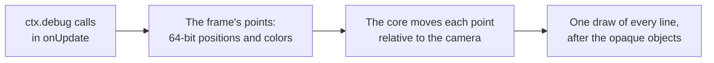
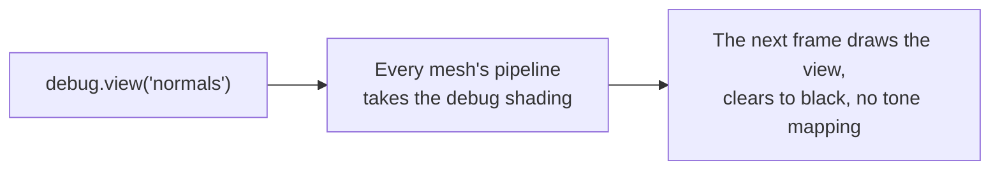
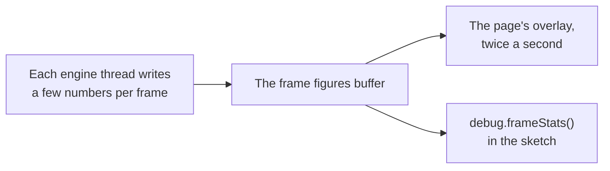

# Debug drawing and stats

> Ships in null3D 0.1, and `debug.skeleton` in null3D 0.2. The API is experimental, so it can still change between versions.

Debug drawing shows where things are in the scene: lines, boxes, spheres, arrows, axes, grids, camera frustums, lights and skeletons. Debug views draw the whole scene with one debug shading, such as its normals, its wireframe or its shadows. The overlay of `debug.stats` shows the engine's frame figures over the canvas, and `debug.frameStats` gives them to the sketch. On the page, `engine.measure` measures the running engine.

## Debug drawing



`ctx.debug` draws lines over the scene for one frame. Call it in `onUpdate` in every frame that needs the drawing. Each call adds the lines of its shape. When the frame draws, the engine moves each point relative to the camera in 64-bit floats. Then it draws every line in one call, after the opaque objects. So lines stay precise far from the origin, as objects do, and objects in front of a line hide it.

```ts
export default defineSketch(({ scene, materials, geometry, debug }) => {
  const sun = scene.createDirectionalLight({ direction: [-1, -2, -1] });
  const crate = scene.createMesh({
    mesh: geometry.box(),
    material: materials.standard({ color: '#e8554e' }),
    dynamic: true,
  });
  const lookout = scene.createPerspectiveCamera({ position: [6, 2, 0], target: [0, 0, 0], far: 20 });
  return {
    onUpdate() {
      debug.grid(10, 10);
      debug.axes(crate);                                   // follows the crate as it moves and turns
      debug.box([-0.6, -0.6, -0.6], [0.6, 0.6, 0.6], '#ff0000');
      debug.arrow([0, 2, 0], [1, 0, 0], 1.5);
      debug.frustum(lookout);
      debug.light(sun, { position: [0, 3, 0] });
    },
  };
});
```

| Call | What it draws | Default color |
| --- | --- | --- |
| `line(from, to, color)` | A line between two points | Yellow |
| `box(min, max, color)` | The 12 edges of a box that lines up with the world's axes | Yellow |
| `sphere(center, radius, color)` | Three circles around the center, one in each plane of the world's axes | Yellow |
| `arrow(origin, direction, length, color)` | A line from `origin` with a head at its tip, 1 meter long unless `length` says otherwise | Yellow |
| `axes(target, size)` | The x, y and z axes, `size` meters long, at a position or on an object | Red, green and blue |
| `grid(size, divisions, options)` | A square grid on the horizontal plane, as three.js's `GridHelper` draws it | Gray, darker through the center |
| `frustum(camera, color)` | The near and far planes of a camera's view, and the edges between them | Orange |
| `light(light, options)` | A directional light: a square that faces the light, and an arrow in the direction its light travels | The light's color |
| `skeleton(object, color)` | The joints of an animated object: a line from each joint of a skin to its parent joint, as three.js's `SkeletonHelper` draws them | Blue at the joint, green at its parent |

Colors take the same forms as material colors: a hex string such as `'#ff0000'`, a number such as `0xff0000`, or three linear components from 0 to 1. Positions are in world space, in arrays such as `[x, y, z]` or typed arrays.

### Objects and cameras

`debug.axes(object)`, `debug.frustum(camera)`, `debug.light(light)` and `debug.skeleton(object)` draw at the object's place in the frame that draws them. A skeleton takes the pose that the frame's [animation](animation.md) step gave its joints. A light draws where it stands unless its `position` option gives another place, which suits a directional light, whose position does not change its light. They wait until the engine has updated the frame's transforms and poses, so they never trail a moving object by one frame. A camera's frustum takes the shape of the canvas, as its view does.

### Release builds

Debug drawing works in development builds only. In a production build, every drawing call and `debug.view` do nothing. The build holds neither the drawing code nor the shaders of the lines and the views. The calls themselves still run. So work that only feeds debug drawing still costs time: wrap it in `if (import.meta.env.DEV)`, which Vite sets to false in production builds. The stats overlay and `debug.frameStats` work in every build.

### Limits

- Lines are one pixel wide on every GPU, because WebGPU draws lines no wider. Wide lines come with [lines](lines.md) in null3D 0.2.
- A frame draws at most 131,072 lines. The engine leaves out the lines after that, and warns once in the console.
- A frame without debug drawing runs no debug pass, uploads nothing and allocates nothing.

## Debug views



`debug.view(name)` draws every mesh with one debug shading in place of its material, from the next frame on. `debug.view('lit')` draws the materials again.

```ts
export default defineSketch(({ debug, input }) => {
  const views = ['lit', 'normals', 'depth', 'overdraw', 'wireframe', 'shadows'] as const;
  let shown = 0;
  return {
    onUpdate() {
      if (input.wasPressed('KeyV')) {
        shown = (shown + 1) % views.length;
        debug.view(views[shown]);
      }
    },
  };
});
```

| View | What it shows |
| --- | --- |
| `'lit'` | The materials' own shading, as without a debug view |
| `'normals'` | Each surface's normal in world space as a color: x as red, y as green and z as blue, each from -1 to 1 as 0 to 1 |
| `'depth'` | The distance from the camera as a gray: white at the near plane, black at the far plane. A perspective camera's distance takes a logarithmic scale, so near and far objects both show. An orthographic camera's scale is linear |
| `'overdraw'` | Light that each surface adds to the pixels it covers, with no depth test. Bright pixels are covered many times, so they cost the most shading. The [8-bit path](../concepts/color-management.md#the-8-bit-path) adds the light after the sRGB encoding, so layers brighten faster there |
| `'wireframe'` | The edges of each triangle as lines one pixel wide, in the material's color |
| `'shadows'` | How much of the main directional light's shadow falls on each surface, as a gray: black in full shadow, white in full light. The gray is the factor that lit shading multiplies the sun's light by. A surface that faces away from the sun is black, as no sunlight reaches it. A surface that receives no shadows, or whose material takes no light, is white |

- A debug view clears to black and hides the background texture. It uses no tone mapping and no exposure, so its colors reach the canvas as the table gives them.
- The views ignore what a material changes: maps, vertex colors, alpha, blending, depth options and custom shaders, vertex offsets included. A mesh keeps its place and the faces it culls.
- The first frame of a view builds its GPU pipelines, so objects can be missing from a few frames after a change.
- The wireframe view keeps an edge list for each mesh once it has shown, which takes twice the GPU memory of the mesh's triangle indices.
- Debug views work in development builds only. In a release build, `debug.view` does nothing, and the build holds neither their code nor their shader. A name that the engine does not know fails with [E1213](../errors/E1213.md).

### Watch the shadow cascades from elsewhere

`debug.shadowCamera(camera)` places the main directional light's [shadow cascades](../concepts/shadows.md) from another camera. The active camera still draws the frame. Keep the active camera still, and move and turn the other one as a player would. In the `'shadows'` view, a shadow edge that crawls or shimmers then shows at once. Nothing else in the frame moves. `debug.shadowCamera()` with no camera places the cascades from the active camera again.

```ts
export default defineSketch(({ scene, debug, time }) => {
  const player = scene.createPerspectiveCamera({ position: [0, 2, 8], target: [0, 0, 0] });
  const watcher = scene.createPerspectiveCamera({ position: [0, 2, 8], target: [0, 0, 0] });
  scene.setActiveCamera(watcher);
  debug.shadowCamera(player);
  debug.view('shadows');
  return {
    onUpdate() {
      player.setPosition(Math.sin(time.now * 0.2) * 0.05, 2, 8);  // a slow sway
    },
  };
});
```

The cascades keep their boxes and their split distances from the other camera's view, so they fall where they fall in that camera's own frames. In a release build the call does nothing. three.js's cascaded shadow maps (`CSM`) take their camera as an option in the same way, so they can follow another camera than the one that renders.

## Stats overlay and frame figures



`debug.stats(true)` shows an overlay over the top-left corner of the canvas, as stats.js does. It shows the GPU path, the quality preset and the render scale. It also shows the frame rates and the CPU time per frame of each thread, split into the frame's phases. `debug.stats(false)` hides it. The page draws the overlay and updates it twice a second. The pointer goes through the overlay to the canvas.

`debug.frameStats()` gives the sketch the figures that the overlay shows. Each figure per frame is a mean over the frames of the last window, about half a second of presented frames. The figures change when a window ends.

```ts
export default defineSketch(({ debug, page, time }) => {
  debug.stats(true);
  let next = 5;
  return {
    onUpdate() {
      const stats = debug.frameStats();   // allocates nothing, so it can run every frame
      if (stats.frames > 0 && time.now >= next) {
        next = time.now + 5;
        // JSON gives a copy that keeps this window's figures, for the page to log or upload.
        page.post('stats', JSON.parse(JSON.stringify(stats)));
      }
    },
  };
});
```

| Figure | What it is |
| --- | --- |
| `frames`, `seconds` | The presented frames of the window and its length. Both are 0 before the first window ends |
| `presentedFps` | Frames per second that the engine presented |
| `completedFps` | Frames per second that the GPU finished. Below `presentedFps`, the GPU limits the frame rate |
| `cpuMs` | CPU time per frame of the busiest thread, in milliseconds |
| `threads` | Each engine thread's name, its CPU time per frame, and the time of each phase, as `engine.measure` names them |
| `drawCalls`, `uploadBytes` | Draw calls and bytes uploaded to the GPU, per frame |
| `tier`, `preset`, `renderScale` | The GPU path, the quality preset, and the share of the canvas's size that the scene draws at |

- The figures cost the frame almost nothing: the engine's threads write them anyway, for `engine.measure`. Reading them allocates nothing, so a sketch can call `debug.frameStats()` every frame.
- The overlay's code downloads at the first `debug.stats(true)`, and the figures' code at the first call of either. Pages that never call them download neither.
- Both work in every build, production builds included.
- The figures leave out GPU time, which the engine measures only during `engine.measure`.

## Frame measurement

`engine.measure(seconds)` on the page measures the running engine for that many seconds. It returns a `FrameMetrics` object. That holds CPU time per frame by thread and step, GPU time per frame and per pass, frame rates, uploads and draw calls. It also holds memory, load times and the frame rates of each second. Each figure that varies from frame to frame comes as `Percentiles`: the median, the 95th and 99th percentiles, the mean and the number of frames.

Each thread writes a few numbers per frame into a buffer that the page reads, so a measurement costs the frame almost nothing. GPU timing runs only while the page measures, and only on one frame in eleven. The engine tracks every frame that the GPU finishes, all the time, because it holds new frames back while two are unfinished. [Performance guide](../guides/performance.md#measure) explains each figure and how to measure fairly.

### Example: measure a running scene

```ts
import { createEngine } from '@null3d/engine';

const canvas = document.querySelector('canvas') as HTMLCanvasElement;
const engine = await createEngine({ canvas, sketch: new URL('./sketch.ts', import.meta.url) });
await engine.firstFrame;
// Let the browser optimize the per-frame code before you measure.
await new Promise((resolve) => setTimeout(resolve, 5000));
const stats = await engine.measure(10);
console.log(`busiest thread: ${stats.cpuMs.median.toFixed(2)} ms per frame`);
console.log(`presented ${stats.presentedFps.toFixed(1)} frames per second`);
for (const part of stats.gpuPassMs ?? []) {
  console.log(`GPU, ${part.name}: ${part.ms.median.toFixed(3)} ms`);
}
```

### GPU time

`gpuMs` and `gpuPassMs` need timestamp queries, which some WebGPU devices offer and WebGL2 never does. Without them both are null. `gpuPassMs` splits `gpuMs` into the parts of the frame, in the order the GPU runs them:

| Part | What it is |
| --- | --- |
| `copies` | Copies recorded before the frame's first pass, where the browser times them |
| `compute 1`, `compute 2` and so on | Each compute pass, such as the culling pass on WebGPU, where the browser times it |
| `render 1`, `render 2` and so on | Each render pass, such as the main pass, where the browser times it |
| `between passes` | The time from the end of one pass to the start of the next, in a frame of more than one pass where the browser times every pass |

These figures time the GPU's work only. Work that the browser does outside the passes shows in `gpuLatencyMs` and in the frame rates.

## API reference

<!-- null3d:api:start -->
<!-- null3d:api:end -->
