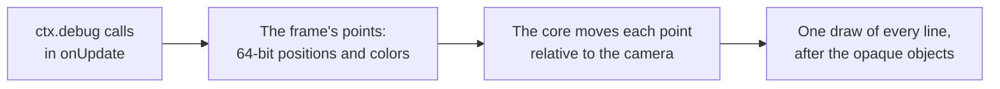

# Debug drawing and stats

> Ships in null3D 0.1. The API is experimental, so it can still change between versions. The calls `debug.view`, `debug.frameStats` and `debug.stats`, which shows a stats overlay, are not built yet, so coding agents must not use them. Skeleton drawing, `debug.skeleton`, comes with animation in null3D 0.2.

Debug drawing shows where things are in the scene: lines, boxes, spheres, arrows, axes, grids, camera frustums and lights. `engine.measure` measures the running engine.

## Debug drawing



`ctx.debug` draws lines over the scene for one frame. Call it in `onUpdate` in every frame that needs the drawing. Each call adds the lines of its shape. When the frame draws, the engine moves each point relative to the camera in 64-bit floats. Then it draws every line in one call, after the opaque objects. So lines stay precise far from the origin, as objects do, and objects in front of a line hide it.

```ts
export default defineSketch(({ scene, materials, geometry, debug }) => {
  const sun = scene.createDirectionalLight({ direction: [-1, -2, -1] });
  const crate = scene.createMesh({
    mesh: geometry.box(),
    material: materials.standard({ color: '#e8554e' }),
    dynamic: true,
  });
  const lookout = scene.createPerspectiveCamera({ position: [6, 2, 0], target: [0, 0, 0], far: 20 });
  return {
    onUpdate() {
      debug.grid(10, 10);
      debug.axes(crate);                                   // follows the crate as it moves and turns
      debug.box([-0.6, -0.6, -0.6], [0.6, 0.6, 0.6], '#ff0000');
      debug.arrow([0, 2, 0], [1, 0, 0], 1.5);
      debug.frustum(lookout);
      debug.light(sun, { position: [0, 3, 0] });
    },
  };
});
```

| Call | What it draws | Default color |
| --- | --- | --- |
| `line(from, to, color)` | A line between two points | Yellow |
| `box(min, max, color)` | The 12 edges of a box that lines up with the world's axes | Yellow |
| `sphere(center, radius, color)` | Three circles around the center, one in each plane of the world's axes | Yellow |
| `arrow(origin, direction, length, color)` | A line from `origin` with a head at its tip, 1 meter long unless `length` says otherwise | Yellow |
| `axes(target, size)` | The x, y and z axes, `size` meters long, at a position or on an object | Red, green and blue |
| `grid(size, divisions, options)` | A square grid on the horizontal plane, as three.js's `GridHelper` draws it | Gray, darker through the center |
| `frustum(camera, color)` | The near and far planes of a camera's view, and the edges between them | Orange |
| `light(light, options)` | A directional light: a square that faces the light, and an arrow in the direction its light travels | The light's color |

Colors take the same forms as material colors: a hex string such as `'#ff0000'`, a number such as `0xff0000`, or three linear components from 0 to 1. Positions are in world space, in arrays such as `[x, y, z]` or typed arrays.

### Objects and cameras

`debug.axes(object)`, `debug.frustum(camera)` and `debug.light(light)` draw at the object's place in the frame that draws them. A light draws where it stands unless its `position` option gives another place, which suits a directional light, whose position does not change its light. They wait until the engine has updated the frame's transforms, so they never trail a moving object by one frame. A camera's frustum takes the shape of the canvas, as its view does.

### Release builds

Debug drawing works in development builds only. In a production build, every `debug` call does nothing, and the build holds neither the drawing code nor the shader of the lines. The calls themselves still run. So work that only feeds debug drawing still costs time: wrap it in `if (import.meta.env.DEV)`, which Vite sets to false in production builds.

### Limits

- Lines are one pixel wide on every GPU, because WebGPU draws lines no wider. Wide lines come with [lines](lines.md) in null3D 0.2.
- A frame draws at most 131,072 lines. The engine leaves out the lines after that, and warns once in the console.
- A frame without debug drawing runs no debug pass, uploads nothing and allocates nothing.

## Frame measurement

`engine.measure(seconds)` on the page measures the running engine for that many seconds. It returns a `FrameMetrics` object. That holds CPU time per frame by thread and step, GPU time per frame and per pass, frame rates, uploads and draw calls. It also holds memory and load times. Each figure that varies from frame to frame comes as `Percentiles`: the median, the 95th and 99th percentiles, the mean and the number of frames.

Each thread writes a few numbers per frame into a buffer that the page reads, so a measurement costs the frame almost nothing. GPU timing runs only while the page measures, and only on one frame in eight. The engine tracks every frame that the GPU finishes, all the time, because it holds new frames back while two are unfinished. [Performance guide](../guides/performance.md#measure) explains each figure and how to measure fairly.

### Example: measure a running scene

```ts
import { createEngine } from '@null3d/engine';

const canvas = document.querySelector('canvas') as HTMLCanvasElement;
const engine = await createEngine({ canvas, sketch: new URL('./sketch.ts', import.meta.url) });
await engine.firstFrame;
// Let the browser optimize the per-frame code before you measure.
await new Promise((resolve) => setTimeout(resolve, 5000));
const stats = await engine.measure(10);
console.log(`busiest thread: ${stats.cpuMs.median.toFixed(2)} ms per frame`);
console.log(`presented ${stats.presentedFps.toFixed(1)} frames per second`);
for (const part of stats.gpuPassMs ?? []) {
  console.log(`GPU, ${part.name}: ${part.ms.median.toFixed(3)} ms`);
}
```

### GPU time

`gpuMs` and `gpuPassMs` need timestamp queries, which some WebGPU devices offer and WebGL2 never does. Without them both are null. `gpuPassMs` splits `gpuMs` into the parts of the frame, in the order the GPU runs them:

| Part | What it is |
| --- | --- |
| `copies` | Copies recorded before the frame's first pass, where the browser times them |
| `compute 1`, `compute 2` and so on | Each compute pass, such as the culling pass on WebGPU |
| `render 1`, `render 2` and so on | Each render pass, such as the main pass |
| `between passes` | The time from the end of one pass to the start of the next, in a frame of more than one pass |

These figures time the GPU's work only. Work that the browser does outside the passes shows in `gpuLatencyMs` and in the frame rates.

## API reference

<!-- null3d:api:start -->

### `Debug`

Interface `Debug`.

Debug drawing: lines that show where things are, such as bounds, directions and axes. Each call draws for one frame only, so call it in `onUpdate` in every frame that needs the drawing. Lines are one pixel wide, and objects in front of them hide them. Colors take the same forms as material colors, and positions are in world space. Only development builds draw. In a release build every call does nothing, and the build holds none of the drawing code.

| Member | Description |
| --- | --- |
| `line(from: Vec3Like, to: Vec3Like, color?: ColorInput): void` | Draws a line from one point to another. The default color is yellow. |
| `box(min: Vec3Like, max: Vec3Like, color?: ColorInput): void` | Draws the edges of a box that lines up with the world's axes, from its lowest corner `min` to its highest corner `max`. The default color is yellow. |
| `sphere(center: Vec3Like, radius: number, color?: ColorInput): void` | Draws a sphere as three circles around its center, one in each plane of the world's axes. The default color is yellow. |
| `arrow(origin: Vec3Like, direction: Vec3Like, length?: number, color?: ColorInput): void` | Draws an arrow from `origin` in `direction`, `length` meters long, with a head at its tip. The direction needs no unit length. The default length is 1, and the default color is yellow. |
| `axes(target: Object3D \| Vec3Like, size?: number): void` | Draws x, y and z axes, in red, green and blue, `size` meters long: at a position, or on an object. An object's axes take its position and rotation in the frame they draw in, so they never lag behind it. The default size is 1. |
| `grid(size?: number, divisions?: number, options?: DebugGridOptions): void` | Draws a square grid on the horizontal plane through its center, `size` meters wide, with `divisions` cells along each side, as three.js's `GridHelper` does. The defaults are 10 and 10. |
| `frustum(camera: Camera, color?: ColorInput): void` | Draws the space that a camera sees: its near and far planes and the edges between them, in the canvas's shape. The camera takes its place in the frame it draws in. The default color is orange, as in three.js's `CameraHelper`. |
| `light(light: DirectionalLight, options?: DebugLightOptions): void` | Draws a directional light as a square that faces its light, with an arrow in the direction its light travels. The light takes its place and direction in the frame it draws in. |

### `DebugGridOptions`

Interface `DebugGridOptions`.

Options for `debug.grid`.

| Member | Description |
| --- | --- |
| `center?: Vec3Like` | The center of the grid. The default is the origin. |
| `color?: ColorInput` | The color of the grid's lines. The default is `'#888888'`, as in three.js's `GridHelper`. |
| `centerColor?: ColorInput` | The color of the two lines through the center. The default is `'#444444'`. |

### `DebugLightOptions`

Interface `DebugLightOptions`.

Options for `debug.light`.

| Member | Description |
| --- | --- |
| `position?: Vec3Like` | Where to draw the light, such as a place in view for a directional light, whose own position does not change its light. The default is the light's position. |
| `size?: number` | The size of the drawing in meters. The default is 1. |
| `color?: ColorInput` | The color of the drawing. The default is the light's own color. |

### `FrameMetrics`

Interface `FrameMetrics`, which extends `FrameSummary`.

What `engine.measure` returns: the per-frame figures, memory, load time and download size.

| Member | Description |
| --- | --- |
| `seconds: number` | Length of the measurement. |
| `memory: MemoryStats` | The engine's WebAssembly memory and the JavaScript heap. |
| `load: { engineStartMs: number; probeMs: number; coreMs: number; firstFrameMs: number \| null; firstFrameDoneMs: number \| null; warmUpMs: number \| null; firstFramePipelines: number \| null; }` | How long the engine took to start and to draw its first frame, in milliseconds. |
| `downloadBytes: { wasm: number \| null; }` | Bytes of the engine's WebAssembly file as the page downloaded it. |
| `lostRecords: number` | Frame records the page read too late; nonzero means some frames are missing from the figures. |
| `completionSignal: 'queue' \| 'fence'` | How the renderer learned that the GPU finished a frame: its queue (WebGPU) or a fence (WebGL2). |
| `refreshHz: number \| null` | The display's refresh rate in hertz, as the thread that draws measured it, or null before then. |
| `mainThread: MainThreadStats \| null` | The page's own thread during the measurement, where the browser reports it, or null. |

### `FrameSummary`

Interface `FrameSummary`.

Per-frame figures of a measurement: CPU time by thread, GPU time, frame intervals, uploads and draw calls.

| Member | Description |
| --- | --- |
| `frames: number` | Frames that the sketch computed and the renderer drew within the measurement. |
| `cpuMs: Percentiles` | CPU time per frame of the busiest thread, the time that limits the frame rate. |
| `cpuMsAllThreads: Percentiles` | CPU time per frame summed over every thread. |
| `threads: Record<string, ThreadStats>` | Per thread, by name: `main`, `sketch-worker`, `render-worker`, `job-0` and so on. |
| `gpuMs: Percentiles \| null` | GPU time per frame, where the device has timestamp queries: from the frame's first command to the end of its last pass. Where the browser cannot time the commands before the first pass, the time starts at the first pass. The engine times one frame in eight, which keeps the cost of measuring small. |
| `gpuPassMs: GpuPassStats[] \| null` | The parts of the GPU time per frame, in the order the frame runs them: the copies before the first pass, where the browser times them, each pass, and the time between passes. In a frame with more passes than the engine times one by one, the last pass it times also counts the passes after it. Null where `gpuMs` is. |
| `gpuStepMs: number \| null` | The step between GPU times when the browser rounds its timestamps, or null when they look exact. Chrome rounds them unless its WebGPU developer features are turned on. |
| `intervalMs: Percentiles` | Time between presented frames. |
| `presentedFps: number` | Frames per second that the renderer presented. |
| `completedFps: number \| null` | Frames per second that the GPU finished. Below `presentedFps`, frames queue on the GPU, and the display shows fewer than the presented rate suggests. Null when no completion arrived. |
| `gpuLatencyMs: Percentiles \| null` | Time from a frame's submit to the GPU finishing it. The engine lets at most two frames wait unfinished on the GPU, so when the GPU falls behind, the figure grows to about two completed frame intervals. With a WebGL2 fence, the engine sees completion at its next frame callback, so the figure rounds up to frame intervals. The figure ends when the thread that draws sees the finish, so it also counts time that the thread spends blocked. In Safari, the copy of a worker's frame to the page blocks the worker until the GPU has finished the frame. |
| `uploadBytes: Percentiles` | Bytes uploaded to the GPU per frame. |
| `drawCalls: Percentiles` | Draw calls per frame. |
| `visibleEntries: Percentiles \| null` | Entries per frame in the list of visible objects on WebGL2, where the job workers cull. Each visible object or instance row is one entry. So is each visible group of 64 rows in a static batch that has stopped changing. The list uploads 4 bytes per entry in each frame that changes it. Null on WebGPU, where the GPU culls and the CPU never learns the count. |
| `rebuilds: number` | Frames whose structure change rebuilt the draw tables: objects created or destroyed, meshes or materials changed, or batches created or destroyed. Steady play has none; showing or hiding objects and changing a batch's active count do not rebuild. |
| `pipelines: number` | GPU pipelines built during the measurement. A build can stall the frame it happens in. The engine builds its pipelines in the first frame, after a change of quality preset, and after the browser replaces the GPU, so steady play builds none. |
| `skippedDraws: number` | Draw commands that frames skipped during the measurement because their pipeline was still building, so the objects they draw were missing from those frames. `scene.warmUp()` before new objects show, and `quality.setPreset()`, keep it at 0. |

### `GpuPassStats`

Interface `GpuPassStats`.

GPU time per frame of one part of the frame, in `FrameSummary.gpuPassMs`.

| Member | Description |
| --- | --- |
| `name: string` | The part: `copies` for the copies before the frame's first pass, a pass by its kind and its place among the passes of that kind, such as `compute 1` or `render 2`, or `between passes`. |
| `ms: Percentiles` | GPU time per frame of the part. |

### `MainThreadStats`

Interface `MainThreadStats`.

The page's own thread during a measurement: tasks that kept it busy for 50 ms or more, and the delay before the page handled input.

| Member | Description |
| --- | --- |
| `longTasks: number` | Tasks of 50 ms or more on the page's thread. |
| `longestTaskMs: number` | The longest of them, or 0 when there were none. |
| `inputDelayMs: Percentiles \| null` | Time from each input event to the page starting to handle it, or null without input. |

### `MemoryStats`

Interface `MemoryStats`.

Memory figures of a measurement.

| Member | Description |
| --- | --- |
| `wasmBytes: number \| null` | Size of the engine's WebAssembly memory at the end of the measurement. |
| `jsHeap: { bytes: number; byScope: Record<string, number>; } \| null` | JavaScript heap by global scope: the page and its workers when a measurement of them finished during the run, otherwise the page alone where the browser reports that. Chrome adds shared memory, such as the engine's own, to the figure of each worker that holds it, so worker figures overlap and can far exceed the worker's own heap. |
| `jsHeapSamples: { atSeconds: number; bytes: number; }[]` | Measurements of the page and its workers that finished during the run, for long runs. |
| `jsHeapNote: string \| null` | Why the heap figures cover only the page, or null when they also cover the workers that run JavaScript each frame. |

### `Percentiles`

Interface `Percentiles`.

A summary of per-frame samples.

| Member | Description |
| --- | --- |
| `count: number` | The number of samples. |
| `median: number` | The middle value. |
| `p95: number` | The 95th percentile: 95% of samples are at or below it. |
| `p99: number` | The 99th percentile: 99% of samples are at or below it. |
| `mean: number` | The average. |

### `PhaseName`

```ts
type PhaseName =
	| 'update'
	| 'commands'
	| 'transforms'
	| 'batches'
	| 'cull'
	| 'record'
	| 'upload'
	| 'replay';
```

A step of a frame that `engine.measure` times. The `update` step is the sketch's own code, in all of its callbacks, and the other steps are the engine's.

### `ThreadStats`

Interface `ThreadStats`.

One thread's CPU time per frame, in `FrameSummary.threads`.

| Member | Description |
| --- | --- |
| `busyMs: Percentiles` | CPU time per frame on this thread. |
| `phases: Partial<Record<PhaseName, Percentiles>>` | CPU time per frame of each phase that ran on this thread. |

<!-- null3d:api:end -->
