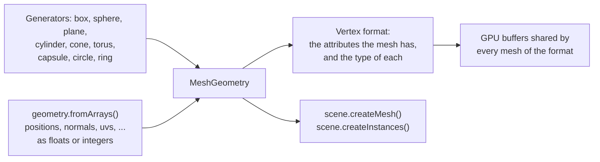

# Geometry

> Ships in null3D 0.1. Integer attributes, joints and weights, and morph targets ship in 0.2. The API is experimental, so it can still change between versions. Not built yet: a call that skins a mesh you build. So joints and weights do not move its vertices yet. Coding agents must not use it.



A mesh is the shape that objects draw. `ctx.geometry` makes meshes, and any number of objects and instance batches can share one mesh. The generators make common shapes with three.js's parameters. `geometry.fromArrays` makes a mesh from your own vertex data, as three.js's `BufferGeometry` does.

## Generators

Each generator takes the parameters and defaults of a three.js geometry class, as named options. It builds the same vertices in the same order as three.js, so a scene draws the same triangles in both engines.

```ts
// sketch.ts
const crate = geometry.box({ width: 1, height: 0.5, depth: 1 });
const ball = geometry.sphere({ radius: 0.5, widthSegments: 32, heightSegments: 16 });
const pillar = geometry.cylinder({ radiusTop: 0.3, radiusBottom: 0.4, height: 2 });
scene.createMesh({ mesh: crate, material: materials.standard({ color: '#c8a064' }) });
```

| Generator | three.js class | Shape |
| --- | --- | --- |
| `geometry.box` | `BoxGeometry` | A box |
| `geometry.sphere` | `SphereGeometry` | A sphere with its poles on the Y axis, or a part of one |
| `geometry.plane` | `PlaneGeometry` | A rectangle in the XY plane that faces +Z |
| `geometry.cylinder` | `CylinderGeometry` | A cylinder on the Y axis, closed at each end unless `openEnded` is true |
| `geometry.cone` | `ConeGeometry` | A cone on the Y axis, with its point at the top |
| `geometry.torus` | `TorusGeometry` | A tube bent into a ring around the Z axis |
| `geometry.capsule` | `CapsuleGeometry` | A cylinder on the Y axis with a half sphere on each end |
| `geometry.circle` | `CircleGeometry` | A disc in the XY plane that faces +Z, or a slice of one |
| `geometry.ring` | `RingGeometry` | A disc with a hole, in the XY plane, that faces +Z |

Every shape is centered on its origin. The options have the names of the three.js constructor's arguments, and the API reference below gives each default. Angles are in radians. Segment counts round down to whole numbers. Each count has a least, which the API reference gives, and a smaller count rises to it. A sphere, for example, has at least 3 segments around it.

The generators give each vertex a position, a normal and texture coordinates, with the values that three.js gives them. The [geometry generators demo](https://github.com/null3d-engine/null3d/tree/main/examples/generators) draws all nine shapes.

## Meshes from arrays

`geometry.fromArrays` takes one array per vertex attribute, laid out as three.js's `BufferGeometry` keeps them: the values of vertex 0, then vertex 1, and so on. Typed arrays and plain arrays of numbers both work. An attribute can also come as 8-bit or 16-bit integers, as [integer attributes](#integer-attributes) shows.

```ts
// sketch.ts: a quad that faces +z, with texture coordinates
const quad = geometry.fromArrays({
  positions: [0, 0, 0, 1, 0, 0, 1, 1, 0, 0, 1, 0],
  normals: [0, 0, 1, 0, 0, 1, 0, 0, 1, 0, 0, 1],
  uvs: [0, 0, 1, 0, 1, 1, 0, 1],
  indices: new Uint16Array([0, 1, 2, 0, 2, 3]),
});
scene.createMesh({ mesh: quad, material: materials.unlit({ color: '#ffffff' }) });
```

| Array | Numbers per vertex | three.js attribute |
| --- | --- | --- |
| `positions` | 3 | `position` |
| `normals` | 3 | `normal` |
| `uvs` | 2 | `uv` |
| `uvs1` | 2, such as a light map's coordinates | `uv1` |
| `colors` | 3, or 4 with alpha, as linear values from 0 to 1 | `color` |
| `tangents` | 4: the direction in which u grows, then 1 or -1 for the direction of v | `tangent` |
| `joints` | 4 joint indices, for skinned meshes | `skinIndex` |
| `weights` | 4: how much each joint moves the vertex, which add up to 1 | `skinWeight` |

The arrays follow these rules:

- `positions` is required. Give `normals`, or set `computeNormals: true`.
- `indices` takes a `Uint16Array`, a `Uint32Array` or an array of numbers, with three indices per triangle. Without indices, each three vertices in a row make one triangle.
- `joints` and `weights` come together. A mesh keeps them for [skinning](animation.md#skinned-meshes). No call skins a mesh that you build yet, so it draws in the pose that its positions give.
- A triangle's front face has its vertices in counter-clockwise order.
- Each array's length must fit the vertex count, and its type must be one that its attribute takes. Each index must name a vertex, and each value must be a finite number. Otherwise the call throws [E1206](../errors/E1206.md).
- The engine copies the arrays. You can change or drop them after the call.

## Integer attributes

Each attribute can come as 8-bit or 16-bit integers instead of 32-bit floats, as glTF's `KHR_mesh_quantization` extension allows. The mesh keeps the integers on the GPU, so it takes less memory and uploads faster. A position of 16-bit integers takes 8 bytes, where floats take 12. A normal of 8-bit integers takes 4 bytes, where floats take 12.

Integers read in one of two ways. Normalized integers read as fractions: from 0 to 1 when they are unsigned, and from -1 to 1 when they are signed. Plain integers read as whole numbers. Give an attribute as `{ array, normalized }` to choose, as three.js's `BufferAttribute` does. The default is plain, as in three.js and glTF.

| Array | Takes | Integers read as |
| --- | --- | --- |
| `positions`, `uvs`, `uvs1` | Floats, or any of the four integer arrays | Plain whole numbers, or fractions with `normalized: true` |
| `normals`, `tangents` | Floats, `Int8Array` or `Int16Array` | Fractions from -1 to 1 |
| `colors`, `weights` | Floats, `Uint8Array` or `Uint16Array` | Fractions from 0 to 1 |
| `joints` | `Uint8Array`, `Uint16Array`, or a plain array of whole numbers from 0 to 65,535 | Whole numbers |

Floats come as a `Float32Array` or a plain array of numbers. The four integer arrays are `Int8Array`, `Uint8Array`, `Int16Array` and `Uint16Array`.

```ts
// sketch.ts: a quad of 16-bit positions from 0 to 1,000, scaled to one meter
const quad = geometry.fromArrays({
  positions: new Uint16Array([0, 0, 0, 1000, 0, 0, 1000, 1000, 0, 0, 1000, 0]),
  normals: new Int8Array([0, 0, 127, 0, 0, 127, 0, 0, 127, 0, 0, 127]),
  uvs: { array: new Uint16Array([0, 0, 65535, 0, 65535, 65535, 0, 65535]), normalized: true },
  indices: [0, 1, 2, 0, 2, 3],
});
scene.createMesh({ mesh: quad, material: materials.standard(), scale: [0.001, 0.001, 0.001] });
```

Integer positions keep their own units. Give the object the scale and the position that turn them into meters, as a glTF node's transform does for a quantized mesh. The engine's bounds and culling then see the object's size in meters. A material's `uvTransform` does the same for integer texture coordinates, as glTF's `KHR_texture_transform` does.

## Computing normals and tangents

`computeNormals: true` computes the normals as three.js's `computeVertexNormals` does. Each vertex gets the average of the normals of its triangles, weighted by their areas. Vertices that triangles share get smooth normals. For hard edges, give each face its own vertices. The [meshes from arrays demo](https://github.com/null3d-engine/null3d/tree/main/examples/mesh-arrays) shows both: a smooth height field, an island with a color at each vertex, and a crystal with hard edges.

`computeTangents: true` computes tangents as three.js's `computeTangents` does, from the positions, the normals and `uvs`. It needs `uvs`, and it works with or without indices. The job workers share the work, so a large mesh takes less time. Both options give the same numbers as three.js, bit for bit. They compute from integer positions, normals and texture coordinates too, as shaders read them, and give 32-bit floats.

## Morph targets

A morph target is another shape of a mesh, such as a smile on a face. The `morphTargets` option gives a mesh its targets, as three.js's `morphAttributes` with `morphTargetsRelative` does. Each target is an array of three numbers per vertex: how far the target moves the vertex at weight 1. The list `positions` moves the vertices, `normals` turns their normals, and `tangents` turns their tangents. The list `colors` changes the mesh's vertex colors, with as many numbers per vertex as `colors` has, three or four. Every list holds the same number of targets, from 1 to 256. The list `names` names the targets.

```ts
const count = positions.length / 3;
const smile = new Float32Array(count * 3);
const blink = new Float32Array(count * 3);
// ... fill in how far each target moves each vertex ...
const face = geometry.fromArrays({
  positions,
  normals,
  indices,
  morphTargets: { positions: [smile, blink], names: ['Smile', 'Blink'] },
});
const head = scene.createMesh({ mesh: face, material });
head.setMorphWeight('Smile', 0.8);
```

Each object of the mesh has weights of its own, which start at 0. `setMorphWeight` sets them, and clips from glTF files animate them ([Morph targets](animation.md#morph-targets)). The [morph targets demo](https://github.com/null3d-engine/null3d/tree/main/examples/morph-flowers) makes tulips with one target, which opens the petals, turns their normals and changes their color. Each tulip has a weight of its own. The engine stores, for each vertex, only the targets that move it. So a face whose targets each move a small part of it takes far less memory than three.js's copy of every vertex for every target. A vertex can take up to 255 targets. The targets of every mesh together can take up to 4,194,304 deltas, 32 MiB of GPU memory. Each of a vertex's positions, normals, tangents and colors counts once. Past those limits, `fromArrays` throws E1206. The GPU keeps each delta in a 16-bit float, which is exact to 1/2048 of the delta's size, and each weight in a 32-bit float. A morphed color stays between 0 and 1, as the glTF specification asks. three.js does not clamp it, so a color that the weights push past 1 or below 0 draws brighter or darker there.

## Vertex formats

A mesh keeps the attributes that you give it, each in the type that it came in. Its vertex format is that set of attributes and their types. Every vertex holds its position and its normal, and each other attribute adds to its size. Each attribute takes whole groups of 4 bytes, as glTF lays them out. So three 8-bit values take 4 bytes, and three 16-bit values take 8:

| Attribute | Bytes per vertex as floats | As 16-bit integers | As 8-bit integers |
| --- | --- | --- | --- |
| Position, normal | 12 each | 8 each | 4 each |
| `uvs`, `uvs1` | 8 each | 4 each | 4 each |
| `tangents`, `colors`, `weights` | 16 each | 8 each | 4 each |
| `joints` | Not taken | 8 | 4 |

Meshes of one vertex format share GPU buffers, so the engine draws them with few changes of GPU state. Meshes of different formats draw apart, so keep the meshes of a scene in few formats. Give a mesh only the attributes that its materials use. The generators' meshes all have one format: a position, a normal and `uvs` as floats, 32 bytes per vertex.

## Levels of detail

`mesh.setLevels` gives a mesh simpler copies of itself, from the most detailed down. Each has its error: the largest distance between its surface and the mesh's, in the units of the mesh's positions. Every object and instance batch that draws the mesh then picks one level per frame. It draws the coarsest level whose error covers fewer pixels on the screen than the `lodThreshold` quality setting:

```ts
const rock = geometry.fromArrays(rockArrays(2000));
rock.setLevels([
	{ mesh: geometry.fromArrays(rockArrays(500)), error: 0.01 },
	{ mesh: geometry.fromArrays(rockArrays(120)), error: 0.05 },
]);
```

Each level must have the mesh's vertex attributes, as it draws with the same material and shading. A level can give the `distance` at which it switches in, as three.js's `LOD.addLevel` does, in place of its error. An empty list takes the levels away, and destroying a level's mesh takes every level away. `mesh.levels` lists them, each with its error. Wrong levels throw [E1221](../errors/E1221.md). [Levels of detail](../concepts/lod.md) explains the rule, the fading bands and the shadows, and how glTF files from the asset tool bring their levels.

## Destroying a mesh

`mesh.destroy()` frees a mesh that the scene no longer draws. Destroy the objects and instance batches that use it first. They can go in the same frame, just before the mesh:

```ts
crate.destroy();
crateMesh.destroy();
```

The engine frees the mesh's data at once. Meshes of one vertex format share GPU buffers, so the engine moves the meshes after it down into its room. The next frame uploads the moved data once. The buffers keep their size, and later meshes take the room. So a game that loads and drops levels keeps the same GPU memory. `geometry.memoryBytes` gives the GPU bytes that all meshes hold.

The move costs an upload of the meshes that follow in the same buffer. So destroy meshes between levels or scenes, not in every frame.

While an object or an instance batch still uses the mesh, `destroy` throws [E1111](../errors/E1111.md) and keeps the mesh. To keep an object and drop its mesh, give the object another mesh with `setMesh` first. Calls on a destroyed mesh, and calls that pass it, throw [E1101](../errors/E1101.md). To free a glTF model with all its meshes, materials and textures, call [`prefab.destroy()`](assets.md#freeing-a-model).

## Large meshes

A mesh can have any number of vertices. The engine uses 16-bit indices. WebGL2 always reads the largest one, 65,535, as the end of a primitive, so one draw reaches 65,535 vertices. A mesh with more vertices splits into parts that draw one after another. Each part holds a copy of the vertices that it shares with the part before it. For the fewest draw calls, keep meshes under 65,535 vertices.

## From three.js

| three.js | null3D |
| --- | --- |
| `new BoxGeometry(1, 2, 3)`, and the other eight classes above | `geometry.box({ width: 1, height: 2, depth: 3 })`: the arguments become named options |
| `rotateX`, `translate` or `scale` on a generated shape, such as a plane laid flat | Turn, move or scale the object instead: `floor.setRotationEuler(-Math.PI / 2, 0, 0)` |
| `new BufferGeometry()` with `setAttribute` and `setIndex` | `geometry.fromArrays({ positions, normals, uvs, indices })` |
| `new BufferAttribute(new Int16Array(values), 3, true)` | `{ array: new Int16Array(values), normalized: true }` |
| `geometry.computeVertexNormals()` | `computeNormals: true` |
| `geometry.computeTangents()` | `computeTangents: true` |
| `geometry.computeBoundingSphere()` | Nothing: the engine computes bounds itself |
| `geometry.morphAttributes.position = [...]` with `morphTargetsRelative = true` | `morphTargets: { positions: [...] }` |
| `geometry.morphAttributes.color = [...]` | `morphTargets: { colors: [...] }`, with `colors` on the mesh |
| `mesh.morphTargetDictionary` | `mesh.mesh.morphTargetNames`, a list in target order; `setMorphWeight` takes a name too |
| `geometry.dispose()` | `mesh.destroy()`, once no object or batch uses the mesh |
| `lod.addLevel(object, distance)` | `mesh.setLevels([{ mesh, distance }])` on the base mesh ([Levels of detail](../concepts/lod.md#from-threejs)) |

[three.js to null3D](../porting/threejs-mapping.md) lists every mapping.

## API reference

[The API reference](reference/geometry.md) lists every export of this page with its type and description. The engine's doc comments make it.
