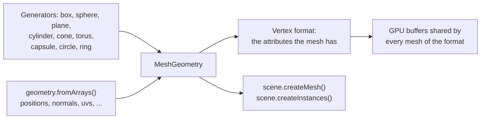

# Geometry

> Ships in null3D 0.1. The API is experimental, so it can still change between versions. The call `destroy` on a mesh is not built yet, so coding agents must not use it.



A mesh is the shape that objects draw. `ctx.geometry` makes meshes, and any number of objects and instance batches can share one mesh. The generators make common shapes with three.js's parameters. `geometry.fromArrays` makes a mesh from your own vertex data, as three.js's `BufferGeometry` does.

## Generators

Each generator takes the parameters and defaults of a three.js geometry class, as named options. It builds the same vertices in the same order as three.js, so a scene draws the same triangles in both engines.

```ts
// sketch.ts
const crate = geometry.box({ width: 1, height: 0.5, depth: 1 });
const ball = geometry.sphere({ radius: 0.5, widthSegments: 32, heightSegments: 16 });
const pillar = geometry.cylinder({ radiusTop: 0.3, radiusBottom: 0.4, height: 2 });
scene.createMesh({ mesh: crate, material: materials.standard({ color: '#c8a064' }) });
```

| Generator | three.js class | Shape |
| --- | --- | --- |
| `geometry.box` | `BoxGeometry` | A box |
| `geometry.sphere` | `SphereGeometry` | A sphere with its poles on the Y axis, or a part of one |
| `geometry.plane` | `PlaneGeometry` | A rectangle in the XY plane that faces +Z |
| `geometry.cylinder` | `CylinderGeometry` | A cylinder on the Y axis, closed at each end unless `openEnded` is true |
| `geometry.cone` | `ConeGeometry` | A cone on the Y axis, with its point at the top |
| `geometry.torus` | `TorusGeometry` | A tube bent into a ring around the Z axis |
| `geometry.capsule` | `CapsuleGeometry` | A cylinder on the Y axis with a half sphere on each end |
| `geometry.circle` | `CircleGeometry` | A disc in the XY plane that faces +Z, or a slice of one |
| `geometry.ring` | `RingGeometry` | A disc with a hole, in the XY plane, that faces +Z |

Every shape is centered on its origin. The options have the names of the three.js constructor's arguments, and the API reference below gives each default. Angles are in radians. Segment counts round down to whole numbers. Each count has a least, which the API reference gives, and a smaller count rises to it. A sphere, for example, has at least 3 segments around it.

The generators give each vertex a position, a normal and texture coordinates, with the values that three.js gives them.

## Meshes from arrays

`geometry.fromArrays` takes one array per vertex attribute, laid out as three.js's `BufferGeometry` keeps them: the values of vertex 0, then vertex 1, and so on. Typed arrays and plain arrays of numbers both work.

```ts
// sketch.ts: a quad that faces +z, with texture coordinates
const quad = geometry.fromArrays({
  positions: [0, 0, 0, 1, 0, 0, 1, 1, 0, 0, 1, 0],
  normals: [0, 0, 1, 0, 0, 1, 0, 0, 1, 0, 0, 1],
  uvs: [0, 0, 1, 0, 1, 1, 0, 1],
  indices: new Uint16Array([0, 1, 2, 0, 2, 3]),
});
scene.createMesh({ mesh: quad, material: materials.unlit({ color: '#ffffff' }) });
```

| Array | Numbers per vertex | three.js attribute |
| --- | --- | --- |
| `positions` | 3 | `position` |
| `normals` | 3 | `normal` |
| `uvs` | 2 | `uv` |
| `uvs1` | 2, such as a light map's coordinates | `uv1` |
| `colors` | 3, or 4 with alpha, as linear values from 0 to 1 | `color` |
| `tangents` | 4: the direction in which u grows, then 1 or -1 for the direction of v | `tangent` |

The arrays follow these rules:

- `positions` is required. Give `normals`, or set `computeNormals: true`.
- `indices` takes a `Uint16Array`, a `Uint32Array` or an array of numbers, with three indices per triangle. Without indices, each three vertices in a row make one triangle.
- A triangle's front face has its vertices in counter-clockwise order.
- Each array's length must fit the vertex count, each index must name a vertex, and each value must be a finite number. Otherwise the call throws [E1206](../errors/E1206.md).
- The engine copies the arrays. You can change or drop them after the call.

## Computing normals and tangents

`computeNormals: true` computes the normals as three.js's `computeVertexNormals` does. Each vertex gets the average of the normals of its triangles, weighted by their areas. Vertices that triangles share get smooth normals. For hard edges, give each face its own vertices. The [meshes from arrays demo](https://github.com/null3d-engine/null3d/tree/main/examples/mesh-arrays) shows both: a smooth height field and a crystal with hard edges.

`computeTangents: true` computes tangents as three.js's `computeTangents` does, from the positions, the normals and `uvs`. It needs `uvs`, and it works with or without indices. The job workers share the work, so a large mesh takes less time. Both options give the same numbers as three.js, bit for bit.

## Vertex formats

A mesh keeps the attributes that you give it. Its vertex format is that set of attributes. Every vertex holds its position and its normal, and each other attribute adds to its size:

| Attribute | Bytes per vertex |
| --- | --- |
| Position and normal | 24 |
| `uvs`, `uvs1` | 8 each |
| `tangents`, `colors` | 16 each |

Meshes of one vertex format share GPU buffers, so the engine draws them with few changes of GPU state. Give a mesh only the attributes that its materials use. The generators' meshes all have one format: a position, a normal and `uvs`, 32 bytes per vertex.

## Large meshes

A mesh can have any number of vertices. The engine uses 16-bit indices. WebGL2 always reads the largest one, 65,535, as the end of a primitive, so one draw reaches 65,535 vertices. A mesh with more vertices splits into parts that draw one after another. Each part holds a copy of the vertices that it shares with the part before it. For the fewest draw calls, keep meshes under 65,535 vertices.

## From three.js

| three.js | null3D |
| --- | --- |
| `new BoxGeometry(1, 2, 3)`, and the other eight classes above | `geometry.box({ width: 1, height: 2, depth: 3 })`: the arguments become named options |
| `rotateX`, `translate` or `scale` on a generated shape, such as a plane laid flat | Turn, move or scale the object instead: `floor.setRotationEuler(-Math.PI / 2, 0, 0)` |
| `new BufferGeometry()` with `setAttribute` and `setIndex` | `geometry.fromArrays({ positions, normals, uvs, indices })` |
| `geometry.computeVertexNormals()` | `computeNormals: true` |
| `geometry.computeTangents()` | `computeTangents: true` |
| `geometry.computeBoundingSphere()` | Nothing: the engine computes bounds itself |

[three.js to null3D](../porting/threejs-mapping.md) lists every mapping.

## API reference

<!-- null3d:api:start -->

### `BoxOptions`

Interface `BoxOptions`.

Options for `geometry.box`. The box is centered on its origin. Segment counts are whole numbers of at least 1.

| Member | Description |
| --- | --- |
| `width?: number` | The size along the X axis. The default is 1. |
| `height?: number` | The size along the Y axis. The default is 1. |
| `depth?: number` | The size along the Z axis. The default is 1. |
| `widthSegments?: number` | How many faces divide each side along the width. The default is 1. |
| `heightSegments?: number` | How many faces divide each side along the height. The default is 1. |
| `depthSegments?: number` | How many faces divide each side along the depth. The default is 1. |

### `CapsuleOptions`

Interface `CapsuleOptions`.

Options for `geometry.capsule`: a cylinder with a half sphere on each end. The capsule stands on the Y axis, centered on its origin, and its full height is `height` plus twice the radius. Segment counts are whole numbers.

| Member | Description |
| --- | --- |
| `radius?: number` | The radius of the capsule and of its half spheres. The default is 1. |
| `height?: number` | The height of the middle part, between the half spheres. The default is 1. |
| `capSegments?: number` | How many rows of faces go along each half sphere. The default is 4, and the least is 1. |
| `radialSegments?: number` | How many faces go around the capsule. The default is 8, and the least is 3. |
| `heightSegments?: number` | How many rows of faces go along the middle part. The default is 1, and the least is 1. |

### `CircleOptions`

Interface `CircleOptions`.

Options for `geometry.circle`: a flat disc of triangles around its center. The circle lies in the XY plane, centered on its origin, and faces +Z. Angles are in radians.

| Member | Description |
| --- | --- |
| `radius?: number` | The radius. The default is 1. |
| `segments?: number` | How many triangles make the circle: a whole number. The default is 32, and the least is 3. |
| `thetaStart?: number` | Where the circle starts, from the +X axis toward +Y. The default is 0. |
| `thetaLength?: number` | How far the circle goes. The default is `Math.PI * 2`. Less makes a slice of the circle. |

### `ConeOptions`

Interface `ConeOptions`.

Options for `geometry.cone`. The cone stands on the Y axis, centered on its origin, with its point at the top. Angles are in radians, and segment counts are whole numbers of at least 1.

| Member | Description |
| --- | --- |
| `radius?: number` | The radius of the bottom. The default is 1. |
| `height?: number` | The height. The default is 1. |
| `radialSegments?: number` | How many faces go around the cone. The default is 32. |
| `heightSegments?: number` | How many rows of faces go up the side. The default is 1. |
| `openEnded?: boolean` | Leaves out the bottom. The default is false. |
| `thetaStart?: number` | Where the side starts around the Y axis, from the +Z axis. The default is 0. |
| `thetaLength?: number` | How far the side goes around the Y axis. The default is `Math.PI * 2`, all the way. |

### `CylinderOptions`

Interface `CylinderOptions`.

Options for `geometry.cylinder`. The cylinder stands on the Y axis, centered on its origin. Angles are in radians, and segment counts are whole numbers of at least 1.

| Member | Description |
| --- | --- |
| `radiusTop?: number` | The radius of the top. The default is 1. With 0, the top is a point. |
| `radiusBottom?: number` | The radius of the bottom. The default is 1. With 0, the bottom is a point. |
| `height?: number` | The height. The default is 1. |
| `radialSegments?: number` | How many faces go around the cylinder. The default is 32. |
| `heightSegments?: number` | How many rows of faces go up the side. The default is 1. |
| `openEnded?: boolean` | Leaves out the top and the bottom, so the cylinder is a tube. The default is false. |
| `thetaStart?: number` | Where the side starts around the Y axis, from the +Z axis. The default is 0. |
| `thetaLength?: number` | How far the side goes around the Y axis. The default is `Math.PI * 2`, all the way. |

### `Geometry`

Class `Geometry`.

Mesh generators with the parameters and defaults of three.js's geometry classes, and meshes from arrays.

| Member | Description |
| --- | --- |
| `box(options: BoxOptions = {}): MeshGeometry` | A box, like three.js's `BoxGeometry`. |
| `sphere(options: SphereOptions = {}): MeshGeometry` | A sphere, like three.js's `SphereGeometry`. |
| `plane(options: PlaneOptions = {}): MeshGeometry` | A flat rectangle, like three.js's `PlaneGeometry`. |
| `cylinder(options: CylinderOptions = {}): MeshGeometry` | A cylinder, like three.js's `CylinderGeometry`. |
| `cone(options: ConeOptions = {}): MeshGeometry` | A cone, like three.js's `ConeGeometry`: a cylinder whose top is a point. |
| `torus(options: TorusOptions = {}): MeshGeometry` | A torus, like three.js's `TorusGeometry`. |
| `capsule(options: CapsuleOptions = {}): MeshGeometry` | A capsule, like three.js's `CapsuleGeometry`. |
| `circle(options: CircleOptions = {}): MeshGeometry` | A flat circle, like three.js's `CircleGeometry`. |
| `ring(options: RingOptions = {}): MeshGeometry` | A flat ring, like three.js's `RingGeometry`. |
| `fromArrays(arrays: MeshArrays): MeshGeometry` | A mesh from arrays of vertex attributes and triangle indices, like three.js's `BufferGeometry` with `setAttribute` and `setIndex`. The mesh keeps the attributes it gets, and meshes with the same attributes share GPU buffers. A mesh can have any number of vertices. Throws E1206 when an array's length does not fit the vertex count or an index names no vertex, and for a value that is not a finite number. |

### `MeshArrays`

Interface `MeshArrays`.

The arrays of a mesh for `geometry.fromArrays`. Each array holds its values for vertex 0, then vertex 1, and so on, as three.js's `BufferGeometry` keeps its attributes. Typed arrays and plain arrays of numbers both work, and the engine copies them.

| Member | Description |
| --- | --- |
| `positions: Float32Array \| readonly number[]` | Three numbers per vertex: x, y and z. Like three.js's `position` attribute. |
| `normals?: Float32Array \| readonly number[]` | Three numbers per vertex: a direction of length 1 away from the surface. Like three.js's `normal` attribute. Pass normals, or set `computeNormals` instead. |
| `uvs?: Float32Array \| readonly number[]` | Texture coordinates: two numbers per vertex, u and v. Like three.js's `uv` attribute. |
| `uvs1?: Float32Array \| readonly number[]` | A second set of texture coordinates, two numbers per vertex, such as those of a light map. Like three.js's `uv1` attribute. |
| `colors?: Float32Array \| readonly number[]` | Linear colors, three numbers per vertex from 0 to 1, or four with alpha. Like three.js's `color` attribute. |
| `tangents?: Float32Array \| readonly number[]` | Four numbers per vertex: the direction in which u grows along the surface, then 1 or -1 for the direction in which v grows. Like three.js's `tangent` attribute. |
| `indices?: Uint16Array \| Uint32Array \| readonly number[]` | Three vertex indices per triangle, counter-clockwise when you look at its front. 16-bit and 32-bit indices both work. Without indices, each three vertices in a row make a triangle. Like three.js's `setIndex`. |
| `computeNormals?: boolean` | Computes the normals from the triangles, as three.js's `computeVertexNormals` does: each vertex gets the average of its triangles' normals, weighted by their areas. |
| `computeTangents?: boolean` | Computes the tangents from the positions, the normals and `uvs`, as three.js's `computeTangents` does, on the job workers. |

### `MeshGeometry`

Class `MeshGeometry`.

A mesh the engine can draw: its id in the engine core, and its bounding radius.

| Member | Description |
| --- | --- |
| `readonly radius: number` | The distance from the mesh's origin to its farthest vertex. |

### `PlaneOptions`

Interface `PlaneOptions`.

Options for `geometry.plane`. The plane lies in the XY plane, centered on its origin, and faces +Z. Segment counts are whole numbers of at least 1.

| Member | Description |
| --- | --- |
| `width?: number` | The size along the X axis. The default is 1. |
| `height?: number` | The size along the Y axis. The default is 1. |
| `widthSegments?: number` | How many faces divide the width. The default is 1. |
| `heightSegments?: number` | How many faces divide the height. The default is 1. |

### `RingOptions`

Interface `RingOptions`.

Options for `geometry.ring`: a flat disc with a hole. The ring lies in the XY plane, centered on its origin, and faces +Z. Angles are in radians, and segment counts are whole numbers.

| Member | Description |
| --- | --- |
| `innerRadius?: number` | The radius of the hole. The default is 0.5. |
| `outerRadius?: number` | The radius of the outer edge. The default is 1. |
| `thetaSegments?: number` | How many faces go around the ring. The default is 32, and the least is 3. |
| `phiSegments?: number` | How many faces go from the inner edge to the outer edge. The default is 1, and the least is 1. |
| `thetaStart?: number` | Where the ring starts, from the +X axis toward +Y. The default is 0. |
| `thetaLength?: number` | How far the ring goes. The default is `Math.PI * 2`, all the way. |

### `SphereOptions`

Interface `SphereOptions`.

Options for `geometry.sphere`. The sphere is centered on its origin, with its poles on the Y axis. Angles are in radians.

| Member | Description |
| --- | --- |
| `radius?: number` | The radius. The default is 1. |
| `widthSegments?: number` | How many faces go around the Y axis. The default is 32, and the least is 3. |
| `heightSegments?: number` | How many faces go from pole to pole. The default is 16, and the least is 2. |
| `phiStart?: number` | Where the sphere starts around the Y axis, from the -X axis. The default is 0. |
| `phiLength?: number` | How far the sphere goes around the Y axis. The default is `Math.PI * 2`, all the way. |
| `thetaStart?: number` | Where the sphere starts, down from the top pole. The default is 0. |
| `thetaLength?: number` | How far the sphere goes down from `thetaStart`. The default is `Math.PI`, to the bottom pole. |

### `TorusOptions`

Interface `TorusOptions`.

Options for `geometry.torus`. The torus is centered on its origin, around the Z axis. Angles are in radians, and segment counts are whole numbers of at least 1.

| Member | Description |
| --- | --- |
| `radius?: number` | The distance from the center of the torus to the center of its tube. The default is 1. |
| `tube?: number` | The radius of the tube. The default is 0.4. |
| `radialSegments?: number` | How many faces go around the tube. The default is 12. |
| `tubularSegments?: number` | How many faces go around the torus. The default is 48. |
| `arc?: number` | How far the torus goes around its center. The default is `Math.PI * 2`, all the way. |
| `thetaStart?: number` | Where the tube starts around its own center. The default is 0. |
| `thetaLength?: number` | How far the tube goes around its own center. The default is `Math.PI * 2`, all the way. |

<!-- null3d:api:end -->
