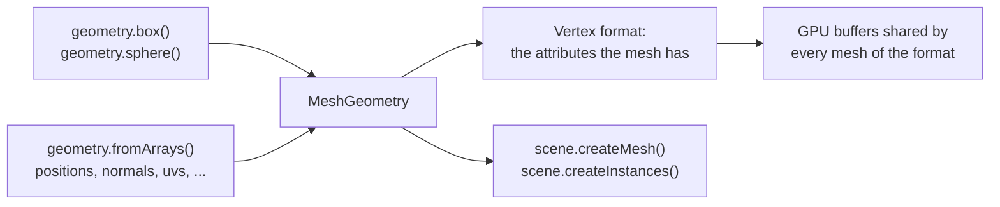

# Geometry

> Planned for null3D 0.1. No release has these APIs yet, so coding agents must not use them.



A mesh is the shape that objects draw. `ctx.geometry` makes meshes, and any number of objects and instance batches can share one mesh. The generators make common shapes with three.js's parameters. `geometry.fromArrays` makes a mesh from your own vertex data, as three.js's `BufferGeometry` does.

## Generators

`geometry.box` and `geometry.sphere` take the parameters and defaults of three.js's `BoxGeometry` and `SphereGeometry`. They build the same vertices in the same order, so a scene draws the same triangles in both engines.

```ts
// sketch.ts
const crate = geometry.box({ width: 1, height: 0.5, depth: 1 });
const ball = geometry.sphere({ radius: 0.5, widthSegments: 32, heightSegments: 16 });
scene.createMesh({ mesh: crate, material: materials.standard({ color: '#c8a064' }) });
```

The generators give each vertex a position and a normal.

## Meshes from arrays

`geometry.fromArrays` takes one array per vertex attribute, laid out as three.js's `BufferGeometry` keeps them: the values of vertex 0, then vertex 1, and so on. Typed arrays and plain arrays of numbers both work.

```ts
// sketch.ts: a quad that faces +z, with texture coordinates
const quad = geometry.fromArrays({
  positions: [0, 0, 0, 1, 0, 0, 1, 1, 0, 0, 1, 0],
  normals: [0, 0, 1, 0, 0, 1, 0, 0, 1, 0, 0, 1],
  uvs: [0, 0, 1, 0, 1, 1, 0, 1],
  indices: new Uint16Array([0, 1, 2, 0, 2, 3]),
});
scene.createMesh({ mesh: quad, material: materials.unlit({ color: '#ffffff' }) });
```

| Array | Numbers per vertex | three.js attribute |
| --- | --- | --- |
| `positions` | 3 | `position` |
| `normals` | 3 | `normal` |
| `uvs` | 2 | `uv` |
| `uvs1` | 2, such as a light map's coordinates | `uv1` |
| `colors` | 3, or 4 with alpha, as linear values from 0 to 1 | `color` |
| `tangents` | 4: the direction in which u grows, then 1 or -1 for the direction of v | `tangent` |

The arrays follow these rules:

- `positions` is required. Give `normals`, or set `computeNormals: true`.
- `indices` takes a `Uint16Array`, a `Uint32Array` or an array of numbers, with three indices per triangle. Without indices, each three vertices in a row make one triangle.
- A triangle's front face has its vertices in counter-clockwise order.
- Each array's length must fit the vertex count, each index must name a vertex, and each value must be a finite number. Otherwise the call throws [E1205](../errors/E1205.md).
- The engine copies the arrays. You can change or drop them after the call.

## Computing normals and tangents

`computeNormals: true` computes the normals as three.js's `computeVertexNormals` does. Each vertex gets the average of the normals of its triangles, weighted by their areas. Vertices that triangles share get smooth normals. For hard edges, give each face its own vertices.

`computeTangents: true` computes tangents as three.js's `computeTangents` does, from the positions, the normals and `uvs`. It needs `uvs`, and it works with or without indices. The job workers share the work, so a large mesh takes less time. Both options give the same numbers as three.js, bit for bit.

## Vertex formats

A mesh keeps the attributes that you give it. Its vertex format is that set of attributes. Every vertex holds its position and its normal, and each other attribute adds to its size:

| Attribute | Bytes per vertex |
| --- | --- |
| Position and normal | 24 |
| `uvs`, `uvs1` | 8 each |
| `tangents`, `colors` | 16 each |

Meshes of one vertex format share GPU buffers, so the engine draws them with few changes of GPU state. Give a mesh only the attributes that its materials use.

## Large meshes

A mesh can have any number of vertices. The engine uses 16-bit indices. WebGL2 always reads the largest one, 65,535, as the end of a primitive, so one draw reaches 65,535 vertices. A mesh with more vertices splits into parts that draw one after another. Each part holds a copy of the vertices that it shares with the part before it. For the fewest draw calls, keep meshes under 65,535 vertices.

## From three.js

| three.js | null3D |
| --- | --- |
| `new BufferGeometry()` with `setAttribute` and `setIndex` | `geometry.fromArrays({ positions, normals, uvs, indices })` |
| `geometry.computeVertexNormals()` | `computeNormals: true` |
| `geometry.computeTangents()` | `computeTangents: true` |
| `geometry.computeBoundingSphere()` | Nothing: the engine computes bounds itself |

[three.js to null3D](../porting/threejs-mapping.md) lists every mapping.

## API reference

<!-- null3d:api:start -->

### `BoxOptions`

Interface `BoxOptions`.

Options for `geometry.box`. The box is centered on its origin.

| Member | Description |
| --- | --- |
| `width?: number` | The size along the X axis. The default is 1. |
| `height?: number` | The size along the Y axis. The default is 1. |
| `depth?: number` | The size along the Z axis. The default is 1. |
| `widthSegments?: number` | How many faces divide each side along the width. The default is 1. |
| `heightSegments?: number` | How many faces divide each side along the height. The default is 1. |
| `depthSegments?: number` | How many faces divide each side along the depth. The default is 1. |

### `Geometry`

Class `Geometry`.

Mesh generators with the parameters and defaults of three.js's geometry classes, and meshes from arrays.

| Member | Description |
| --- | --- |
| `box(options: BoxOptions = {}): MeshGeometry` | A box, like three.js's `BoxGeometry`. |
| `sphere(options: SphereOptions = {}): MeshGeometry` | A sphere, like three.js's `SphereGeometry`. |
| `fromArrays(arrays: MeshArrays): MeshGeometry` | A mesh from arrays of vertex attributes and triangle indices, like three.js's `BufferGeometry` with `setAttribute` and `setIndex`. The mesh keeps the attributes it gets, and meshes with the same attributes share GPU buffers. A mesh can have any number of vertices. Throws E1205 when an array's length does not fit the vertex count or an index names no vertex, and for a value that is not a finite number. |

### `MeshArrays`

Interface `MeshArrays`.

The arrays of a mesh for `geometry.fromArrays`. Each array holds its values for vertex 0, then vertex 1, and so on, as three.js's `BufferGeometry` keeps its attributes. Typed arrays and plain arrays of numbers both work, and the engine copies them.

| Member | Description |
| --- | --- |
| `positions: Float32Array \| readonly number[]` | Three numbers per vertex: x, y and z. Like three.js's `position` attribute. |
| `normals?: Float32Array \| readonly number[]` | Three numbers per vertex: a direction of length 1 away from the surface. Like three.js's `normal` attribute. Pass normals, or set `computeNormals` instead. |
| `uvs?: Float32Array \| readonly number[]` | Texture coordinates: two numbers per vertex, u and v. Like three.js's `uv` attribute. |
| `uvs1?: Float32Array \| readonly number[]` | A second set of texture coordinates, two numbers per vertex, such as those of a light map. Like three.js's `uv1` attribute. |
| `colors?: Float32Array \| readonly number[]` | Linear colors, three numbers per vertex from 0 to 1, or four with alpha. Like three.js's `color` attribute. |
| `tangents?: Float32Array \| readonly number[]` | Four numbers per vertex: the direction in which u grows along the surface, then 1 or -1 for the direction in which v grows. Like three.js's `tangent` attribute. |
| `indices?: Uint16Array \| Uint32Array \| readonly number[]` | Three vertex indices per triangle, counter-clockwise when you look at its front. 16-bit and 32-bit indices both work. Without indices, each three vertices in a row make a triangle. Like three.js's `setIndex`. |
| `computeNormals?: boolean` | Computes the normals from the triangles, as three.js's `computeVertexNormals` does: each vertex gets the average of its triangles' normals, weighted by their areas. |
| `computeTangents?: boolean` | Computes the tangents from the positions, the normals and `uvs`, as three.js's `computeTangents` does, on the job workers. |

### `MeshGeometry`

Class `MeshGeometry`.

A mesh the engine can draw: its id in the engine core, and its bounding radius.

| Member | Description |
| --- | --- |
| `readonly radius: number` | The distance from the mesh's origin to its farthest vertex. |

### `SphereOptions`

Interface `SphereOptions`.

Options for `geometry.sphere`. The sphere is centered on its origin.

| Member | Description |
| --- | --- |
| `radius?: number` | The radius. The default is 1. |
| `widthSegments?: number` | How many faces go around the equator. The default is 32. |
| `heightSegments?: number` | How many faces go from pole to pole. The default is 16. |

<!-- null3d:api:end -->
