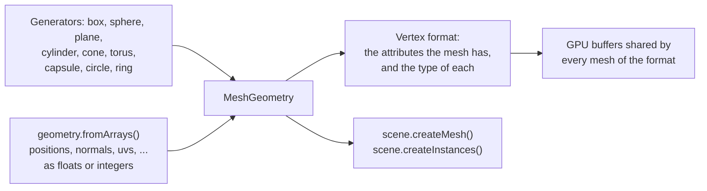

# Geometry

> Ships in null3D 0.1. Integer attributes, joints and weights, and morph targets ship in 0.2. The API is experimental, so it can still change between versions. Not built yet: a call that skins a mesh you build. So joints and weights do not move its vertices yet. Coding agents must not use it.



A mesh is the shape that objects draw. `ctx.geometry` makes meshes, and any number of objects and instance batches can share one mesh. The generators make common shapes with three.js's parameters. `geometry.fromArrays` makes a mesh from your own vertex data, as three.js's `BufferGeometry` does.

## Generators

Each generator takes the parameters and defaults of a three.js geometry class, as named options. It builds the same vertices in the same order as three.js, so a scene draws the same triangles in both engines.

```ts
// sketch.ts
const crate = geometry.box({ width: 1, height: 0.5, depth: 1 });
const ball = geometry.sphere({ radius: 0.5, widthSegments: 32, heightSegments: 16 });
const pillar = geometry.cylinder({ radiusTop: 0.3, radiusBottom: 0.4, height: 2 });
scene.createMesh({ mesh: crate, material: materials.standard({ color: '#c8a064' }) });
```

| Generator | three.js class | Shape |
| --- | --- | --- |
| `geometry.box` | `BoxGeometry` | A box |
| `geometry.sphere` | `SphereGeometry` | A sphere with its poles on the Y axis, or a part of one |
| `geometry.plane` | `PlaneGeometry` | A rectangle in the XY plane that faces +Z |
| `geometry.cylinder` | `CylinderGeometry` | A cylinder on the Y axis, closed at each end unless `openEnded` is true |
| `geometry.cone` | `ConeGeometry` | A cone on the Y axis, with its point at the top |
| `geometry.torus` | `TorusGeometry` | A tube bent into a ring around the Z axis |
| `geometry.capsule` | `CapsuleGeometry` | A cylinder on the Y axis with a half sphere on each end |
| `geometry.circle` | `CircleGeometry` | A disc in the XY plane that faces +Z, or a slice of one |
| `geometry.ring` | `RingGeometry` | A disc with a hole, in the XY plane, that faces +Z |

Every shape is centered on its origin. The options have the names of the three.js constructor's arguments, and the API reference below gives each default. Angles are in radians. Segment counts round down to whole numbers. Each count has a least, which the API reference gives, and a smaller count rises to it. A sphere, for example, has at least 3 segments around it.

The generators give each vertex a position, a normal and texture coordinates, with the values that three.js gives them. The [geometry generators demo](https://github.com/null3d-engine/null3d/tree/main/examples/generators) draws all nine shapes.

## Meshes from arrays

`geometry.fromArrays` takes one array per vertex attribute, laid out as three.js's `BufferGeometry` keeps them: the values of vertex 0, then vertex 1, and so on. Typed arrays and plain arrays of numbers both work. An attribute can also come as 8-bit or 16-bit integers, as [integer attributes](#integer-attributes) shows.

```ts
// sketch.ts: a quad that faces +z, with texture coordinates
const quad = geometry.fromArrays({
  positions: [0, 0, 0, 1, 0, 0, 1, 1, 0, 0, 1, 0],
  normals: [0, 0, 1, 0, 0, 1, 0, 0, 1, 0, 0, 1],
  uvs: [0, 0, 1, 0, 1, 1, 0, 1],
  indices: new Uint16Array([0, 1, 2, 0, 2, 3]),
});
scene.createMesh({ mesh: quad, material: materials.unlit({ color: '#ffffff' }) });
```

| Array | Numbers per vertex | three.js attribute |
| --- | --- | --- |
| `positions` | 3 | `position` |
| `normals` | 3 | `normal` |
| `uvs` | 2 | `uv` |
| `uvs1` | 2, such as a light map's coordinates | `uv1` |
| `colors` | 3, or 4 with alpha, as linear values from 0 to 1 | `color` |
| `tangents` | 4: the direction in which u grows, then 1 or -1 for the direction of v | `tangent` |
| `joints` | 4 joint indices, for skinned meshes | `skinIndex` |
| `weights` | 4: how much each joint moves the vertex, which add up to 1 | `skinWeight` |

The arrays follow these rules:

- `positions` is required. Give `normals`, or set `computeNormals: true`.
- `indices` takes a `Uint16Array`, a `Uint32Array` or an array of numbers, with three indices per triangle. Without indices, each three vertices in a row make one triangle.
- `joints` and `weights` come together. A mesh keeps them for [skinning](animation.md#skinned-meshes). No call skins a mesh that you build yet, so it draws in the pose that its positions give.
- A triangle's front face has its vertices in counter-clockwise order.
- Each array's length must fit the vertex count, and its type must be one that its attribute takes. Each index must name a vertex, and each value must be a finite number. Otherwise the call throws [E1206](../errors/E1206.md).
- The engine copies the arrays. You can change or drop them after the call.

## Integer attributes

Each attribute can come as 8-bit or 16-bit integers instead of 32-bit floats, as glTF's `KHR_mesh_quantization` extension allows. The mesh keeps the integers on the GPU, so it takes less memory and uploads faster. A position of 16-bit integers takes 8 bytes, where floats take 12. A normal of 8-bit integers takes 4 bytes, where floats take 12.

Integers read in one of two ways. Normalized integers read as fractions: from 0 to 1 when they are unsigned, and from -1 to 1 when they are signed. Plain integers read as whole numbers. Give an attribute as `{ array, normalized }` to choose, as three.js's `BufferAttribute` does. The default is plain, as in three.js and glTF.

| Array | Takes | Integers read as |
| --- | --- | --- |
| `positions`, `uvs`, `uvs1` | Floats, or any of the four integer arrays | Plain whole numbers, or fractions with `normalized: true` |
| `normals`, `tangents` | Floats, `Int8Array` or `Int16Array` | Fractions from -1 to 1 |
| `colors`, `weights` | Floats, `Uint8Array` or `Uint16Array` | Fractions from 0 to 1 |
| `joints` | `Uint8Array`, `Uint16Array`, or a plain array of whole numbers from 0 to 65,535 | Whole numbers |

Floats come as a `Float32Array` or a plain array of numbers. The four integer arrays are `Int8Array`, `Uint8Array`, `Int16Array` and `Uint16Array`.

```ts
// sketch.ts: a quad of 16-bit positions from 0 to 1,000, scaled to one meter
const quad = geometry.fromArrays({
  positions: new Uint16Array([0, 0, 0, 1000, 0, 0, 1000, 1000, 0, 0, 1000, 0]),
  normals: new Int8Array([0, 0, 127, 0, 0, 127, 0, 0, 127, 0, 0, 127]),
  uvs: { array: new Uint16Array([0, 0, 65535, 0, 65535, 65535, 0, 65535]), normalized: true },
  indices: [0, 1, 2, 0, 2, 3],
});
scene.createMesh({ mesh: quad, material: materials.standard(), scale: [0.001, 0.001, 0.001] });
```

Integer positions keep their own units. Give the object the scale and the position that turn them into meters, as a glTF node's transform does for a quantized mesh. The engine's bounds and culling then see the object's size in meters. A material's `uvTransform` does the same for integer texture coordinates, as glTF's `KHR_texture_transform` does.

## Computing normals and tangents

`computeNormals: true` computes the normals as three.js's `computeVertexNormals` does. Each vertex gets the average of the normals of its triangles, weighted by their areas. Vertices that triangles share get smooth normals. For hard edges, give each face its own vertices. The [meshes from arrays demo](https://github.com/null3d-engine/null3d/tree/main/examples/mesh-arrays) shows both: a smooth height field and a crystal with hard edges.

`computeTangents: true` computes tangents as three.js's `computeTangents` does, from the positions, the normals and `uvs`. It needs `uvs`, and it works with or without indices. The job workers share the work, so a large mesh takes less time. Both options give the same numbers as three.js, bit for bit. They compute from integer positions, normals and texture coordinates too, as shaders read them, and give 32-bit floats.

## Morph targets

A morph target is another shape of a mesh, such as a smile on a face. The `morphTargets` option gives a mesh its targets, as three.js's `morphAttributes` with `morphTargetsRelative` does. Each target is an array of three numbers per vertex: how far the target moves the vertex at weight 1. The list `positions` moves the vertices, `normals` turns their normals, and `tangents` turns their tangents. The list `colors` changes the mesh's vertex colors, with as many numbers per vertex as `colors` has, three or four. Every list holds the same number of targets, from 1 to 256. The list `names` names the targets.

```ts
const count = positions.length / 3;
const smile = new Float32Array(count * 3);
const blink = new Float32Array(count * 3);
// ... fill in how far each target moves each vertex ...
const face = geometry.fromArrays({
  positions,
  normals,
  indices,
  morphTargets: { positions: [smile, blink], names: ['Smile', 'Blink'] },
});
const head = scene.createMesh({ mesh: face, material });
head.setMorphWeight('Smile', 0.8);
```

Each object of the mesh has weights of its own, which start at 0. `setMorphWeight` sets them, and clips from glTF files animate them ([Morph targets](animation.md#morph-targets)). The engine stores, for each vertex, only the targets that move it. So a face whose targets each move a small part of it takes far less memory than three.js's copy of every vertex for every target. A vertex can take up to 255 targets. The targets of every mesh together can take up to 4,194,304 deltas, 32 MiB of GPU memory. Each of a vertex's positions, normals, tangents and colors counts once. Past those limits, `fromArrays` throws E1206. The GPU keeps each delta in a 16-bit float, which is exact to 1/2048 of the delta's size, and each weight in a 32-bit float. A morphed color stays between 0 and 1, as the glTF specification asks. three.js does not clamp it, so a color that the weights push past 1 or below 0 draws brighter or darker there.

## Vertex formats

A mesh keeps the attributes that you give it, each in the type that it came in. Its vertex format is that set of attributes and their types. Every vertex holds its position and its normal, and each other attribute adds to its size. Each attribute takes whole groups of 4 bytes, as glTF lays them out. So three 8-bit values take 4 bytes, and three 16-bit values take 8:

| Attribute | Bytes per vertex as floats | As 16-bit integers | As 8-bit integers |
| --- | --- | --- | --- |
| Position, normal | 12 each | 8 each | 4 each |
| `uvs`, `uvs1` | 8 each | 4 each | 4 each |
| `tangents`, `colors`, `weights` | 16 each | 8 each | 4 each |
| `joints` | Not taken | 8 | 4 |

Meshes of one vertex format share GPU buffers, so the engine draws them with few changes of GPU state. Meshes of different formats draw apart, so keep the meshes of a scene in few formats. Give a mesh only the attributes that its materials use. The generators' meshes all have one format: a position, a normal and `uvs` as floats, 32 bytes per vertex.

## Destroying a mesh

`mesh.destroy()` frees a mesh that the scene no longer draws. Destroy the objects and instance batches that use it first. They can go in the same frame, just before the mesh:

```ts
crate.destroy();
crateMesh.destroy();
```

The engine frees the mesh's data at once. Meshes of one vertex format share GPU buffers, so the engine moves the meshes after it down into its room. The next frame uploads the moved data once. The buffers keep their size, and later meshes take the room. So a game that loads and drops levels keeps the same GPU memory. `geometry.memoryBytes` gives the GPU bytes that all meshes hold.

The move costs an upload of the meshes that follow in the same buffer. So destroy meshes between levels or scenes, not in every frame.

While an object or an instance batch still uses the mesh, `destroy` throws [E1111](../errors/E1111.md) and keeps the mesh. To keep an object and drop its mesh, give the object another mesh with `setMesh` first. Calls on a destroyed mesh, and calls that pass it, throw [E1101](../errors/E1101.md). To free a glTF model with all its meshes, materials and textures, call [`prefab.destroy()`](assets.md#freeing-a-model).

## Large meshes

A mesh can have any number of vertices. The engine uses 16-bit indices. WebGL2 always reads the largest one, 65,535, as the end of a primitive, so one draw reaches 65,535 vertices. A mesh with more vertices splits into parts that draw one after another. Each part holds a copy of the vertices that it shares with the part before it. For the fewest draw calls, keep meshes under 65,535 vertices.

## From three.js

| three.js | null3D |
| --- | --- |
| `new BoxGeometry(1, 2, 3)`, and the other eight classes above | `geometry.box({ width: 1, height: 2, depth: 3 })`: the arguments become named options |
| `rotateX`, `translate` or `scale` on a generated shape, such as a plane laid flat | Turn, move or scale the object instead: `floor.setRotationEuler(-Math.PI / 2, 0, 0)` |
| `new BufferGeometry()` with `setAttribute` and `setIndex` | `geometry.fromArrays({ positions, normals, uvs, indices })` |
| `new BufferAttribute(new Int16Array(values), 3, true)` | `{ array: new Int16Array(values), normalized: true }` |
| `geometry.computeVertexNormals()` | `computeNormals: true` |
| `geometry.computeTangents()` | `computeTangents: true` |
| `geometry.computeBoundingSphere()` | Nothing: the engine computes bounds itself |
| `geometry.morphAttributes.position = [...]` with `morphTargetsRelative = true` | `morphTargets: { positions: [...] }` |
| `geometry.morphAttributes.color = [...]` | `morphTargets: { colors: [...] }`, with `colors` on the mesh |
| `mesh.morphTargetDictionary` | `mesh.mesh.morphTargetNames`, a list in target order; `setMorphWeight` takes a name too |
| `geometry.dispose()` | `mesh.destroy()`, once no object or batch uses the mesh |

[three.js to null3D](../porting/threejs-mapping.md) lists every mapping.

## API reference

<!-- null3d:api:start -->

### `BoxOptions`

Interface `BoxOptions`.

Options for `geometry.box`. The box is centered on its origin. Segment counts are whole numbers of at least 1.

| Member | Description |
| --- | --- |
| `width?: number` | The size along the X axis. The default is 1. |
| `height?: number` | The size along the Y axis. The default is 1. |
| `depth?: number` | The size along the Z axis. The default is 1. |
| `widthSegments?: number` | How many faces divide each side along the width. The default is 1. |
| `heightSegments?: number` | How many faces divide each side along the height. The default is 1. |
| `depthSegments?: number` | How many faces divide each side along the depth. The default is 1. |

### `CapsuleOptions`

Interface `CapsuleOptions`.

Options for `geometry.capsule`: a cylinder with a half sphere on each end. The capsule stands on the Y axis, centered on its origin, and its full height is `height` plus twice the radius. Segment counts are whole numbers.

| Member | Description |
| --- | --- |
| `radius?: number` | The radius of the capsule and of its half spheres. The default is 1. |
| `height?: number` | The height of the middle part, between the half spheres. The default is 1. |
| `capSegments?: number` | How many rows of faces go along each half sphere. The default is 4, and the least is 1. |
| `radialSegments?: number` | How many faces go around the capsule. The default is 8, and the least is 3. |
| `heightSegments?: number` | How many rows of faces go along the middle part. The default is 1, and the least is 1. |

### `CircleOptions`

Interface `CircleOptions`.

Options for `geometry.circle`: a flat disc of triangles around its center. The circle lies in the XY plane, centered on its origin, and faces +Z. Angles are in radians.

| Member | Description |
| --- | --- |
| `radius?: number` | The radius. The default is 1. |
| `segments?: number` | How many triangles make the circle: a whole number. The default is 32, and the least is 3. |
| `thetaStart?: number` | Where the circle starts, from the +X axis toward +Y. The default is 0. |
| `thetaLength?: number` | How far the circle goes. The default is `Math.PI * 2`. Less makes a slice of the circle. |

### `ConeOptions`

Interface `ConeOptions`.

Options for `geometry.cone`. The cone stands on the Y axis, centered on its origin, with its point at the top. Angles are in radians, and segment counts are whole numbers of at least 1.

| Member | Description |
| --- | --- |
| `radius?: number` | The radius of the bottom. The default is 1. |
| `height?: number` | The height. The default is 1. |
| `radialSegments?: number` | How many faces go around the cone. The default is 32. |
| `heightSegments?: number` | How many rows of faces go up the side. The default is 1. |
| `openEnded?: boolean` | Leaves out the bottom. The default is false. |
| `thetaStart?: number` | Where the side starts around the Y axis, from the +Z axis. The default is 0. |
| `thetaLength?: number` | How far the side goes around the Y axis. The default is `Math.PI * 2`, all the way. |

### `CylinderOptions`

Interface `CylinderOptions`.

Options for `geometry.cylinder`. The cylinder stands on the Y axis, centered on its origin. Angles are in radians, and segment counts are whole numbers of at least 1.

| Member | Description |
| --- | --- |
| `radiusTop?: number` | The radius of the top. The default is 1. With 0, the top is a point. |
| `radiusBottom?: number` | The radius of the bottom. The default is 1. With 0, the bottom is a point. |
| `height?: number` | The height. The default is 1. |
| `radialSegments?: number` | How many faces go around the cylinder. The default is 32. |
| `heightSegments?: number` | How many rows of faces go up the side. The default is 1. |
| `openEnded?: boolean` | Leaves out the top and the bottom, so the cylinder is a tube. The default is false. |
| `thetaStart?: number` | Where the side starts around the Y axis, from the +Z axis. The default is 0. |
| `thetaLength?: number` | How far the side goes around the Y axis. The default is `Math.PI * 2`, all the way. |

### `Geometry`

Class `Geometry`.

Mesh generators with the parameters and defaults of three.js's geometry classes, and meshes from arrays.

| Member | Description |
| --- | --- |
| `readonly memoryBytes: number` | The GPU bytes that every mesh holds: the shared vertex and index buffers, which keep room to grow, and the texture of morph target deltas. It counts what the frames made so far, so it grows once a frame draws a new mesh. Destroyed meshes give their room to later ones, so a scene that loads and destroys the same models keeps the same figure. |
| `box(options: BoxOptions = {}): MeshGeometry` | A box, like three.js's `BoxGeometry`. |
| `sphere(options: SphereOptions = {}): MeshGeometry` | A sphere, like three.js's `SphereGeometry`. |
| `plane(options: PlaneOptions = {}): MeshGeometry` | A flat rectangle, like three.js's `PlaneGeometry`. |
| `cylinder(options: CylinderOptions = {}): MeshGeometry` | A cylinder, like three.js's `CylinderGeometry`. |
| `cone(options: ConeOptions = {}): MeshGeometry` | A cone, like three.js's `ConeGeometry`: a cylinder whose top is a point. |
| `torus(options: TorusOptions = {}): MeshGeometry` | A torus, like three.js's `TorusGeometry`. |
| `capsule(options: CapsuleOptions = {}): MeshGeometry` | A capsule, like three.js's `CapsuleGeometry`. |
| `circle(options: CircleOptions = {}): MeshGeometry` | A flat circle, like three.js's `CircleGeometry`. |
| `ring(options: RingOptions = {}): MeshGeometry` | A flat ring, like three.js's `RingGeometry`. |
| `fromArrays(arrays: MeshArrays): MeshGeometry` | A mesh from arrays of vertex attributes and triangle indices, like three.js's `BufferGeometry` with `setAttribute` and `setIndex`. The mesh keeps the attributes it gets, each in the type of number it came in, and meshes whose attributes have the same types share GPU buffers. A mesh can have any number of vertices. Throws E1206 when an array's length does not fit the vertex count, when its attribute does not take its type of number, when an index names no vertex, for a value that is not a finite number, and for morph targets whose arrays do not fit the vertices or whose lists hold different numbers of targets. |

### `IntegerArray`

```ts
type IntegerArray = Int8Array | Uint8Array | Int16Array | Uint16Array;
```

The integer typed arrays that vertex attributes take: 8-bit and 16-bit, signed and unsigned.

### `MeshArrays`

Interface `MeshArrays`.

The arrays of a mesh for `geometry.fromArrays`. Each array holds its values for vertex 0, then vertex 1, and so on, as three.js's `BufferGeometry` keeps its attributes. The engine copies them. An attribute can come as 32-bit floats, or as the 8-bit and 16-bit integers that glTF's `KHR_mesh_quantization` allows for it. The mesh keeps that type on the GPU. Smaller types take less memory and upload faster. Integer positions keep their own scale, so give the object the scale that turns them into meters, as a glTF node does. Meshes share GPU buffers with the meshes whose attributes have the same types.

| Member | Description |
| --- | --- |
| `positions: VertexValues` | Three numbers per vertex: x, y and z. Like three.js's `position` attribute. Takes floats, or 8-bit or 16-bit integers, normalized or plain. |
| `normals?: VertexValues` | Three numbers per vertex: a direction of length 1 away from the surface. Like three.js's `normal` attribute. Pass normals, or set `computeNormals` instead. Takes floats, or an `Int8Array` or `Int16Array`, whose integers read as fractions from -1 to 1. |
| `uvs?: VertexValues` | Texture coordinates: two numbers per vertex, u and v. Like three.js's `uv` attribute. Takes floats, or 8-bit or 16-bit integers, normalized or plain. |
| `uvs1?: VertexValues` | A second set of texture coordinates, two numbers per vertex, such as those of a light map. Like three.js's `uv1` attribute. Takes the same types as `uvs`. |
| `colors?: VertexValues` | Linear colors, three numbers per vertex from 0 to 1, or four with alpha. Like three.js's `color` attribute. Takes floats, or a `Uint8Array` or `Uint16Array`, whose integers read as fractions from 0 to 1. |
| `tangents?: VertexValues` | Four numbers per vertex: the direction in which u grows along the surface, then 1 or -1 for the direction in which v grows. Like three.js's `tangent` attribute. Takes the same types as `normals`. |
| `joints?: VertexValues` | The joints that move each vertex of a skinned mesh: four joint indices per vertex, in a `Uint8Array`, a `Uint16Array` or a plain array. Like three.js's `skinIndex` attribute. Give `weights` with them. |
| `weights?: VertexValues` | How much each of a vertex's four joints moves it: four numbers per vertex, which add up to 1. Like three.js's `skinWeight` attribute. Takes floats, or a `Uint8Array` or `Uint16Array`, whose integers read as fractions from 0 to 1. |
| `indices?: Uint16Array \| Uint32Array \| readonly number[]` | Three vertex indices per triangle, counter-clockwise when you look at its front. 16-bit and 32-bit indices both work. Without indices, each three vertices in a row make a triangle. Like three.js's `setIndex`. |
| `computeNormals?: boolean` | Computes the normals from the triangles, as three.js's `computeVertexNormals` does: each vertex gets the average of its triangles' normals, weighted by their areas. |
| `computeTangents?: boolean` | Computes the tangents from the positions, the normals and `uvs`, as three.js's `computeTangents` does, on the job workers. |
| `morphTargets?: MorphTargets` | The mesh's morph targets: shapes that each object of the mesh blends in by its own weights. The engine keeps, for each vertex, only the targets that move it. |

### `MeshGeometry`

Class `MeshGeometry`.

A mesh the engine can draw: its id in the engine core, its bounding radius, and its morph targets.

| Member | Description |
| --- | --- |
| `readonly radius: number` | The distance from the mesh's origin to its farthest vertex, at rest. |
| `readonly morphTargets: number` | How many morph targets the mesh has. 0 for a mesh without any. |
| `readonly morphTargetNames: readonly string[]` | The morph targets' names, by target, or none when the mesh's arrays named none. Like three.js's `morphTargetDictionary`, turned around. `mesh.setMorphWeight` takes a name too. |
| `destroy(): void` | Destroys the mesh, like three.js's `geometry.dispose()`. The engine frees its GPU memory and its other data at once, and later meshes take its room. Destroy the objects and instance batches that use it first, in the same frame or before. Throws E1111 while one still uses it, and E1101 for a mesh that is destroyed already. Later calls that pass the mesh throw E1101. |

### `MorphTargets`

Interface `MorphTargets`.

A mesh's morph targets, like three.js's `morphAttributes` with `morphTargetsRelative` set, as glTF stores them. Each list holds one array per target, of three numbers per vertex, or for colors as many as the mesh's `colors` hold. They say how far the target moves the vertex's position, normal, tangent or color at weight 1. Every list has the same number of targets, from 1 to 256. A mesh's targets move its vertices by their weights, which each object sets with `setMorphWeight`, and clips animate.

| Member | Description |
| --- | --- |
| `positions?: readonly (Float32Array \| readonly number[])[]` | For each target, how far it moves each position. Like `morphAttributes.position`. |
| `normals?: readonly (Float32Array \| readonly number[])[]` | For each target, how far it turns each normal. Like `morphAttributes.normal`. |
| `tangents?: readonly (Float32Array \| readonly number[])[]` | For each target, how far it turns each tangent's direction: three numbers per vertex, as glTF gives them. three.js does not morph tangents. |
| `colors?: readonly (Float32Array \| readonly number[])[]` | For each target, how far it changes each vertex color: three or four numbers per vertex, as many as the mesh's `colors` hold, in linear color. Like `morphAttributes.color`. A morphed color is clamped to the range 0 to 1, as the glTF specification asks. Needs `colors`. |
| `names?: readonly string[]` | The targets' names, one per target, which `setMorphWeight` takes in place of numbers. |

### `PlaneOptions`

Interface `PlaneOptions`.

Options for `geometry.plane`. The plane lies in the XY plane, centered on its origin, and faces +Z. Segment counts are whole numbers of at least 1.

| Member | Description |
| --- | --- |
| `width?: number` | The size along the X axis. The default is 1. |
| `height?: number` | The size along the Y axis. The default is 1. |
| `widthSegments?: number` | How many faces divide the width. The default is 1. |
| `heightSegments?: number` | How many faces divide the height. The default is 1. |

### `RingOptions`

Interface `RingOptions`.

Options for `geometry.ring`: a flat disc with a hole. The ring lies in the XY plane, centered on its origin, and faces +Z. Angles are in radians, and segment counts are whole numbers.

| Member | Description |
| --- | --- |
| `innerRadius?: number` | The radius of the hole. The default is 0.5. |
| `outerRadius?: number` | The radius of the outer edge. The default is 1. |
| `thetaSegments?: number` | How many faces go around the ring. The default is 32, and the least is 3. |
| `phiSegments?: number` | How many faces go from the inner edge to the outer edge. The default is 1, and the least is 1. |
| `thetaStart?: number` | Where the ring starts, from the +X axis toward +Y. The default is 0. |
| `thetaLength?: number` | How far the ring goes. The default is `Math.PI * 2`, all the way. |

### `SphereOptions`

Interface `SphereOptions`.

Options for `geometry.sphere`. The sphere is centered on its origin, with its poles on the Y axis. Angles are in radians.

| Member | Description |
| --- | --- |
| `radius?: number` | The radius. The default is 1. |
| `widthSegments?: number` | How many faces go around the Y axis. The default is 32, and the least is 3. |
| `heightSegments?: number` | How many faces go from pole to pole. The default is 16, and the least is 2. |
| `phiStart?: number` | Where the sphere starts around the Y axis, from the -X axis. The default is 0. |
| `phiLength?: number` | How far the sphere goes around the Y axis. The default is `Math.PI * 2`, all the way. |
| `thetaStart?: number` | Where the sphere starts, down from the top pole. The default is 0. |
| `thetaLength?: number` | How far the sphere goes down from `thetaStart`. The default is `Math.PI`, to the bottom pole. |

### `TorusOptions`

Interface `TorusOptions`.

Options for `geometry.torus`. The torus is centered on its origin, around the Z axis. Angles are in radians, and segment counts are whole numbers of at least 1.

| Member | Description |
| --- | --- |
| `radius?: number` | The distance from the center of the torus to the center of its tube. The default is 1. |
| `tube?: number` | The radius of the tube. The default is 0.4. |
| `radialSegments?: number` | How many faces go around the tube. The default is 12. |
| `tubularSegments?: number` | How many faces go around the torus. The default is 48. |
| `arc?: number` | How far the torus goes around its center. The default is `Math.PI * 2`, all the way. |
| `thetaStart?: number` | Where the tube starts around its own center. The default is 0. |
| `thetaLength?: number` | How far the tube goes around its own center. The default is `Math.PI * 2`, all the way. |

### `VertexArray`

Interface `VertexArray`.

One attribute's numbers with a note on how its integers read, like three.js's `BufferAttribute`, whose `array` and `normalized` fields it shares. Normalized integers read as fractions: from 0 to 1 when unsigned, and from -1 to 1 when signed. Plain integers read as whole numbers.

| Member | Description |
| --- | --- |
| `array: Float32Array \| IntegerArray \| readonly number[]` | The numbers, as `MeshArrays` takes them. |
| `normalized?: boolean` | True when the integers are normalized. The default is false, as in three.js and glTF. It applies to positions and texture coordinates. The other attributes read integers one way only, so they refuse a value that says otherwise. |

### `VertexValues`

```ts
type VertexValues = Float32Array | IntegerArray | readonly number[] | VertexArray;
```

The numbers of one vertex attribute: a typed array, a plain array of numbers, or a `VertexArray` that also says whether its integers are normalized. Plain arrays hold 32-bit floats, except joints, which hold 16-bit integers.

<!-- null3d:api:end -->
