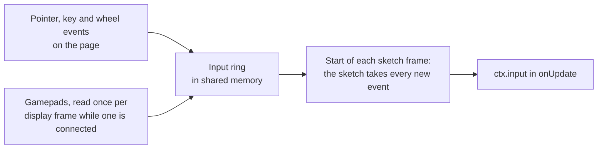

# Input

> This API is experimental: it ships in null3D 0.1, and it can still change between versions.



The page listens for pointer, touch, keyboard and wheel events, and reads the gamepads. It writes each event into a ring in shared memory. At the start of each frame, before `onUpdate`, the sketch takes every event that came since the previous frame. Then `ctx.input` gives the same answers for the whole frame. The sketch adds no DOM listeners, and input works the same in every thread mode.

```ts
export default defineSketch(({ scene, input }) => {
  const player = scene.createMesh(/* ... */);
  input.actions.define({
    left: ['KeyA', 'ArrowLeft', 'GamepadLeftStickLeft'],
    right: ['KeyD', 'ArrowRight', 'GamepadLeftStickRight'],
    jump: ['Space', 'GamepadA'],
  });
  let x = 0;
  return {
    onUpdate(dt) {
      x += (input.value('right') - input.value('left')) * 4 * dt;
      player.setPosition(x, 0, 0);
      if (input.wasPressed('jump')) { /* start a jump */ }
      if (input.wasPressed('Mouse0')) { /* a click, or a tap on a touch screen */ }
    },
  };
});
```

## Names

Every input call takes a name. A name that no key, button or action has throws [E1205](../errors/E1205.md) in development builds. Names are case-sensitive.

| Input | Names |
| --- | --- |
| Keys | `KeyboardEvent.code` names, such as `KeyW`, `Digit1`, `Space`, `Enter`, `Escape`, `ShiftLeft`, `ArrowUp` and `F1`. A code names the key's place on the keyboard, so `KeyW` is the same key on every layout. |
| Mouse buttons | `Mouse0` is the main button, `Mouse1` the middle button and `Mouse2` the right button. `Mouse3` and `Mouse4` are the back and forward buttons. A pen's tip and the first finger on a touch screen press `Mouse0`. |
| Gamepad buttons | The standard layout, as on an Xbox controller: `GamepadA`, `GamepadB`, `GamepadX`, `GamepadY`, the shoulders `GamepadLB` and `GamepadRB`, the triggers `GamepadLT` and `GamepadRT`, `GamepadBack`, `GamepadStart`, the stick presses `GamepadLS` and `GamepadRS`, `GamepadDpadUp`, `GamepadDpadDown`, `GamepadDpadLeft`, `GamepadDpadRight` and `GamepadHome`. |
| Gamepad sticks | Four directions for each stick: `GamepadLeftStickUp`, `GamepadLeftStickDown`, `GamepadLeftStickLeft` and `GamepadLeftStickRight`, and the same with `RightStick`. |
| Actions | The names you give with `input.actions.define()`. |

## Presses and releases

- `isDown(name)` is true while the key or button is down.
- `wasPressed(name)` is true for one frame: the first frame after it went down.
- `wasReleased(name)` is true for one frame: the first frame after it came up.

The sketch counts presses and releases per frame. A key can go down and up between two frames, in a quick tap or during a slow frame. The next frame then gives both `wasPressed` and `wasReleased`, and `isDown` is false.

`value(name)` gives how far a key or button is down, from 0 to 1. Keys and most buttons give 0 or 1. The triggers and the stick directions give the values between.

## The pointer

`input.pointer` follows the main pointer: the mouse, a pen, or the first finger on the canvas.

| Field | Value |
| --- | --- |
| `x`, `y` | The position in CSS pixels from the canvas's top-left corner, at the pointer's last event |
| `ndcX`, `ndcY` | The position in normalized device coordinates: from -1 at the left and bottom edges to 1 at the right and top edges |
| `dx`, `dy` | The movement since the previous frame, in CSS pixels |
| `buttons` | The buttons held, as `PointerEvent.buttons` gives them: 1 for the main button, 2 for the right button and 4 for the middle button, added together |
| `wheel` | The wheel's scroll since the previous frame, in pixels. It is positive where a page would scroll down. A line counts 16 pixels and a page 100, as three.js's controls count them. |
| `isTouch` | True when the pointer is a finger |

When the user presses a button on the canvas, the canvas captures the pointer. A drag that leaves the canvas keeps its movement and ends with a release.

## Touches

`input.touches` lists the fingers on the canvas, oldest first, up to 10. Each has an `id`, which stays the same while the finger stays down, a position `x` and `y`, and its movement `dx` and `dy` since the previous frame. The list and its entries change in place, so read them in `onUpdate` and keep no copies across frames.

```ts
const { touches } = input;
if (touches.length === 2) {
  const dx = touches[1].x - touches[0].x;
  const dy = touches[1].y - touches[0].y;
  const spread = Math.sqrt(dx * dx + dy * dy); // pinch distance in CSS pixels
}
```

A canvas that takes touch gestures needs `touch-action: none` in its CSS. Without it, the browser scrolls or zooms the page, and it cancels the touch, which the sketch sees as a release.

## Actions

An action names a list of keys and buttons, so the sketch asks for `jump` instead of each key. Players can then use a keyboard, a gamepad or a touch control for the same action.

```ts
input.actions.define({ jump: ['Space', 'GamepadA'], fire: ['Mouse0', 'GamepadRT'] });
input.wasPressed('jump'); // any of its keys and buttons went down
```

- An action is down while any of its keys and buttons is down.
- `wasPressed` is true when the action goes down, and `wasReleased` when the last of its keys and buttons comes up. A second key that goes down while the action is down gives no second press.
- `value` gives the largest value of its keys and buttons.
- Defining a name again replaces its list. An action's name must differ from every key and button name.

## Gamepads

The page reads the gamepads once per display frame while at least one is connected. Without a connected pad, the page does no gamepad work. A browser shows a pad to the page only after the user presses a button on it.

- Names follow the standard layout, which browsers give common controllers. A pad that the browser reports with another layout keeps its button numbers, so its names may not match its labels.
- With several pads connected, a button is down while any pad holds it. Each stick direction comes from the pad whose stick is pushed furthest.
- A stick reads 0 until it moves 0.15 from its center. Its value then rises smoothly, to 1 at 0.95. A stick direction goes down at 0.5 and comes up below 0.4, so it does not flicker on and off near one value.

## What the page does

- When the window loses focus, the page hides, or the engine pauses, the sketch sees every key and button that was down come up. Input that comes while the engine is paused never reaches the sketch.
- Keys typed into a text field, a text area, a select box or editable content never reach the sketch.
- The engine blocks the context menu on the canvas, so the sketch can use the right button.
- The engine leaves the browser's own actions for keys and the wheel alone. On a page that scrolls, stop Space and the arrow keys from scrolling it with a `keydown` listener on the page that calls `preventDefault()`. When the sketch zooms with the wheel, stop the page from scrolling with a wheel listener on the canvas: `canvas.addEventListener('wheel', (e) => e.preventDefault(), { passive: false })`.
- On a Mac, the browser sends no release for a key pressed while Cmd is down. So when Cmd comes up, the sketch sees every key come up.
- In hold mode, the sketch gets no input, so a held frame is the same on every run. See [Testing your sketch](../guides/testing.md).

## API reference

<!-- null3d:api:start -->

### `Input`

Interface `Input`.

The input that the page forwards to the sketch: pointer, touch, keyboard and gamepad. It changes once per frame, before `onUpdate`, so every call in one frame gives the same answer. Keys take their `KeyboardEvent.code` names, such as `KeyW`, `Space` or `ArrowLeft`, which name the key's place on the keyboard whatever its layout. Mouse buttons are `Mouse0` (the main button, or a finger) to `Mouse4`. Gamepad names follow the standard layout, as on an Xbox controller.

| Member | Description |
| --- | --- |
| `readonly pointer: InputPointer` | The main pointer: the mouse, a pen, or the first finger on the canvas. |
| `readonly touches: readonly InputTouch[]` | The fingers on the canvas, oldest first. The list and its entries change in place. |
| `readonly actions: InputActions` | Named actions, such as `jump`, each for a list of keys and buttons. |
| `isDown(name: string): boolean` | True while the key, button or action is down. |
| `wasPressed(name: string): boolean` | True in the first frame after the key, button or action went down. |
| `wasReleased(name: string): boolean` | True in the first frame after the key, button or action came up. |
| `value(name: string): number` | How far the key, button or action is down, from 0 to 1. Keys and most buttons give 0 or 1. The triggers `GamepadLT` and `GamepadRT` and the stick directions, such as `GamepadLeftStickUp`, give the values between. A stick gives 0 until it leaves its dead zone near the center. |

### `InputActions`

Interface `InputActions`.

Named actions, each for a list of keys and buttons.

| Member | Description |
| --- | --- |
| `define(actions: Readonly<Record<string, readonly string[]>>): void` | Names actions, each for a list of key and button names, such as `{ jump: ['Space', 'GamepadA'] }`. The input calls then take the action's name. An action is down while any of its keys and buttons is down, and its value is the largest of their values. Defining a name again replaces its list. |

### `InputPointer`

Interface `InputPointer`.

The main pointer: the mouse, a pen, or the first finger that touches the canvas.

| Member | Description |
| --- | --- |
| `readonly x: number` | Distance from the canvas's left edge in CSS pixels, at the pointer's last event. |
| `readonly y: number` | Distance from the canvas's top edge in CSS pixels, at the pointer's last event. |
| `readonly ndcX: number` | `x` in normalized device coordinates: -1 at the canvas's left edge and 1 at its right edge. |
| `readonly ndcY: number` | `y` in normalized device coordinates: -1 at the canvas's bottom edge and 1 at its top edge. |
| `readonly buttons: number` | The buttons held, as `PointerEvent.buttons` gives them: 1 for the main button, 2 for the right button and 4 for the middle button, added together. A finger on the screen holds the main button. |
| `readonly dx: number` | Movement to the right since the previous frame, in CSS pixels. |
| `readonly dy: number` | Movement down since the previous frame, in CSS pixels. |
| `readonly wheel: number` | The wheel's scroll since the previous frame, in pixels: positive where a page would scroll down. A wheel that scrolls by lines counts 16 pixels a line, and one that scrolls by pages counts 100 a page, as three.js's controls count them. |
| `readonly isTouch: boolean` | True when the pointer is a finger on a touch screen. |

### `InputTouch`

Interface `InputTouch`.

A finger on the canvas.

| Member | Description |
| --- | --- |
| `readonly id: number` | A number that stays the same while the finger stays down. |
| `readonly x: number` | Distance from the canvas's left edge in CSS pixels. |
| `readonly y: number` | Distance from the canvas's top edge in CSS pixels. |
| `readonly dx: number` | Movement to the right since the previous frame, in CSS pixels. |
| `readonly dy: number` | Movement down since the previous frame, in CSS pixels. |

<!-- null3d:api:end -->
