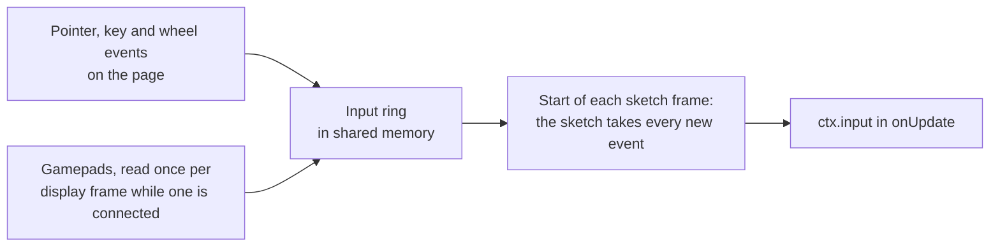

# Input

> Ships in null3D 0.1, with pointer events on objects and the pointer lock from null3D 0.2. The API is experimental, so it can still change between versions.



The page listens for pointer, touch, keyboard and wheel events, and reads the gamepads. It writes each event into a ring in shared memory. At the start of each frame, before `onUpdate`, the sketch takes every event that came since the previous frame. Only a second drag of the pointer, and wheel scroll after a drag, wait for the next frame, as [The pointer](#the-pointer) explains. Then `ctx.input` gives the same answers for the whole frame. The sketch adds no DOM listeners, and input works the same in every thread mode.

```ts
export default defineSketch(({ scene, input }) => {
  const player = scene.createMesh(/* ... */);
  input.actions.define({
    left: ['KeyA', 'ArrowLeft', 'GamepadLeftStickLeft'],
    right: ['KeyD', 'ArrowRight', 'GamepadLeftStickRight'],
    jump: ['Space', 'GamepadA'],
  });
  let x = 0;
  return {
    onUpdate(dt) {
      x += (input.value('right') - input.value('left')) * 4 * dt;
      player.setPosition(x, 0, 0);
      if (input.wasPressed('jump')) { /* start a jump */ }
      if (input.wasPressed('Mouse0')) { /* a click, or a tap on a touch screen */ }
    },
  };
});
```

The [input demo](https://github.com/null3d-engine/null3d/tree/main/examples/input) moves a box with an action map. Drags turn its camera, and the wheel and trackpad pinches zoom.

## Names

Every input call takes a name. A name that no key, button or action has throws [E1205](../errors/E1205.md) in development builds. Names are case-sensitive.

| Input | Names |
| --- | --- |
| Keys | `KeyboardEvent.code` names, such as `KeyW`, `Digit1`, `Space`, `Enter`, `Escape`, `ShiftLeft`, `ArrowUp` and `F1`. A code names the key's place on the keyboard, so `KeyW` is the same key on every layout. |
| Mouse buttons | `Mouse0` is the main button, `Mouse1` the middle button and `Mouse2` the right button. `Mouse3` and `Mouse4` are the back and forward buttons. A pen's tip and the first finger on a touch screen press `Mouse0`. |
| Gamepad buttons | The standard layout, as on an Xbox controller: `GamepadA`, `GamepadB`, `GamepadX`, `GamepadY`, the shoulders `GamepadLB` and `GamepadRB`, the triggers `GamepadLT` and `GamepadRT`, `GamepadBack`, `GamepadStart`, the stick presses `GamepadLS` and `GamepadRS`, `GamepadDpadUp`, `GamepadDpadDown`, `GamepadDpadLeft`, `GamepadDpadRight` and `GamepadHome`. |
| Gamepad sticks | Four directions for each stick: `GamepadLeftStickUp`, `GamepadLeftStickDown`, `GamepadLeftStickLeft` and `GamepadLeftStickRight`, and the same with `RightStick`. |
| Actions | The names you give with `input.actions.define()`. |

## Presses and releases

- `isDown(name)` is true while the key or button is down.
- `wasPressed(name)` is true for one frame: the first frame after it went down.
- `wasReleased(name)` is true for one frame: the first frame after it came up.

The sketch counts presses and releases per frame. A key can go down and up between two frames, in a quick tap or during a slow frame. The next frame then gives both `wasPressed` and `wasReleased`, and `isDown` is false.

`value(name)` gives how far a key or button is down, from 0 to 1. Keys and most buttons give 0 or 1. The triggers and the stick directions give the values between.

## The pointer

`input.pointer` follows the main pointer: the mouse, a pen, or the first finger on the canvas.

| Field | Value |
| --- | --- |
| `x`, `y` | The position in CSS pixels from the canvas's top-left corner, at the pointer's last event |
| `ndcX`, `ndcY` | The position in normalized device coordinates: from -1 at the left and bottom edges to 1 at the right and top edges |
| `dx`, `dy` | The movement since the previous frame, in CSS pixels |
| `dragDx`, `dragDy` | The part of `dx` and `dy` made while a button was held. Movement before a press or after a release in the same frame does not count. |
| `buttons` | The buttons held, as `PointerEvent.buttons` gives them: 1 for the main button, 2 for the right button and 4 for the middle button, added together |
| `wheel` | The wheel's scroll since the previous frame, in pixels. It is positive where a page would scroll down. A line counts 16 pixels and a page 100, as three.js's controls count them. |
| `pinch` | The part of `wheel` that came from a pinch on a trackpad. It is positive as the fingers close. |
| `isTouch` | True when the pointer is a finger |
| `locked` | True while the canvas holds the pointer lock |

Use `dragDx` and `dragDy` for drags, such as turning an object with the mouse. A frame can hold the end of a hover and the start of a drag, and `dx` counts both.

A frame's drag belongs to one press. During a slow frame, one drag can end and the next can start before the sketch reads either. The next press and the events after it then wait for the following frame, so each drag keeps its own button and movement. Two quick clicks between two frames also count as two presses, one in each of the next two frames. Wheel scroll that follows a release waits for the following frame in the same way. So a frame's scroll never comes after the end of its drag. Controls that ignore the wheel during a drag, as three.js's do, still take the scroll after it.

Browsers send a pinch on a trackpad as wheel scroll with the Control key's flag, while no Control key is down. Unless the page stops it, the browser also zooms the whole page on a pinch. [What the page does](#what-the-page-does) shows how to stop it.

When the user presses a button on the canvas, the canvas captures the pointer. A drag that leaves the canvas keeps its movement and ends with a release.

The page can ask for the pointer lock with [`engine.requestPointerLock()`](engine.md#the-running-engine). While the canvas holds the lock, the browser hides the pointer and keeps it still. The fields `x` and `y` then stay where the lock began, and `dx` and `dy` give the mouse's movement, with no edge to stop it. Objects take no pointer events during the lock. [First-person controls](controls.md#pointer-lock) turn the view by the movement.

## Touches

`input.touches` lists the fingers on the canvas, oldest first, up to 10. Each has an `id`, which stays the same while the finger stays down, a position `x` and `y`, and its movement `dx` and `dy` since the previous frame. The list and its entries change in place, so read them in `onUpdate` and keep no copies across frames.

```ts
const { touches } = input;
if (touches.length === 2) {
  const dx = touches[1].x - touches[0].x;
  const dy = touches[1].y - touches[0].y;
  const spread = Math.sqrt(dx * dx + dy * dy); // pinch distance in CSS pixels
}
```

A canvas that takes touch gestures needs `touch-action: none` in its CSS. Without it, the browser scrolls or zooms the page, and it cancels the touch, which the sketch sees as a release.

## Pointer events on objects

`object.on(type, handler)` calls `handler` for each pointer event of `type` on an object, and `object.off(type, handler)` removes it. Instance batches take the same calls, and the event's `instance` names the row. So do [sprite](sprites.md), [point](points.md) and [line](lines.md) batches, whose `instance` names the sprite, the point or the line's segment. The engine finds the object under the pointer itself, so the sketch needs no raycast of its own. The [picking demo](https://github.com/null3d-engine/null3d/tree/main/examples/picking) lights up the shape under the pointer, and outlines the shape that a click selects.

```ts
export default defineSketch(({ scene, geometry, materials, page }) => {
  // A camera and lights, as on the Scene page, go here.
  const crate = geometry.box();
  const wood = materials.standard({ color: '#b07d4f' });
  for (let i = 0; i < 5; i++) {
    const box = scene.createMesh({ name: `crate ${i}`, mesh: crate, material: wood, position: [i * 2 - 4, 0.5, 0] });
    box.on('pointerenter', () => box.setScale(1.2, 1.2, 1.2));
    box.on('pointerleave', () => box.setScale(1, 1, 1));
    box.on('click', () => page.post('picked', box.name));
  }
});
```

| Type | When it comes |
| --- | --- |
| `pointerdown` | A button or a finger goes down over the object |
| `pointerup` | A button or a finger comes up over the object |
| `click` | The main button or a finger goes down and comes up over the object. Between the two, a mouse or a pen may move 2 CSS pixels and a finger 10, so a drag that turns the camera is no click |
| `pointermove` | The pointer moves over the object. Moves of one pointer that follow each other in a frame give one event, at the last position |
| `pointerenter` | The pointer comes over the object or one of its children |
| `pointerleave` | The pointer leaves the object and all its children |

### Which object gets the event

- The engine casts a ray from the camera through the pointer. The closest object or row of a batch that the ray hits gets the event. Sprites, points and lines are hit where they draw, with the camera of the frame on screen at the event. Objects behind it get nothing, so a wall in front of a box takes the click.
- The ray tests the objects on the layers that the camera draws, as [Raycasting](raycast.md) tests them. Hidden objects are never hit. A see-through object, such as a glass pane, takes the event too. To pick through it, cast your own ray with `camera.screenToRay` and `scene.raycast` on the layers you choose.
- The event then goes to the object's parent, and on up to the root object. An event on a web page goes up through the elements that hold its target in the same way. So a handler on a model's group hears the clicks on every part of the model. `event.stopPropagation()` stops the event before the next parent.
- A `click` goes to the closest object that was under the pointer at both the press and the release. A press on one child of a group and a release on another click the group.
- `pointerenter` and `pointerleave` do not go on to parents: each object gets its own. A move from one child of a group to another leaves the first child and enters the second, and the group stays entered. Each `pointerenter` gets one `pointerleave` later, unless the object is destroyed or its handler is removed first.
- A finger enters the object at its press, and leaves it after its release. A mouse or a pen that leaves the canvas leaves every object. An HTML element over the canvas counts as outside it.

### When handlers run

- Handlers run on the sketch's thread at the start of each frame, before `onFixedUpdate` and `onUpdate`, in the order of the events.
- Each ray comes from the camera of the frame that was on screen at its event, as with [`camera.screenToRay`](cameras.md). So a click during a fast camera pan hits what the user saw.
- Objects are tested where the last frame's update put them. A moving object can be up to a frame of its motion away from where the user saw it.
- While a mouse or a pen rests over the canvas, the engine casts its ray again in each frame. So `pointerenter` and `pointerleave` follow objects and cameras that move under a still pointer.

### The event

The engine passes one event object to every handler and reuses it, so copy any value that you keep after the handler returns.

| Field | Value |
| --- | --- |
| `type` | The event's type |
| `object` | The object under the pointer, or the batch of a row: an instance, sprite, point or line batch. It can be a child of the object whose handler runs. For `pointerleave`, it is the object that the pointer moved onto, or null |
| `instance` | The row of a batch: an instance row, a sprite, a point or a line's segment. -1 for an object |
| `point`, `normal`, `distance`, `triangle` | Where the ray hit `object`, as a [raycast's hit](raycast.md#raycasts) gives them |
| `ray` | The ray from the camera through the pointer, from the frame that was on screen at the event |
| `x`, `y` | The pointer's position in CSS pixels from the canvas's top-left corner |
| `pointerId` | The browser's pointer id. Each finger on a touch screen has its own |
| `isTouch` | True when the pointer is a finger |
| `button` | The button that went down or came up, as `PointerEvent.button` gives it: 0 for the main button or a finger. -1 for the other types |
| `buttons` | The buttons held, as `input.pointer.buttons` gives them |

### What it costs

In a frame in which no object listens, pointer events cast no ray and copy nothing. Otherwise each event casts one ray, which takes one to three microseconds in a scene of 20,000 objects. The first ray in a frame also updates the scene's trees, as any query does. The engine casts only the rays that the handlers need: with only `click` handlers, a move casts none. Moves of one pointer that follow each other in a frame share one ray.

### Compared with three.js

three.js has no pointer events on objects. An app adds DOM listeners to the canvas, then calls `Raycaster.setFromCamera` and `intersectObjects` in each one. In the sketch, `object.on` replaces both. react-three-fiber's mesh events map to `on`: `onClick` to `'click'`, `onPointerDown` to `'pointerdown'`, `onPointerEnter` to `'pointerenter'`, and so on. Three differences:

- react-three-fiber casts rays only against objects with handlers. It passes an event to every one that the ray hits, nearest first, until a handler calls `stopPropagation`. null3D passes it to the closest object that the camera draws and to its parents only. So an object without handlers in front still takes the event.
- react-three-fiber's `onClick` also comes after a drag, with the drag's length in `event.delta`. null3D gives no click after a drag of more than 2 CSS pixels, or 10 for a finger.
- react-three-fiber's `onPointerMissed` has no equivalent. Set a flag in your `click` handlers, and in `onUpdate` treat `input.wasReleased('Mouse0')` without the flag as a click on nothing.

## Actions

An action names a list of keys and buttons, so the sketch asks for `jump` instead of each key. Players can then use a keyboard, a gamepad or a touch control for the same action.

```ts
input.actions.define({ jump: ['Space', 'GamepadA'], fire: ['Mouse0', 'GamepadRT'] });
input.wasPressed('jump'); // any of its keys and buttons went down
```

- An action is down while any of its keys and buttons is down.
- `wasPressed` is true when the action goes down, and `wasReleased` when the last of its keys and buttons comes up. A second key that goes down while the action is down gives no second press.
- `value` gives the largest value of its keys and buttons.
- Defining a name again replaces its list. An action's name must differ from every key and button name.

## Gamepads

The page reads the gamepads once per display frame while at least one is connected. Without a connected pad, the page does no gamepad work. A browser shows a pad to the page only after the user presses a button on it.

- Names follow the standard layout, which browsers give common controllers. A pad that the browser reports with another layout keeps its button numbers, so its names may not match its labels.
- With several pads connected, a button is down while any pad holds it. Each stick direction comes from the pad whose stick is pushed furthest.
- A stick reads 0 until it moves 0.15 from its center. Its value then rises smoothly, to 1 at 0.95. A stick direction goes down at 0.5 and comes up below 0.4, so it does not flicker on and off near one value.

## What the page does

- When the window loses focus, the page hides, or the engine pauses, the sketch sees every key and button that was down come up. Input that comes while the engine is paused never reaches the sketch.
- Keys typed into a text field, a text area, a select box or editable content never reach the sketch.
- The engine blocks the context menu on the canvas, so the sketch can use the right button.
- The engine leaves the browser's own actions for keys and the wheel alone. On a page that scrolls, stop Space and the arrow keys from scrolling it with a `keydown` listener on the page that calls `preventDefault()`. When the sketch zooms with the wheel or a pinch, stop the page from scrolling and zooming with a wheel listener on the canvas: `canvas.addEventListener('wheel', (e) => e.preventDefault(), { passive: false })`.
- On a Mac, the browser sends no release for a key pressed while Cmd is down. So when Cmd comes up, the sketch sees every key come up.
- In hold mode, the sketch gets no input, so a held frame is the same on every run. See [Testing your sketch](../guides/testing.md).

## API reference

[The API reference](reference/input.md) lists every export of this page with its type and description. The engine's doc comments make it.
