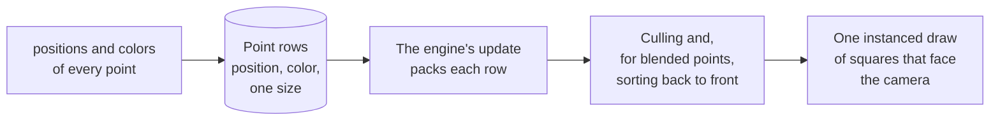

# Points

> Ships in null3D 0.2. The API is experimental, so it can still change between versions. Points do not cast or receive shadows, and overlap queries do not find them. Coding agents must not rely on either.



A point cloud is many small squares that face the camera, all of one size, such as stars, dust, sparks or a scanned object. null3D draws each point as a square of two triangles, so points of any size draw the same on every GPU path. Each point is a row in the batch's typed arrays, with its own position and color. Sketch code writes the rows straight into engine memory, with no call per point, as it does for [instance batches](../concepts/instances.md).

A batch is one draw for the GPU, whatever its size. Points are [sprites](sprites.md) of one size, with no rotation and no atlas. So the engine culls them, and sorts blended points back to front, as it does for sprites.

```ts
import { defineSketch } from '@null3d/engine';

export default defineSketch(async ({ scene, time }) => {
  const camera = scene.createPerspectiveCamera({ position: [0, 6, 14], target: [0, 0, 0] });
  scene.setActiveCamera(camera);

  // A spiral galaxy of 20,000 stars, 3 numbers per star for positions and for colors.
  const count = 20000;
  const positions = new Float32Array(count * 3);
  const colors = new Float32Array(count * 3);
  for (let i = 0; i < count; i++) {
    const radius = Math.random() ** 2 * 8;
    const angle = radius * 0.8 + (i % 3) * ((Math.PI * 2) / 3) + Math.random() * 0.5;
    positions[i * 3] = Math.cos(angle) * radius;
    positions[i * 3 + 1] = (Math.random() - 0.5) * 0.4;
    positions[i * 3 + 2] = Math.sin(angle) * radius;
    // Warm in the middle, cool at the edge.
    colors.set([1, 0.6 + radius / 20, 0.3 + radius / 10], i * 3);
  }
  await scene.createPoints({ positions, colors, size: 0.05 });

  return {
    onUpdate() {
      const turn = time.now * 0.1;
      camera.setPosition(Math.cos(turn) * 14, 6, Math.sin(turn) * 14);
      camera.lookAt(0, 0, 0);
    },
  };
});
```

## Create a batch

`scene.createPoints(options)` returns a promise of the batch. The first call downloads the sprite code, which points share with sprites. A page without points or sprites never downloads it. Await the call in the setup function, as the example does. If the sprite code does not download, the promise rejects with [E1406](../errors/E1406.md).

`scene.createPoints` takes these options:

| Option | Default | What it does |
| --- | --- | --- |
| `positions` | None: it is required | The points, 3 numbers each. Their number is the batch's capacity, which never changes |
| `colors` | White | Linear colors, 3 numbers per point (RGB) or 4 (RGBA), which multiply `color` |
| `size` | 1 | The width and height of every point: world units, or CSS pixels without size attenuation |
| `sizeAttenuation` | `true` | `true` gives the size in world units. `false` gives it in CSS pixels, so each point keeps its size on screen |
| `map` | None | A color map in sRGB. Each point shows the whole picture, upright, and its color multiplies the point's |
| `color` | White | A color that multiplies every point's color |
| `opacity` | 1 | An opacity that multiplies every point's alpha |
| `alphaMode` | `'opaque'` | `'opaque'` ignores the alpha. `'mask'` cuts each point where its alpha falls below `alphaCutoff`. `'blend'` blends each point over what lies behind it |
| `alphaCutoff` | 0.5 | With the `mask` mode, the alpha below which a point draws nothing |
| `blending` | `'normal'` | With the `blend` mode: `'normal'`, `'additive'` for glows and sparks, or `'multiply'` |
| `fog` | `true` | `false` keeps the points out of the scene's fog |
| `depthWrite` | `true` | `false` writes no depth, so a point hides nothing behind it |
| `depthTest` | `true` | `false` draws the points in front of everything |
| `dynamic` | `false` | `true` updates and uploads every point in use, in every frame. A static batch updates only the points that you mark |
| `layers` | `1`, layer 0 | The [layers](../concepts/render-layers.md) of every point, as a 32-bit mask |
| `origin` | `[0, 0, 0]` | The point that every position is relative to, kept at full precision: [Batch origins](../concepts/large-worlds.md#batch-origins) |

`positions` that do not hold 3 numbers per point throw [E1206](../errors/E1206.md), and so do `colors` that do not hold 3 or 4 numbers per point. A batch of no points throws E1206 too. In development builds, a value that is not finite throws E1206. A size that is not above 0 throws [E1108](../errors/E1108.md), and one that is not finite throws [E1203](../errors/E1203.md).

`points.material.set({ color, opacity, alphaCutoff })` changes the look of every point at any time. The other options are fixed when the batch is created.

## The row arrays

| Array | Values per point | What each point holds |
| --- | --- | --- |
| `positions` | 3 | Its position in the world (x, y, z), relative to the batch's `origin` |
| `colors` | 4 | A linear color (r, g, b, a), white at first |

Point `i` starts at index `i * 3` in `positions` and `i * 4` in `colors`. The `colors` array always holds 4 numbers per point, even when `colors` in the options held 3: the call writes an alpha of 1 then. Both arrays are `Float32Array` views of engine memory. The rules of [instance batches](../concepts/instances.md#the-row-arrays) apply. Read the arrays from the batch each time you use them, such as at the start of `onUpdate`. A view from before the engine's memory grew can be empty.

Color components from 0 to 1,024 draw, and alpha from 0 to 1. Brighter colors work with [bloom](post.md). Convert an sRGB color, such as a hex string, with `color.fromHex` from the [math helpers](math.md).

## Sizes in the world and on the screen

With `sizeAttenuation: true`, the default, the size is in world units. A point 0.1 units wide is as wide as a box 0.1 units wide at the same distance, so far points look smaller.

With `sizeAttenuation: false`, the size is in CSS pixels, at every distance and on every screen. A point 4 pixels wide shows 4 CSS pixels wide, and the engine scales it by the device's pixel ratio. The engine never culls these points, because their size in the world grows with their distance.

`points.setSize(size)` changes the size of every point. It updates and uploads every point once, so do not call it in every frame of a large batch. For points of many sizes, use [sprites](sprites.md), whose `sizes` array gives each sprite its own.

## Static and dynamic batches

A static batch, the default, updates only the points that you mark with `markDirty(start, count)`, as an [instance batch](../concepts/instances.md#static-and-dynamic-batches) does. A dynamic batch updates every point in use in every frame, and needs no marks. Use a dynamic batch for points that move every frame, and a static batch for a cloud that holds still.

`setActiveCount(n)` draws only the first `n` points. `setLayers(mask)` moves every point to other layers. `destroy()` removes the batch and frees its rows. After it, stop using the batch and its arrays.

## Round points, maps and blending

A point without a map is a square. For round points, give a map of a disc, with `alphaMode: 'mask'` for a sharp edge or `'blend'` for a soft one. The map is sRGB, and its color multiplies each point's color, so one white disc serves points of every color.

Opaque and masked points need no sorting, and cost the least. Blended points draw after the opaque objects, farthest first, in the same transparent pass as other blended objects. Every frame, the engine sorts the points of a batch among themselves and among the scene's other blended objects. For points that add light, such as sparks, `blending: 'additive'` with `depthWrite: false` needs no exact order to look right.

## Clicks and raycasts

Raycasts hit a point where the ray crosses its square. The hit's `object` is the batch, and its `instance` is the point. A point batch takes `points.on('click', handler)` and the other [pointer events on objects](input.md#pointer-events-on-objects), as an instance batch does. The `pointThreshold` option changes the test: a ray then hits a point within that many meters, whatever the point's size. That makes small points easier to click. [Raycasting](raycast.md#sprites-points-and-lines) has the details.

## Speed

A batch costs about the same per point as an instance batch costs per row. The engine packs each point into the data that it keeps for an instance row. So points share the culling, sorting and drawing of instance batches. One batch of 100,000 points draws in one draw on WebGPU and WebGL2.

Every point counts toward the device's limit of objects and instance rows, as an instance row does ([Instances and batching](../concepts/instances.md#limits)). Each point takes about 215 bytes of engine memory, so a cloud of a million points takes about 215 MB. Point batches count toward the limit of 256 instance batches.

## Compared with three.js

| three.js | null3D |
| --- | --- |
| `new THREE.Points(geometry, new THREE.PointsMaterial({ size, color }))` | `scene.createPoints({ positions, size, color })` |
| The geometry's `position` attribute | `positions` |
| The geometry's `color` attribute with `vertexColors: true` | `colors` |
| `material.size` with `sizeAttenuation: true` | `size` in world units: three.js's size times `tan(fov / 2)` |
| `material.size` with `sizeAttenuation: false` | `size` with `sizeAttenuation: false`, in CSS pixels, as three.js gives it |
| `material.map` | `map` |
| `material.transparent` | `alphaMode: 'blend'` |
| `material.alphaTest` | `alphaMode: 'mask'` with `alphaCutoff` |

Most points look the same in both engines. These differ:

- three.js's size attenuation scales a point by half the canvas's height over its depth. So its size in the world depends on the camera's field of view. A null3D size is in world units. Multiply a three.js size by `tan(fov / 2)`, with `fov` the vertical field of view, to keep the look. With an orthographic camera, three.js ignores size attenuation, so use `sizeAttenuation: false` with three.js's size.
- WebGL draws a point only while its center is on the screen. So a large three.js point vanishes when its center leaves the edge. A null3D point stays until its whole square leaves the screen.
- Each GPU sets a largest size for WebGL points, and the WebGL specification lets that limit be as low as 1 pixel. null3D points have no such limit. three.js's WebGPU renderer draws `Points` one pixel wide.
- three.js draws the points of one cloud in their order. null3D sorts blended points back to front.
- `alphaMap` has no counterpart yet.
- three.js's `Raycaster` hits a point within `params.Points.threshold`, 1 meter by default, whatever its size. null3D hits each point's square, and the `pointThreshold` option gives three.js's test.

## API reference

[The API reference](reference/points.md) lists every export of this page with its type and description. The engine's doc comments make it.
