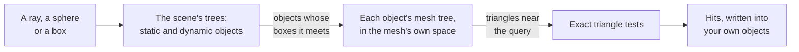

# Raycasting and spatial queries

> Ships in null3D 0.2. The API is experimental, so it can still change between versions. Pixel-exact GPU picking is not built yet, so coding agents must not use it. Queries test a skinned character in its bind pose, not in its animated pose.



A raycast finds where a ray meets the scene's objects. An overlap query finds the objects inside a sphere or a box. Every query tests the triangles of objects and instance rows, as three.js's `Raycaster` does. The engine keeps a tree over the scene's objects and a tree over each mesh's triangles. So a query tests only the few triangles near it.

Queries run in the sketch, on the scene. They write their results into objects and arrays that you create once, so a query in every frame allocates nothing.

```ts
import { defineSketch, type RaycastHit, vec3 } from '@null3d/engine';

/** The drone's own layer, which its ray leaves out. */
const DRONE = 1 << 1;

export default defineSketch(({ scene, geometry, materials, time }) => {
  const camera = scene.createPerspectiveCamera({ position: [0, 9, 14], target: [0, 0, 0] });
  scene.setActiveCamera(camera);
  scene.createDirectionalLight({ direction: [-1, -2, -1], intensity: 3 });
  const stone = materials.standard({ color: '#8a8f99' });
  const block = geometry.box({ width: 2, height: 1, depth: 2 });
  for (let i = 0; i < 12; i++) {
    const angle = (i / 12) * Math.PI * 2;
    const height = 1 + (i % 4) * 0.5;
    scene.createMesh({ mesh: block, material: stone, position: [Math.cos(angle) * 5, height / 2, Math.sin(angle) * 5], scale: [1, height, 1] });
  }
  const drone = scene.createMesh({
    mesh: geometry.sphere({ radius: 0.3 }),
    material: materials.standard({ color: '#e8554e' }),
    dynamic: true,
    layers: DRONE,
  });

  // Made once, reused in every frame.
  const from = vec3.create();
  const down = vec3.set(vec3.create(), 0, -1, 0);
  const hit: RaycastHit = { object: null, instance: -1, point: vec3.create(), normal: vec3.create(), distance: 0, triangle: -1 };
  const options = { maxDistance: 50 };

  return {
    onUpdate() {
      vec3.set(from, Math.cos(time.now) * 5, 20, Math.sin(time.now) * 5);
      // Straight down onto the blocks: the drone floats one meter above what it passes over.
      const ground = scene.raycast(from, down, options, hit) ? (hit.point[1] as number) : 0;
      drone.setPosition(from[0], ground + 1, from[2]);
    },
  };
});
```

The drone sits on layer 1, and the ray tests layer 0, the default. So the ray never hits the drone itself.

## Raycasts

| Call | Returns |
| --- | --- |
| `scene.raycast(origin, direction, options, hit)` | True on a hit, with the closest hit written into `hit` |
| `scene.raycastAny(origin, direction, options)` | True when the ray hits anything. It stops at the first hit it finds, so it is the fastest raycast. Use it for line of sight |
| `scene.raycastAll(origin, direction, options, hits)` | The number of hits, written into `hits` nearest first: one hit for each triangle that the ray crosses |

A ray starts at `origin` and runs along `direction`, which needs no unit length. Both are arrays of three numbers. The ray hits nothing behind its origin.

`options` is `undefined` or an object with two optional fields:

- `layers`: the layers to test, a 32-bit mask as `setLayers` takes. A query tests an object when their masks share a layer. The default is layer 0 alone, as for a camera and for three.js's `Raycaster`.
- `maxDistance`: the farthest hit in meters. The default is no limit.

A hit has these fields:

| Field | Value |
| --- | --- |
| `object` | The object that the ray hit, or the instance batch of a row. `null` after a miss |
| `instance` | The row of an instance batch, or -1 for an object |
| `point` | Where the ray hit, in world space |
| `normal` | The unit normal of the hit triangle in world space, on the side that faces the ray's origin |
| `distance` | The distance from the origin to the point, in meters |
| `triangle` | The index of the hit triangle in its mesh, as three.js's `faceIndex` |

`raycast` sets `hit.object` to `null` after a miss, and leaves the other fields as they were. `raycastAll` fills the first entries of `hits` and returns how many it filled. When the array is too short, it adds hit objects to it. It leaves the entries after the hits as they were, so read only the first ones.

## Rays from the pointer

For clicks and hover on objects, `object.on('click', handler)` casts the ray itself. [Pointer events on objects](input.md#pointer-events-on-objects) describes it. For a ray of your own, such as one that tests only some layers, `camera.screenToRay(x, y, ray)` writes the ray through a point on the canvas. Pass `input.pointer.x` and `input.pointer.y`, and the ray comes from the frame that was on screen at the pointer's event.

```ts
const ray = { origin: vec3.create(), direction: vec3.create() };   // made once
// in onUpdate:
if (input.wasPressed('Mouse0')) {
  camera.screenToRay(input.pointer.x, input.pointer.y, ray);
  if (scene.raycast(ray.origin, ray.direction, { layers: GROUND }, hit)) moveTo(hit.point);
}
```

## Batches of rays

The call `scene.raycastBatch(rays, options, out)` casts many rays at once, on the job workers. Its `rays` array holds six numbers per ray: its origin, then its direction. Its `out` object holds typed arrays with one entry per ray, or three numbers per ray for points and normals. Only `distances` is required, and the call fills each other array that you give. It returns how many rays hit something.

```ts
const COUNT = 1000;
const rays = new Float64Array(COUNT * 6);   // origin x, y, z, then direction x, y, z
const out = {
  distances: new Float32Array(COUNT),        // -1 where a ray hits nothing
  objects: new Array(COUNT).fill(null),
  instances: new Int32Array(COUNT),
  points: new Float32Array(COUNT * 3),
  normals: new Float32Array(COUNT * 3),
};
const hitCount = scene.raycastBatch(rays, { maxDistance: 100 }, out);
```

Each ray's result is the closest hit that `raycast` gives for it. Use a batch for many rays in one frame, such as sensors, lidar or visibility checks for a crowd.

## Overlap queries

| Call | Returns |
| --- | --- |
| `scene.overlapSphere(center, radius, options, out)` | The number of objects with a triangle within `radius` meters of `center` |
| `scene.overlapBox(min, max, options, out)` | The number of objects with a triangle inside the box from `min` to `max`, or crossing it. The box's sides lie along the world's axes |

Each entry of `out` gets an `object` and an `instance`, in no set order. `out` fills as the hits of `raycastAll` do. `options` takes `layers`.

```ts
const nearby: OverlapHit[] = [];             // made once
const count = scene.overlapSphere(center, 3, { layers: ENEMIES }, nearby);
for (let i = 0; i < count; i++) {
  const { object, instance } = nearby[i];
  // ...
}
```

An overlap query tests triangles. A long wall counts only where its surface reaches the volume, even when its bounding sphere reaches farther. A volume entirely inside a closed mesh touches none of its triangles, so the query does not find that mesh.

## What queries test

- Each object and instance row with a mesh, on the query's layers. Groups, cameras and lights have no mesh.
- Each triangle as its material draws it: front faces only, or both faces for a material with `doubleSided: true`. three.js's `Raycaster` reads a material's `side` the same way.
- Shown objects only. A hidden object is never hit.
- The positions of the last frame's update. A move, a new object or a destroy in your `onUpdate` counts from the next frame. In `onLateUpdate`, queries see this frame's positions, but rows of instance batches still have the last frame's positions.

A custom material's vertex offset moves vertices on the GPU only, so queries test the mesh's own positions. In the same way, a skinned character is tested in its bind pose, the pose of its mesh before animation, moved by its object's matrix. A ray through its animated arm can miss, and a ray through the place where the arm rests in the bind pose can hit.

## Input that queries refuse

Every query checks its input before the engine runs it, in development and production builds alike. A check that passes costs a few comparisons. A query that gets input it cannot use throws an error that names the call and the value:

| Input | Error |
| --- | --- |
| A number that is NaN or infinite, in a point, a direction, a radius or the rays of a batch | [E1203](../errors/E1203.md) |
| A direction of length 0 | [E1108](../errors/E1108.md) |
| An origin, a center, a box corner or a radius past ±3.4 × 10^38, the range of 32-bit floats | [E1108](../errors/E1108.md) |
| A negative `maxDistance` or radius, or a box whose lowest corner lies above its highest | [E1108](../errors/E1108.md) |
| A `rays` array whose length is not a multiple of 6, or an `out` array too short for the rays | [E1108](../errors/E1108.md) |
| A layer mask that does not fit 32 bits | [E1207](../errors/E1207.md) |

A direction can have any length above 0, from 10^-300 to 10^300. The engine makes it a unit vector in 64-bit numbers before the ray runs.

## How queries find objects

The engine keeps two levels of trees, in its WebAssembly core.

- One tree per mesh, over its triangles. The first query after a mesh is created builds the mesh's tree, on the job workers. A large mesh can make that first query slow.
- Two trees over the scene's objects and instance rows. The tree over static objects is built once, and again only after objects are created or destroyed. When a static object moves, the engine adjusts the boxes of its tree instead. The tree over dynamic objects is built again in each frame that runs a query, from all their positions at once. A frame without queries builds nothing.

Each node of a tree has four children, so one SIMD instruction tests a ray against four boxes. A query walks the scene's trees to the objects whose boxes it meets. Then it moves the ray into each object's own space and walks that object's mesh tree. Each object's box comes from its mesh's box, so it holds every triangle.

The trees give the same hits as testing every triangle of every object in turn. Objects far from the origin, thousands of kilometers out, get the same precision as objects near it. The engine stores positions relative to grid cells, and each query moves its origin into each cell's frame in 64-bit numbers.

## Compared with three.js

| three.js | null3D |
| --- | --- |
| `raycaster.setFromCamera(pointer, camera)` | `camera.screenToRay(input.pointer.x, input.pointer.y, ray)`, with the camera of the frame on screen at the pointer's event |
| DOM listeners that raycast for clicks and hover | `object.on('click', handler)` and the other [pointer events on objects](input.md#pointer-events-on-objects) |
| `raycaster.intersectObjects(scene.children, true)` | `scene.raycastAll(origin, direction, options, hits)` tests the whole scene |
| `intersects[0]` | `scene.raycast(origin, direction, options, hit)` |
| `raycaster.far` | `maxDistance` |
| `raycaster.layers` | `options.layers`, with the same default: layer 0 alone |
| `intersection.instanceId` | `hit.instance` |
| `intersection.faceIndex` | `hit.triangle` |
| `three-mesh-bvh` | Built in: delete its setup |

three.js tests hidden objects unless you filter them out; null3D never hits them. three.js tests a skinned mesh's animated vertices; null3D tests its bind pose. three.js returns a new array of new objects for each raycast; null3D writes into the objects you pass. three.js tests each object's bounding sphere in turn, so a ray costs more as the scene grows. null3D walks its trees, so a ray costs about the same in a large scene.

<!-- null3d:api:start -->

### `OverlapHit`

Interface `OverlapHit`.

An object that a query found: a scene object, or a row of an instance batch.

| Member | Description |
| --- | --- |
| `object: Object3D \| InstanceBatch \| null` | The object or the instance batch, or null after a raycast that hit nothing. |
| `instance: number` | The row of an instance batch, or -1 for an object. |

### `QueryOptions`

Interface `QueryOptions`.

The options of every query.

| Member | Description |
| --- | --- |
| `layers?: number` | The layers to test, as a 32-bit mask like `Object3D.setLayers` takes. A query tests an object when their masks share a layer. The default is layer 0 alone, as for a camera and for three.js's `Raycaster`. |

### `RaycastBatchHits`

Interface `RaycastBatchHits`.

The arrays that `scene.raycastBatch` fills: one entry per ray, or three numbers per ray for points and normals. Only `distances` is required; the call fills each other array you give.

| Member | Description |
| --- | --- |
| `distances: Float32Array \| Float64Array` | The distance to each ray's closest hit in meters, or -1 when the ray hits nothing. |
| `objects?: (Object3D \| InstanceBatch \| null)[]` | The object or instance batch that each ray hit, or null. |
| `instances?: Int32Array` | The instance batch row that each ray hit, or -1. |
| `points?: Float32Array \| Float64Array` | Each hit's point in world space, three numbers per ray. |
| `normals?: Float32Array \| Float64Array` | Each hit triangle's unit normal in world space, facing the ray, three numbers per ray. |

### `RaycastHit`

Interface `RaycastHit`, which extends `OverlapHit`.

A raycast's hit. Create one with `point` and `normal` arrays, and pass it to each raycast.

| Member | Description |
| --- | --- |
| `point: Vec3Like` | Where the ray hit, in world space. |
| `normal: Vec3Like` | The unit normal of the hit triangle in world space, on the side that faces the ray. |
| `distance: number` | The distance from the ray's origin to the hit, in meters. |
| `triangle: number` | The index of the hit triangle in its mesh, as three.js's `faceIndex`. |

### `RaycastOptions`

Interface `RaycastOptions`, which extends `QueryOptions`.

The options of a raycast.

| Member | Description |
| --- | --- |
| `maxDistance?: number` | The farthest hit, in meters from the ray's origin. The default is no limit. |

<!-- null3d:api:end -->
