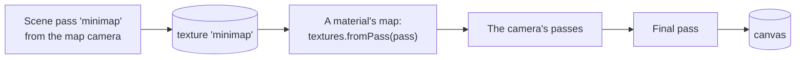

# Render graph API

> Ships in null3D 0.2. The API is experimental, so it can still change between versions. Scene passes, `render.setPassEnabled`, `render.removePass` and `render.dumpGraph` are built. Full-screen passes of your own WGSL are not built yet, so coding agents must not use them: use [custom effects](post.md#custom-effects) for full-screen WGSL.



`ctx.render` adds passes of your own to the engine's [render graph](../concepts/render-graph.md). A scene pass draws the scene from a second camera into a texture. `textures.fromPass` gives that texture to materials and sprites, so a minimap, a security camera's screen or a portal shows it. The render graph orders the passes, plans their memory and checks them as one.

## A minimap

```ts
import { defineSketch } from '@null3d/engine';

export default defineSketch(({ scene, materials, geometry, textures, render }) => {
  const mapCamera = scene.createOrthographicCamera({ height: 40, near: 1, far: 100, position: [0, 50, 0] });
  mapCamera.setRotationEuler(-Math.PI / 2, 0, 0);
  const map = render.addPass({ kind: 'scene', camera: mapCamera, writes: 'minimap', size: [256, 256] });
  const screen = materials.unlit({ map: textures.fromPass(map) });
  scene.createMesh({ mesh: geometry.plane({ width: 2, height: 2 }), material: screen, position: [0, 1, -4] });
  return {};
});
```

## Scene passes

`render.addPass({ kind: 'scene', ... })` adds a pass from the next frame on and returns a `RenderPass`.

| Option | Meaning | Default |
| --- | --- | --- |
| `kind` | `'scene'`: the pass draws the scene's objects from `camera`. | Required |
| `camera` | The camera that the pass draws from. Its lens takes the texture's shape, so a perspective camera's aspect ratio follows `size`. | Required |
| `writes` | The name of the pass's texture. Other passes name it in `reads`, and `render.dumpGraph()` and errors show it. | Required |
| `size` | The texture's size in pixels, as `[width, height]`, from 1 to `textures.maxSize`. | Required |
| `name` | The pass's name in `render.dumpGraph()` and errors. | `writes` |
| `layers` | The layers of the objects that the pass draws, as a 32-bit mask. | The camera's layers |
| `reads` | The textures of other passes that the objects of this pass may show, by their `writes` names. | None |
| `clearColor` | The color that the texture clears to before the pass draws. | The scene's background color |
| `clearAlpha` | The alpha that the texture clears to with `clearColor`, from 0 to 1. | 1 |

- A pass runs only while something shows its texture: a texture from `textures.fromPass`, or another running pass that names it in `reads`. A pass that nothing shows costs nothing, not even its texture's memory.
- The texture holds linear color, after the exposure and before the tone curve. On most devices it holds high dynamic range color. A material that shows it, such as an unlit material, gives the camera the same light that the pass saw. The final pass then maps it as it maps the rest of the scene.
- Devices that draw 8-bit color tone map in each material's shader: compatibility mode with MSAA, and WebGL2 devices without float targets ([Color management](../concepts/color-management.md)). In compatibility mode the engine turns the pass's colors back to linear as it fills the texture, but they stay tone mapped, so the material that shows the texture applies the tone curve a second time. With the default `'aces'` curve the image then looks a little lighter in the middle tones. On WebGL2 devices without float targets the texture holds display color, so the image looks brighter and flatter.
- The image stands upright on a plane, with v = 0 at its bottom row, as three.js's render targets do.
- Each pass texture has the scene's anti-aliasing: with MSAA the pass draws with the same samples, then resolves.
- A pass never draws an object whose material shows the texture of a pass that it does not read, or its own texture. So a mirror does not show itself, and a minimap's screen does not appear in the minimap. To show a mirror in a mirror, add a second pass for it.
- A sketch can add at most 31 scene passes at once.

### What a scene pass draws

A scene pass draws the scene's objects with their materials, the sun, its shadows where the camera's shadow cascades reach, the ambient light, the environment's light and the fog. In this version it draws no point or spot lights, no ambient occlusion and no sky background, and it culls each frame in one pass, without occlusion culling. Its texture clears to `clearColor` instead of the sky.

### Switching and removing passes

- `render.setPassEnabled(pass, false)` stops a pass from the next frame on. Its texture keeps the last image that it drew. A sketch can draw a costly pass every few frames this way. The call allocates nothing.
- `render.removePass(pass)` removes a pass and destroys the textures that `textures.fromPass` made of it.
- `pass.live` is false after `removePass`, and `pass.enabled` gives the switch.

## The graph as text

`render.dumpGraph()` returns the whole render graph as Graphviz DOT text: the engine's passes and yours, in the order they run, grouped into the GPU's render passes. Each texture shows its format, size and memory. Passes that are switched off show dashed, and so do passes that nothing reads, with the words "culled: nothing uses its output". Paste the text into a Graphviz viewer to see it as a picture.

```ts
console.log(render.dumpGraph());
```

## Cost

- A scene pass culls the scene and draws it again, at its own size. A 256 by 256 minimap costs far less than the main view. A pass at the canvas's size costs about as much as the main view.
- On WebGPU, a full-screen copy turns each pass's image upright, at one texel read per texel of the texture. WebGL2 draws it upright directly.
- Each pass texture takes memory for its texels, and for its samples with MSAA, while something shows it.
- To save time, switch a pass off in frames where its image need not change.

## Errors

| Code | Cause |
| --- | --- |
| E1220 | Options that `render.addPass` does not take, a `writes` or `name` that another pass has, or a 32nd scene pass. Or something that is not a render pass, given to `render.setPassEnabled`, `render.removePass` or `textures.fromPass`. |
| E1502 | A name in `reads` that no pass writes. Or `render.removePass` on a pass whose texture another pass reads. |
| E1503 | A `writes` name that the engine's own passes write, such as `sceneColor`. |
| E1504 | A pass that reads its own texture. |
| E1101 | A call on a pass that `render.removePass` removed. |

The core checks the whole graph when `render.addPass`, `render.removePass` or `textures.fromPass` changes it, so the call that breaks the graph throws.

## Related pages

- [Custom passes and render targets](../guides/custom-passes.md): render-to-texture with examples, and custom effects.
- [The render graph](../concepts/render-graph.md): how the graph orders passes and plans their memory.
- [Textures](textures.md): `textures.fromPass`.
- [Cameras](cameras.md): perspective and orthographic cameras.
- [The security camera demo](https://github.com/null3d-engine/null3d/tree/main/examples/security-camera): a camera on a pole sweeps a yard behind a wall, and a monitor shows what it sees.

## API reference

[The API reference](reference/render.md) lists every export of this page with its type and description. The engine's doc comments make it.
