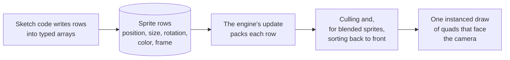

# Sprites

> Roadmap step 0.2, first released in null3D 0.1.0. The API is experimental, so it can still change between versions. Sprites do not cast or receive shadows, and overlap queries do not find them. Coding agents must not rely on either.



A sprite is a flat picture that always faces the camera, such as a particle, a marker, a tree far away or a health bar. null3D draws sprites in batches. Each sprite is a row in the batch's typed arrays, with its own position, size, rotation, color and frame of a texture atlas. Sketch code writes the rows straight into engine memory, with no call per sprite, as it does for [instance batches](../concepts/instances.md).

A batch is one draw for the GPU, whatever its size. The engine culls the sprites and sorts blended sprites back to front, as it does for instance rows. This work runs on the job workers or on the GPU. The [sprites and lines demo](https://github.com/null3d-engine/null3d/tree/main/examples/sprites-lines) draws a fountain of 2,000 sparks in one batch.

```ts
import { defineSketch } from '@null3d/engine';

export default defineSketch(async ({ scene, textures, time }) => {
  scene.setActiveCamera(scene.createPerspectiveCamera({ position: [0, 3, 10], target: [0, 1, 0] }));

  // An atlas of two frames side by side: a warm disc and a cool disc, 8 x 8 texels each.
  const texels = new Uint8Array(16 * 8 * 4);
  for (let y = 0; y < 8; y++) {
    for (let x = 0; x < 16; x++) {
      const [dx, dy] = [(x % 8) - 3.5, y - 3.5];
      const inside = dx * dx + dy * dy < 12;
      const color = x < 8 ? [255, 160, 60] : [80, 200, 255];
      texels.set([...color, inside ? 255 : 0], (y * 16 + x) * 4);
    }
  }
  const atlas = textures.fromData({ width: 16, height: 8, data: texels, colorSpace: 'srgb' });

  const puffs = await scene.createSprites({
    count: 500,
    map: atlas,
    atlas: { columns: 2, rows: 1 },
    dynamic: true,
  });
  const phase = new Float32Array(puffs.count); // your own data, one value per sprite
  const frames = puffs.frames;
  for (let i = 0; i < puffs.count; i++) {
    phase[i] = Math.random() * 10;
    frames[i] = i % 2;
  }

  return {
    onUpdate() {
      const positions = puffs.positions; // read the views in each frame
      const sizes = puffs.sizes;
      const colors = puffs.colors;
      for (let i = 0; i < puffs.count; i++) {
        const start = phase[i] ?? 0;
        const t = (time.now * 0.3 + start) % 3; // each puff rises for 3 seconds
        positions[i * 3] = Math.sin(start * 7) * 2;
        positions[i * 3 + 1] = t * 1.5;
        positions[i * 3 + 2] = Math.cos(start * 7) * 2;
        sizes[i * 2] = sizes[i * 2 + 1] = 0.3 + t * 0.4;
        colors[i * 4 + 3] = 1 - t / 3; // fade out as it rises
      }
    },
  };
});
```

## Create a batch

`scene.createSprites(options)` returns a promise of the batch. The first call downloads the sprite code, so a page without sprites never downloads it. Await the call in the setup function, as the example does. If the sprite code does not download, the promise rejects with [E1406](../errors/E1406.md).

`scene.createSprites` takes these options:

| Option | Default | What it does |
| --- | --- | --- |
| `count` | None: it is required | The number of sprites: the batch's capacity, which never changes |
| `map` | None | A color map in sRGB, whose color multiplies `color` and each sprite's color |
| `atlas` | One frame | `{ columns, rows }`: splits `map` into a grid of frames, from 1 to 2,048 on each side |
| `sizeAttenuation` | `true` | `true` gives sizes in world units. `false` gives sizes in CSS pixels, so each sprite keeps its size on screen |
| `center` | `[0.5, 0.5]` | The point of each sprite that sits at its position, as a fraction of its width and height from its bottom left corner. The sprite turns about it |
| `color` | White | A color that multiplies every sprite's color |
| `opacity` | 1 | An opacity that multiplies every sprite's alpha |
| `alphaMode` | `'blend'` | `'blend'` blends each sprite over what lies behind it. `'mask'` cuts it where its alpha falls below `alphaCutoff`. `'opaque'` ignores the alpha |
| `alphaCutoff` | 0.5 | With the `mask` mode, the alpha below which a sprite draws nothing |
| `blending` | `'normal'` | With the `blend` mode: `'normal'`, `'additive'` for glows and fire, or `'multiply'` |
| `fog` | `true` | `false` keeps the sprites out of the scene's fog |
| `depthWrite` | `true` | `false` writes no depth, so a sprite hides nothing behind it |
| `depthTest` | `true` | `false` draws the sprites in front of everything |
| `dynamic` | `false` | `true` updates and uploads every sprite in use, in every frame. A static batch updates only the sprites that you mark |
| `layers` | `1`, layer 0 | The [layers](../concepts/render-layers.md) of every sprite, as a 32-bit mask |
| `origin` | `[0, 0, 0]` | The point that every sprite's position is relative to, kept at full precision: [Batch origins](../concepts/large-worlds.md#batch-origins) |

An atlas side that is not a whole number from 1 to 2,048 throws [E1108](../errors/E1108.md). A `center` that is not two finite numbers throws [E1203](../errors/E1203.md).

`sprites.material.set({ color, opacity, alphaCutoff })` changes the look of every sprite at any time. The other options are fixed when the batch is created.

## The row arrays

| Array | Values per sprite | What each sprite holds | A new sprite holds |
| --- | --- | --- | --- |
| `positions` | 3 | Its position in the world (x, y, z), relative to the batch's `origin` | 0, 0, 0 |
| `sizes` | 2 | Its width and height | 1, 1 |
| `rotations` | 1 | Its turn on the screen, in radians, counterclockwise | 0 |
| `colors` | 4 | A linear color (r, g, b, a) | 1, 1, 1, 1 |
| `frames` | 1 | The frame of the atlas that it shows | 0 |

Sprite `i` starts at index `i * 3` in `positions`, `i * 2` in `sizes`, `i * 4` in `colors`, and `i` in `rotations` and `frames`. `frames` is a `Uint32Array`, and the other arrays are `Float32Array` views of engine memory. The rules of [instance batches](../concepts/instances.md#the-row-arrays) apply. Read the arrays from the batch each time you use them, such as at the start of `onUpdate`. A view from before the engine's memory grew can be empty.

A negative width or height mirrors the sprite. Color components from 0 to 1,024 draw, and alpha from 0 to 1. Brighter colors work with [bloom](post.md). Convert an sRGB color, such as a hex string, with `color.fromHex` from the [math helpers](math.md).

## Static and dynamic batches

A static batch, the default, updates only the sprites that you mark with `markDirty(start, count)`, as an [instance batch](../concepts/instances.md#static-and-dynamic-batches) does. A dynamic batch updates every sprite in use in every frame, and needs no marks. Use a dynamic batch for particles, and a static batch for sprites that rarely change, such as trees far away.

`setActiveCount(n)` draws only the first `n` sprites, for pools of particles. `setLayers(mask)` moves every sprite to other layers. `destroy()` removes the batch and frees its rows. After it, stop using the batch and its arrays.

## Atlases

An atlas is one texture that holds a grid of frames of the same size. Frame 0 is the top left frame of the image as it stands upright, and frames count along each row, then down. A frame past the last one counts again from frame 0. So a flipbook animation writes one number per sprite:

```ts
// In onUpdate: an explosion of 16 frames, at 24 frames per second.
const frames = blasts.frames;
for (let i = 0; i < blasts.count; i++) frames[i] = Math.floor((time.now - started[i]) * 24);
```

Leave a clear border of a few texels around each frame's picture. The texture's filter and its mip levels blend neighboring texels. So a picture that touches its frame's edge bleeds into the next frame at a distance.

## Sizes in the world and on the screen

With `sizeAttenuation: true`, the default, sizes are in world units. A sprite 1 unit wide is as wide as a box 1 unit wide at the same distance, so far sprites look smaller.

With `sizeAttenuation: false`, sizes are in CSS pixels, at every distance and on every screen. A sprite 32 pixels wide shows 32 CSS pixels wide, and the engine scales it by the device's pixel ratio. Use it for markers, icons and labels that must stay readable. The engine never culls these sprites, because their size in the world grows with their distance. So keep such batches small, or hide sprites with `setActiveCount`.

## Blending, sorting and depth

Blended sprites draw after the opaque objects, farthest first, in the same transparent pass as other blended objects. The engine sorts each sprite by the depth of its position in the camera's view. It sorts the sprites of a batch among each other and among the scene's other blended objects and rows, every frame. Sorting costs time in large batches. For particles that add light, such as sparks and fire, `blending: 'additive'` with `depthWrite: false` needs no exact order to look right.

`alphaMode: 'mask'` draws sprites opaque, cut out by their alpha, with no sorting. Use it for foliage and other sharp edged pictures.

## Clicks and raycasts

Raycasts hit a sprite where the ray crosses its quad, as three.js's `Raycaster` hits a `Sprite`. The hit's `object` is the batch, and its `instance` is the sprite. A sprite batch takes `sprites.on('click', handler)` and the other [pointer events on objects](input.md#pointer-events-on-objects), as an instance batch does. A ray hits the whole quad, also where the sprite's map is clear. [Raycasting](raycast.md#sprites-points-and-lines) has the details.

```ts
sprites.on('click', (event) => {
  const i = event.instance; // the sprite under the pointer
  sprites.colors[i * 4 + 3] = 0.3;
  sprites.markDirty(i, 1);
});
```

## Speed

A batch costs about the same per sprite as an instance batch costs per row. The engine packs each sprite into the data that it keeps for an instance row. So sprites share the culling, sorting and drawing of instance batches. One batch of 100,000 sprites draws in one draw on WebGPU and WebGL2.

Every sprite counts toward the device's limit of objects and instance rows, as an instance row does ([Instances and batching](../concepts/instances.md#limits)). Each sprite takes about 215 bytes of engine memory. Sprite batches count toward the limit of 256 instance batches.

## Compared with three.js

| three.js | null3D |
| --- | --- |
| `new THREE.Sprite(new THREE.SpriteMaterial({ map, color }))` | One row of `scene.createSprites({ count, map })`; set `colors` per sprite or `color` for all |
| `sprite.position` | `positions` |
| `sprite.scale.set(w, h, 1)` | `sizes` |
| `material.rotation` | `rotations`, per sprite |
| `material.sizeAttenuation = false` | `sizeAttenuation: false`, with sizes in CSS pixels |
| `sprite.center` | `center`, for the whole batch |
| `texture.offset` and `texture.repeat` for an atlas | `atlas` and `frames` |
| `material.transparent` (true for sprites) | `alphaMode: 'blend'`, the default |
| `material.alphaTest` | `alphaMode: 'mask'` with `alphaCutoff` |

three.js makes one object and one draw per sprite. null3D draws a whole batch in one draw. Without size attenuation, a three.js sprite's size is a fraction of the view's height that depends on the camera's field of view. A null3D sprite's size is in CSS pixels. A three.js scale of `s` shows `s × h / (2 × tan(fov / 2))` pixels on a canvas `h` CSS pixels high. Raycasts hit sprites as three.js's `Raycaster` does. Sprites face the active camera, which takes the place of `raycaster.camera`.

## API reference

[The API reference](reference/sprites.md) lists every export of this page with its type and description. The engine's doc comments make it.
