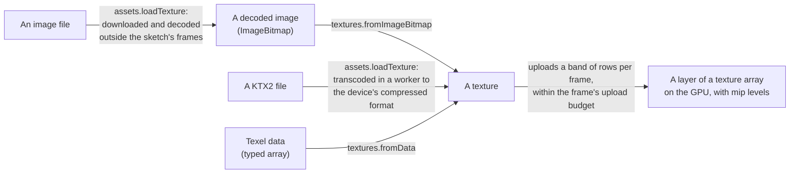

# Textures

> Ships in null3D 0.1. The API is experimental, so it can still change between versions. Maps on materials, texture backgrounds, `textures.fromPass` and cube maps are not built yet, so coding agents must not use them.



A texture is an image or a block of data on the GPU, which materials sample. A sketch makes textures in three ways:

- `assets.loadTexture(url, options)` downloads an image file or a KTX2 file and decodes it into a texture. [Assets](assets.md) covers the loading calls.
- `textures.fromImageBitmap(bitmap, options)` makes a texture from an image that is decoded already, such as a frame drawn on an `OffscreenCanvas`.
- `textures.fromData({ width, height, depth, format, data })` makes a texture from numbers, four per texel.

```ts
import { defineSketch } from '@null3d/engine';

export default defineSketch(async ({ assets, textures }) => {
  const bricks = await assets.loadTexture('/tex/bricks.png', { wrap: 'repeat', anisotropy: 8 });
  const normals = await assets.loadTexture('/tex/bricks-normal.png', { colorSpace: 'linear', wrap: 'repeat' });

  // A checkerboard of 2 x 2 texels, sharp when it is magnified.
  const dark = [40, 40, 40, 255];
  const light = [220, 220, 220, 255];
  const checker = textures.fromData({
    width: 2,
    height: 2,
    data: new Uint8Array([...dark, ...light, ...light, ...dark]),
    colorSpace: 'srgb',
    filter: 'nearest',
  });
});
```

Each call returns the texture at once. Its texels upload to the GPU in the frames that follow, and a material draws with its color alone until they are there.

## Options

Every call that makes a texture takes these options:

| Option | Values | Default |
| --- | --- | --- |
| `colorSpace` | `'srgb'` for color maps, `'linear'` for data maps | `'srgb'` for images, `'linear'` for data |
| `wrap` | `'clamp'`, `'repeat'` or `'mirror'`, or `[u, v]` for each axis | `'clamp'`, as in three.js |
| `filter` | `'linear'`, or `'nearest'` for sharp texels such as pixel art | `'linear'` |
| `mipmaps` | True to make mip levels on the GPU | True for images, false for data |
| `anisotropy` | A whole number from 1 to 16 | 1, which is off |
| `uvSet` | 0 or 1: the set of texture coordinates that materials read the texture at | 0 |

`loadTexture` also takes `flipY` and `premultipliedAlpha`, which say how the image decodes:

- `flipY: true`, the default, puts the image's top row at v = 1, the top of a plane, as three.js's `TextureLoader` does. glTF textures use `flipY: false`.
- `premultipliedAlpha: true` stores each color multiplied by its alpha, as three.js's `premultiplyAlpha` does. It is false by default.

An option that the engine does not know, such as `wrap: 'tile'` or `anisotropy: 32`, throws [E1208](../errors/E1208.md).

## KTX2 files

`assets.loadTexture` also loads KTX2 files of Basis Universal data, in ETC1S or UASTC, as `basisu` and `toktx` write them. The GPU keeps such a texture in a compressed format. It takes a quarter or an eighth of the GPU memory of `rgba8unorm`, and uploads that many fewer bytes.

```ts
const bricks = await assets.loadTexture('/tex/bricks.ktx2', { wrap: 'repeat' });
console.log(bricks.format); // 'astc-4x4-unorm' on phones and tablets, 'bc7-rgba-unorm' on most desktop GPUs
```

The engine turns the file's data into the first format on its list that the device supports:

| Data in the file | Formats, in order |
| --- | --- |
| UASTC | `astc-4x4-unorm`, `bc7-rgba-unorm`, `etc2-rgb8unorm` or `etc2-rgba8unorm`, `rgba8unorm` |
| ETC1S | `etc2-rgb8unorm` or `etc2-rgba8unorm`, `bc7-rgba-unorm`, `astc-4x4-unorm`, `rgba8unorm` |

- UASTC keeps the most detail in ASTC and BC7. ETC1S data is ETC1 data, which ETC2 takes as it is. Without alpha, ETC2 also takes half the memory of the other formats.
- Phones and tablets have ASTC and ETC2. Desktop GPUs have BC7, and Macs with Apple chips have all three. A device with none gets `rgba8unorm`.
- A texture whose width or height is not a multiple of 4 texels gets `rgba8unorm` too. WebGPU keeps compressed textures in whole blocks of 4 x 4 texels.
- `texture.format` says which format the device got, and `texture.bytes` its GPU memory.

A KTX2 file takes the texture options above, with these differences:

- The texture has the mip levels that the file holds. The GPU cannot make mip levels of compressed texels, so encode the file with them, as `basisu -mipmap` and `toktx --genmipmap` do. `mipmaps: false` keeps level 0 alone.
- The color space comes from the file, which `basisu` writes as sRGB unless you give it `-linear`. The `colorSpace` option overrides it.
- The file's first row goes to v = 0, the bottom of a plane, as with three.js's `KTX2Loader`. glTF models expect that order. For a plane, encode the file flipped, as `basisu -y_flip` does. Compressed rows cannot turn over. So in development builds, `flipY: true` throws E1208, and so does `premultipliedAlpha: true`. A production build ignores both.
- A KTX2 file of several layers makes a texture of several layers. Cube maps, 3D textures, UASTC HDR data and KTX2 files of other formats throw [E1412](../errors/E1412.md).
- `texture.update` throws E1208 on a texture from a KTX2 file. Load the file again instead.

The first KTX2 file starts the transcoder: a worker that runs the official build of Basis Universal. It downloads about 365 KB after Brotli, once. A page that loads no KTX2 file never downloads it. The worker transcodes outside the sketch's frames. A build copies the transcoder's files beside the engine's other files, and the host serves them all alike. When they do not download, the load throws [E1406](../errors/E1406.md).

## Images

`textures.fromImageBitmap` uploads an image as it is: the image's first row goes to v = 0, the bottom of a plane. To make a texture that stands upright, as three.js shows it, decode the image with its rows flipped. `assets.loadImageBitmap` does so by default. `createImageBitmap` does so with `imageOrientation: 'flipY'`:

```ts
const canvas = new OffscreenCanvas(256, 64);
const context = canvas.getContext('2d')!;
context.fillText('Score: 0', 8, 40);
const label = textures.fromImageBitmap(await createImageBitmap(canvas, { imageOrientation: 'flipY' }));
```

The image moves to the thread that draws, without a copy, so the sketch can use it no more. An image that is closed, or that went to a texture already, has no pixels, and the call throws E1208.

## Data

`textures.fromData` takes four numbers per texel, in rows from the bottom up. It stores them in one of two formats:

| Format | Data | Use |
| --- | --- | --- |
| `rgba8unorm`, the default | A `Uint8Array` or `Uint8ClampedArray` of values from 0 to 255 | Colors and data from 0 to 1. It can be `srgb` or `linear`. |
| `rgba16float` | A `Uint16Array` of half floats, or a `Float32Array`, which the engine turns into half floats | Values outside 0 to 1, such as light levels above 1. It is always `linear`, and has no mip levels. |

A texture with `depth` above 1 holds that many layers, up to 256, one after another in `data`. Its layers are a texture array of their own. Materials read its first layer.

Data of the wrong length or type for the size and format throws E1208. Data textures have no mip levels unless `mipmaps` is true, as in three.js's `DataTexture`.

## Updating and destroying

`texture.update(source)` gives a texture new texels, which upload in their turn:

- An image may have another size, and the texture then takes that size. Images fill textures of one layer in `rgba8unorm`.
- Data must fit the texture's size and format.

Until the new texels are on the GPU, materials draw with their colors alone. For a texture that changes often, such as frames of a video, keep the images small: each update decodes and uploads a whole image.

`texture.destroy()` frees the texture's GPU memory. Materials that map it draw with their colors alone, and later calls on the texture throw [E1101](../errors/E1101.md).

A texture's `width`, `height` and `depth` give its size, and `bytes` its GPU memory. Its `format`, `colorSpace` and `uvSet` say how it was made. The widest and tallest texture the device takes is `textures.maxSize`. The GPU memory of every texture array is `textures.memoryBytes`.

## Texture arrays

Textures of one size, one format and one number of mip levels share a 2D texture array on the GPU. Each texture takes one layer of the array. Materials whose maps are in one array share one bind group when they sample their maps the same way. The GPU then switches textures less often between draws.

An array holds at most 256 layers, the most that an iPad allows. It starts with room for a few textures, and doubles its layers when it is full. The GPU copies the old array into the new one, so the textures that it holds keep their texels. When a size has more than 256 textures, a second array holds the rest. A texture from data with several layers has an array of its own, with exactly its layers. So does a texture in a compressed format, because WebGPU's compatibility mode cannot copy compressed texels into a larger array.

Textures of many different sizes need many arrays. Give the textures of a scene a few common sizes where you can, such as 512 x 512 and 1024 x 1024. An update with an image of another size moves the texture to the array of that size.

A texture can be at most 4096 texels wide and tall, the most that every WebGPU device allows. On a WebGL2 device that allows less, the device's own limit applies: at least 2048 texels. `textures.maxSize` gives the limit, and a larger image throws E1208.

## From texels to GPU

An image decodes off the main thread into an `ImageBitmap`, and then moves to the thread that draws without a copy. In the default pipelined mode, that thread is the render worker. Data goes into the engine's memory, which that thread reads.

The engine spreads uploads over frames, so loading many textures does not make one frame slow. Each frame uploads no more texel bytes than the upload budget, the `uploadBytesPerFrame` setting of the [quality preset](../concepts/quality-presets.md#the-settings-of-each-preset). A large texture goes up in bands of rows, one band per frame. Textures upload in the order that they got their texels. The engine frees its copy of data once the upload is done. Texels from a KTX2 file go into the engine's memory as data does. They go up in bands of rows of blocks, each mip level in turn.

Until its texels are on the GPU, a texture draws as if the material had no map. A material then shows its base color alone.

## Mip levels

Mip levels are smaller copies of a texture. The GPU reads them where the texture covers few pixels on screen, so distant textures do not shimmer. The engine makes each texture's mip levels on the GPU, after its texels upload. Each level is the average of the level above it, in linear color. Textures in `rgba16float` have no mip levels. A texture from a KTX2 file has the mip levels of its file.

## Sampling

Each texture has its own sampler settings, from its options:

- What texture coordinates outside 0 to 1 read along each axis: the texel at the edge, a repeat of the texture, or a mirrored repeat. By default the edge texel repeats outward, as in three.js.
- The filter of magnified texels, of minified texels and between mip levels: linear or nearest. It is linear by default.
- Anisotropic filtering, which keeps a texture sharp on a surface seen at a slant, such as a floor. It reaches at most 16 samples, or the quality preset's cap (`maxAnisotropy`) when that is lower. A nearest filter turns it off. It is off by default.

## Color spaces

Color maps, such as the base color of a surface, store sRGB colors. The GPU turns their texels into linear values as it samples them, so lighting works in linear color. Data maps, such as normal, roughness and metalness maps, store linear values, which the GPU reads as they are. Choose with the `colorSpace` option. [Color management](../concepts/color-management.md) explains the engine's color spaces.

## GPU memory

A texture takes the GPU memory of its layers, with every mip level. The mip levels add a third to the image: a texture of 1024 x 1024 texels, at 4 bytes each, takes about 5.3 MiB. An `rgba16float` texel takes 8 bytes. A compressed texel takes 1 byte, or half a byte in `etc2-rgb8unorm`. The same texture from a KTX2 file then takes about 1.3 MiB or 0.7 MiB. An array also holds its free layers, so a half-full array costs as much as a full one.

## Both GPU paths

WebGPU and WebGL2 store, upload and sample textures the same way, and make the same mip levels. They draw the same images. A compressed format needs its WebGPU feature or its WebGL2 extension, which the engine asks for by name: `WEBGL_compressed_texture_astc`, `EXT_texture_compression_bptc` and `WEBGL_compressed_texture_etc`.

## When the browser takes the GPU away

The engine keeps no copy of an image or of data once its upload is done, which saves memory. When the browser takes the GPU away, the engine starts a new device and uploads the texels that it still holds. A texture whose texels it released draws without its map until the texture gets an update. A texture from a KTX2 file takes no update, so load the file again for a new texture.

## API reference

<!-- null3d:api:start -->

### `CompressedTextureFormat`

```ts
type CompressedTextureFormat =
	| 'astc-4x4-unorm'
	| 'bc7-rgba-unorm'
	| 'etc2-rgb8unorm'
	| 'etc2-rgba8unorm';
```

A compressed format, which stores blocks of 4 x 4 texels in a quarter or an eighth of the GPU memory of `rgba8unorm`. A texture from a KTX2 file takes the one that the device supports: `astc-4x4-unorm`, `bc7-rgba-unorm`, `etc2-rgb8unorm` without alpha or `etc2-rgba8unorm` with it. The names are WebGPU's, and a texture's `colorSpace` says whether sampling decodes sRGB.

### `Texture`

Class `Texture`.

A texture: an image or data on the GPU, which materials sample. Its texels upload in the frames after the call that makes it, a band of rows per frame. A material draws with its color alone until they are on the GPU.

| Member | Description |
| --- | --- |
| `readonly depth: number` | Layers: 1, or more for a texture from data with a depth. |
| `readonly format: TextureFormat \| CompressedTextureFormat` | How the texture stores its texels on the GPU. A texture from a KTX2 file has the compressed format that the device supports, or `rgba8unorm` where it supports none. |
| `readonly colorSpace: TextureColorSpace` | Whether sampling turns the texels from sRGB into linear values, or reads them as they are. |
| `readonly uvSet: 0 \| 1` | The set of texture coordinates that materials read the texture at. |
| `readonly width: number` | Texels in each row. An update with an image of another size changes it. |
| `readonly height: number` | Rows in each layer. An update with an image of another size changes it. |
| `readonly bytes: number` | The GPU bytes of the texture: its layers, with every mip level. |
| `update(source: ImageBitmap \| TextureDataArray): void` | Gives the texture new texels, which upload in their turn. An image may have another size, and the texture then takes that size; the image moves to the thread that draws, so this thread can use it no more. Data must fit the texture's size and format. Until the new texels are on the GPU, materials draw with their colors alone. A texture from a KTX2 file takes no updates, and throws E1208: load the file again. |
| `destroy(): void` | Frees the texture's GPU memory. Materials that map it draw with their colors alone. Calls on the texture after this throw E1101. |

### `TextureColorSpace`

```ts
type TextureColorSpace = 'srgb' | 'linear';
```

`srgb` for colors, which sampling turns into linear values, or `linear` for data such as normals, roughness and metalness, which sampling reads as they are.

### `TextureData`

Interface `TextureData`, which extends `TextureOptions`.

A texture's size and texels for `textures.fromData`, with its options.

| Member | Description |
| --- | --- |
| `width: number` | Texels in each row, from 1 up to `textures.maxSize`. |
| `height: number` | Rows in each layer, from 1 up to `textures.maxSize`. |
| `depth?: number` | Layers, from 1 to 256. The default is 1. |
| `format?: TextureFormat` | The default is `rgba8unorm`. |
| `data: TextureDataArray` | Four numbers per texel, in rows from the first to the last, layer after layer. The first row is at v = 0, the bottom of a plane. |

### `TextureDataArray`

```ts
type TextureDataArray = Uint8Array | Uint8ClampedArray | Uint16Array | Float32Array;
```

Texel data: bytes for `rgba8unorm`, and for `rgba16float` either half floats as 16-bit words or 32-bit floats, which the engine turns into half floats.

### `TextureFilter`

```ts
type TextureFilter = 'linear' | 'nearest';
```

How texels are read between their centers and between mip levels: blended (`linear`), or the nearest one (`nearest`), which keeps pixel art sharp.

### `TextureFormat`

```ts
type TextureFormat = 'rgba8unorm' | 'rgba16float';
```

How a texture stores its texels on the GPU: `rgba8unorm`, four 8-bit channels, or `rgba16float`, four 16-bit floats for values outside 0 to 1.

### `TextureOptions`

Interface `TextureOptions`.

How a texture stores and samples its texels. Every call that makes a texture takes them.

| Member | Description |
| --- | --- |
| `colorSpace?: TextureColorSpace` | `srgb` for color maps, such as a base color, and `linear` for data maps, such as normal, roughness, metalness and occlusion maps. The default is `srgb` for images and `linear` for data. |
| `wrap?: TextureWrap \| readonly [TextureWrap, TextureWrap]` | Along u, then v, or one value for both. The default is `clamp`, as in three.js. |
| `filter?: TextureFilter` | The filter of magnified and minified texels and between mip levels. The default is `linear`. |
| `mipmaps?: boolean` | True to make mip levels on the GPU after each upload, so the texture does not shimmer where it covers few pixels. The default is true for images and false for data. `rgba16float` textures have no mip levels. |
| `anisotropy?: number` | Samples along the direction of steepest change, a whole number from 1 to 16, which keeps a texture sharp on a surface seen at a slant. The quality preset caps it, and a `nearest` filter turns it off. The default is 1, which is off. |
| `uvSet?: 0 \| 1` | The set of texture coordinates that materials read the texture at: 0 for the first, 1 for the second, as three.js's `texture.channel`. The default is 0. |

### `Textures`

Class `Textures`.

Makes textures from decoded images and from data, and reads what the GPU holds. A sketch finds it as `ctx.textures`. `ctx.assets.loadTexture` loads and decodes image files into textures.

| Member | Description |
| --- | --- |
| `fromImageBitmap(image: ImageBitmap, options: TextureOptions = {}): Texture` | A texture from a decoded image. The image's first row goes to v = 0, the bottom of a plane. Decode images with `imageOrientation: 'flipY'`, as `assets.loadImageBitmap` does by default, so that they stand upright as three.js shows them. The image moves to the thread that draws, so this thread can use it no more. Throws E1208 for an image without pixels, one larger than `maxSize`, and options the engine does not know. |
| `fromData(texture: TextureData): Texture` | A texture from data: four numbers per texel, in rows from the bottom up, layer after layer. A texture of several layers is a texture array of its own. Throws E1208 when the data does not fit the size and format, and for options the engine does not know. |
| `readonly memoryBytes: number` | The GPU bytes that every texture holds, with the free layers of their texture arrays. It counts what the GPU holds already, so it grows as uploads finish. |
| `readonly maxSize: number` | The widest and tallest texture this device takes: 4096 texels, or less on a WebGL2 device that allows less. |

### `TextureWrap`

```ts
type TextureWrap = 'clamp' | 'repeat' | 'mirror';
```

What texture coordinates outside 0 to 1 read. `clamp` reads the texel at the edge, `repeat` repeats the texture, and `mirror` repeats it with every other copy mirrored.

<!-- null3d:api:end -->
