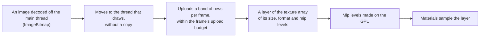

# Textures

> Ships in null3D 0.1. The API is experimental, so it can still change between versions. The calls that make textures are not built yet, so coding agents must not use them: `assets.loadTexture` with its options, `textures.fromData`, `textures.fromImageBitmap` and `textures.fromPass`. The same holds for maps on materials, compressed textures and cube maps. This page describes how the engine keeps textures on the GPU, which those calls use.

## Texture arrays

Textures of one size, one format and one number of mip levels share a 2D texture array on the GPU. Each texture takes one layer of the array. Materials whose maps are in one array share one bind group when they sample their maps the same way. The GPU then switches textures less often between draws.

An array holds at most 256 layers, the most that an iPad allows. It starts with room for a few textures, and doubles its layers when it is full. The GPU copies the old array into the new one, so the textures that it holds keep their images. When a size has more than 256 textures, a second array holds the rest.

Textures of many different sizes need many arrays. Give the textures of a scene a few common sizes where you can, such as 512 x 512 and 1024 x 1024.

A texture can be at most 4096 texels wide and tall, the most that every WebGPU device allows. On a WebGL2 device that allows less, the device's own limit applies: at least 2048 texels.

## From image to GPU

A texture's image decodes off the main thread into an `ImageBitmap`. The image then moves to the thread that draws without a copy. In the default pipelined mode, that thread is the render worker.

The engine spreads uploads over frames, so loading many textures does not make one frame slow. Each frame uploads at most 4 MiB of texels. A large image goes up in bands of rows, one band per frame. Textures upload in the order that they got their images.

Until its image is on the GPU, a texture draws as if the material had no map. A material then shows its base color alone.

## Mip levels

Mip levels are smaller copies of a texture. The GPU reads them where the texture covers few pixels on screen, so distant textures do not shimmer. The engine makes each texture's mip levels on the GPU, after its image uploads. Each level is the average of the level above it, in linear color.

## Sampling

Each texture has its own sampler settings:

- What texture coordinates outside 0 to 1 read along each axis: the texel at the edge, a repeat of the texture, or a mirrored repeat. By default the edge texel repeats outward, as in three.js.
- The filters of magnified texels, of minified texels and between mip levels: linear or nearest. All three are linear by default.
- Anisotropic filtering, which keeps a texture sharp on a surface seen at a slant, such as a floor. It reaches at most 16 samples, and a nearest filter turns it off. It is off by default.

## Color spaces

Color maps, such as the base color of a surface, store sRGB colors. The GPU turns their texels into linear values as it samples them, so lighting works in linear color. Data maps, such as normal, roughness and metalness maps, store linear values, which the GPU reads as they are. [Color management](../concepts/color-management.md) explains the engine's color spaces.

## GPU memory

A texture takes the GPU memory of its layer, with every mip level. The mip levels add a third to the image: a texture of 1024 x 1024 texels, at 4 bytes each, takes about 5.3 MiB. An array also holds its free layers, so a half-full array costs as much as a full one.

## Both GPU paths

WebGPU and WebGL2 store, upload and sample textures the same way, and make the same mip levels. They draw the same images.

## When the browser takes the GPU away

The engine keeps no copy of an image once its upload is done, which saves memory. When the browser takes the GPU away, the engine starts a new device and uploads the images that it still holds. A texture whose image it released draws without its map until the texture gets an image again.
