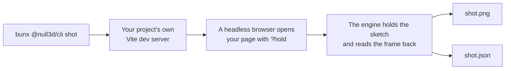

# The `null3d` command

> Ships in null3D 0.1. The API is experimental, so it can still change between versions. The commands `create`, `test`, `bench`, `assets`, `docs`, `port`, `skills`, `mcp` and `doctor` are not built yet, so coding agents must not use them.

The `@null3d/cli` package holds the `null3d` command. You need no command to build or run a sketch: Vite and the null3D Vite plugin do that. The command does jobs that a bundler does not do, such as drawing a frame of your scene with no person watching.

Run it with `bunx` in your project's folder:

```sh
bunx @null3d/cli --help            # the commands
bunx @null3d/cli shot --help       # the options of one command
bunx @null3d/cli --version
```

The command needs Node 20.19 or later, or Node 22.12 or later, as Vite 8 does.

## shot



`shot` draws one frame of your page and saves it as a PNG file. It starts your project's own Vite dev server in the current folder, with your Vite config, on a free port. Then it opens your page in a headless browser with the `?hold` switch. The engine steps the sketch to the time you give, draws that frame and reads it back ([Testing your sketch](../guides/testing.md)). Your page needs no test code.

```sh
bunx @null3d/cli shot --out shot.png --time 1.5 --size 1280x720 --gpu webgl2
```

| Option | Effect | Without it |
| --- | --- | --- |
| `--out <file.png>` | The image to write. The JSON file beside it takes its name, such as `shot.json` | `shot.png` |
| `--time <seconds>` | The sketch time of the frame, from 0 to 600 | The `hold` option of `createEngine`, or 0 |
| `--size <width>x<height>` | The browser window's size in CSS pixels. Each CSS pixel is one pixel of the image | `1280x720` |
| `--gpu <tier>` | Forces a GPU tier: `webgpu`, `compat` or `webgl2` | The engine picks the tier |
| `--page <path>` | The page to open, from the dev server's root, with any query of its own | `/` |
| `--timeout <seconds>` | How long the page may take to draw the frame | 60 |

The image has the size of your page's canvas. A canvas that fills the window gives an image of the window's size. When your page's CSS gives the canvas another size, the summary says so.

### What it prints

When the engine draws the frame, `shot` prints a short summary and exits with 0:

```text
Drew / at 1.5 s, frame 91, on webgl2: 1280 x 720 pixels.
It made 3 draw calls, uploaded 30.3 KB and built 2 pipelines.
Saved shot.png, and the frame's facts and what the page logged in shot.json.
The page logged no errors or warnings.
```

The summary lists what the page logged, with the first lines of each entry. The JSON file holds every line.

### The JSON file

| Field | What it holds |
| --- | --- |
| `ok` | `true` when the engine drew the frame and `shot` saved the image |
| `page` | The page's address, with hold mode's switches |
| `environment` | Where the frame was drawn: `chrome-real-gpu` or `chromium-swiftshader` |
| `browser` | The browser's name and version |
| `time`, `frame` | The sketch time and the frame's number: the steps to the time, plus one |
| `tier` | The GPU path that drew the frame: `webgpu`, `webgpu-compat` or `webgl2` |
| `width`, `height` | The image's size in pixels |
| `image` | The image's file name, in the JSON file's folder |
| `stats` | The frame's figures in the form that `engine.measure()` returns: CPU time by thread and phase, draw calls, uploads and pipelines. The held frame is the first frame that the engine draws, so it builds every pipeline and uploads the whole scene |
| `code`, `error` | When no frame was drawn: the error's code, or `null`, and what went wrong |
| `ms` | Time from opening the page to the engine's result, in milliseconds |
| `errors` | The page's uncaught errors and console errors, then the dev server's errors |
| `warnings` | The page's console warnings |

### When it draws no frame

When no frame is drawn, `shot` says why, saves the JSON file and exits with 1. It deletes the image of an earlier run, so an old image never passes for a new one. It stops at once in these cases:

- The engine stops the hold at the sketch's first error, such as [E1408](../errors/E1408.md), and publishes the error.
- The page logs an error and has not started the engine by the time it loads, for example because a page script threw.
- The project has no HTML file at the `--page` path. Vite would answer that address with your main page.

A page must start the engine as it loads. A page that waits for a click never starts the hold, so `shot` gives up after `--timeout` seconds.

### Where it draws

`shot` draws with Google Chrome on your computer's GPU. When the `CI` variable is set, it draws with Playwright's Chromium on SwiftShader, a GPU in software. Most CI machines have no GPU. Set `CI=1` to draw the software GPU's image on your own computer:

```sh
CI=1 bunx @null3d/cli shot --out ci-shot.png
```

The two draw the edges of objects a little differently, so keep reference images for each. When a browser is missing, `shot` prints the command that installs it.
