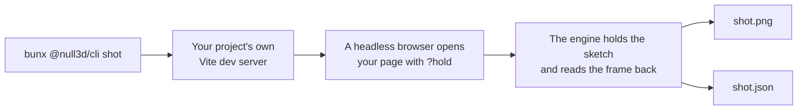
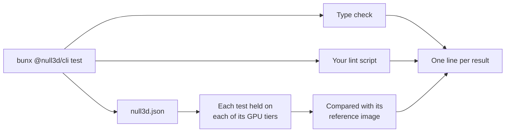
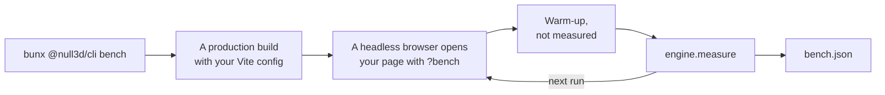

# The `null3d` command

> Ships in null3D 0.1, with `assets` from 0.2. The API is experimental, so it can still change between versions. The commands `create`, `docs`, `port`, `skills`, `mcp` and `doctor` are not built yet. Coding agents must not use them. `test` runs image tests, but no behavior tests yet.

The `@null3d/cli` package holds the `null3d` command. You need no command to build or run a sketch: Vite and the null3D Vite plugin do that. The command does jobs that a bundler does not do, such as drawing a frame of your scene with no person watching.

Run it with `bunx` in your project's folder:

```sh
bunx @null3d/cli --help            # the commands
bunx @null3d/cli shot --help       # the options of one command
bunx @null3d/cli --version
```

The command needs Node 20.19 or later, or Node 22.12 or later, as Vite 8 does.

## shot



`shot` draws one frame of your page and saves it as a PNG file. It starts your project's own Vite dev server in the current folder, with your Vite config, on a free port. Then it opens your page in a headless browser with the `?hold` switch. The engine steps the sketch to the time you give, draws that frame and reads it back ([Testing your sketch](../guides/testing.md)). Your page needs no test code.

```sh
bunx @null3d/cli shot --out shot.png --time 1.5 --size 1280x720 --gpu webgl2
```

| Option | Effect | Without it |
| --- | --- | --- |
| `--out <file.png>` | The image to write. The JSON file beside it takes its name, such as `shot.json` | `shot.png` |
| `--time <seconds>` | The sketch time of the frame, from 0 to 600 | The `hold` option of `createEngine`, or 0 |
| `--size <width>x<height>` | The browser window's size in CSS pixels. Each CSS pixel is one pixel of the image | `1280x720` |
| `--gpu <tier>` | Forces a GPU tier: `webgpu`, `compat` or `webgl2` | The engine picks the tier |
| `--page <path>` | The page to open, from the dev server's root, with any query of its own | `/` |
| `--timeout <seconds>` | How long the page may take to draw the frame | 60 |

The image has the size of your page's canvas. A canvas that fills the window gives an image of the window's size. When your page's CSS gives the canvas another size, the summary says so.

### What it prints

When the engine draws the frame, `shot` prints a short summary and exits with 0:

```text
Drew / at 1.5 s, frame 91, on webgl2: 1280 x 720 pixels.
It made 3 draw calls, uploaded 30.3 KB and built 2 pipelines.
Saved shot.png, and the frame's facts and what the page logged in shot.json.
The page logged no errors or warnings.
```

The summary lists what the page logged, with the first lines of each entry. The JSON file holds every line.

### The JSON file

| Field | What it holds |
| --- | --- |
| `ok` | `true` when the engine drew the frame and `shot` saved the image |
| `page` | The page's address, with hold mode's switches |
| `environment` | Where the frame was drawn: `chrome-real-gpu` or `chromium-swiftshader` |
| `browser` | The browser's name and version |
| `time`, `frame` | The sketch time and the frame's number: the steps to the time, plus one |
| `tier` | The GPU path that drew the frame: `webgpu`, `webgpu-compat` or `webgl2` |
| `width`, `height` | The image's size in pixels |
| `image` | The image's file name, in the JSON file's folder |
| `stats` | The frame's figures in the form that `engine.measure()` returns: CPU time by thread and phase, draw calls, uploads and pipelines. The held frame is the first frame that the engine draws, so it builds every pipeline and uploads the whole scene |
| `code`, `error` | When no frame was drawn: the error's code, or `null`, and what went wrong |
| `ms` | Time from opening the page to the engine's result, in milliseconds |
| `errors` | The page's uncaught errors and console errors, then the dev server's errors |
| `warnings` | The page's console warnings |

### When it draws no frame

When no frame is drawn, `shot` says why, saves the JSON file and exits with 1. It deletes the image of an earlier run, so an old image never passes for a new one. It stops at once in these cases:

- The engine stops the hold at the sketch's first error, such as [E1408](../errors/E1408.md), and publishes the error.
- The page logs an error and has not started the engine by the time it loads, for example because a page script threw.
- The project has no HTML file at the `--page` path. Vite would answer that address with your main page.

A page must start the engine as it loads. A page that waits for a click never starts the hold, so `shot` gives up after `--timeout` seconds.

## test



`test` checks your project, for a coding agent's test loop or for CI. It runs these checks in your project's folder:

1. The type check: `tsc --noEmit` with your project's own TypeScript, when the folder has a `tsconfig.json`. A `tsconfig.json` of project references gets `tsc --build --noEmit`.
2. Your lint script: the `lint` entry of `scripts` in your `package.json`, when it has one.
3. The image tests that `null3d.json` lists. It holds each test on each of its GPU tiers in a headless browser. Then it compares each image with its reference image.

The type check and the lint script run while the browser draws. The command prints one line for each result, and exits with 1 when a check fails.

```sh
bunx @null3d/cli test
bunx @null3d/cli test --gpu webgl2
bunx @null3d/cli test --update-references
```

| Option | Effect | Without it |
| --- | --- | --- |
| `--gpu <tiers>` | Draws only on these GPU tiers, joined by commas, such as `webgpu,webgl2` | The tiers that each test lists |
| `--update-references` | Keeps each image that has no reference, or that differs from its reference, as the new reference | Such an image fails its test |

### The list of image tests

`null3d.json` in your project's folder lists the image tests:

```json
{
  "tests": [
    { "name": "start", "sketch": "sketch.ts", "hold": 1.5 },
    { "name": "harbor-at-night", "sketch": "sketch.ts?view=harbor", "hold": 4, "size": "640x360", "tiers": ["webgpu", "webgl2"] },
    { "name": "home-page", "page": "/", "hold": 1.5 }
  ]
}
```

| Setting | What it gives | Without it |
| --- | --- | --- |
| `name` | The test's name in lowercase words joined by dashes. It names the test's image files | Required |
| `sketch` | A sketch module to draw, from your project's folder. A query after the path reaches the sketch ([Testing your sketch](../guides/testing.md#frames-that-stay-the-same-on-every-run)) | Give `sketch` or `page` |
| `page` | A page of your project to open instead, from the dev server's root | Give `sketch` or `page` |
| `hold` | The sketch time to hold at, in seconds, from 0 to 600 | Required |
| `size` | The image's width and height in pixels, such as `640x360` | `320x180` |
| `tiers` | The GPU tiers to draw on: `webgpu`, `compat` and `webgl2` | All three |

A sketch test draws your sketch module on a page that `test` serves itself. The canvas has the test's size, and the engine has its default options. A page test opens your page in a window of the test's size, as `shot` does. Use a page test when your page passes options to `createEngine` that change the image. When `null3d.json` has a mistake, `test` names each wrong setting and runs no image tests.

### References and results

Each image test compares its image with a reference image in `tests/references/<environment>/<tier>/<name>.png`. The environment is `chrome-real-gpu` or `chromium-swiftshader` ([Where the commands draw](#where-the-commands-draw)). Commit the references with your project.

Each run saves its images in `test-results/null3d/<environment>/<tier>/`: `<name>.png`, and `<name>-diff.png` when the image differs from its reference. The diff marks the pixels that differ in red. Keep `test-results/` out of git.

An image passes when at most 0.1% of its pixels differ from the reference. A pixel differs when its color moves more than 10% of the color range. Pixels on the anti-aliased edges of shapes never count. The two limits are those of three.js's own image tests.

A new test has no reference, so its first run fails and saves the image. Open the image. When it is right, run `bunx @null3d/cli test --update-references` to keep it as the reference. Do the same after a change that alters an image on purpose, and check the new references in your git diff before you commit them. With `--update-references`, an image that matches its reference leaves the reference as it is.

### What it prints

```text
PASS  type check (tsc --noEmit)
SKIP  lint: the project's package.json has no lint script
The images are drawn in Chrome 154.0.8037.59 on this computer's GPU, and compared with the references in tests/references/chrome-real-gpu.
PASS  start on webgpu: it matches the reference (image test-results/null3d/chrome-real-gpu/webgpu/start.png)
FAIL  start on webgl2: 2.280% of pixels differ from the reference, and at most 0.100% may (image test-results/null3d/chrome-real-gpu/webgl2/start.png, reference tests/references/chrome-real-gpu/webgl2/start.png, diff test-results/null3d/chrome-real-gpu/webgl2/start-diff.png)
FAIL  harbor-at-night on webgpu: there is no reference yet. When the image is right, bunx @null3d/cli test --update-references keeps it as the reference (image test-results/null3d/chrome-real-gpu/webgpu/harbor-at-night.png)
2 passed, 2 failed, 1 skipped.
```

Each line starts with the result: `PASS`, `FAIL`, `SKIP`, or `SAVED` for an image that became its reference. Then come the check, the reason and the image files. The lines under a failure show what the type check or the lint script printed, or the errors that the page logged. The last line counts the results.

An image test also fails in these cases, and its line says why:

- The hold stops at an error, such as an error in the sketch ([E1408](../errors/E1408.md)). The lines under it show the sketch's error with the place that threw.
- The page logs an error, even when the engine draws the frame.
- The engine draws on another GPU tier than the one that the test asks for.

## bench



`bench` measures the engine on your page. It builds your project for production with your Vite config, into a temporary folder, and serves the build. A production build has none of the engine's development checks, so the engine runs as your users get it. Then `bench` opens your page in a headless browser with the `?bench` switch, once for each run. Each run lets the page run for the warm-up, and then measures it with `engine.measure` ([Performance guide](../guides/performance.md#measure)). Your page needs no benchmark code.

```sh
bunx @null3d/cli bench --gpu webgpu,webgl2
```

| Option | Effect | Without it |
| --- | --- | --- |
| `--page <path>` | The page to open, from the server's root, with any query of its own | `/` |
| `--gpu <tiers>` | The GPU paths to measure, joined by commas: `webgpu`, `compat` and `webgl2` | The engine picks the path |
| `--runs <count>` | Fresh runs on each GPU path | 5 |
| `--seconds <seconds>` | How long each run measures | 30 |
| `--warmup <seconds>` | How long each run lets the page run before it measures | 5 |
| `--size <width>x<height>` | The browser window's size in CSS pixels | `1280x720` |
| `--out <file.json>` | The JSON file to write | `bench.json` |
| `--timeout <seconds>` | How long the page may take to start the engine | 60 |

With more than one GPU path, `bench` takes one run on each path in turn. A computer that slows down during the command then slows every path alike. The runs take several minutes, so `bench` prints a line after each run.

### What it prints

For each GPU path, `bench` prints the median of the runs:

```text
/ on webgpu: 5 runs of 30 s, each after 5 s of warm-up.
CPU time per frame, the median of the runs:
  the busiest thread in each frame: 0.10 ms (runs from 0.10 to 0.11 ms)
  sketch-worker: 0.05 ms, of which the sketch's update 0.02 ms
  render-worker: 0.10 ms
  16 job workers: 0.00 ms together, at most 0.00 ms on one
  all threads: 0.15 ms
GPU time per frame: 0.46 ms.
Frames per second: 60.0 presented, 60.0 finished by the GPU, on a display of 60.0 Hz.
```

- The busiest thread in each frame limits the frame rate. The runs' lowest and highest values show how much the figure varies.
- Each thread's line gives its own CPU time per frame. The sketch's update is your `onUpdate`, and the rest of that thread's time is the engine's own work.
- The engine times the GPU only on WebGPU, where the browser offers GPU timestamps. The `bench` command starts Chrome with WebGPU's developer features on, so the times are not rounded. The line says n/a on WebGL2 every time, and on WebGPU where the browser does not time the GPU.
- A headless browser draws 60 frames per second on every computer. Compare CPU time and GPU time between computers.

When a run fails, `bench` says why after the figures of its path, and exits with 1.

### The JSON file

| Field | What it holds |
| --- | --- |
| `ok` | `true` when every run measured the engine |
| `page` | The page as you gave it |
| `environment`, `browser` | Where the runs drew, as for `shot`, and the browser's version |
| `warmupSeconds`, `measureSeconds` | The warm-up and the measured time of each run |
| `paths` | One entry for each GPU path: `gpu`, the tier that `--gpu` forced or `null`; `tier`, the path that the engine drew with; `summary`, the medians and the spread of the runs; and `runs` |
| `runs` | Each run's figures from `engine.measure` in `stats`, with its GPU path and the engine's mode, or `ok: false` and the `error` that stopped it |
| `error` | What stopped `bench` before its runs, such as a production build that failed |
| `errors`, `warnings` | What the pages and the server logged, each entry once |

### Measure fairly

- Close other busy programs. Programs that use the CPU change the figures from run to run.
- Compare runs on one computer, one after another.
- Vite builds `index.html` alone, unless `build.rolldownOptions.input` in your Vite config lists more pages. For a page outside the build, `bench` says so.
- The page must start the engine as it loads. A page that waits for a click never starts the engine, so `bench` gives up after `--timeout` seconds.

## assets

`assets optimize` makes glTF models smaller and faster to load and draw. It merges equal meshes, materials and textures into one copy. It stores each mesh's vertices as 8-bit and 16-bit integers, in the order that the GPU reads them fastest. It stores each animation clip at the rate of keys that the engine keeps, so the engine copies the keys at load. It encodes each texture as a KTX2 file with every mip level. Each model becomes one `.glb` file in the output folder, with its textures in a `textures` folder beside it. It prints a budget report for each model.

```sh
bunx @null3d/cli assets optimize models/ public/models/ --lod --max-texture-size 1024
```

| Option | Effect | Without it |
| --- | --- | --- |
| `--lod` | Adds levels of detail to each mesh of 64 triangles or more, and stores each level's error | No levels |
| `--simplify <share>` | Keeps this share of each mesh's triangles, from 0 to 1, as far as `--simplify-error` allows | 1: every triangle |
| `--simplify-error <share>` | The most that `--simplify` may move a mesh's surface, as a share of the mesh's size | 0.01 |
| `--max-texture-size <pixels>` | The largest side of a texture: a power of two up to 2048 | 2048 |
| `--texture-quality <size\|high>` | `high` encodes color and data maps in UASTC instead of ETC1S | `size` |
| `--no-roughness-bake` | Leaves the roughness levels of metal-rough maps as plain averages, with no detail from the normal maps | The roughness levels of each metal-rough map whose material has a normal map take the normal map's detail, in UASTC |
| `--compression <none\|meshopt>` | `none` leaves the buffers uncompressed, without `EXT_meshopt_compression` | `meshopt` |
| `--no-blockers` | Gives no mesh a blocker for software occlusion culling | Blockers for meshes that enclose space |
| `--bvh <triangles>` | Stores the tree that raycasts walk for each mesh part of at least this many triangles, or for none with 0 | 20000 |
| `--jobs <count>` | The worker threads that encode textures | One per CPU core |
| `--report <file.json>` | Also writes the budget report as a JSON file | No file |

A mesh's glTF extras change two steps for that mesh alone. `"occluder": false` gives it no blocker. `"occluder": true` makes it block with its own triangles when no blocker fits. `"quantizePositions": false` keeps its positions as 32-bit floats. Use it for a mesh that spreads small parts over a large space, such as a city's buildings merged by material. Integer steps would move their corners by centimetres.

It exits with 1 when a model fails, after it writes the others. [The asset pipeline](../guides/assets-pipeline.md) says what each step does, and how the Vite plugin runs the same steps when a module imports a model with `?optimized`.

`assets env` makes an environment map from an equirectangular HDR image, a Radiance (`.hdr`) or OpenEXR (`.exr`) file. The output is one KTX2 file. It holds a cube map with a level for each roughness, filtered as the engine's materials reflect light. It also holds nine spherical harmonics coefficients of the diffuse light.

```sh
bunx @null3d/cli assets env hdri/venice_sunset_2k.hdr public/env/venice.ktx2 --size 512
```

| Option | Effect | Without it |
| --- | --- | --- |
| `--size <texels>` | The width of the cube map's largest faces: a power of 2 from 32 to 2048 | 256 |
| `--format <rgb9e5ufloat\|rgba16float>` | The texel format: 4 or 8 bytes per texel | `rgb9e5ufloat` |
| `--builtin room` | Writes the engine's built-in room instead of reading an image, and takes only the output file | An input file |

It exits with 1 when the input cannot be read. [The asset pipeline](../guides/assets-pipeline.md#environment-maps) says what the file holds.

`assets convert` turns a model of another format into a binary glTF file. It takes OBJ, FBX, STL and PLY files, and a `.gltf` file with its buffers and images. A Draco-compressed file gets meshopt compression instead. OBJ and FBX materials become glTF's metal-rough materials, with their textures in the file. FBX skins, blend shapes and clips come along. Units become meters, and Y points up.

```sh
bunx @null3d/cli assets convert models/hero.fbx models/hero.glb
```

| Option | Effect | Without it |
| --- | --- | --- |
| `--compression <none\|meshopt>` | `meshopt` stores vertices as integers and compresses the buffers; `none` leaves them as floats | `meshopt` for a Draco or meshopt input, else `none` |

It prints what the file holds. It adds a note for each part it left out, such as a camera or a texture file it did not find. It exits with 1 when the input cannot be read. [The asset pipeline](../guides/assets-pipeline.md#convert-other-formats) says how each format and material converts.

`assets pack-orm` packs occlusion, roughness and metalness maps into one texture, in the red, green and blue channels where glTF reads them. A `.ktx2` output is UASTC with every mip level; a `.png` output keeps the size of the largest map.

```sh
bunx @null3d/cli assets pack-orm textures/brick_orm.ktx2 --occlusion brick_ao.png --roughness brick_rough.png
```

| Option | Effect | Without it |
| --- | --- | --- |
| `--occlusion <image>` | The occlusion map, read from its red channel | White |
| `--roughness <image>` | The roughness map | White |
| `--metalness <image>` | The metalness map | Black |
| `--max-texture-size <pixels>` | The largest side of a `.ktx2` texture: a power of two up to 2048 | 2048 |

`assets normal-from-bump` makes a normal map from a height map, such as a three.js material's bump map.

```sh
bunx @null3d/cli assets normal-from-bump textures/stone_bump.png textures/stone_normal.ktx2 --scale 2
```

| Option | Effect | Without it |
| --- | --- | --- |
| `--scale <number>` | The strength of the slopes, as three.js's `bumpScale` | 1 |
| `--clamp` | The map does not tile, so the edge texels take no neighbors from the opposite edge | The map tiles |
| `--max-texture-size <pixels>` | The largest side of a `.ktx2` texture: a power of two up to 2048 | 2048 |

Both exit with 1 when an image cannot be read. [The asset pipeline](../guides/assets-pipeline.md#pack-occlusion-roughness-and-metalness) says what each makes.

## Where the commands draw

`shot`, `test` and `bench` draw with Google Chrome on your computer's GPU. When the `CI` variable is set, they draw with Playwright's Chromium on SwiftShader, a GPU in software. Most CI machines have no GPU. Set `CI=1` to draw the software GPU's images on your own computer:

```sh
CI=1 bunx @null3d/cli shot --out ci-shot.png
CI=1 bunx @null3d/cli test --update-references
```

The two draw the edges of objects a little differently, so keep reference images for each. When a browser is missing, the command prints the command that installs it.
