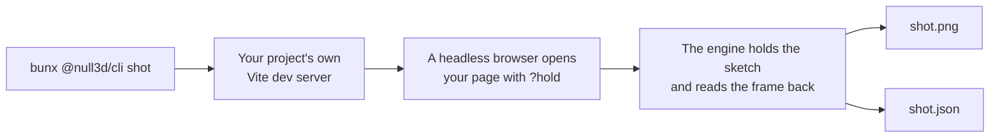
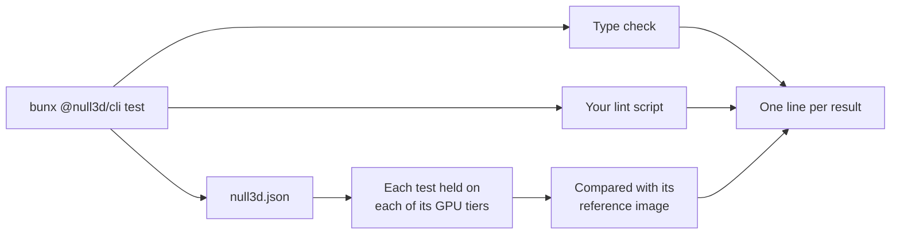

# The `null3d` command

> Ships in null3D 0.1. The API is experimental, so it can still change between versions. The commands `create`, `bench`, `assets`, `docs`, `port`, `skills`, `mcp` and `doctor` are not built yet, so coding agents must not use them. `test` runs image tests, but no behavior tests yet.

The `@null3d/cli` package holds the `null3d` command. You need no command to build or run a sketch: Vite and the null3D Vite plugin do that. The command does jobs that a bundler does not do, such as drawing a frame of your scene with no person watching.

Run it with `bunx` in your project's folder:

```sh
bunx @null3d/cli --help            # the commands
bunx @null3d/cli shot --help       # the options of one command
bunx @null3d/cli --version
```

The command needs Node 20.19 or later, or Node 22.12 or later, as Vite 8 does.

## shot



`shot` draws one frame of your page and saves it as a PNG file. It starts your project's own Vite dev server in the current folder, with your Vite config, on a free port. Then it opens your page in a headless browser with the `?hold` switch. The engine steps the sketch to the time you give, draws that frame and reads it back ([Testing your sketch](../guides/testing.md)). Your page needs no test code.

```sh
bunx @null3d/cli shot --out shot.png --time 1.5 --size 1280x720 --gpu webgl2
```

| Option | Effect | Without it |
| --- | --- | --- |
| `--out <file.png>` | The image to write. The JSON file beside it takes its name, such as `shot.json` | `shot.png` |
| `--time <seconds>` | The sketch time of the frame, from 0 to 600 | The `hold` option of `createEngine`, or 0 |
| `--size <width>x<height>` | The browser window's size in CSS pixels. Each CSS pixel is one pixel of the image | `1280x720` |
| `--gpu <tier>` | Forces a GPU tier: `webgpu`, `compat` or `webgl2` | The engine picks the tier |
| `--page <path>` | The page to open, from the dev server's root, with any query of its own | `/` |
| `--timeout <seconds>` | How long the page may take to draw the frame | 60 |

The image has the size of your page's canvas. A canvas that fills the window gives an image of the window's size. When your page's CSS gives the canvas another size, the summary says so.

### What it prints

When the engine draws the frame, `shot` prints a short summary and exits with 0:

```text
Drew / at 1.5 s, frame 91, on webgl2: 1280 x 720 pixels.
It made 3 draw calls, uploaded 30.3 KB and built 2 pipelines.
Saved shot.png, and the frame's facts and what the page logged in shot.json.
The page logged no errors or warnings.
```

The summary lists what the page logged, with the first lines of each entry. The JSON file holds every line.

### The JSON file

| Field | What it holds |
| --- | --- |
| `ok` | `true` when the engine drew the frame and `shot` saved the image |
| `page` | The page's address, with hold mode's switches |
| `environment` | Where the frame was drawn: `chrome-real-gpu` or `chromium-swiftshader` |
| `browser` | The browser's name and version |
| `time`, `frame` | The sketch time and the frame's number: the steps to the time, plus one |
| `tier` | The GPU path that drew the frame: `webgpu`, `webgpu-compat` or `webgl2` |
| `width`, `height` | The image's size in pixels |
| `image` | The image's file name, in the JSON file's folder |
| `stats` | The frame's figures in the form that `engine.measure()` returns: CPU time by thread and phase, draw calls, uploads and pipelines. The held frame is the first frame that the engine draws, so it builds every pipeline and uploads the whole scene |
| `code`, `error` | When no frame was drawn: the error's code, or `null`, and what went wrong |
| `ms` | Time from opening the page to the engine's result, in milliseconds |
| `errors` | The page's uncaught errors and console errors, then the dev server's errors |
| `warnings` | The page's console warnings |

### When it draws no frame

When no frame is drawn, `shot` says why, saves the JSON file and exits with 1. It deletes the image of an earlier run, so an old image never passes for a new one. It stops at once in these cases:

- The engine stops the hold at the sketch's first error, such as [E1408](../errors/E1408.md), and publishes the error.
- The page logs an error and has not started the engine by the time it loads, for example because a page script threw.
- The project has no HTML file at the `--page` path. Vite would answer that address with your main page.

A page must start the engine as it loads. A page that waits for a click never starts the hold, so `shot` gives up after `--timeout` seconds.

## test



`test` checks your project, for a coding agent's test loop or for CI. It runs these checks in your project's folder:

1. The type check: `tsc --noEmit` with your project's own TypeScript, when the folder has a `tsconfig.json`. A `tsconfig.json` of project references gets `tsc --build --noEmit`.
2. Your lint script: the `lint` entry of `scripts` in your `package.json`, when it has one.
3. The image tests that `null3d.json` lists. It holds each test on each of its GPU tiers in a headless browser. Then it compares each image with its reference image.

The type check and the lint script run while the browser draws. The command prints one line for each result, and exits with 1 when a check fails.

```sh
bunx @null3d/cli test
bunx @null3d/cli test --gpu webgl2
bunx @null3d/cli test --update-references
```

| Option | Effect | Without it |
| --- | --- | --- |
| `--gpu <tiers>` | Draws only on these GPU tiers, joined by commas, such as `webgpu,webgl2` | The tiers that each test lists |
| `--update-references` | Keeps each image that has no reference, or that differs from its reference, as the new reference | Such an image fails its test |

### The list of image tests

`null3d.json` in your project's folder lists the image tests:

```json
{
  "tests": [
    { "name": "start", "sketch": "sketch.ts", "hold": 1.5 },
    { "name": "harbor-at-night", "sketch": "sketch.ts?view=harbor", "hold": 4, "size": "640x360", "tiers": ["webgpu", "webgl2"] },
    { "name": "home-page", "page": "/", "hold": 1.5 }
  ]
}
```

| Setting | What it gives | Without it |
| --- | --- | --- |
| `name` | The test's name in lowercase words joined by dashes. It names the test's image files | Required |
| `sketch` | A sketch module to draw, from your project's folder. A query after the path reaches the sketch ([Testing your sketch](../guides/testing.md#frames-that-stay-the-same-on-every-run)) | Give `sketch` or `page` |
| `page` | A page of your project to open instead, from the dev server's root | Give `sketch` or `page` |
| `hold` | The sketch time to hold at, in seconds, from 0 to 600 | Required |
| `size` | The image's width and height in pixels, such as `640x360` | `320x180` |
| `tiers` | The GPU tiers to draw on: `webgpu`, `compat` and `webgl2` | All three |

A sketch test draws your sketch module on a page that `test` serves itself. The canvas has the test's size, and the engine has its default options. A page test opens your page in a window of the test's size, as `shot` does. Use a page test when your page passes options to `createEngine` that change the image. When `null3d.json` has a mistake, `test` names each wrong setting and runs no image tests.

### References and results

Each image test compares its image with a reference image in `tests/references/<environment>/<tier>/<name>.png`. The environment is `chrome-real-gpu` or `chromium-swiftshader` ([Where the commands draw](#where-the-commands-draw)). Commit the references with your project.

Each run saves its images in `test-results/null3d/<environment>/<tier>/`: `<name>.png`, and `<name>-diff.png` when the image differs from its reference. The diff marks the pixels that differ in red. Keep `test-results/` out of git.

An image passes when at most 0.1% of its pixels differ from the reference. A pixel differs when its color moves more than 10% of the color range. Pixels on the anti-aliased edges of shapes never count. The two limits are those of three.js's own image tests.

A new test has no reference, so its first run fails and saves the image. Open the image. When it is right, run `bunx @null3d/cli test --update-references` to keep it as the reference. Do the same after a change that alters an image on purpose, and check the new references in your git diff before you commit them. With `--update-references`, an image that matches its reference leaves the reference as it is.

### What it prints

```text
PASS  type check (tsc --noEmit)
SKIP  lint: the project's package.json has no lint script
The images are drawn in Chrome 154.0.8037.59 on this computer's GPU, and compared with the references in tests/references/chrome-real-gpu.
PASS  start on webgpu: it matches the reference (image test-results/null3d/chrome-real-gpu/webgpu/start.png)
FAIL  start on webgl2: 2.280% of pixels differ from the reference, and at most 0.100% may (image test-results/null3d/chrome-real-gpu/webgl2/start.png, reference tests/references/chrome-real-gpu/webgl2/start.png, diff test-results/null3d/chrome-real-gpu/webgl2/start-diff.png)
FAIL  harbor-at-night on webgpu: there is no reference yet. When the image is right, bunx @null3d/cli test --update-references keeps it as the reference (image test-results/null3d/chrome-real-gpu/webgpu/harbor-at-night.png)
2 passed, 2 failed, 1 skipped.
```

Each line starts with the result: `PASS`, `FAIL`, `SKIP`, or `SAVED` for an image that became its reference. Then come the check, the reason and the image files. The lines under a failure show what the type check or the lint script printed, or the errors that the page logged. The last line counts the results.

An image test also fails in these cases, and its line says why:

- The hold stops at an error, such as an error in the sketch ([E1408](../errors/E1408.md)). The lines under it show the sketch's error with the place that threw.
- The page logs an error, even when the engine draws the frame.
- The engine draws on another GPU tier than the one that the test asks for.

## Where the commands draw

`shot` and `test` draw with Google Chrome on your computer's GPU. When the `CI` variable is set, they draw with Playwright's Chromium on SwiftShader, a GPU in software. Most CI machines have no GPU. Set `CI=1` to draw the software GPU's images on your own computer:

```sh
CI=1 bunx @null3d/cli shot --out ci-shot.png
CI=1 bunx @null3d/cli test --update-references
```

The two draw the edges of objects a little differently, so keep reference images for each. When a browser is missing, the command prints the command that installs it.
