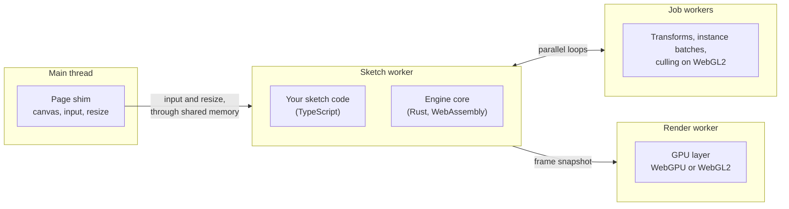

# Architecture: threads and the frame

> Ships in null3D 0.1. The API is experimental, so it can still change between versions.

In null3D, a 3D scene is called a sketch: a module that builds the scene and updates it every frame. null3D runs your sketch in a worker thread and draws from a second worker. The page's main thread keeps nothing but the page, so scrolling, input and page UI stay smooth while the sketch runs. All threads share one block of WebAssembly memory, so they pass scene data by reading the same arrays. Texture images are the exception: the sketch's thread sends each image in a message to the thread that draws.

## The four kinds of thread

| Thread | What runs there | How many |
| --- | --- | --- |
| Main thread | The page and a thin engine shim. The shim tests the browser and picks the engine build, the GPU path and the quality preset. It hands the canvas to the thread that draws, and writes input and resize events into shared memory. | 1 |
| Sketch worker | Your sketch code and the engine core. Reading or writing scene data is a plain memory access here. | 1 |
| Render worker | The GPU device and the canvas. It uploads changed data and replays draw lists into WebGPU or WebGL2 calls. It runs no sketch code. | 1 |
| Job workers | Parallel loops over scene data in Rust: transforms and bounds, instance batches, WebGL2 culling, and the normals and tangents it computes for new meshes. | Logical cores minus 2, at least 1 |

## Why the work is split this way

Sketch code runs in a worker so that it can touch scene data directly. The engine keeps positions, rotations and other fields in shared arrays, and your code reads and writes those arrays with no copy and no message.

One thread owns the GPU because browser GPU objects cannot move between workers. The parallel work therefore happens before any GPU call. The sketch worker records each frame as binary draw lists, and the render worker replays them.

The render worker runs no sketch code. A garbage-collection pause in your code cannot delay the frame on screen.

The busy loops stay inside WebAssembly. Each call from JavaScript into WebAssembly has a cost, so each step of the frame is one call that covers every object.

## One frame

In the default mode the two workers overlap. The render worker draws frame N while the sketch worker computes frame N+1.

The sketch worker, computing frame N+1:

1. Wakes when the render worker signals a new frame, and reads the new input from shared memory.
2. Runs your `onFixedUpdate` once for each fixed step that fell due, then your `onUpdate`. Your code writes transforms straight into the shared arrays and queues structural changes, such as creating, destroying and reparenting objects.
3. Applies the structural changes in one batch.
4. Runs parallel jobs: transforms by hierarchy depth, with their bounds.
5. Runs your `onLateUpdate`, then updates the objects that it moved and the objects below them.
6. Runs more parallel jobs: the instance batches.
7. Gathers the lights that shade the frame, and tests each grid cell against each view, such as the camera's. On the WebGL2 path, parallel jobs then cull the objects of the cells in view.
8. Records the frame's draw lists: the new GPU objects and the uploads first, then each pass in the order that the [render graph](render-graph.md) sets.
9. Publishes the finished frame: it stores the frame's number in one shared slot, which the render worker reads in its next frame callback.

The render worker, drawing frame N inside its own `requestAnimationFrame` callback:

1. Takes the next complete frame. The sketch worker runs at most one frame ahead, so no frame is skipped. If none is ready, it draws nothing, and the browser keeps showing the last frame. It also draws nothing while two frames are unfinished on the GPU. The sketch worker then waits too, so at most two frames wait on a GPU that falls behind.
2. Applies a canvas resize that arrives with the frame. The frame was built for that size, so the canvas and the frame's render targets always agree. A new pixel ratio, as when the window moves to another screen, resizes the canvas too.
3. Uploads the changed byte ranges to GPU buffers, and on WebGL2 to data textures. On WebGPU, uploads from 64 KiB up to 4 MiB have two routes: the direct write call, and staging buffers that the browser keeps mapped. The render worker times both on the device and takes the faster one. Chrome favors the staging buffers, and Safari the direct call. On WebGL2, uploads read straight from shared memory, or from a copy in a browser that refuses to read it. Textures upload in bands of rows, within the quality preset's budget of bytes per frame, and the GPU then makes their mip levels.
4. Replays the draw lists into WebGPU or WebGL2 calls and submits them. The browser shows the frame when the callback returns.

The thread that draws builds GPU pipelines in the background. The first frame waits until its pipelines are built. After that, an object whose pipeline is still building draws nothing until the build ends. `scene.warmUp()` waits for the builds ([Loading screens and warm-up](../guides/loading-screens.md)).

The engine times each step of the sketch worker's frame, the replay on the drawing thread, and each job worker's busy time. The [performance guide](../guides/performance.md) shows how to read those figures.

## The passes of a frame

A frame's draw list holds a series of passes, and the [render graph](render-graph.md) puts them in order. A pass is one job for the GPU, such as drawing the scene from the camera. In this version the engine declares every pass itself:

- On WebGPU, a culling pass comes first. This compute pass tests the objects and instance rows against the camera's view, on the GPU. In a scene over several grid cells, it skips the still objects of the cells out of view ([Culling](culling.md)).
- The opaque pass draws the objects in view into multisampled color and depth. Its render pass resolves the color straight into the canvas.
- In development builds, a frame with [debug drawing](../api/debug.md) draws the lines after the opaque pass, in the same render pass.

On WebGL2 the job workers cull before the frame records, so the frame has no culling pass there. The graph works out the order only when the passes change, so a frame whose passes stay the same pays nothing for it.

## Precision far from the origin

Positions are 32-bit floats, as in three.js. Far from the origin such a value moves in coarse steps: about 8 mm at 100 km. The engine therefore keeps each world matrix relative to the center of a grid cell, 1,024 m wide. A root object takes the cell that holds its position, and its children take their root's cell. An instance row takes the cell that holds its own position.

Each frame, the engine computes the offset from the camera to each cell in use, in 64-bit floats. The GPU adds those offsets, so it draws positions relative to the camera, which stay precise near it. Static matrices stay on the GPU while the camera moves. [Culling](culling.md) describes the cells and their limits.

## Latency modes

| Mode | The render step runs on | Added latency | Best for |
| --- | --- | --- | --- |
| Pipelined | The render worker, one frame behind | 1 frame | Most sketches: the sketch's work and the GPU's work overlap, which gives the highest frame rate |
| Low latency | The sketch worker, right after the update | None | Sketches where input must show one frame sooner, when the frame budget has room for the drawing too |
| Single-threaded | One thread, in sequence | None | Pages without cross-origin isolation |

Pipelined is the default when the page can use threads, and single-threaded otherwise. On a page that can use threads, `createEngine({ latency: 'low' })` asks for low latency.

Low latency costs frame rate where the GPU is busy. In the S1 benchmark on an iPad Pro with WebGPU, it showed about a third fewer frames than pipelined mode. The GPU's work then overlaps less with the sketch's. With WebGL2 on the same iPad, both modes showed the same frame rate.

In pipelined mode, the render worker takes a new frame only at a display refresh. A frame that takes a little longer than one refresh waits for the next one. So on a 60 Hz display, frames that take just over 16.7 ms show at 30 frames per second. The [performance guide](../guides/performance.md#the-frame-budget) shows what this costs on a phone.

## Where the sketch runs

The engine puts the sketch, the drawing and the parallel work on threads by the page's mode:

| Mode | Your sketch and the engine core | Drawing | Parallel loops |
| --- | --- | --- | --- |
| Pipelined, the default | The sketch worker | The render worker | The job workers and the sketch worker |
| Low latency | The sketch worker | The sketch worker | The job workers and the sketch worker |
| Pipelined, where a worker cannot draw | The sketch worker | The page's main thread | The job workers and the sketch worker |
| Single-threaded | The page's main thread | The page's main thread | The page's main thread |
| Pipelined, with `sketchThread: 'main'` | The page's main thread | The render worker | The job workers and the page's main thread |
| Low latency, with `sketchThread: 'main'` | The page's main thread | The page's main thread | The job workers and the page's main thread |

A worker can draw only where the browser gives it a WebGPU or WebGL2 context for a canvas that the page hands over. The engine tests this at startup. Where a worker cannot draw, the page draws, and the sketch stays on its thread, in pipelined mode. Low latency with the sketch in its worker needs that worker to draw, so there the engine runs in pipelined mode instead. A development build logs a warning, and `engine.mode.latency` is `pipelined`. Read `engine.mode` for the build, the latency mode, the thread that runs the sketch, the thread that draws and the number of job workers.

`createEngine({ sketchThread: 'main' })` runs your sketch code and the engine core on the page's main thread, in the threaded build. Your sketch can then reach the DOM. Use it for apps that work mostly with the DOM, for a three.js port whose scene code still uses the DOM, and for debugging. The API stays the same. Your sketch's frames share the main thread with the page. Layout work and page scripts can delay a frame, and a slow frame delays the page's input. With the `?render=main` switch, the page draws too, as in low-latency mode, and `engine.mode.latency` is `low`. The page runs the sketch of one engine at a time. A second engine that asks for the main thread before the first has stopped fails with [E1415](../errors/E1415.md).

Worker threads need shared memory, and browsers allow shared memory only on cross-origin isolated pages. On any other page, the engine loads its single-threaded build, which runs the same code on one thread. [Hosting and cross-origin isolation](../getting-started/hosting.md) shows how to send the two headers that turn isolation on. The page switches `?threads=off`, `?render=main` and `?sketch-thread=main` force the other modes on one device, for tests ([Testing your sketch](../guides/testing.md)).

## Rules the engine keeps

- The render worker never waits for the sketch worker. Work that needs the GPU's answer, such as `engine.capture()`, returns its result through a promise.
- No worker makes a blocking call to the main thread. Messages to the page never wait for a reply.
- Each frame's data has two copies. The sketch worker writes one while the render worker reads the other, so neither waits on a lock.
- Each parallel loop splits into chunks, and a worker that finishes early claims the next chunk. A phone's slower cores then take fewer chunks, so they hold up the frame less.
- A hidden tab pauses the frames, because the browser stops `requestAnimationFrame` there. The job workers then sleep.

## The engine's lifetime

`createEngine` starts the threads, loads the core and runs the sketch's setup. `destroy` stops them all. A single-page app that leaves the view with the canvas, and comes back later, needs neither.

`engine.detach()` takes the canvas off the page and pauses the engine. The engine keeps its threads, its GPU resources and the scene, and stops reading input. Later, `engine.attach(element)` puts the canvas at the end of an element and resumes, with no new start.

Every handler call, such as `engine.onSketchMessage`, returns a function that removes the handler. A component that mounts again removes its old handler and adds a new one.

A kept engine holds its memory and GPU buffers. Destroy it once the app is unlikely to show the view again.

## Related pages

- [Handles and objects](handles.md): how your code names scene objects.
- [Static and dynamic objects](static-dynamic.md): which objects the engine recomputes each frame.
- [GPU tiers and backends](backends.md): what the render worker draws with.
