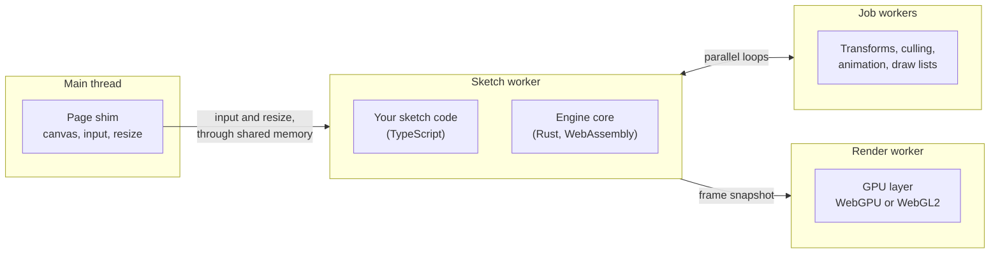

# Architecture: threads and the frame

> Planned for null3D 0.1. No release has these APIs yet, so coding agents must not use them.

In null3D, a 3D scene is called a sketch: a module that builds the scene and updates it every frame. null3D runs your sketch in a worker thread and draws from a second worker. The page's main thread keeps nothing but the page, so scrolling, input and page UI stay smooth while the sketch runs. All threads share one block of WebAssembly memory, so they pass scene data by reading the same arrays.

## The four kinds of thread

| Thread | What runs there | How many |
| --- | --- | --- |
| Main thread | The page and a thin engine shim. The shim picks the engine build, hands the canvas to the render worker, and writes input and resize events into shared memory. | 1 |
| Sketch worker | Your sketch code and the engine core. Reading or writing scene data is a plain memory access here. | 1 |
| Render worker | The GPU device and the canvas. It uploads changed data and replays draw lists into WebGPU or WebGL2 calls. It runs no sketch code. | 1 |
| Job workers | Parallel loops over scene data in Rust: transforms, culling, animation and draw-list recording, plus asset decoding. | Logical cores minus 2, at least 1 |

## Why the work is split this way

Sketch code runs in a worker so that it can touch scene data directly. The engine keeps positions, rotations and other fields in shared arrays, and your code reads and writes those arrays with no copy and no message.

One thread owns the GPU because browser GPU objects cannot move between workers. The parallel work therefore happens before any GPU call: job workers write binary draw lists, and the render worker replays them.

The render worker runs no sketch code. A garbage-collection pause in your code cannot delay the frame on screen.

The busy loops stay inside WebAssembly. Each call from JavaScript into WebAssembly has a cost, so the API crosses into WebAssembly once per batch of work.

## One frame

In the default mode the two workers overlap. The render worker draws frame N while the sketch worker computes frame N+1.

The sketch worker, computing frame N+1:

1. Wakes when the render worker signals a new frame, and reads the new input from shared memory.
2. Runs your `onUpdate`. Your code writes transforms straight into the shared arrays and queues structural changes, such as creating, destroying and reparenting objects.
3. Applies the structural changes in one batch.
4. Runs parallel jobs: animation, transforms by hierarchy depth, bounds and level of detail. On the WebGL2 path the jobs also cull each view, such as the camera's.
5. Records the frame's draw lists: the uploads first, then each pass in the order that the [render graph](render-graph.md) sets.
6. Publishes the finished frame by flipping one shared index, then signals the render worker.

The render worker, drawing frame N inside its own `requestAnimationFrame` callback:

1. Takes the next complete frame. The sketch worker runs at most one frame ahead, so no frame is skipped. If none is ready, it draws nothing, and the browser keeps showing the last frame.
2. Applies a canvas resize that arrives with the frame. The frame was built for that size, so the canvas and the frame's render targets always agree. A new pixel ratio, as when the window moves to another screen, resizes the canvas too.
3. Uploads the changed byte ranges to GPU buffers, and on WebGL2 to data textures. On WebGPU, uploads from 64 KiB up to 4 MiB have two routes: the direct write call, and staging buffers that the browser keeps mapped. The render worker times both on the device and takes the faster one. Chrome favors the staging buffers, and Safari the direct call. On WebGL2, uploads read straight from shared memory, or from a copy in a browser that refuses to read it.
4. Replays the draw lists into WebGPU or WebGL2 calls and submits them. The browser shows the frame when the callback returns.

The engine times each step on every thread, job workers included. The [performance guide](../guides/performance.md) shows how to read those figures.

## Precision far from the origin

Positions are 32-bit floats, as in three.js. Far from the origin such a value moves in coarse steps: about 8 mm at 100 km. The engine therefore keeps each world matrix relative to the center of a grid cell, 1,024 m wide. Each frame the engine computes the offset from the camera to each cell in use, in 64-bit floats. The GPU adds those offsets, so it draws positions relative to the camera, which stay precise near it. Static matrices stay on the GPU while the camera moves. [Culling](culling.md) describes the cells.

## Latency modes

| Mode | The render step runs on | Added latency | Best for |
| --- | --- | --- | --- |
| Pipelined | The render worker, one frame behind | 1 frame | Most sketches: the highest throughput and the steadiest frame pacing |
| Low latency | The sketch worker, in the same frame | None | Sketches where input delay matters most, such as fast sketches, when the frame budget allows |
| Single-threaded | One thread, in sequence | None | Pages without cross-origin isolation, and older iPhones |

Pipelined is the default when the page can use threads, and single-threaded otherwise. You pick a mode with `createEngine({ latency })`.

## Rules the engine keeps

- No thread waits for another on the critical path. Work that needs the GPU's answer, such as pixel-exact picking, returns its result in a later frame through a promise.
- No worker makes a blocking call to the main thread. Messages to the page never wait for a reply.
- Each frame's data has two copies. The sketch worker writes one while the render worker reads the other, so neither waits on a lock.
- Frame work comes before background work such as asset decoding. A worker that finishes early takes the remaining chunks from the others, so a phone's slower cores never hold up a frame.
- A hidden tab pauses the frames, because the browser stops `requestAnimationFrame` there. The job workers then sleep.

## Sketch code on the main thread

`createEngine({ sketchThread: 'main' })` runs your sketch code on the page's main thread. Use it for apps that work mostly with the DOM, and for debugging. The API stays the same.

## Without cross-origin isolation

Worker threads need shared memory, and browsers allow shared memory only on cross-origin isolated pages. On any other page the engine loads its single-threaded build, which runs the same code on one thread. [Hosting and cross-origin isolation](../getting-started/hosting.md) shows how to send the two headers that turn isolation on.

## The engine's lifetime

`createEngine` starts the threads, loads the core and runs the sketch's setup. `destroy` stops them all. A single-page app that leaves the view with the canvas, and comes back later, needs neither.

`engine.detach()` takes the canvas off the page and pauses the engine. The engine keeps its threads, its GPU resources and the scene, and stops reading input. Later, `engine.attach(element)` puts the canvas at the end of an element and resumes, with no new start.

Every handler call, such as `engine.onSketchMessage`, returns a function that removes the handler. A component that mounts again removes its old handler and adds a new one.

A kept engine holds its memory and GPU buffers. Destroy it once the app is unlikely to show the view again.

## Related pages

- [Handles and objects](handles.md): how your code names scene objects.
- [Static and dynamic objects](static-dynamic.md): which objects the engine recomputes each frame.
- [GPU tiers and backends](backends.md): what the render worker draws with.
