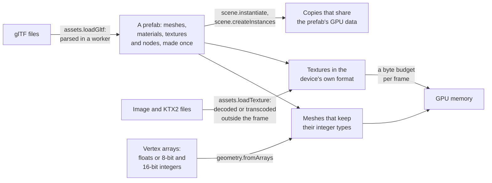

# Assets and prefabs

> Ships in null3D 0.2. The API is experimental, so it can still change between versions. Models, prefabs, meshopt compression, textures, KTX2 files, integer vertex types and the upload budget are built. The skins and clips of glTF files load and animate. Not built yet: Draco compression, morph targets, and the texture memory budget. Coding agents must not use them.



Assets are the models, textures and meshes that a scene draws. A glTF model loads into a prefab, a template whose meshes, materials and textures exist once on the GPU. Each copy of the model creates only its objects, and draws with the prefab's data. Files download and decode outside the sketch's frames. A texture from a KTX2 file stays compressed in the format that the device supports. A mesh keeps its vertex data in the types that it came in, so integer data stays half or a quarter the size of floats. Texture uploads share a byte budget per frame, so a scene that loads many textures does not make one frame slow.

## Models and prefabs

`assets.loadGltf` loads a glTF 2.0 model. A worker parses the file outside the sketch's frames, so a large model never stalls a frame. The loader then makes each mesh, material and texture of the file once, and returns a prefab. Then `scene.instantiate(prefab)` creates the model's objects under one new group, with one batch of queued changes. Each copy shares the prefab's GPU data, so ten copies of a model add only their own objects.

```ts
// sketch.ts
const ship = await assets.loadGltf('/models/ship.glb');
const first = scene.instantiate(ship, { position: [0, 0, 0] });
const second = scene.instantiate(ship, { position: [8, 0, 0] });
const many = scene.createInstances(ship, 200); // one row places a whole ship
```

For hundreds or thousands of copies, `scene.createInstances(prefab, count)` draws them with instance batches instead of objects, one batch for each mesh of the model. The batches share their rows, so one write to a row moves every part of that copy. [Scene](../api/scene.md#models-and-copies) covers the three ways to copy, and [Assets](../api/assets.md#gltf-models) lists what each part of a file becomes.

Before you publish a model, run it through `bunx @null3d/cli assets optimize`. The command stores its meshes as integers compressed with meshopt, and its textures as KTX2 files. The model then downloads less and takes less GPU memory. [The asset pipeline](../guides/assets-pipeline.md) covers it.

The loader reads `.glb` files, and `.gltf` files with the files they name. It reads these extensions: `KHR_mesh_quantization`, `KHR_meshopt_compression`, `EXT_meshopt_compression`, `KHR_texture_basisu`, `EXT_texture_webp`, `EXT_texture_avif`, `KHR_texture_transform`, `KHR_materials_unlit`, `KHR_materials_emissive_strength`, `KHR_materials_specular`, `KHR_materials_ior`, `KHR_lights_punctual` and `EXT_mesh_gpu_instancing`. A file that requires another extension fails with E1417. The loader leaves out other extensions that a file only uses, and the model draws without them.

### Compressed meshes

meshopt compression makes a model's vertex and index data several times smaller to download. The loader decodes it in its worker with meshoptimizer's own decoder, so the meshes match what any other meshopt decoder reads from the file. The decoder is about 6 KB after Brotli. It downloads with the first file that holds meshopt data, so a page without such files does not download it. It runs as WebAssembly, with SIMD instructions where the browser has them.

```ts
// sketch.ts: the same call loads a compressed model
const city = await assets.loadGltf('/models/city-meshopt.glb');
scene.instantiate(city);
```

The loader reads both names of the extension: `KHR_meshopt_compression`, and the older `EXT_meshopt_compression`. A file can carry a fallback buffer with the uncompressed data, for loaders without a decoder. The engine never downloads that buffer, because it always decodes. A file whose compressed data breaks the extension's rules, or does not decode, fails with E1416.

## Textures

`assets.loadTexture` loads PNG, JPEG, WebP and AVIF images, and KTX2 files of Basis Universal data. The browser decodes images off the main thread. Every browser that runs null3D decodes WebP and AVIF, so the engine ships no decoder for them. An image that does not decode fails with E1412. A worker transcodes KTX2 data into the compressed format that the device supports. The GPU then keeps it at a quarter or an eighth of the memory of plain RGBA. The transcoder downloads when the first KTX2 file loads, so a page without KTX2 files does not download it.

A KTX2 file of UASTC HDR data holds colors brighter than white, such as a sky or a lamp. It becomes BC6H on a device with BC formats, at one byte per texel. Other devices, such as phones, get `rgb9e5ufloat`: shared-exponent floats at four bytes per texel, half the memory of `rgba16float`, which every device filters. Its values are linear, so use it for emissive maps and unlit materials, with tone mapping on.

A glTF texture takes the first image it has of these: `KHR_texture_basisu`'s KTX2 image, `EXT_texture_webp`'s WebP image, `EXT_texture_avif`'s AVIF image, its own image. Its own image is a fallback for loaders without the extensions, so the engine does not download or decode it.

```ts
// sketch.ts
const bricks = await assets.loadTexture('/tex/bricks.ktx2', { wrap: 'repeat' });
scene.createMesh({ mesh: geometry.box(), material: materials.standard({ map: bricks }) });
```

[Textures](../api/textures.md) lists the formats that each kind of KTX2 data becomes on each device.

## Meshes and vertex data

A mesh's vertex attributes can be 32-bit floats, or the 8-bit and 16-bit integers that glTF's `KHR_mesh_quantization` extension allows. Integer positions, normals and texture coordinates take less memory and upload faster. The GPU reads them back as floats in the shader, so the materials do not change.

```ts
// sketch.ts: positions as 16-bit integers from 0 to 1,000, and normals as 8-bit integers
const tile = geometry.fromArrays({
  positions: new Uint16Array([0, 0, 0, 1000, 0, 0, 1000, 1000, 0, 0, 1000, 0]),
  normals: new Int8Array([0, 0, 127, 0, 0, 127, 0, 0, 127, 0, 0, 127]),
  indices: [0, 1, 2, 0, 2, 3],
});
scene.createMesh({ mesh: tile, material: materials.standard(), scale: [0.001, 0.001, 0.001] });
```

Integer positions keep their own units. The object's transform turns them into meters, as a glTF node's transform does for a quantized mesh. So the bounds that culling tests are in meters, and the scene draws as the file intends. [Geometry](../api/geometry.md#integer-attributes) lists the types that each attribute takes.

Meshes whose attributes have the same types share GPU buffers, and they draw with few changes of GPU state. Keep the meshes of a scene in few such formats.

## Limits on each file

A model or texture file can come from a user, or be broken. So the loaders check every count in a file before they allocate memory for it. A file that passes a limit fails at once with its error code. It never holds a worker for minutes, and it never fills the tab's memory.

| What | Limit | Error |
| --- | --- | --- |
| One array of a model: an accessor, decoded meshopt data, or the triangles of a strip or a fan | 256 MiB, the largest buffer that every WebGPU device takes | E1416 |
| All the arrays and images that one model file decodes to | 64 MiB, plus 32 bytes for each byte of the file and its buffers, up to 1 GiB | E1416 |
| One animation clip | 4,194,304 keys, its frames times its tracks, at the clip's key rate | E1416 from `loadGltf`, E1218 elsewhere |
| A mesh that the engine builds from a file or from arrays | What engine memory holds. The call fails, and the engine runs on | E1109 |
| The sides of a KTX2 texture | `textures.maxSize`, checked before the transcoder runs | E1412 |
| The layers of a KTX2 texture, and its texels | 256 layers, and 256 MiB of texels in the format that the device gets | E1412 |
| The sides of a PNG, JPEG, WebP or AVIF image inside a model, from its header before it decodes | 4,096, the largest texture of the engine | E1416 |
| The pixels of every image that a model's materials decode | 1 GiB in all, 4 bytes per pixel | E1416 |
| The sides of an image that `loadTexture` decodes, or that a model names by address | `textures.maxSize`, from the header before it decodes | E1412 |
| The sides of an image that `loadImageBitmap` decodes | 16,384, the largest canvas of browsers | E1412 |

The model limit grows with the file, because compressed data decodes to several times its size. The sample models decode to at most 3 times their bytes, so a real model stays far below the limit. A model that does pass it is broken, or holds more than a scene can draw. Split it into several files.

A primitive that names an accessor another primitive also names shares that accessor's arrays. So a file pays once for data that it uses many times.

## Uploads and memory

Each frame sends at most the preset's texture upload budget to the GPU: 2 MiB on Low, up to 16 MiB on Ultra. A larger texture goes up over several frames, and the engine then makes its mip levels on the GPU. A mesh goes up whole in the frame after the call that makes it. [Quality presets](quality-presets.md) lists the budget of each preset, and `quality.set({ uploadBytesPerFrame })` changes it.

Each texture reports its GPU memory in `memoryBytes`. The engine counts this memory, but it does not hold textures to a budget yet.

## From three.js

| three.js | null3D |
| --- | --- |
| `TextureLoader`, and `KTX2Loader` with its transcoder path | `assets.loadTexture(url)` for both. The engine ships the transcoder |
| A `BufferAttribute` of an `Int16Array` with `normalized: true` | `{ array: new Int16Array(values), normalized: true }` in `geometry.fromArrays` |
| `new GLTFLoader().loadAsync(url)`, then `scene.add(gltf.scene)` | `const prefab = await assets.loadGltf(url)`, then `scene.instantiate(prefab)` |
| `gltf.scene.clone()` or `SkeletonUtils.clone` for each copy | `scene.instantiate(prefab)` for each copy, which shares the GPU data |
| `GLTFLoader` with `KTX2Loader` and its transcoder path | `assets.loadGltf(url)`. The engine ships the transcoder |
| `GLTFLoader` with a model whose textures use `EXT_texture_webp` or `EXT_texture_avif` | `assets.loadGltf(url)`. The browser decodes both formats |
| `KTX2Loader` with a UASTC HDR file | `assets.loadTexture(url)`, which gives BC6H or `rgb9e5ufloat` |
| `GLTFLoader` with `setMeshoptDecoder(MeshoptDecoder)` | `assets.loadGltf(url)`. The engine ships the decoder, and downloads it with the first compressed file |
| `GLTFLoader` with a quantized mesh | `assets.loadGltf(url)`. A glTF node's transform becomes the object's transform, so the integers stay on the GPU |
| An `InstancedMesh` for each mesh of a model, kept in step by hand | `scene.createInstances(prefab, count)`: one set of rows for all the model's meshes |
