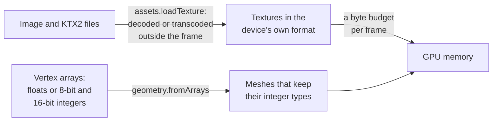

# Assets and prefabs

> Ships in null3D 0.2. The API is experimental, so it can still change between versions. Textures, KTX2 files, meshes with integer attributes and the upload budget are built. Not built yet: glTF models (`assets.loadGltf`), meshopt compression, prefabs, `scene.instantiate`, and the texture memory budget. Coding agents must not use them.



Assets are the textures and meshes that a scene draws. Files download and decode outside the sketch's frames. A texture from a KTX2 file stays compressed in the format that the device supports. A mesh keeps its vertex data in the types that it came in, so integer data stays half or a quarter the size of floats. Texture uploads share a byte budget per frame, so a scene that loads many textures does not make one frame slow.

## Textures

`assets.loadTexture` loads PNG, JPEG and WebP images, AVIF images where the browser decodes them, and KTX2 files of Basis Universal data. The browser decodes images off the main thread. A worker transcodes KTX2 data into the compressed format that the device supports. The GPU then keeps it at a quarter or an eighth of the memory of plain RGBA. The transcoder downloads when the first KTX2 file loads, so a page without KTX2 files does not download it.

```ts
// sketch.ts
const bricks = await assets.loadTexture('/tex/bricks.ktx2', { wrap: 'repeat' });
scene.createMesh({ mesh: geometry.box(), material: materials.standard({ map: bricks }) });
```

[Textures](../api/textures.md) lists the formats that each kind of KTX2 data becomes on each device.

## Meshes and vertex data

A mesh's vertex attributes can be 32-bit floats, or the 8-bit and 16-bit integers that glTF's `KHR_mesh_quantization` extension allows. Integer positions, normals and texture coordinates take less memory and upload faster. The GPU reads them back as floats in the shader, so the materials do not change.

```ts
// sketch.ts: positions as 16-bit integers from 0 to 1,000, and normals as 8-bit integers
const tile = geometry.fromArrays({
  positions: new Uint16Array([0, 0, 0, 1000, 0, 0, 1000, 1000, 0, 0, 1000, 0]),
  normals: new Int8Array([0, 0, 127, 0, 0, 127, 0, 0, 127, 0, 0, 127]),
  indices: [0, 1, 2, 0, 2, 3],
});
scene.createMesh({ mesh: tile, material: materials.standard(), scale: [0.001, 0.001, 0.001] });
```

Integer positions keep their own units. The object's transform turns them into meters, as a glTF node's transform does for a quantized mesh. So the bounds that culling tests are in meters, and the scene draws as the file intends. [Geometry](../api/geometry.md#integer-attributes) lists the types that each attribute takes.

Meshes whose attributes have the same types share GPU buffers, and they draw with few changes of GPU state. Keep the meshes of a scene in few such formats.

## Uploads and memory

Each frame sends at most the preset's texture upload budget to the GPU: 2 MiB on Low, up to 16 MiB on Ultra. A larger texture goes up over several frames, and the engine then makes its mip levels on the GPU. A mesh goes up whole in the frame after the call that makes it. [Quality presets](quality-presets.md) lists the budget of each preset, and `quality.set({ uploadBytesPerFrame })` changes it.

Each texture reports its GPU memory in `memoryBytes`. The engine counts this memory, but it does not hold textures to a budget yet.

## From three.js

| three.js | null3D |
| --- | --- |
| `TextureLoader`, and `KTX2Loader` with its transcoder path | `assets.loadTexture(url)` for both. The engine ships the transcoder |
| A `BufferAttribute` of an `Int16Array` with `normalized: true` | `{ array: new Int16Array(values), normalized: true }` in `geometry.fromArrays` |
| `GLTFLoader` with a quantized mesh | Not built yet. A glTF node's transform becomes the object's transform |
