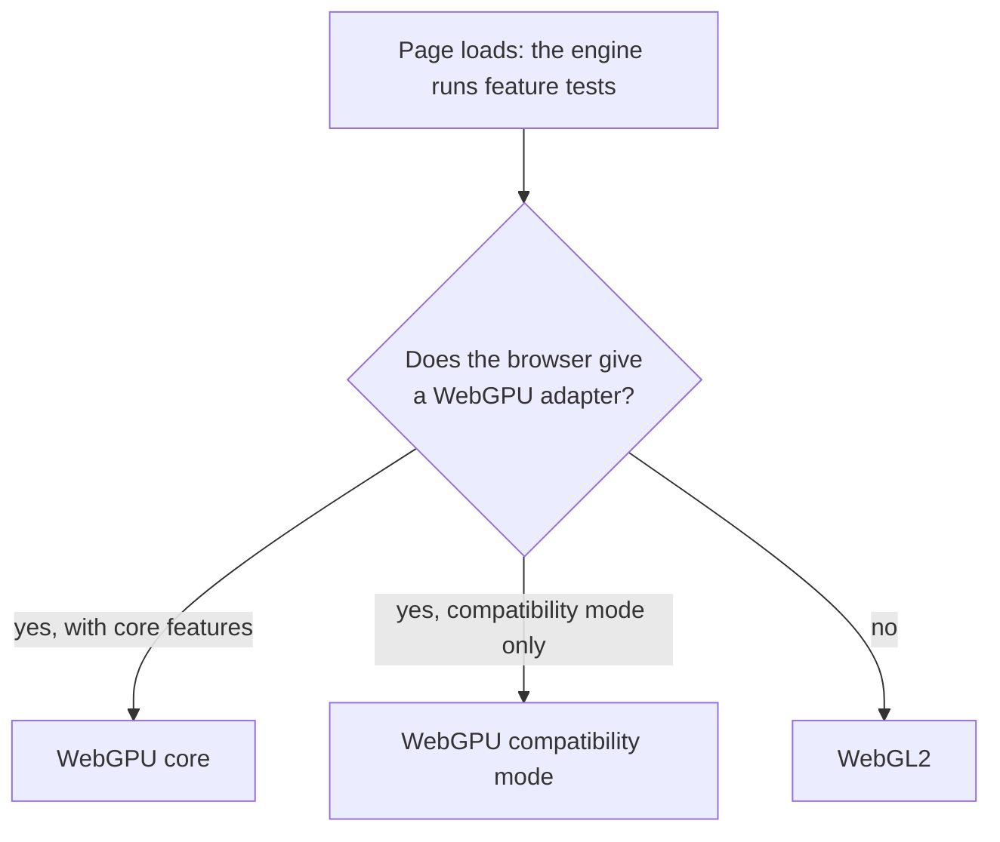

# GPU tiers and backends

> Ships in null3D 0.1. The API is experimental, so it can still change between versions.



null3D draws with WebGPU where the browser offers it, and with WebGL2 everywhere else. The same sketch code runs on both, with no backend checks in it. The engine picks the tier once, at startup, from feature tests. It tests the thread that will draw: where a worker draws, the engine picks the best tier that the worker can use. Where no worker can draw, the page draws in pipelined mode, even when the page asks for low latency ([Architecture](architecture.md#where-the-sketch-runs)). After two starts in a row that crashed the tab on WebGPU, the engine starts on WebGL2. A page that names a GPU path keeps it ([Quality presets](quality-presets.md#starts-that-crashed-the-tab)).

## The three tiers

| Tier | Where it runs | What it gives | Main limits |
| --- | --- | --- | --- |
| WebGPU core | Chrome and Edge 113+ on Windows, macOS and ChromeOS; Chrome 121+ on Android 12+ with ARM, Qualcomm or Intel GPUs; Safari 26 on macOS, iOS and iPadOS; Firefox 141+ on Windows and 147+ on Apple silicon Macs | Compute shaders, indirect draws, render bundles, storage buffers | Optional features differ from device to device |
| WebGPU compatibility mode | Chrome 146+ on devices that have only OpenGL ES 3.1 or Direct3D 11 | Compute shaders and indirect draws on older GPUs | About 45% of these devices allow no storage buffers in vertex shaders; 16-bit float targets cannot use MSAA; uniform bindings stop at 16 KB |
| WebGL2 | Every other supported browser: iPhones and iPads on iOS and iPadOS 18, Android phones without WebGPU (including phones with Samsung Xclipse GPUs), Firefox on Android and Linux | Instancing, uniform buffers, MSAA | No compute shaders, no indirect draws, no storage buffers |

These facts were checked in September 2026. Browser support changes often, so this table can go out of date. At run time, the engine's feature tests decide.

## How each path draws

On WebGPU, the GPU culls the scene itself. The engine records one draw for each group of objects that share a pipeline, a mesh and a material, and replays these draws every frame. The GPU fills in each draw's count. The CPU's cost per frame grows with the number of those groups, and stays almost flat as the object count grows.

On WebGL2 there are no compute shaders, so the job workers cull in parallel on the CPU and group the visible objects the same way. Each object's matrix sits in a data texture on the GPU, which a frame updates only where matrices changed. Dynamic instance batches write theirs each frame into the next of three textures. A frame then never writes a texture that the GPU may still read. Each frame lists the visible objects, 4 bytes each, and uploads the list only when it changed. The `visibleEntries` figure of `engine.measure` counts the entries of each frame's list. A static instance batch that has stopped changing is culled in groups of 64 nearby rows, with one test and one list entry per group. A group partly in view draws all its rows, and the GPU clips the ones outside. On both paths, a scene spread over several grid cells skips the still objects of the cells out of view first ([Culling](culling.md)). Where the browser has the `WEBGL_multi_draw` extension, one call draws every group with the same shading, the same texture maps and the same mesh buffer. Firefox lacks the extension, so there each group takes one call.

Every feature works on both paths, or its page describes its WebGL2 fallback. The page downloads only the renderers and the shaders of the path that it draws with. Other work differs by path too:

| Work | WebGPU | WebGL2 |
| --- | --- | --- |
| Lists of the lights of each cluster | A compute pass on the GPU | The job workers |
| Culling for shadow cascades and shadow tiles | A compute pass for each, on the GPU | The job workers |
| Sorting see-through objects back to front | The job workers | The job workers |
| [Skinning](../api/animation.md#skinned-meshes) | A compute pass, once per frame for every pass that draws the mesh | The vertex shader of each pass that draws the mesh |
| [Morph targets](../api/animation.md#morph-targets) | The skinning pass, once per frame, with every weight | The vertex shader of each pass, with the preset's count of each object's largest weights. Its shaders load with the first morphed mesh |
| The [depth prepass](quality-presets.md#the-depth-prepass) | Off on every preset. Drawn when `depthPrepass` is on, with a shader that computes positions only | On for every preset, as it restores early rejection of hidden pixels on Apple GPUs. Drawn with each material's own vertex shader |
| [Occlusion culling](culling.md#gpu-occlusion-culling-on-webgpu) | On the GPU, in two phases, when `gpuOcclusion` is on | Not on the GPU |
| GPU time in `engine.measure` | Where the device has timestamp queries | Not measured |

Shadows, skinned and morphed meshes, debug views and custom materials draw the same on both paths. The one exception: on WebGL2, a custom material draws a morphed mesh in its shape at rest. A debug view's wireframe draws an edge list of each mesh, because neither API fills triangles as lines.

## Quality presets on each tier

WebGL2 and WebGPU's compatibility mode run at most the Medium [quality preset](quality-presets.md), even when the page, the `?preset=` switch or `quality.setPreset` asks for more. So on those tiers the preset's pixel ratio cap is at most 2. Its anisotropic filtering cap is at most 4x, and its texture upload budget at most 4 MiB per frame. An option that the page sets, such as `maxPixelRatio`, still replaces the preset's value.

## Color and anti-aliasing on each tier

The anti-aliasing mode smooths the jagged edges of objects. The quality preset picks it: FXAA on Low, and MSAA from Medium up. The `antialias` option of `createEngine` replaces the preset's mode. The mode stays fixed while the engine runs, because the scene's targets and pipelines depend on it.

| Mode | How the frame draws it |
| --- | --- |
| `msaa` | The opaque pass draws 4 samples per pixel into color and depth targets the size of the canvas, and its render pass averages them. Edges and thin lines come out smooth. WebGL2 lets every device draw at least 4 samples. |
| `fxaa` | The opaque pass draws one sample per pixel. The final pass finds edges by their contrast, and blends each pixel on an edge with its neighbors along the edge. It needs less memory and bandwidth than MSAA, and blurs thin lines a little. |
| `none` | The opaque pass draws one sample per pixel, and nothing smooths the edges. |

The scene's color target differs from tier to tier:

| Tier | Scene color | How it reaches the canvas |
| --- | --- | --- |
| WebGPU core | `rg11b10ufloat` where the device can draw into it and the canvas is opaque; `rgba16float` elsewhere | The final pass applies the exposure and the tone mapping, encodes sRGB and dithers, into the canvas. With MSAA, the render pass first averages the samples into a texture. |
| WebGPU compatibility mode | With MSAA, 8 bits per channel. With FXAA or none, as on core WebGPU. | With MSAA, each shader tone maps and encodes its own result. The render pass averages the samples into the canvas, or into a texture that the final pass copies while the render scale can drop below 1. With FXAA or none, as on core WebGPU. |
| WebGL2 | `RGBA16F` where the float target test passes; 8 bits per channel elsewhere. With `?scene-format=rg11b10`, `R11F_G11F_B10F` where the canvas is opaque and that format passes the test too | As on core WebGPU with the float target. Without it, each shader tone maps its own result. MSAA then averages the samples as in compatibility mode. With FXAA or none, the final pass reads the color as it is, and FXAA smooths its edges. |

On every tier, the final pass also scales the image up to the canvas when the [render scale](quality-presets.md#dynamic-resolution) is below 1. It blends the nearest four pixels, and skips FXAA there, because the scaling softens edges already. WebGL2 and compatibility mode run Low or Medium, whose lowest render scale is below 1, so there the final pass usually runs.

High dynamic range (HDR) color keeps light brighter than white until the tone mapping. It needs a float target that the GPU can draw into, with 4 samples for MSAA. Compatibility mode allows no MSAA on 16-bit float targets, so there MSAA takes the 8-bit path, and FXAA and none keep HDR color. Some WebGL2 devices draw into no float target at all. On WebGL2, `engine.report.webgl2.floatRenderTargets` gives the result of the engine's test for `RGBA16F`, `RGBA32F` and `R11F_G11F_B10F`. The target must be complete and keep values above 1. For MSAA it must also take 4 samples.

`engine.capabilities.hdr` says which path the engine started on. Bloom moves compatibility mode to HDR color with FXAA when a sketch turns it on ([the post-processing chain](post-processing.md#effects-on-devices-without-hdr-color)). Both paths show the same colors. Edges differ a little, because the 8-bit path averages MSAA's samples after the tone mapping. FXAA compares and blends colors as the tone mapping would show them on both paths, so bright edges stay smooth. [Color management](color-management.md) describes the conversions and the tone mapping.

Phone GPUs draw in tiles, and each write of a tile back to memory costs time and power. So each render pass discards the targets that no later pass reads: the depth, and with MSAA the samples once they are averaged. Chrome 146 and later also offer transient attachments. Where the browser has them, those targets take that usage, so they can stay in the GPU's tile memory. `engine.report.webgpu.transientAttachments` says whether the browser has them. On WebGL2 the engine tells the driver the same with `invalidateFramebuffer`.

## Depth on each tier

The engine draws reversed depth: the near plane stores 1 and the far plane stores 0. Floating-point numbers are most precise near 0, where reversed depth puts far surfaces. Standard depth stores 0 at the near plane instead. Far from the camera it runs out of precision, and two close surfaces flicker through each other (z-fighting).

| Tier | Depth | Surfaces 1 cm apart stay apart |
| --- | --- | --- |
| WebGPU | Reversed, in a 32-bit float buffer | Out to 10 km |
| WebGL2 with the `EXT_clip_control` extension | Reversed, in a 32-bit float buffer | Out to 10 km |
| WebGL2 without it | Reversed, in WebGL2's range from -1 to 1 | Out to about 250 m |

WebGL2 maps depth into a range from -1 to 1, which loses most of the precision that reversed depth gives. The `EXT_clip_control` extension sets the range from 0 to 1, as on WebGPU. In September 2026, Chrome, Safari and Brave had it on a MacBook Pro. So did Chrome on a Galaxy S24+, and Safari and Brave on an iPad Pro. Firefox on macOS did not. Without the extension, the engine keeps reversed depth in the range from -1 to 1. In every browser tested, that fought in fewer pixels than standard depth.

The distances come from the engine's depth precision test on a MacBook Pro, with the camera's near plane at 0.1 m. The field `engine.capabilities.depth` says which depth the device draws: `reversed`, or `reversed-gl` on WebGL2 without the extension. In both, depth textures such as [shadow maps](shadows.md) hold the same values as on WebGPU. Shaders that read depth then work the same on every tier. The `?depth=standard` switch below gives a third value, `standard`.

## Capability flags

The engine reads what the device can do at startup and exposes it as `engine.capabilities`:

```ts
engine.capabilities;
// { tier: 'webgpu' | 'webgpu-compat' | 'webgl2', threaded, features, limits, hdr, maxInstances, depth, halfPrecision }
```

The `features` field lists the WebGPU adapter's optional features. On WebGL2 it lists the extensions that the engine asks for and the browser has. The `limits` field gives the WebGPU adapter's limits, and is empty on WebGL2. The engine acts on these tests:

- the tier itself, which gives compute shaders and indirect draws on WebGPU
- each texture compression family: BC, ETC2 and ASTC
- multi-draw on WebGL2 (`WEBGL_multi_draw`)
- GPU timer queries on WebGPU (`timestamp-query`)
- rendering into 16-bit and 32-bit float textures, and into the packed `R11F_G11F_B10F` format, on WebGL2 (`engine.report.webgl2.floatRenderTargets`)
- transient attachments on WebGPU (`engine.report.webgpu.transientAttachments`)

Where float targets take the anti-aliasing mode, the scene draws high dynamic range color, and the final pass tone maps it. That holds on core WebGPU and on WebGL2 devices that pass the float target test. It holds in compatibility mode with FXAA or none too. `hdr` says whether the engine took that path. [Color management](color-management.md) covers the 8-bit path of the other devices.

Code that uses an optional feature checks this object first. A sketch reads the same values in its context, as `ctx.engine.capabilities`.

## The portable budget

The WebGPU path stays inside WebGPU's default limits, and inside compatibility mode's limits where those are lower. Anything beyond them needs a capability flag and a fallback. Some of the numbers the engine plans around:

| Limit | Budget |
| --- | --- |
| Bind groups | 4 (the engine uses 2) |
| Compute threads per workgroup | 128 |
| Uniform binding size | 16 KB |
| Color attachments | 4 |
| Texture size | 4096 pixels for loaded textures. The canvas and the render targets of its size reach 8,192 pixels on core WebGPU and 4,096 in compatibility mode (`engine.capabilities.maxCanvasSize`) |
| Texture array layers | 256 |
| Buffer size | 256 MB |
| Storage binding size | 128 MB |
| Objects and instance rows in one scene | 2,097,152, since each takes 64 bytes of a storage binding |

The storage binding is the one limit the engine raises past this budget. When a device offers larger storage bindings and buffers, the engine asks for them. A scene there can hold more objects and instance rows, up to the 8,388,480 that one culling pass covers. `engine.capabilities.maxInstances` gives the number for the device. A call that would take a scene past it fails with E1501.

On WebGPU, development builds warn once when a scene passes 2,097,152, because a device with the default limits refuses that scene.

On WebGL2 the limit follows the largest texture the device allows. Each object's matrix takes 3 texels of a data texture, 512 matrices to a texel row. That is 2,097,152 objects and instance rows at 4,096 pixels, and 8,388,608 at 16,384. Larger textures hold no more, because the list of visible objects can name at most 8,388,608. WebGL2 promises at least 2,048 pixels, which holds 1,048,576. `engine.capabilities.maxInstances` gives the number on WebGL2 too. On WebGL2, development builds warn once when a scene passes 1,048,576, because a device with the smallest textures refuses that scene.

Engine memory holds the rows too. A page with worker threads gives the engine 1 GiB by default, which holds about 5 million instance rows. The `memory` option of `createEngine` raises the maximum to as much as 4 GiB ([Page API](../api/engine.md#memory)). A call that needs more memory than the engine can get fails with E1109.

A 2018 iPad Pro on iPadOS 26 reports almost exactly WebGPU's default limits, which makes it a good test that the budget holds.

## Never branch on GPU names

Some browsers hide the GPU's name. Firefox on macOS reports every adapter detail as empty, and Brave can hide them by design. A name also does not tell you which features the engine turned on. Read `engine.capabilities` instead.

## Devices with two GPUs

Some laptops have a separate graphics chip next to the one built into the processor. The engine asks the browser for the faster one. `createEngine({ powerPreference: 'low-power' })` asks for the one that saves battery instead. The browser treats either as a request. The engine's capability check and its renderer ask for the same GPU, so the reported features and limits match the GPU that draws. A device with one GPU ignores the option.

## Choosing a tier for testing

`createEngine({ gpu: 'webgl2' })` forces a tier, and so do the URL switches `?gpu=webgpu`, `?gpu=compat` and `?gpu=webgl2`. A device can then test every path it supports. Use them for testing only; in production, let the engine choose.

On WebGL2, uploads read straight from the engine's shared memory. A browser that refuses to read shared memory gets a copy of each upload instead. The switch `?uploads=copy` makes the engine copy everywhere, so one device can test both routes.

On WebGL2, the engine compiles shader programs in the background where the browser has the `KHR_parallel_shader_compile` extension. The switch `?compile=wait` makes it wait for each compile at the program's first draw instead, as a browser without the extension does.

The switch `?half=on` makes the scene shaders do their color math at half precision, where the device can. It is off by default, and serves measurements. The switch `?hdr=off` makes the engine draw the 8-bit color path on a device that draws HDR color, so one device can test both. The switch `?scene-format=` picks the HDR scene color's format where the device can draw it. The value `rg11b10` takes the packed small float format of 4 bytes a pixel, and `rgba16f` takes 16-bit floats of 8 bytes. The small format keeps 6 bits of mantissa in red and green and 5 in blue, against 10 in a 16-bit float. On WebGL2 it serves measurements of its cost and of banding in dark gradients. Without the switch, WebGL2 keeps `RGBA16F`: on the phones measured, the small format drew no faster. The switch `?prepass=on` or `?prepass=off` turns the depth prepass on or off, and `?occlusion=on` or `?occlusion=off` turns GPU occlusion culling on or off.

The switch `?depth=` forces a WebGL2 depth mode: `reversed`, `reversed-gl` or `standard`, which draws depth as three.js's WebGL renderer does by default. A browser without `EXT_clip_control` cannot draw `reversed`, so it draws its own mode instead. Shadow maps hold the same depth values as on WebGPU in `reversed` and `reversed-gl`. In `standard` they would hold them the other way around, so WebGL2 draws no shadows in that mode.

KTX2 textures take the compressed format of the first family that the device has: ASTC, BC7 or ETC2 by the file's data ([Textures](../api/textures.md#ktx2-files)). The switch `?compression=` keeps them to the families that it lists, such as `?compression=bc`, or to none with `?compression=none`. One device can then test the format of each kind of device.

## When the GPU goes away

A WebGPU device can be lost, for example after a driver reset, and so can a WebGL2 context. The thread that draws then makes a new device, or waits for the context to come back. It draws the whole scene again from data the engine kept. The engine keeps no copy of a texture's texels once their upload is done. Such a texture draws without its map until it gets an update ([Textures](../api/textures.md#when-the-browser-takes-the-gpu-away)). The sketch worker keeps running, so your sketch's state survives. If the GPU is lost more than twice within one minute, or no new device starts, the engine stops drawing and reports E1302.

## Minimum browsers

| Browser | Minimum version |
| --- | --- |
| Safari on macOS, iOS and iPadOS | 18 |
| Chrome and Edge | 91 |
| Firefox | 89 |

WebAssembly SIMD sets the minimums of Chrome, Edge and Firefox. In an older browser, and in Safari before 16.4, `createEngine` fails with [E1303](../errors/E1303.md) instead of taking a slow path. The page can then show its own message.

Safari 16.4 and 17 have WebAssembly SIMD and pass the engine's feature tests. The engine still meets faults there that no test finds in advance. On a phone with 4 GB of memory, Safari 17 refused the engine's shared memory. Its WebGL2 compiler also rejected a shader of the standard material. So null3D does not support Safari before 18, and `createEngine` fails there with [E1306](../errors/E1306.md) before it starts a worker or asks for memory. A page that the null3D Vite plugin builds still starts the core's download as its HTML arrives, and leaves it unread. Every browser on iPhone and iPad runs Safari's WebKit engine, so the same check covers Chrome, Edge and Firefox on iOS and iPadOS before 18. The check reads the browser's user agent. An `AppleWebKit/` number of 600 or more marks Apple's WebKit, and the check then reads Safari's `Version/` part, or else the iOS or iPadOS version. Chrome, Edge, Samsung Internet and Firefox on other systems give no such number, so the check passes them.

On a cross-origin isolated page, the engine runs worker threads, which wait for each other with `Atomics.waitAsync`. Firefox has it from version 145. In older versions, the threads wake each other with messages instead. The switch `?wake=message` does the same in any browser, for tests.

## Related pages

- [Architecture: threads and the frame](architecture.md): the render worker that owns the GPU.
- [Hosting and cross-origin isolation](../getting-started/hosting.md): the headers that turn on worker threads.
