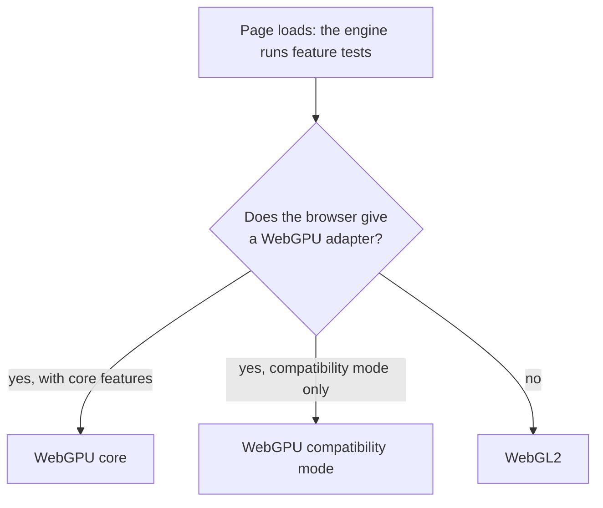

# GPU tiers and backends

> Planned for sokko3d 0.1. This page describes the design. The first milestone implements parts of it in this repository, but no release has these APIs yet, so coding agents must not use them.



sokko3d draws with WebGPU where the browser offers it, and with WebGL2 everywhere else. The same game code runs on both, with no backend checks in it. The engine picks the tier once, at startup, from feature tests.

## The three tiers

| Tier | Where it runs | What it gives | Main limits |
| --- | --- | --- | --- |
| WebGPU core | Chrome and Edge 113+ on Windows, macOS and ChromeOS; Chrome 121+ on Android 12+ with ARM, Qualcomm or Intel GPUs; Safari 26 on macOS, iOS and iPadOS; Firefox 141+ on Windows and 147+ on Apple silicon Macs | Compute shaders, indirect draws, render bundles, storage buffers | Optional features differ from device to device |
| WebGPU compatibility mode | Chrome 146+ on devices that have only OpenGL ES 3.1 or Direct3D 11 | Compute shaders and indirect draws on older GPUs | About 45% of these devices allow no storage buffers in vertex shaders; 16-bit float targets cannot use MSAA; uniform bindings stop at 16 KB |
| WebGL2 | Every other supported browser: iPhones before iOS 26, Android phones without WebGPU (including phones with Samsung Xclipse GPUs), Firefox on Android and Linux | Instancing, uniform buffers, MSAA | No compute shaders, no indirect draws, no storage buffers |

These facts were checked in September 2026. Browser support changes often, so this table can go out of date. At run time, the engine's feature tests decide.

## How each path draws

On WebGPU, the GPU culls the scene itself. The engine records each group of objects that share a pipeline, a mesh and a material once, in a render bundle. The GPU then fills in the draw counts every frame. The CPU's cost per frame grows with the number of those groups, and stays almost flat as the object count grows.

On WebGL2 there are no compute shaders, so the job workers cull in parallel on the CPU. Static objects keep their data on the GPU, and each frame uploads only a list of which instances are visible. Where the browser has the `WEBGL_multi_draw` extension, one call draws many groups.

A feature ships only when it works on both paths, or when its WebGL2 fallback is documented on its page.

## Capability flags

The engine reads what the device can do at startup and exposes it as `engine.capabilities`:

```ts
engine.capabilities;
// { tier: 'webgpu' | 'webgpu-compat' | 'webgl2', threaded, features, limits }
```

The features it tests include:

- compute shaders and indirect draws
- storage buffers in vertex shaders
- multi-draw
- each texture compression family: BC, ETC2 and ASTC
- filtering of 32-bit float textures
- GPU timer queries
- MSAA on 16-bit float targets

Game code that uses an optional feature checks this object first.

## The portable budget

The WebGPU path stays inside WebGPU's default limits, and inside compatibility mode's limits where those are lower. Anything beyond them needs a capability flag and a fallback. Some of the numbers the engine plans around:

| Limit | Budget |
| --- | --- |
| Bind groups | 4 (the engine uses 3) |
| Compute threads per workgroup | 128 |
| Uniform binding size | 16 KB |
| Color attachments | 4 |
| Texture size | 4096 pixels (8192 only after a check) |
| Texture array layers | 256 |
| Buffer size | 256 MB |

A 2018 iPad Pro on iPadOS 26 reports almost exactly WebGPU's default limits, which makes it a good test that the budget holds.

## Never branch on GPU names

Some browsers hide the GPU's name. Firefox on macOS reports every adapter detail as empty, and Brave can hide them by design. A name also does not tell you which features the engine turned on. Read `engine.capabilities` instead, in both the engine and your game.

## Choosing a tier for testing

`createEngine({ gpu: 'webgl2' })` forces a tier, and so do the URL switches `?gpu=webgpu`, `?gpu=compat` and `?gpu=webgl2`. A device can then test every path it supports. Use them for testing only; in production, let the engine choose.

## When the GPU goes away

A WebGPU device can be lost, for example after a driver reset. The render worker then creates a new device and rebuilds the GPU resources from data the engine kept. If the device is lost twice within one minute, the engine restarts the render worker on WebGL2. The game worker keeps running, so game state survives.

## Minimum browsers

| Browser | Minimum version |
| --- | --- |
| Safari on macOS and iOS | 16.4 |
| Chrome and Edge | 91 |
| Firefox | 89 |

WebAssembly SIMD sets these minimums. An older browser gets a clear "browser not supported" message instead of a slow path.

## Related pages

- [Architecture: threads and the frame](architecture.md): the render worker that owns the GPU.
- [Hosting and cross-origin isolation](../getting-started/hosting.md): the headers that turn on worker threads.
