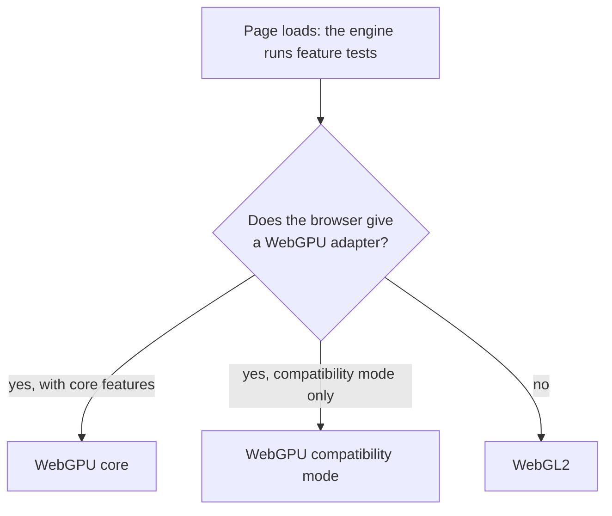

# GPU tiers and backends



null3D draws with WebGPU where the browser offers it, and with WebGL2 everywhere else. The same sketch code runs on both, with no backend checks in it. The engine picks the tier once, at startup, from feature tests.

## The three tiers

| Tier | Where it runs | What it gives | Main limits |
| --- | --- | --- | --- |
| WebGPU core | Chrome and Edge 113+ on Windows, macOS and ChromeOS; Chrome 121+ on Android 12+ with ARM, Qualcomm or Intel GPUs; Safari 26 on macOS, iOS and iPadOS; Firefox 141+ on Windows and 147+ on Apple silicon Macs | Compute shaders, indirect draws, render bundles, storage buffers | Optional features differ from device to device |
| WebGPU compatibility mode | Chrome 146+ on devices that have only OpenGL ES 3.1 or Direct3D 11 | Compute shaders and indirect draws on older GPUs | About 45% of these devices allow no storage buffers in vertex shaders; 16-bit float targets cannot use MSAA; uniform bindings stop at 16 KB |
| WebGL2 | Every other supported browser: iPhones before iOS 26, Android phones without WebGPU (including phones with Samsung Xclipse GPUs), Firefox on Android and Linux | Instancing, uniform buffers, MSAA | No compute shaders, no indirect draws, no storage buffers |

These facts were checked in September 2026. Browser support changes often, so this table can go out of date. At run time, the engine's feature tests decide.

## How each path draws

On WebGPU, the GPU culls the scene itself. The engine records one draw for each group of objects that share a pipeline, a mesh and a material, and replays these draws every frame. The GPU fills in each draw's count. The CPU's cost per frame grows with the number of those groups, and stays almost flat as the object count grows.

On WebGL2 there are no compute shaders, so the job workers cull in parallel on the CPU and group the visible objects the same way. Each object's matrix sits in a data texture on the GPU. Static objects upload theirs only when they change. Moving instance batches write theirs each frame into the next of three textures. A frame then never writes a texture that the GPU may still read. Each frame lists the visible objects, 4 bytes each, and uploads the list only when it changed. The `visibleEntries` figure of `engine.measure` counts the entries of each frame's list. A static instance batch that has stopped changing is culled in groups of 64 nearby rows, with one test and one list entry per group. A group partly in view draws all its rows, and the GPU clips the ones outside. Where the browser has the `WEBGL_multi_draw` extension, one call draws every group with the same shading and the same mesh buffer. Firefox lacks the extension, so there each group takes one call.

Every feature works on both paths, or its page describes its WebGL2 fallback.

## Depth on each tier

The engine draws reversed depth: the near plane stores 1 and the far plane stores 0. Floating-point numbers are most precise near 0, where reversed depth puts far surfaces. Standard depth stores 0 at the near plane instead. Far from the camera it runs out of precision, and two close surfaces flicker through each other (z-fighting).

| Tier | Depth | Surfaces 1 cm apart stay apart |
| --- | --- | --- |
| WebGPU | Reversed, in a 32-bit float buffer | Out to 10 km |
| WebGL2 with the `EXT_clip_control` extension | Reversed, in a 32-bit float buffer | Out to 10 km |
| WebGL2 without it | Reversed, in WebGL2's range from -1 to 1 | Out to about 250 m |

WebGL2 maps depth into a range from -1 to 1, which loses most of the precision that reversed depth gives. The `EXT_clip_control` extension sets the range from 0 to 1, as on WebGPU. In September 2026, Chrome, Safari and Brave had it on a MacBook Pro. So did Chrome on a Galaxy S24+, and Safari and Brave on an iPad Pro. Firefox on macOS did not. Without the extension, the engine keeps reversed depth in the range from -1 to 1. In every browser tested, that fought in fewer pixels than standard depth.

The distances come from the engine's depth precision test on a MacBook Pro, with the camera's near plane at 0.1 m. The field `engine.capabilities.depth` says which depth the device draws: `reversed`, or `reversed-gl` on WebGL2 without the extension.

## Capability flags

The engine reads what the device can do at startup and exposes it as `engine.capabilities`:

```ts
engine.capabilities;
// { tier: 'webgpu' | 'webgpu-compat' | 'webgl2', threaded, features, limits, hdr, maxInstances, depth }
```

The features it tests include:

- compute shaders and indirect draws
- storage buffers in vertex shaders
- multi-draw
- each texture compression family: BC, ETC2 and ASTC
- filtering of 32-bit float textures
- GPU timer queries
- MSAA on 16-bit float targets
- rendering into 16-bit and 32-bit float textures on WebGL2 (`engine.report.webgl2.floatRenderTargets`)

Where float targets take antialiasing, the scene draws high dynamic range color, and the final pass tone maps it. That holds on core WebGPU, and on WebGL2 devices that pass the float target test. `hdr` says whether the engine took that path. [Color management](color-management.md) covers the 8-bit path of the other devices.

Code that uses an optional feature checks this object first. The sketch worker has no copy of its own, so the page sends the sketch what it needs: `engine.postToSketch('capabilities', engine.capabilities)`.

## The portable budget

The WebGPU path stays inside WebGPU's default limits, and inside compatibility mode's limits where those are lower. Anything beyond them needs a capability flag and a fallback. Some of the numbers the engine plans around:

| Limit | Budget |
| --- | --- |
| Bind groups | 4 (the engine uses 3) |
| Compute threads per workgroup | 128 |
| Uniform binding size | 16 KB |
| Color attachments | 4 |
| Texture size | 4096 pixels (8192 only after a check) |
| Texture array layers | 256 |
| Buffer size | 256 MB |
| Storage binding size | 128 MB |
| Objects and instance rows in one scene | 2,097,152, since each takes 64 bytes of a storage binding |

The storage binding is the one limit the engine raises past this budget. When a device offers larger storage bindings and buffers, the engine asks for them. A scene there can hold more objects and instance rows, up to the 8,388,480 that one culling pass covers. `engine.capabilities.maxInstances` gives the number for the device. A call that would take a scene past it fails with E1501.

On WebGPU, development builds warn once when a scene passes 2,097,152, because a device with the default limits refuses that scene.

On WebGL2 the limit follows the largest texture the device allows. Each object's matrix takes 3 texels of a data texture, 512 matrices to a texel row. That is 2,097,152 objects and instance rows at 4,096 pixels, and 8,388,608 at 16,384. Larger textures hold no more, because the list of visible objects can name at most 8,388,608. WebGL2 promises at least 2,048 pixels, which holds 1,048,576. `engine.capabilities.maxInstances` gives the number on WebGL2 too. On WebGL2, development builds warn once when a scene passes 1,048,576, because a device with the smallest textures refuses that scene.

Engine memory holds the rows too. A page with worker threads gives the engine 1 GiB by default, which holds about 5 million instance rows. The `memory` option of `createEngine` raises the maximum to as much as 4 GiB ([Page API](../api/engine.md#memory)). A call that needs more memory than the engine can get fails with E1109.

A 2018 iPad Pro on iPadOS 26 reports almost exactly WebGPU's default limits, which makes it a good test that the budget holds.

## Never branch on GPU names

Some browsers hide the GPU's name. Firefox on macOS reports every adapter detail as empty, and Brave can hide them by design. A name also does not tell you which features the engine turned on. Read `engine.capabilities` instead.

## Devices with two GPUs

Some laptops have a separate graphics chip next to the one built into the processor. The engine asks the browser for the faster one. `createEngine({ powerPreference: 'low-power' })` asks for the one that saves battery instead. The browser treats either as a request. The engine's capability check and its renderer ask for the same GPU, so the reported features and limits match the GPU that draws. A device with one GPU ignores the option.

## Choosing a tier for testing

`createEngine({ gpu: 'webgl2' })` forces a tier, and so do the URL switches `?gpu=webgpu`, `?gpu=compat` and `?gpu=webgl2`. A device can then test every path it supports. Use them for testing only; in production, let the engine choose.

On WebGL2, uploads read straight from the engine's shared memory. A browser that refuses to read shared memory gets a copy of each upload instead. The switch `?uploads=copy` makes the engine copy everywhere, so one device can test both routes.

The switch `?depth=` forces a WebGL2 depth mode: `reversed`, `reversed-gl` or `standard`, which draws depth as three.js's WebGL renderer does by default. A browser without `EXT_clip_control` cannot draw `reversed`, so it draws its own mode instead.

## When the GPU goes away

A WebGPU device can be lost, for example after a driver reset, and so can a WebGL2 context. The thread that draws then makes a new device, or waits for the context to come back. It draws the whole scene again from data the engine kept. The sketch worker keeps running, so your sketch's state survives. If the GPU is lost more than twice within one minute, or no new device starts, the engine stops drawing and reports E1302.

## Minimum browsers

| Browser | Minimum version |
| --- | --- |
| Safari on macOS and iOS | 16.4 |
| Chrome and Edge | 91 |
| Firefox | 89 |

WebAssembly SIMD sets these minimums. An older browser gets a clear "browser not supported" message instead of a slow path.

## Related pages

- [Architecture: threads and the frame](architecture.md): the render worker that owns the GPU.
- [Hosting and cross-origin isolation](../getting-started/hosting.md): the headers that turn on worker threads.
