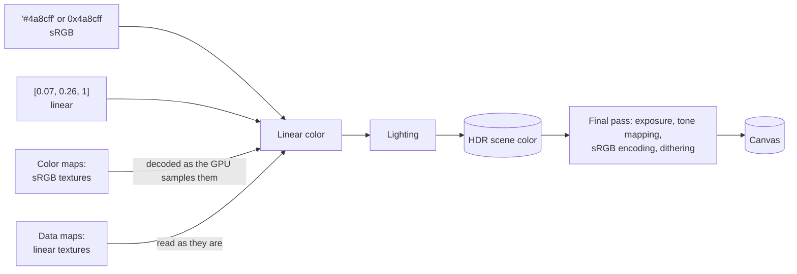

# Color management

> Ships in null3D 0.1. The API is experimental, so it can still change between versions.



null3D works in linear color, as three.js does with its color management on. A color that you give as a hex string or a number is sRGB, the way CSS writes colors. The engine converts it to linear once, when the call receives it. A color that you give as three numbers is linear already.

Lighting adds and scales light in linear color, so a lit surface can be brighter than white. The scene therefore draws into a high dynamic range (HDR) target. At the end of each frame, the final pass scales the color by the exposure. A tone mapping curve then maps it into the display's range, and the pass encodes it as sRGB for the canvas.

## Colors in the API

Every call that takes a color takes one of three forms:

| Form | Example | Color space |
| --- | --- | --- |
| Hex string | `'#4a8cff'` or `'#48f'` | sRGB |
| Number | `0x4a8cff` | sRGB |
| Three numbers from 0 to 1 | `[0.07, 0.26, 1]` | Linear |

```ts
const blue = materials.standard({ color: '#4a8cff' });
const same = materials.standard({ color: [0.07, 0.26, 1] }); // the same color, as linear values
scene.createDirectionalLight({ color: '#fff4e0', intensity: 3 });
```

Three numbers are linear, as three.js's `Color.setRGB` reads them. The color helpers give linear numbers too: `color.fromSrgb` converts sRGB components, and `color.fromHsl` gives what three.js's `setHSL` gives ([Math helpers](../api/math.md#colors)). A light's intensity multiplies its linear color. A color in any other form throws [E1204](../errors/E1204.md).

## Texture color spaces

A texture stores its image in one of two ways:

| Kind | Examples | How the GPU reads it |
| --- | --- | --- |
| Color | Base color, emissive color | The texture has an sRGB format, so the GPU decodes each texel to linear values as it samples it. Filtering and mip levels average in linear color too. |
| Data | Normals, roughness, metalness, occlusion | The texture has a linear format, so the GPU reads each texel as it is. |

The `colorSpace` option of the texture calls chooses: `'srgb'`, the default for images, or `'linear'`, the default for data. A data map stored as a color map comes out wrong: its values shrink toward 0. A color map stored as data comes out too bright and washed out. [Textures](../api/textures.md) covers how the engine keeps textures on the GPU.

## HDR color and the final pass

A strong light can make a surface many times brighter than white. The scene keeps those values in a float target, the scene color:

- `rgba16float` on WebGPU. Where the device can draw into `rg11b10ufloat` and the canvas is opaque, the scene color takes that format instead, which needs half the memory.
- `RGBA16F` on WebGL2, where the device can draw float targets in the anti-aliasing mode.

The final pass reads each pixel of the scene color. In the FXAA anti-aliasing mode it first smooths the edges. It multiplies the color by the exposure and applies the tone mapping. It then encodes the result as sRGB and adds a little noise, called dithering, so smooth gradients show no bands. The final pass is one triangle over the canvas, with no scene work in it.

### The 8-bit path

Some devices cannot draw a float target in the anti-aliasing mode. These are WebGPU in compatibility mode with MSAA, and WebGL2 devices whose float targets fail the engine's test. There, each shader applies the exposure and the tone mapping itself, and writes into an 8-bit target. With MSAA that target resolves straight into the canvas, so the frame has no final pass. With FXAA or no anti-aliasing, the final pass reads the target and keeps its colors.

`engine.capabilities.hdr` says which path the engine took. Both paths show the same colors, and differ only at the edges of objects. With MSAA, the 8-bit path averages the samples of an edge after tone mapping, and the HDR path before it. [GPU tiers and backends](backends.md#color-and-anti-aliasing-on-each-tier) lists the path of each tier and anti-aliasing mode.

## Exposure and tone mapping

Set both from the sketch with [`post.set`](../api/post.md):

```ts
export default defineSketch(({ post }) => {
  post.set({ toneMapping: 'agx', exposure: 1.5 });
  return {};
});
```

| `toneMapping` | three.js equivalent | Look |
| --- | --- | --- |
| `'aces'` (the default) | `ACESFilmicToneMapping` | Strong contrast. Bright saturated colors change hue on their way to white: red turns orange, then yellow. |
| `'agx'` | `AgXToneMapping` | Softer contrast. Bright colors fade toward white and keep their hue. |
| `'neutral'` | `NeutralToneMapping` | Base colors keep their values until they near white. Khronos made it for product images. |
| `'none'` | `LinearToneMapping` | The exposed color, clipped at white. A bright color loses detail once a channel reaches white. |

The exposure multiplies the scene's color before the tone mapping. An exposure of 2 is one stop brighter, and 0.5 is one stop darker. The engine uses three.js's formulas for each curve, so a scene looks the same in both engines with the same settings.

## The background

The background color is part of the scene. Exposure and tone mapping change it as they change the objects, as in three.js's WebGPURenderer. ACES, for example, makes dark colors darker. To show an exact page color behind the scene, use `toneMapping: 'none'` at an exposure of 1. You can also use a transparent canvas over a CSS background.

A [background texture](../api/scene.md#the-camera-and-the-background) draws into the scene color too, so exposure and tone mapping change it in the same way. three.js's WebGLRenderer draws an sRGB background texture without them. To show the texture's own colors, use `toneMapping: 'none'` at an exposure of 1.

## Transparent canvases

`createEngine({ transparent: true })` makes a see-through canvas. The page shows through wherever no object draws, until the sketch calls `scene.setBackground`. The canvas holds premultiplied alpha, the form that browsers composite, so a partly covered edge pixel keeps its color scaled by its coverage.

```ts
const engine = await createEngine({
  canvas: document.querySelector('canvas')!,
  sketch: new URL('./sketch.ts', import.meta.url),
  transparent: true,
});
```

## Parity with three.js

- Hex colors, linear lighting and sRGB output work as in three.js r152 and later, where color management is on by default.
- Three numbers are linear, as `Color.setRGB` reads them.
- A color map with `texture.colorSpace = SRGBColorSpace` is a texture with an sRGB format in null3D.
- A data map with `NoColorSpace` or `LinearSRGBColorSpace` is a texture with a linear format.
- The tone mapping curves use three.js's formulas. The defaults differ: three.js uses no tone mapping, and null3D uses ACES. A port of a scene without tone mapping sets `toneMapping: 'none'`.
- three.js's `NoToneMapping` ignores the exposure. null3D's `'none'` applies it, as `LinearToneMapping` does, and an exposure of 1 gives the same image.
- three.js's WebGLRenderer draws a `scene.background` color without tone mapping. null3D tone maps the background, as three.js's WebGPURenderer does.
- null3D always dithers its output, and three.js only dithers materials that ask for it. The difference is at most one step of an 8-bit color.

## Related pages

- [Post-processing API](../api/post.md): `post.set` and each setting.
- [Page API: createEngine](../api/engine.md): the `transparent` option, and `engine.capabilities.hdr`.
- [The render graph](render-graph.md): the final pass, and the resolve pass that takes its place on the 8-bit path.
- [GPU tiers and backends](backends.md): which devices draw HDR color.
- [Math helpers](../api/math.md#colors): the color helpers, which give linear RGB.
- [Textures](../api/textures.md): how the engine keeps textures on the GPU.
- [three.js to null3D mapping](../porting/threejs-mapping.md): tone mapping, color output and background entries.
