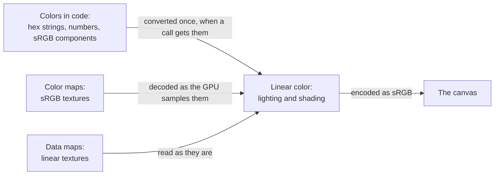

# Color management

> Ships in null3D 0.1. The API is experimental, so it can still change between versions. Tone mapping, exposure and render targets with a high dynamic range are not built yet, so coding agents must not use them. Neither are the calls that load textures and choose their color space.



The engine lights and shades in linear color, where light adds up as it does in the real world. Colors that people pick, and the texels of images, are stored with the sRGB curve instead. That curve spends more of its values on dark shades, which the eye tells apart best. The engine turns each color into linear values before it shades with it, and encodes the result as sRGB for the screen.

## Colors in code

Every call that takes a color takes it in one of three forms:

```ts
// sketch.ts
materials.unlit({ color: '#4a8cff' }); // a hex string
materials.unlit({ color: 0x4a8cff }); // a number
materials.unlit({ color: [0.29, 0.55, 1] }); // three sRGB components from 0 to 1
```

All three forms are sRGB colors, as a color picker gives them. The engine converts a color to linear values once, when a call receives it, so shading costs nothing more. The `color` math helpers make the same conversion, and write linear values into an array: `color.fromHex(out, '#4a8cff')`.

## Texture color spaces

A texture stores its image in one of two ways:

| Kind | Examples | How the GPU reads it |
| --- | --- | --- |
| Color | Base color, emissive color | The texture has an sRGB format, so the GPU decodes each texel to linear values as it samples it. Filtering and mip levels average in linear color too. |
| Data | Normals, roughness, metalness, occlusion | The texture has a linear format, so the GPU reads each texel as it is. |

A data map stored as a color map comes out wrong: its values shrink toward 0. A color map stored as data comes out too bright and washed out. [Textures](../api/textures.md) covers how the engine keeps textures on the GPU.

## The canvas

The engine draws into the canvas in sRGB. Each shader encodes its linear result with the sRGB curve before it writes a pixel. The background color converts the same way, so a background of `'#20242a'` shows as exactly that color.

## Parity with three.js

null3D follows three.js with its color management on, which has been the default since three.js r152:

| three.js | null3D |
| --- | --- |
| `new Color('#4a8cff')`, `new Color(0x4a8cff)`: sRGB, converted to linear | The same |
| `texture.colorSpace = SRGBColorSpace` for color maps | A texture with an sRGB format |
| `texture.colorSpace = NoColorSpace` or `LinearSRGBColorSpace` for data maps | A texture with a linear format |
| `renderer.outputColorSpace = SRGBColorSpace` | The canvas is always sRGB |
| `color.setRGB(r, g, b)`: linear components | `[r, g, b]` arrays hold sRGB components. Convert linear values with the `color` helpers first. |

A scene with the same colors and textures therefore shades the same in both engines, apart from tone mapping, which null3D does not have yet.
