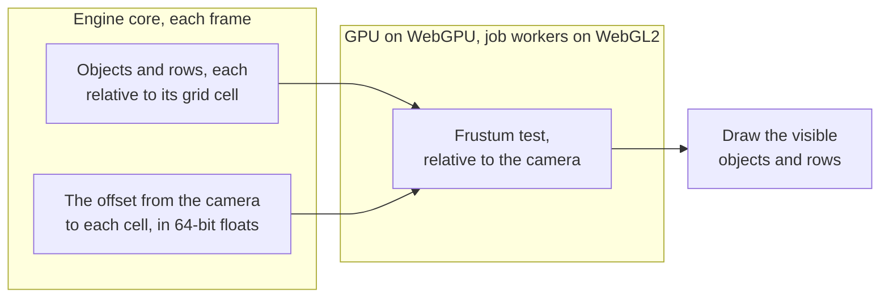

# Culling

> Ships in null3D 0.1. The API is experimental, so it can still change between versions.



Culling finds the objects and instance rows in the camera's view, so the GPU draws only those. The engine tests each bounding sphere against the six planes of the view. Every position in the test is relative to the camera, so a scene far from the origin culls and draws as it does near it. The engine culls each [view](render-graph.md) separately, against that view's camera.

## How each path culls

On WebGPU the GPU culls the scene itself. A compute pass runs one GPU thread per object or instance row. Each thread adds its cell's offset to its bounding sphere and tests the sphere. An object in view joins its group: the objects that share a mesh and a material. The prerecorded draws read how many each group holds. The CPU's cost per frame stays almost flat as the scene grows.

On WebGL2 there are no compute shaders, so the job workers cull on the CPU. They test four spheres per SIMD instruction and list the visible objects, 4 bytes each. They test a static instance batch that has stopped changing in groups of 64 nearby rows, one test per group. When a static batch's rows lie in more than one grid cell, they test it row by row.

[GPU tiers and backends](backends.md) describes each path's draw calls and uploads.

## Grid cells

The engine divides space into cells 1,024 m wide. The origin cell spans 512 m on each side of the origin, so a scene within 512 m of it uses one cell.

- A root object takes the cell that holds its position. Its children take its cell.
- An instance row takes the cell that holds its position.

The engine keeps each world matrix relative to its cell's center, where 32-bit floats are precise to a fraction of a millimeter. Each frame it computes the offset from the camera to each cell in use, in 64-bit floats, and uploads one vector per cell. Each view gets the offsets from its own camera. The GPU adds an object's offset to its position, so every position it sees is relative to the camera. Positions near the camera keep the most precision.

When only the camera moves, static objects keep their data on the GPU, and only the offsets change. A scene inside one cell uploads one vector per frame.

## What this means for your sketch

Write world positions as usual, and the engine picks the cells:

```ts
const base = [250_000, 0, -80_000] as const;
const camera = scene.createPerspectiveCamera({
  position: [base[0], 5, base[2] + 12],
  target: base,
});
scene.setActiveCamera(camera);
scene.createMesh({ mesh: geometry.box(), material: stone, position: base });
```

The cells have these limits:

- The engine stores positions as 32-bit floats. It places an object 100 km from the origin to within about 4 mm, and 1,000 km out to within about 3 cm. What it computes from those positions, such as a child's place under its parent, keeps its precision.
- A mesh's vertices are offsets from its object's origin, and they stay 32-bit. Put large coordinates in object positions, never in vertices.
- `getWorldPosition` gives 64-bit numbers. Pass it a plain array or a `Float64Array`, because a `Float32Array` rounds them to 32 bits.
- At most 512 cells hold objects at once. An object in a cell past that stays in the origin cell, where its position keeps only 32-bit precision.

## Related pages

- [GPU tiers and backends](backends.md): how each path draws.
- [Architecture: threads and the frame](architecture.md): where culling runs in a frame.
- [Static and dynamic objects](static-dynamic.md): which objects upload their data each frame.
- [The demo far from the origin](https://github.com/null3d-engine/null3d/tree/main/examples/far-from-origin): keys 2 cm wide, 1,000 km from the origin, seen from 40 cm.
