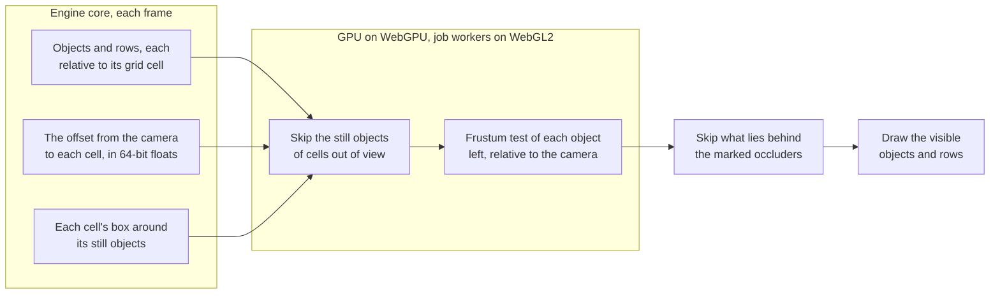
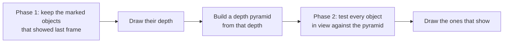

# Culling

> Ships in null3D 0.1. The API is experimental, so it can still change between versions.



Culling finds the objects and instance rows in the camera's view, so the GPU draws only those. Occlusion culling also skips the objects that marked occluders hide. The engine tests each bounding sphere against the six planes of the view. Every position in the test is relative to the camera, so a scene far from the origin culls and draws as it does near it. When a scene spreads over several grid cells, the engine first skips every still object of the cells out of view. The engine culls each [view](render-graph.md) separately, against that view's camera.

## How each path culls

On WebGPU the GPU culls the scene itself. A compute pass runs one GPU thread per object or instance row. Each thread adds its cell's offset to its bounding sphere and tests the sphere. An object in view joins its group: the objects that share a mesh and a material. The prerecorded draws read how many each group holds. The CPU's cost per frame stays almost flat as the scene grows. When the scene spreads over several grid cells, the pass runs only over the objects of the cells in view and over the moving objects.

On WebGL2 there are no compute shaders, so the job workers cull on the CPU. They test four spheres per SIMD instruction and list the visible objects, 4 bytes each. They test a static instance batch that has stopped changing in groups of 64 nearby rows, one test per group. Each group lies inside one grid cell. The job workers skip the objects and groups of the cells out of view.

[GPU tiers and backends](backends.md) describes each path's draw calls and uploads.

## GPU occlusion culling on WebGPU

The frustum test keeps every object in view, even one that a wall hides. On WebGPU, the objects that you mark as occluders hide the objects behind them. The GPU then skips those. You mark them as for WebGL2, with the `occluder` option or `setOccluder(true)` (see the next section). The GPU works in two phases in each frame, for each camera:



1. The first phase keeps the marked objects in view that showed in the camera's last frame and look large on the screen. The bounds of such an object span at least a sixteenth of the render size's longer side. The GPU draws their depth alone, into a depth target of its own.
2. A compute pass builds a depth pyramid from that depth. Each level holds the farthest depth of each 2 x 2 square of the level below it.
3. The second phase tests each object in view against the pyramid. An object whose bounding sphere lies wholly behind the depth that the pyramid holds under it is hidden. The GPU notes which objects show, for the next frame.
4. The opaque pass draws the objects that show, as it does without occlusion culling.

The pyramid holds the depth of objects drawn in this frame, so no object that shows can hide behind it. The image matches the image without occlusion culling. When the camera turns fast, the first phase keeps the wrong objects, so fewer objects hide, but none shows a frame late.

What it costs and where it runs:

- A frame in which no object is marked culls once, as without occlusion culling, and costs nothing more.
- Otherwise it costs a depth-only draw of the marked objects that showed last frame, a depth pyramid and a second culling pass.
- It saves the GPU time of every hidden object: its vertices, and the pixels that the depth test would discard. Mark large, solid objects that hide many detailed ones, such as buildings and walls.
- It pays only where the hidden objects cost more GPU time than its passes. In a test room whose walls hide 94% of its spheres, it saved 7% of the GPU time on an idle desktop GPU. It cost 38% to 66% more while another app drew on the same GPU. On an iPad and an Android phone, it cost more than it saved. Compare your scene's GPU time in `engine.measure` with `?occlusion=on` and `?occlusion=off` before you keep it on.
- Every preset leaves it off. The `gpuOcclusion` option of `createEngine` turns it on, and the `?occlusion=on` and `?occlusion=off` switches win over the option. It is fixed while the engine runs.
- Its shaders download the first time the scene marks an occluder, as the shaders of other features that many scenes leave out do. Until they are built, each camera culls once, as without occlusion culling. A game that must fetch nothing during play lists `'occlusion'` in `createEngine`'s `preload` ([loading screens](../guides/loading-screens.md#loading-everything-up-front)).
- It runs on WebGPU, in compatibility mode too, without the depth prepass. Shadow cascades and tiles cull with the frustum test alone. See-through objects draw from the sorted list of the transparent pass, and hide nothing.
- Some objects draw no depth in the first phase, so they hide nothing. These are objects that blend, cut holes with an alpha mask, skip the depth buffer or use a custom material. Instance rows are never occluders.
- An object hides only behind the occluders that the first phase kept. An occluder that comes into view hides others from the next frame on. A hidden object costs two culling tests, and no draw.

```ts
const engine = await createEngine({ canvas, sketch, gpuOcclusion: true });
// In the sketch: the walls hide what lies behind them.
scene.createMesh({ mesh: wall, material: plaster, position: [0, 3, -8], occluder: true });
```

## Bounds that you set

By default, culling tests an object's mesh sphere: the sphere around the object's origin that holds every vertex of its mesh. The object's scale grows it, and its rotation turns it. A shader that moves vertices, such as waves on water, can move them outside that sphere. Culling then hides the object while parts of it are still in view. Two mesh calls change what culling tests:

- `setBounds(center, radius)` gives the object a sphere of its own, with its center relative to the object's origin. Bounds that cover the moved vertices keep culling at work.
- `setFrustumCulled(false)` turns culling off for the object, so the engine draws it wherever it is.

```ts
// Waves lift the water's vertices by up to 2 m. A sphere 1 m higher and 1 m wider than the
// mesh's sphere holds every lifted vertex.
water.setBounds([0, 1, 0], waterMesh.radius + 1);
```

Both calls rebuild the draw tables, so make them at setup. On WebGPU, each object with a sphere of its own draws from a group of its own, as the GPU tests one sphere per group. On WebGL2, the job workers test each object's own sphere and the cost stays the same.

## Software occlusion culling on WebGL2

Frustum culling keeps everything in the view, even what a building hides. On WebGL2, objects that you mark as blockers hide the objects behind them, so the GPU skips those too:

```ts
// Buildings block the view from the street; the props behind them skip the GPU.
for (const lot of lots) {
  scene.createMesh({ mesh: building, material: walls, position: lot.position, occluder: true });
}
// Or mark an object later.
tower.setOccluder(true);
```

Each frame, the job workers draw the blockers in the camera's view, nearest first, into a small depth buffer of about 256 x 144 pixels. Then each object that passed the frustum test is tested against it. An object whose bounding sphere lies wholly behind the blockers is not drawn. The job workers test four spheres at a time, with SIMD.

- The buffer never hides an object that a finer depth buffer would show. A pixel counts as covered only when the blocker covers its whole square, and its depth is the blocker's farthest depth there. An object that shows through a gap, beside an edge or above a roof still draws.
- It uses the frame's own camera and positions, so a hidden object shows in the same frame that it comes into view.
- A blocker draws its own mesh, up to 4,096 triangles. The frame draws up to 16,384 blocker triangles, nearest first. The frame skips a blocker whose radius is under 2 pixels of the buffer.
- A blocker mesh splits into its connected parts: triangles that share corners. Each part takes its place by the nearest point of its own bounding sphere. So one mesh that merges the buildings of a whole city, of one material, blocks with its near buildings first, and its far ones wait behind nearer blockers.
- Mark large, solid objects that hide much of the scene: buildings, walls and hills. A blocker that hides little costs time and saves none.
- Objects that blend, cut holes with an alpha mask, skip the depth buffer, use a custom material or are skinned never block. Their drawn shape can have gaps that the mesh does not show.
- Only the active camera's view uses blockers. Shadow cascades, shadow tiles and other views cull as before, so a hidden object still casts its shadow.
- A blocker must lie inside what its object draws. An object's own mesh does.

### Blockers from the asset tool

`assets optimize` gives a blocker to each mesh of a model that encloses space. The blocker is one or two boxes inside the mesh, joined into one closed surface of a few dozen triangles at most. The tool checks each blocker against the mesh, and drops one that would show outside it. A copy of the model then blocks with those meshes. Each draws its blocker in place of its mesh, so a building of thousands of triangles blocks for the cost of a few dozen:

```ts
// city.glb came from assets optimize, so its buildings block on WebGL2.
const city = await assets.loadGltf('/models/city.glb');
scene.instantiate(city);
// Or keep a copy's meshes from blocking.
scene.instantiate(city, { occluder: false });
```

`setOccluder` changes an object afterwards. [The asset pipeline](../guides/assets-pipeline.md#blockers-and-stored-trees) says which meshes get blockers.

The `softwareOcclusion` quality setting turns it on and off during play. It is on from the Medium preset up, and off on Low. The `?occlusion=off` switch turns it off for a page. `engine.measure` reports the entries that it hid as `occludedEntries`, beside `visibleEntries`.

WebGPU reads the same marks for its own [occlusion culling on the GPU](#gpu-occlusion-culling-on-webgpu), which the `gpuOcclusion` setting turns on, and ignores the `softwareOcclusion` setting.

## Grid cells

The engine divides space into cells 1,024 m wide. The origin cell spans 512 m on each side of the origin, so a scene within 512 m of it uses one cell.

- A root object takes the cell that holds its position. Its children take its cell.
- An instance row takes the cell that holds its position.

The engine keeps each world matrix relative to its cell's center, where 32-bit floats are precise to a fraction of a millimeter. Each frame it computes the offset from the camera to each cell in use, in 64-bit floats, and uploads one vector per cell. Each view gets the offsets from its own camera. The GPU adds an object's offset to its position, so every position it sees is relative to the camera. Positions near the camera keep the most precision.

When only the camera moves, static objects keep their data on the GPU, and only the offsets change. A scene inside one cell uploads one vector per frame.

## Skipping cells out of view

Most frames of a large world show a few of its cells. The engine then tests each cell once, and skips every still object in a cell out of view:

- A still object is a static object whose parents are all static, or a row of a static instance batch. Everything else moves: dynamic objects, static objects under a dynamic parent, and the rows of dynamic batches. Each view tests every moving object, as without cells.
- Each cell has a box around the bounding spheres of its still objects. Each view tests the box against its frustum. A cell counts as out of view only when its box lies outside the frustum by more than the rounding of the per-object test. So skipping a cell never drops a still object that the per-object test would keep.
- On WebGPU the engine keeps the still objects in cell order: each cell's are one run of a list on the GPU. Each view's culling pass covers only the runs of its cells in view and the moving objects.
- On WebGL2 the job workers skip the still objects of each cell out of view. A static batch at rest builds its groups of 64 rows inside cells, so it skips whole cells of groups too.
- A still object that changes grows its cell's box. One that moves into another cell rebuilds the cell order, as creating or destroying an object does. Keep objects that cross cells often dynamic.
- On WebGL2, a static batch whose rows change is tested row by row until it rests again. So is a static batch whose rows are spread so thinly over cells that its groups of 64 rows would be mostly empty.

A scene inside one cell has nothing to skip, and culls as it would without cells. The benchmark scene S1-cells spreads 100,000 still boxes over 8 x 8 cells and flies the camera low over them.

## What this means for your sketch

Write world positions as usual, and the engine picks the cells:

```ts
const base = [250_000, 0, -80_000] as const;
const camera = scene.createPerspectiveCamera({
  position: [base[0], 5, base[2] + 12],
  target: base,
});
scene.setActiveCamera(camera);
scene.createMesh({ mesh: geometry.box(), material: stone, position: base });
```

The cells have these limits:

- The engine stores positions as 32-bit floats. It places an object 100 km from the origin to within about 4 mm, and 1,000 km out to within about 3 cm. What it computes from those positions, such as a child's place under its parent, keeps its precision.
- A mesh's vertices are offsets from its object's origin, and they stay 32-bit. Put large coordinates in object positions, never in vertices.
- `getWorldPosition` and `getWorldMatrix` give 64-bit positions. Pass them a plain array or a `Float64Array`, because a `Float32Array` rounds them to 32 bits.
- At most 512 cells hold objects at once. An object in a cell past that stays in the origin cell, where its position keeps only 32-bit precision.

## Related pages

- [GPU tiers and backends](backends.md): how each path draws.
- [Architecture: threads and the frame](architecture.md): where culling runs in a frame.
- [Static and dynamic objects](static-dynamic.md): which objects upload their data each frame.
- [The demo far from the origin](https://github.com/null3d-engine/null3d/tree/main/examples/far-from-origin): keys 2 cm wide, 1,000 km from the origin, seen from 40 cm.
