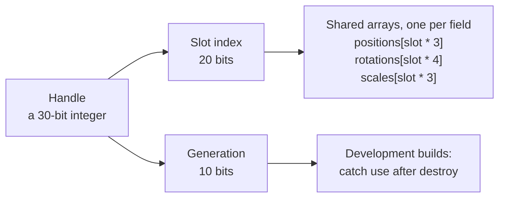

# Handles and objects

> Planned for null3d 0.1. No release has these APIs yet, so coding agents must not use them.



Every scene object in null3d is a small integer called a handle. The object's data lives in shared arrays, one array per field, and the handle's slot number is the object's index into each array.

## What a handle holds

A handle packs two numbers into 30 bits:

| Part | Bits | Purpose |
| --- | --- | --- |
| Slot index | 20 | The object's row in the data arrays. One engine holds up to 1,048,575 live scene objects. |
| Generation | 10 | A counter that changes when a slot is reused, so the engine can tell an old handle from a new one. |

Each instance in an instance batch is a row of that batch, with no handle of its own. The limit therefore does not cap instance counts.

Handles are 30 bits because Chrome's JavaScript engine stores integers of up to 31 bits, sign included, directly in the value, with no memory allocation. A handle therefore never creates garbage, even in a loop that runs every frame.

## Wrapper objects

`Mesh`, `Light`, `Camera` and `Group` are small classes that hold the engine and a handle. The engine creates one wrapper per scene object, at the moment you create the object, so frames allocate no wrappers.

```ts
const crate = scene.createMesh({
  mesh: geometry.box({ width: 1, height: 1, depth: 1 }),
  material: materials.standard({ color: '#b5651d' }),
  position: [0, 0.5, 0],
});

crate.setPosition(2, 0.5, 0);

const out = [0, 0, 0];
crate.getWorldPosition(out); // writes into out, allocates nothing
```

Setters such as `setPosition`, `setRotation` and `setScale` write straight into the shared arrays. Getters take an output array, so a hot path allocates nothing.

Each kind of handle has its own TypeScript type: `MeshHandle`, `LightHandle` and `CameraHandle`. Passing a light where the engine expects a mesh fails at compile time and costs nothing at run time.

## Slots stay put

A slot keeps its index until its object is destroyed, and the engine reuses freed slots for new objects. The engine never moves an object into another slot to close a gap. So an index your code computed once, such as `positions[slot * 3]`, stays valid for the object's whole life.

Each slot holds the object's position (3 floats), rotation as a quaternion (4 floats) and scale (3 floats). It also holds the parent's slot, flags, the mesh and material IDs, and a bounding sphere.

## Stale handles

When you destroy an object, its slot's generation changes. A handle you kept from before the destroy no longer matches:

```ts
crate.destroy();
crate.setPosition(0, 0, 0); // development build: throws an EngineError
```

In development builds the engine checks every handle and throws an `EngineError` that names the object and the frame it was destroyed in. Release builds leave the check out, so a setter costs only its memory write.

## Keep game data in your own arrays

A handle names engine data. Keep per-object game state, such as velocity or health, in your own typed arrays, indexed the way your game counts objects. For an instance batch, index them by row:

```ts
const drones = scene.createInstances(droneMesh, 5_000, { dynamic: true });
const velocity = new Float32Array(drones.count * 3); // your data, one row per drone
```

Your loops then read your arrays and write the engine's arrays, and neither side allocates.

## Related pages

- [Static and dynamic objects](static-dynamic.md): when a write reaches the GPU.
- [Architecture: threads and the frame](architecture.md): where the shared arrays live.
