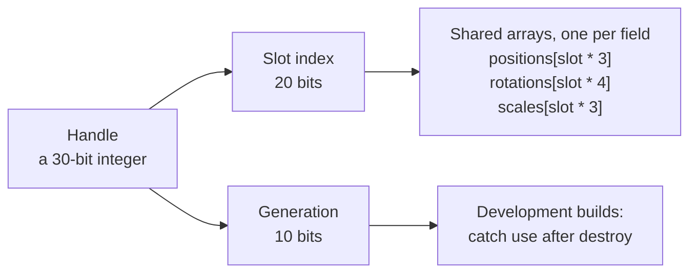

# Handles and objects

> Ships in null3D 0.1. The API is experimental, so it can still change between versions.



Every mesh, camera and group in null3D has a handle: a small integer that names it. The object's data lives in shared arrays, one array per field, and the handle's slot number is the object's index into each array.

## What a handle holds

A handle packs two numbers into 30 bits:

| Part | Bits | Purpose |
| --- | --- | --- |
| Slot index | 20 | The object's row in the data arrays. 20 bits give room for 1,048,575 objects, and this version's scene holds up to 16,383. |
| Generation | 10 | A counter that changes when a slot is reused, so the engine can tell an old handle from a new one. |

Each instance in an instance batch is a row of that batch, with no handle of its own. The limit therefore does not cap instance counts.

Handles are 30 bits because Chrome's JavaScript engine stores integers of up to 31 bits, sign included, directly in the value, with no memory allocation. A handle therefore never creates garbage, even in a loop that runs every frame.

## Wrapper objects

`Mesh`, `Camera` and `Group` are small classes that hold the scene and a handle. The engine creates one wrapper per object, at the moment you create the object, so frames allocate no wrappers. The directional light and the ambient light have no handle: each one sets a light for the whole scene.

```ts
const crate = scene.createMesh({
  mesh: geometry.box({ width: 1, height: 1, depth: 1 }),
  material: materials.standard({ color: '#b5651d' }),
  position: [0, 0.5, 0],
});
crate.setPosition(2, 0.5, 0);

const out = new Float32Array(3); // made once, in the setup

// In onUpdate, from the second frame on:
crate.getWorldPosition(out); // writes into out, allocates nothing
```

Setters such as `setPosition`, `setRotation` and `setScale` write straight into the shared arrays. Getters take an output array, so a hot path allocates nothing. The engine adds a new object to the scene when it processes the frame, after `onUpdate` returns. Read the object's world position in that frame's `onLateUpdate`, or from the next `onUpdate` call on.

Each kind of object has its own class. Passing a mesh where the engine expects a camera, as in `scene.setActiveCamera(crate)`, fails at compile time.

## Slots stay put

A slot keeps its index until its object is destroyed. The engine reuses freed slots for new objects, but it never moves an object into another slot to close a gap. Error messages name an object by its name and slot, such as `"Crate" (slot 7)`, and `describe()` returns the same text.

Each slot holds the object's position (3 floats), rotation as a quaternion (4 floats) and scale (3 floats). It also holds the parent's slot, flags, the layer mask, the grid cell, and the mesh and material IDs. The last fields are the render order and the center and radius of the object's bounding sphere.

## Stale handles

When you destroy an object, its slot's generation changes. A handle you kept from before the destroy no longer matches:

```ts
crate.destroy();
crate.setPosition(0, 0, 0); // development build: throws E1101
```

In development builds, every call on an object apart from `describe` checks that the object still lives. A call on a destroyed object throws an `EngineError` with the code [E1101](../errors/E1101.md), which names the object and the frame it was destroyed in. Release builds leave this check out, so a transform setter costs only its memory writes.

## Keep per-object data in your own arrays

A handle names engine data. Keep per-object state, such as velocity or health, in your own typed arrays, indexed the way your sketch counts objects. For an instance batch, index them by row:

```ts
const drones = scene.createInstances(droneMesh, 5_000, { material: droneMaterial, dynamic: true });
const velocity = new Float32Array(drones.count * 3); // your data, one row per drone
```

Your loops then read your arrays and write the engine's arrays, and neither side allocates.

## Related pages

- [Objects and transforms](../api/objects.md): every call on a mesh, camera or group.
- [Static and dynamic objects](static-dynamic.md): when a write reaches the GPU.
- [Instances and batching](instances.md): rows instead of handles, for many copies of one mesh.
- [Architecture: threads and the frame](architecture.md): where the shared arrays live.
