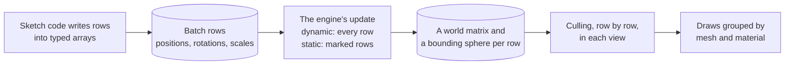

# Instances and batching

> Ships in null3D 0.1. The API is experimental, so it can still change between versions. Drawing each row in its own color and custom per-instance attributes are not built yet, so coding agents must not use them.



An instance batch draws one mesh with one material many times. Each copy is a row in the batch's typed arrays, with its own position, rotation and scale. Sketch code writes the rows straight into engine memory, with no call per row. The engine then computes and culls the rows in bulk, on its job workers or on the GPU.

Use a batch for many copies that you move in loops, such as particles, bullets, crowds, trees and rocks. Use separate objects from `scene.createMesh` when each copy needs a name, a parent or its own setters.

## Create a batch

```ts
import { defineSketch } from '@null3d/engine';

export default defineSketch(({ scene, geometry, materials }) => {
  const camera = scene.createPerspectiveCamera({ position: [0, 30, 60], target: [0, 0, 0] });
  scene.setActiveCamera(camera);
  scene.createDirectionalLight({ direction: [-1, -2, -1], intensity: 3 });

  const rocks = scene.createInstances(geometry.sphere({ radius: 0.2 }), 10_000, {
    material: materials.standard({ color: '#8a8a8a' }),
  });
  const positions = rocks.positions;
  for (let i = 0; i < rocks.count; i++) {
    positions[i * 3] = (Math.random() - 0.5) * 100;
    positions[i * 3 + 2] = (Math.random() - 0.5) * 100;
  }
});
```

`scene.createInstances(mesh, count, options)` takes these options:

| Option | Default | What it does |
| --- | --- | --- |
| `material` | None: it is required | The material of every row |
| `dynamic` | `false` | `true` recomputes and uploads every row in use, in every frame. A static batch updates only the rows that you mark. |
| `colors` | `false` | `true` adds a `colors` array |
| `layers` | `1`, layer 0 | The [layers](render-layers.md) of every row, as a 32-bit mask |

`count` is the batch's capacity, which never changes. All rows draw at first. A new batch computes every row in its first frame, so rows that you write before that frame need no mark.

## The row arrays

| Array | Floats per row | What each row holds | A new row holds |
| --- | --- | --- | --- |
| `positions` | 3 | The position (x, y, z) | 0, 0, 0 |
| `rotations` | 4 | The rotation as a quaternion (x, y, z, w) | 0, 0, 0, 1 |
| `scales` | 3 | The scale on each axis | 1, 1, 1 |
| `colors` | 4 | A linear color (r, g, b, a), with `colors: true` only | 1, 1, 1, 1 |

Row `i` starts at index `i * 3` in an array of 3 floats per row, and at `i * 4` in an array of 4. Rows have no parent, so each position is in world space.

The arrays are `Float32Array` views of engine memory. The engine's memory can grow when the scene grows: new meshes, batches, materials and lights, and textures made or updated from data. In the single-threaded build, growth empties every older view, and a write to an empty view does nothing. So read the arrays from the batch each time you use them, such as at the start of `onUpdate`. Do not keep them from the setup. A read allocates nothing while the memory keeps its size.

To turn rows, write quaternions. The [math helpers](../api/math.md) make them without allocating:

```ts
import { defineSketch, quat } from '@null3d/engine';

export default defineSketch(({ scene, geometry, materials, time }) => {
  // The camera and the lights as in the first example.
  const birds = scene.createInstances(geometry.box({ width: 0.4, height: 0.1, depth: 0.2 }), 5_000, {
    material: materials.standard({ color: '#d0d0d0' }),
    dynamic: true,
  });
  const phase = new Float32Array(birds.count); // your own data, one value per row
  for (let i = 0; i < birds.count; i++) phase[i] = Math.random() * Math.PI * 2;
  const up = [0, 1, 0];
  const q = quat.create(); // a scratch quaternion, made once

  return {
    onUpdate() {
      const positions = birds.positions; // read the views in each frame
      const rotations = birds.rotations;
      for (let i = 0; i < birds.count; i++) {
        const a = time.now * 0.5 + phase[i];
        positions[i * 3] = Math.cos(a) * 20;
        positions[i * 3 + 1] = 5 + Math.sin(a * 3);
        positions[i * 3 + 2] = Math.sin(a) * 20;
        quat.setAxisAngle(q, up, -a); // turn each bird about the vertical axis
        rotations.set(q, i * 4);
      }
    },
  };
});
```

Rows that you write in `onUpdate` show in that frame.

## Static and dynamic batches

| | Static batch (the default) | Dynamic batch |
| --- | --- | --- |
| Recomputed | Only the rows that you mark with `markDirty` | Every row in use, in every frame |
| Uploaded to the GPU | The marked rows, once | Every row in use, in every frame |
| Best for | Rows that rarely move, such as trees, rocks and buildings | Rows that move in most frames |

The engine does not see a write to a static batch until you mark the rows. `markDirty(start, count)` marks `count` rows from row `start`. With no arguments it marks every row, and with one argument it marks the rows from `start` to the end:

```ts
// In the setup:
const trees = scene.createInstances(treeMesh, 5_000, { material: bark }); // static
const q = quat.create();

// Later, in onUpdate: the tree in row 42 falls over.
quat.setAxisAngle(q, [1, 0, 0], Math.PI / 2);
trees.rotations.set(q, 42 * 4);
trees.markDirty(42, 1); // recompute and upload row 42 only
```

A mark past the batch's capacity throws [E1108](../errors/E1108.md). A dynamic batch needs no marks, because it recomputes every row in use in every frame. [Static and dynamic objects](static-dynamic.md) compares what each kind uploads.

## Pools: draw only the rows in use

`setActiveCount(n)` draws only the first `n` rows. Size a batch for the most rows it will ever need, and keep the rows in use at the front of its arrays. A new active count is cheap: the engine recomputes the rows that come into use, and keeps its draw tables.

```ts
const bullets = scene.createInstances(geometry.sphere({ radius: 0.05 }), 1_000, {
  material: materials.unlit({ color: '#ffd23f' }),
  dynamic: true,
});
let live = 0;
bullets.setActiveCount(0);

function fire(x: number, y: number, z: number): void {
  if (live === bullets.count) return; // every row is in use
  const p = bullets.positions;
  p[live * 3] = x;
  p[live * 3 + 1] = y;
  p[live * 3 + 2] = z;
  live++;
  bullets.setActiveCount(live);
}

function remove(row: number): void {
  live--;
  // Move the last row in use into the gap, so the rows in use stay at the front.
  bullets.positions.copyWithin(row * 3, live * 3, live * 3 + 3);
  bullets.setActiveCount(live);
}
```

Keep each row's own data, such as a velocity, in your own typed arrays in the same row order, and move it the same way. An active count past the capacity throws [E1108](../errors/E1108.md).

`destroy()` removes a batch at once and frees its rows. After it, stop using the batch and every array that you read from it. Its calls throw [E1101](../errors/E1101.md), and so do its array getters, such as `positions`, in every build. An array that you read before the destroy can point at memory that the engine gives to another batch.

## Culling

Each row has its own bounding sphere. The sphere's center is the row's position, and its radius is the mesh's radius times the row's largest scale. The engine culls row by row in each view, and skips the rows outside the view. On WebGPU a compute pass on the GPU culls. On WebGL2 the job workers cull. They test a static batch at rest in groups of 64 nearby rows, each group inside one grid cell. A group that is partly in view draws whole, and the GPU clips the rows outside. In a scene over several grid cells, both paths skip the rows of static batches in the cells out of view ([Culling](culling.md)). On WebGL2, a frame where you mark a static batch's rows tests the batch row by row, with no cell skipped. So does the frame after it.

## Automatic batching

The engine groups what it draws by mesh and material. Objects from `scene.createMesh` and batch rows that share a mesh and a material draw together. They share instanced or indirect draws. So 500 crates from `createMesh` with one mesh and one material draw as cheaply as a batch of 500 rows. On WebGPU, an object with bounds of its own from `setBounds`, and an object that is never culled, each draw apart from the others. On WebGL2 the groups split further. There, the rows of a dynamic batch and of a static batch at rest draw apart from objects with the same mesh and material.

The difference is the sketch's own work on the CPU:

| | Separate objects | An instance batch |
| --- | --- | --- |
| Moving one | A setter call, such as `setPosition` | A write to the arrays, with no call |
| Hierarchy | Parents and children | None: each row is in world space |
| Identity | A name and a handle each | A row number |

Some calls change the scene's structure: creating or destroying a batch or an object of any kind, lights included, and `setMaterial`, `setMesh`, `setParent`, `setDynamic`, `setBounds`, `setFrustumCulled`, `setCastShadows` and `setReceiveShadows`. So do `texture.destroy()`, and `texture.update()` with an image of another size. The next frame then rebuilds the engine's draw tables, which costs more than a normal frame. `setBounds` rebuilds on every call, even with the same bounds. Transform setters, row writes, `setVisible`, `setLayers`, `setActiveCount` and `setRenderOrder` never rebuild the tables. Neither do the other setters of lights and cameras, or `material.set`. So create batches in the setup, and pool rows during play instead of creating batches.

## Limits

- An engine holds up to 256 instance batches. One more throws [E1102](../errors/E1102.md).
- Every row counts toward the device's limit of objects and instance rows, whether it draws or not. `engine.capabilities.maxInstances` gives the limit. The scene's 16,384 object slots always count toward it too, used or not. So the batches of a scene hold at most the limit less 16,384 rows. A `createInstances` call that would pass it throws [E1501](../errors/E1501.md).
- Each row takes about 210 bytes of engine memory, or about 260 with colors. When the engine cannot get more memory, `createInstances` throws [E1109](../errors/E1109.md).
- On WebGL2 the limit follows the largest texture the device allows. A device whose textures reach only 2,048 pixels, the least that WebGL2 allows, draws 1,048,576, which leaves 1,032,192 rows for batches. [GPU tiers and backends](backends.md#the-portable-budget) gives the numbers.
- Development builds warn once in the console when a scene passes the number that every device of its GPU path draws. On WebGPU that is 2,097,152, the most that devices with WebGPU's default limits draw. On WebGL2 it is 1,048,576. The engine picks the GPU path for each device, so test a scene past 1,048,576 on both paths.

## Per-row colors

`colors: true` adds a `colors` array, with a linear RGBA color for each row, white at first. Convert an sRGB color, such as a hex string, with the color helpers in [Math helpers](../api/math.md). This version keeps the colors but does not draw them yet: every row shows its material's color.

## Related pages

- [Static and dynamic objects](static-dynamic.md): what each kind recomputes and uploads.
- [Handles and objects](handles.md): separate objects, and per-object data in your own arrays.
- [Scene](../api/scene.md): `createInstances` and the reference of instance batches.
- [Math helpers](../api/math.md): vectors, quaternions and colors for rows.
- [The instance batch demo](https://github.com/null3d-engine/null3d/tree/main/examples/instances): 10,000 boxes in one batch that the sketch moves in each frame.
