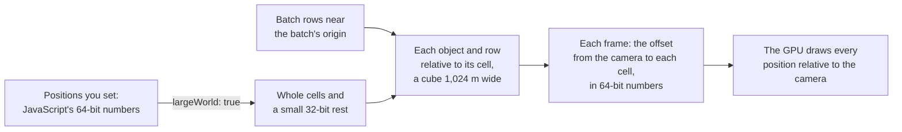

# Large worlds and precision

> Roadmap step 0.2, first released in null3D 0.1.0. The API is experimental, so it can still change between versions.



A 32-bit float holds about seven significant digits. Far from the origin, a 32-bit position therefore moves in coarse steps. The step is about 1 mm at 10 km, 6 cm at 1,000 km and 0.5 m at the Earth's radius. A scene drawn straight from such numbers jitters as the camera moves. The engine keeps such scenes precise in three ways:

- It stores each object and instance row relative to a grid cell, so stored numbers stay small.
- It draws relative to the camera, so the GPU gets small numbers where the viewer looks.
- In large-world mode, the position setters keep the full precision of JavaScript's numbers.

## Grid cells

The engine divides space into cells, cubes 1,024 m wide. The cell at the origin spans -512 m to 512 m along each axis. A root object takes the cell that holds its position, and its children take its cell. An instance row takes the cell that holds its position. Each world matrix is relative to its cell's center, so its numbers stay under 512 m.

Each frame, the engine computes the offset from the camera to each cell in use, in 64-bit numbers. The GPU adds a cell's offset to the positions of the cell's objects. So every position that the GPU draws is relative to the camera, and most precise near it. Still objects keep their matrices on the GPU while the camera moves, because only the offsets change. [Culling](culling.md) skips whole cells out of view first.

A scene within 512 m of the origin uses the origin's cell alone, which covers most games. Its only cost is one offset per frame.

Lights, shadow cascades, raycasts, overlap queries, `screenToRay`, `worldToScreen` and debug lines all work from the cells in 64-bit numbers. So they keep their precision far from the origin too.

## Large-world mode

Cells keep world matrices precise, but a position that you set is a 32-bit float by default. At the Earth's radius it moves in steps of 0.5 m before it reaches a cell. Start the engine with `largeWorld: true`, and the setters keep each position exact:

```ts
// page.ts
const engine = await createEngine({ canvas, sketch, largeWorld: true });
```

```ts
import { defineSketch } from '@null3d/engine';

/** The Earth's radius, in meters. */
const R = 6_378_137;

export default defineSketch(({ scene, geometry, materials }) => {
  // A tower on the Earth's surface, and a camera that walks past it.
  const camera = scene.createPerspectiveCamera({ position: [-40, R + 2, 30], target: [0, R + 20, 0] });
  scene.setActiveCamera(camera);
  scene.createDirectionalLight({ direction: [-1, -2, -1], intensity: 3 });
  scene.createMesh({
    mesh: geometry.box({ width: 10, height: 40, depth: 10 }),
    material: materials.standard({ color: '#8a8a8a' }),
    position: [0, R + 20, 0],
  });

  return {
    onUpdate(dt) {
      camera.translate(dt * 1.5, 0, 0); // 1.5 m per second, smooth at the Earth's radius
    },
  };
});
```

Each setter splits each number into a whole number of cells and a 32-bit rest of at most half a cell. The rest keeps 0.03 mm or better, at any distance. The engine adds the whole cells to the cell of the rest. `getPosition`, `translate` and `lookAt` read the whole position back. So a move of a millimeter stays a millimeter.

The mode costs a few operations in each position setter. It also takes 12 bytes of engine memory for each place in the scene's object tables. That is about 12 KB at the start, and more as the tables grow. Use it for scenes that reach beyond about 100 km from the origin. There, a 32-bit position moves in steps of 8 mm or more. Instance batches do not need the mode: give each one an origin instead.

## Batch origins

Sketch code writes an instance batch's rows straight into its arrays of 32-bit floats. The `origin` option of `scene.createInstances` gives the batch a point that every row is relative to. The engine keeps the origin at full precision, so rows near it keep the precision of 32-bit floats at any distance from the world's origin:

```ts
// A forest tile on the Earth's surface: each row is a few hundred meters from the tile's center.
const center = [1_234_567.25, 6_378_137, -98_765.5];
const trees = scene.createInstances(treeMesh, 5_000, { material: bark, origin: center });
const positions = trees.positions;
for (let i = 0; i < trees.count; i++) {
  positions[i * 3] = (Math.random() - 0.5) * 400;
  positions[i * 3 + 2] = (Math.random() - 0.5) * 400;
}
```

Sprite, point and line batches take the same `origin` option. Batch origins work with large-world mode and without it. A model's own instancing, from the `EXT_mesh_gpu_instancing` extension, takes its node's place as its batch's origin, so its rows stay precise too.

## A moving camera

A camera that moves far from the origin stays as smooth as one near it. Each frame, the engine computes the camera's offset to each cell in 64-bit numbers, so the offsets stay small and exact near the camera.

A test checks this with a flight. A camera flies sideways past six squares, 4 m to 35 m away, 12 cm per frame for 16 frames. It flies at the origin, 1,000 km out and at the Earth's radius, in large-world mode. Each square's image moves from frame to frame as it does at the origin, within 0.0001 pixels. This holds on WebGPU, its compatibility mode and WebGL2.

The same flight without large-world mode, or with no free cell, jitters. The camera's position then moves in steps of about 6 cm at 1,000 km and 0.5 m at the Earth's radius. So the squares jump by up to 3.5 pixels at 1,000 km and 7.8 pixels at the Earth's radius.

## Floating-origin geometry

Vertex positions are 32-bit floats relative to their object's origin, and the engine does not split them. So keep them small: build each mesh around its own center, and place the center with the object's position. Terrain tiles, roads and city blocks far from the origin then keep their precision. A tile whose vertices hold Earth-centered coordinates would move in steps of 0.5 m. Large coordinates belong in object positions and batch origins, never in vertices.

Shaders work the same way. The surface input's `relativePosition` is relative to the camera, so it is exact near the camera wherever the camera is. The absolute world position holds fewer digits far from the origin. [Built-in shader inputs](../shaders/builtins.md) lists both.

## Depth

The engine draws reversed depth in a 32-bit float buffer on every GPU path. The far plane stores 0, where floating-point numbers are most precise. So far surfaces stay apart over long view distances, which large scenes need. On WebGL2 without the `EXT_clip_control` extension, reversed depth keeps WebGL2's range from -1 to 1, which is less precise. [Depth on each tier](backends.md#depth-on-each-tier) gives the distances, and `engine.capabilities.depth` says which depth the device draws.

three.js offers logarithmic depth for large scenes. It writes depth from the fragment shader, which turns off the GPU's early depth test, so the engine does not use it.

## Limits

- At most 512 cells are in use at once, the origin's cell included. A cell is in use while an object or a row lies in it, and frees when the last one leaves. When all 512 are in use, an object or a row that enters a new cell goes into the origin's cell instead. There it has the precision of a 32-bit position. The engine then warns once in the console, as such content jitters far from the origin.
- Dense content fills the most objects and rows that a scene can draw before it fills the cells. A city of 20,000 objects per square kilometer reaches that most at about 420 km² of flat ground: about 420 cells. Content spread thin can reach it, such as one marker in each of 1,000 towns. Keep such content in fewer cells. Put far objects under a few parent objects, as children share their root's cell. Or create and destroy them as the camera moves.
- In large-world mode, positions reach about 2 × 10¹² m from the origin, the most whole cells that a 32-bit integer counts.

## Related pages

- [Culling](culling.md): how cells speed up culling.
- [Instances and batching](instances.md): instance batches and their options.
- [Objects and transforms](../api/objects.md): the position setters and getters.
- [Engine](../api/engine.md): the `largeWorld` option of `createEngine`.
- [GPU tiers and backends](backends.md#depth-on-each-tier): depth on each tier.
- [The large world demo](https://github.com/null3d-engine/null3d/tree/main/examples/large-world): a drive along a road on the Earth's surface, in large-world mode with batch origins.
