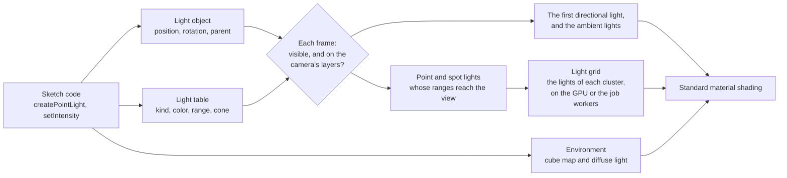
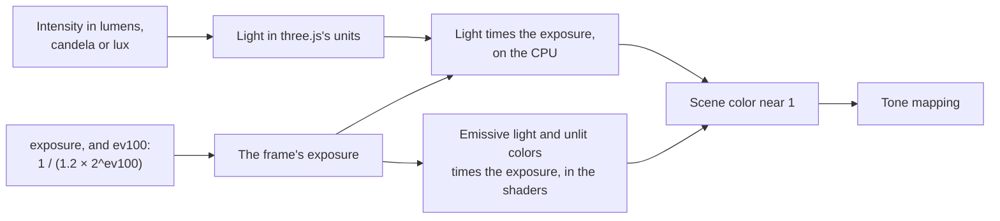
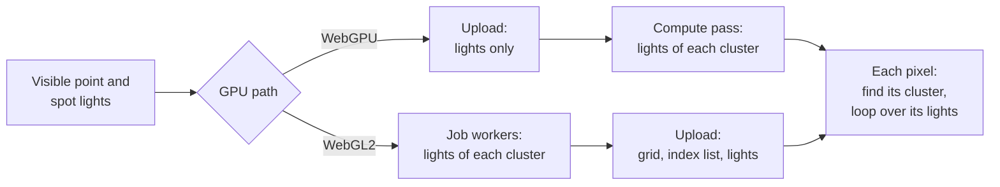

# Lighting and environment

> Ships in null3D 0.1, with environment maps from 0.2. The API is experimental, so it can still change between versions. Hemisphere lights do not light surfaces yet, and surfaces show one directional light. The quality presets do not set the light limits yet. Coding agents must not rely on these parts.



Every light is a scene object with a row in the engine's light table. The object holds what every object holds: where the light is, which way it faces, its parent, whether it is visible, and its layers. The light table holds the rest: the light's kind, its colors, its intensity, and for point and spot lights their range, decay and cone.

Setters change the engine's memory at once, and they allocate nothing except those that convert a color. Each frame, after the engine updates transforms, it reads every light:

1. It skips a light that is hidden by itself or a parent, or whose layer mask shares no bit with the camera's.
2. The first directional light created that remains, the sum of the ambient lights, and the scene's environment become the light that standard materials reflect.
3. It tests the sphere of each point and spot light's range against the camera's view, and lists the lights whose spheres reach into it.
4. Each listed light goes into the clusters of the view that its sphere reaches. On WebGPU the GPU does this work, and on WebGL2 the job workers do it, as [Clustered forward shading](#clustered-forward-shading) explains.

## Kinds of light and their units

Units follow three.js since r155, which dropped its legacy light mode. A scene tuned for three.js's current units needs the same intensities in null3D.

| Light | What it models | Intensity | `intensityUnit` |
| --- | --- | --- | --- |
| Directional | The sun or the moon: parallel light from one direction | Lux: the light that reaches a surface facing it | `'lux'` |
| Point | A bulb: light from a point in every direction | Candela | `'lumen'`: divided by 4π |
| Spot | A torch or a stage light: light from a point in a cone | Candela | `'lumen'`: divided by π at any cone angle |
| Hemisphere | Sky and ground: light that fades from one color to the other with the way a surface faces | Lux, on both colors | `'lux'` |
| Ambient | Light that bounces everywhere, from no direction | Lux | `'lux'` |

A standard material reflects light with the formulas of three.js's `MeshStandardMaterial`. A rough surface that is not a metal reflects close to its color divided by π, times the light that reaches it. A white directional light with an intensity of π therefore shows a white, rough surface that faces it as nearly white.

Point and spot lights fade with distance by their `decay`. A decay of 2, the default, fades light with the square of the distance, as real light fades. Each also ends at its `range`, because the engine finds the lights near each surface by their ranges. three.js's `distance` of 0, a light with no end, has no equivalent.

```ts
import { defineSketch } from '@null3d/engine';

export default defineSketch(({ scene }) => {
  // A late-afternoon sun, a blue sky over brown ground, and a warm lamp.
  scene.createDirectionalLight({ direction: [-1, -0.6, -0.4], color: '#ffd9a8', intensity: 2.5 });
  scene.createHemisphereLight({ skyColor: '#9ec5ff', groundColor: '#5a4632', intensity: 0.8 });
  scene.createPointLight({ position: [2, 1.5, 0], color: '#ffb46b', intensity: 12, range: 6 });
});
```

## Units and exposure



A scene can keep three.js's units, as most scenes and ports do, or use real units. A real sun gives about 100,000 lux, an 800-lumen bulb lights a room, and a camera's exposure brings that light to the screen. In null3D, `intensityUnit` gives a light its real unit, and `post.set({ ev100 })` sets the camera's exposure value at ISO 100, as in Filament and Bevy. The exposure is 1 / (1.2 × 2^ev100): about 1 / 39,000 at 15, a sunny day.

The engine multiplies the exposure into each light at its source, as Filament does, not into the finished picture. On the CPU it scales each light, the background color and the fog color. In the shaders it scales emissive light, light maps, unlit colors and background textures. Everything before the tone mapping is linear, so the picture is the same as with the exposure at the end. But the scene's colors stay near 1, so a 16-bit float holds them. With the exposure at the end, a sun of 100,000 lux gives a smooth metal a highlight above 65,504. That is the largest 16-bit float, so the highlight loses its color.

```ts
import { defineSketch } from '@null3d/engine';

export default defineSketch(({ scene, post }) => {
  // A sunny day in real units: the sun in lux, a lamp in lumens, and a camera at EV100 15.
  post.set({ ev100: 15 });
  scene.createDirectionalLight({ direction: [-1, -2, -1], intensity: 100_000, intensityUnit: 'lux' });
  scene.createAmbientLight({ intensity: 20_000, intensityUnit: 'lux' });
  scene.createPointLight({ position: [0, 1, 0], range: 10, intensity: 1_000_000, intensityUnit: 'lumen' });
});
```

Colors that you set in the scene's units take the exposure too: a background color, an unlit material's color and an emissive color. At EV100 15 a background color of white draws black, as it does in three.js at the same exposure. Give emissive light in nits instead, through `emissiveIntensity`, such as 40,000 for about white at EV100 15. [Post-processing API](../api/post.md#lights-in-real-units) gives the settings.

## Clustered forward shading

A scene can hold hundreds of point and spot lights, but a surface only needs the few whose ranges reach it. The engine therefore cuts the camera's view into clusters. The screen splits into 16 tiles across and 9 up, and the depth splits into 24 slices. Slices grow with distance, from the near plane out to where the farthest light ends. Near the camera, where each meter covers more of the screen, slices are thin.

Each frame the engine lists, for each cluster, the lights whose range spheres reach it. Each pixel of a standard material then finds its cluster and loops over that cluster's lights alone. The test is conservative: a cluster may list a light that ends just before it, but never misses a light that reaches it. Each light fades smoothly to nothing at its range, so a listed light that does not reach a pixel adds nothing.



Where the lists come from depends on the GPU path:

- On WebGPU, a compute pass on the GPU lists each cluster's lights, before the scene draws. The CPU only picks the frame's lights, cuts the view into slices and uploads the light list. Its work per frame stays small with hundreds of lights.
- On WebGL2, which has no compute shaders, the job workers list them on the CPU, and the frame uploads the lists as data textures.

Both paths use the same tests in the same order, so they list the same lights in each cluster.

The engine shades each surface in the pass that draws it. A deferred renderer would light the whole screen in a later pass instead. Forward shading favors phones and tablets:

- A deferred renderer writes several full-screen buffers in every frame, and on the tile-based GPUs of phones that memory traffic is the main cost.
- Forward shading works with MSAA directly, where deferred shading needs extra passes.
- Transparent surfaces use the same lighting code as opaque ones.

Both GPU paths light a scene the same way. WebGPU reads the lists from storage buffers, and WebGL2 from small data textures. In this version the camera lists up to 1,024 point and spot lights in a frame, the ones nearest to it. Each cluster lists up to 128. [Performance guide](../guides/performance.md#point-and-spot-lights) gives the cost of lights.

## Lights as objects

Because each light is an object, it moves, turns, hides and has a parent the way a mesh does. A lamp that is the child of a car moves with the car. Directional and spot lights send their light along their -Z axis, as a camera looks, so `lookAt` aims them. A hemisphere light's sky lies along its +Y axis.

Point and spot lights that move in most frames should be dynamic, with `dynamic: true`, as any object that moves in most frames should be. [Static and dynamic objects](static-dynamic.md) explains the choice.

## Lights far from the origin

The engine keeps each object's position relative to a grid cell, a cube of space about 1 km wide. Scenes far from the origin then stay precise. Lights take part too. Each frame the engine finds every point and spot light's position relative to the camera, with the offset between their cells in 64-bit floats. A lamp 1,000 km from the origin is then as precise, next to the camera, as a lamp at the origin.

## Fog

Fog fades objects toward one color with their distance from the camera, as air does over a landscape. A sketch sets it with `scene.setFog`: linear fog or exponential squared fog, with three.js's formulas and defaults. [Scene](../api/scene.md#fog) lists the options. The distance is the depth along the camera's view direction, for both kinds of camera, so objects at the same depth take the same fog.

The engine mixes the fog into each pixel's color as it shades the pixel, after lighting and before it encodes the color for the screen. Fog therefore needs no pass and no texture, and adds almost no work. The mix happens in linear color, as in three.js's WebGPURenderer. The background takes no fog, so scenes with fog usually give the background the fog's color. A material created with `fog: false` keeps its color at every distance.

## Environment maps

An environment map holds the light that reaches a point from every direction, such as a sky, a street or a room. Metal and glossy surfaces reflect it, and every surface takes some of it as diffuse light. Metals need it most, since they have almost no diffuse color and show only what they reflect.

```ts
import { defineSketch } from '@null3d/engine';

export default defineSketch(async ({ scene, assets, materials, geometry }) => {
  // The room of three.js's RoomEnvironment: soft, neutral light, with no file of your own.
  scene.setEnvironment(await assets.builtinEnvironment('room'));
  // Or a file that `bunx @null3d/cli assets env` made from an HDR image, turned and dimmed:
  // scene.setEnvironment(await assets.loadEnvironment('/env/sunset.ktx2'), { intensity: 0.8, rotation: [0, Math.PI / 2, 0] });
  const chrome = materials.standard({ color: '#d8d8d8', metalness: 1, roughness: 0.1 });
  scene.createMesh({ mesh: geometry.sphere(), material: chrome });
  return {};
});
```

The engine takes an environment as one KTX2 file, which `bunx @null3d/cli assets env` makes from an HDR image before you publish:

- A cube map with one level for each step of roughness. Level 0 holds the light itself, for mirrors. Each smaller level holds the light blurred as a rougher surface reflects it, with the GGX distribution of the standard material.
- Nine spherical harmonics coefficients, the diffuse light from each direction in a few numbers, as three.js's `LightProbe` holds it.

three.js builds the same data in the browser on every visit with `PMREMGenerator`. The engine reads the finished file, so a page does no prefiltering before it draws. [The asset pipeline](../guides/assets-pipeline.md#environment-maps) gives the command's options and the file's sizes.

The built-in room needs no file. The GPU draws three.js's room into a cube map and filters it for each roughness when a sketch first asks for it, as three.js's `PMREMGenerator.fromScene` does. It follows the asset tool's steps, so it gives the same map as `bunx @null3d/cli assets env --builtin room`.

### How an environment lights a surface

The standard material takes the environment's light as three.js's `MeshStandardMaterial` takes it from `scene.environment`:

- Specular light comes from the cube map, along the view's reflection about the surface's normal. A rough surface reads a smaller, blurrier level.
- Diffuse light comes from the nine coefficients, along the surface's normal.
- The split-sum terms of three.js's table weigh the two by the view's angle, the roughness and the metalness, with three.js's energy compensation.
- The occlusion map darkens the diffuse light, and darkens the specular light as three.js's `computeSpecularOcclusion` does.

three.js's PMREM blurs its levels a little less than the GGX distribution of its own materials. The engine therefore reads each roughness from the level that matches three.js's light best, from a table that compares the two. A port keeps its look: the spheres of the engine's parity scenes match three.js under three.js's own image rule.

`scene.setEnvironment(environment, { intensity, rotation })` sets the scene's environment, and `scene.setEnvironment(null)` removes it. `intensity` scales the light, as three.js's `scene.environmentIntensity` does. `rotation` turns the environment by Euler angles in radians, as `scene.environmentRotation` does. The call allocates nothing, so a sketch can turn the environment in every frame. A material's `envIntensity` scales the environment's light on that material alone.

| Call | Gives |
| --- | --- |
| `assets.loadEnvironment(url)` | An environment from a file of `bunx @null3d/cli assets env` |
| `assets.builtinEnvironment('room')` | The room that three.js's `RoomEnvironment` builds: a white room with six boxes and glowing panels. It is blurred as three.js's examples blur it, with `fromScene(room, 0.04)`. The GPU makes it, so no file downloads |
| `scene.setEnvironment(environment, options)` | Nothing: it lights the scene with the environment from the next frame |
| `environment.destroy()` | Nothing: it frees the cube map's GPU memory |

### Cost

- A page downloads the file reader, under 1 KB after Brotli, with its first environment file.
- The built-in room downloads no file. Its first use loads the code and the shaders that make it, about 7 KB after Brotli. The shaders compile in the background while the scene loads, and `builtinEnvironment` resolves once they are ready. The GPU then makes the whole map in the next frame, before that frame draws. So no frame shows the scene without the room's light. That frame takes longer by the map's GPU time, which the table below gives.
- Ask for the room while the scene loads. A call during play makes one long frame: on a phone, the time of 3 to 7 frames at 60 frames per second.
- A map of the default size takes 2 MB of GPU memory. A file's map uploads in the frames after the load, within the frame's upload budget. The scene draws without an environment until its map is on the GPU.
- The environment is a value of each frame, not a build of the shaders. So setting one builds no pipeline, and each pixel of a standard material pays one branch while the scene has none.
- With an environment, each pixel of a standard material reads the cube map once and adds up the nine coefficients.
- On WebGL2 the cube map takes one of the 16 texture units that a fragment shader may use. A standard material with all six maps uses 13 of them.

The tests of the room's generator measured these times in Chrome. The phones ran in a device cloud, on a page with no shader cache. On WebGPU the map's time is the GPU's own. On WebGL2 it runs from the call until the GPU has finished.

| Device | Shaders, in the background | The whole map, in one frame |
| --- | --- | --- |
| MacBook Pro (Apple M5 Max), WebGPU | 8 to 14 ms, once 300 ms | 20 to 21 ms, then about 9 ms for each later map |
| MacBook Pro (Apple M5 Max), WebGL2 | 9 to 15 ms | 20 to 27 ms, of which 16 to 17 ms on the GPU |
| Galaxy S25, Pixel 9, Pixel 10 and Pixel 11, WebGPU | 93 to 129 ms | 48 to 100 ms |
| The same phones, WebGL2 | 100 to 226 ms | 58 to 107 ms |

### Differences from three.js

- three.js takes `scene.environmentIntensity` in place of a material's `envMapIntensity` when the material has no map of its own. The engine multiplies the two, so `envIntensity` keeps its meaning with a scene environment.
- Each material can have its own `envMap` in three.js. The engine has one environment per scene.

## Related pages

- [Lights](../api/lights.md): the calls and options of each kind of light.
- [Scene](../api/scene.md#fog): the fog's options.
- [Objects and transforms](../api/objects.md): the calls that lights share with every object.
- [Render layers](render-layers.md): which cameras a light lights.
- [Materials](../api/materials.md): the standard material, which lights shade.
- [The asset pipeline](../guides/assets-pipeline.md#environment-maps): the command that makes environment maps.
- [Assets](../api/assets.md#environments): the calls that load environments.
