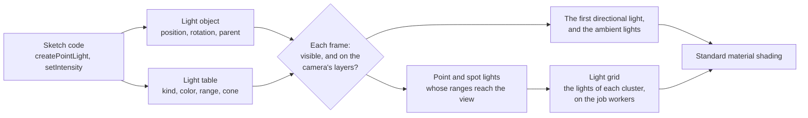
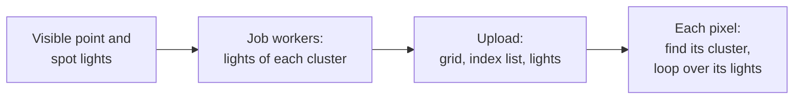

# Lighting and environment

> Ships in null3D 0.1. The API is experimental, so it can still change between versions. Hemisphere lights do not light surfaces yet, and surfaces show one directional light. The quality presets do not set the light limits yet. Environment maps and spherical harmonics come in null3D 0.2. Coding agents must not rely on these parts.



Every light is a scene object with a row in the engine's light table. The object holds what every object holds: where the light is, which way it faces, its parent, whether it is visible, and its layers. The light table holds the rest: the light's kind, its colors, its intensity, and for point and spot lights their range, decay and cone.

Setters change the engine's memory at once, and they allocate nothing except those that convert a color. Each frame, after the engine updates transforms, it reads every light:

1. It skips a light that is hidden by itself or a parent, or whose layer mask shares no bit with the camera's.
2. The first directional light created that remains, and the sum of the ambient lights, become the light that standard materials reflect.
3. It tests the sphere of each point and spot light's range against the camera's view, and lists the lights whose spheres reach into it.
4. The job workers put each listed light into the clusters of the view that its sphere reaches, as [Clustered forward shading](#clustered-forward-shading) explains.

## Kinds of light and their units

Units follow three.js since r155, which dropped its legacy light mode. A scene tuned for three.js's current units needs the same intensities in null3D.

| Light | What it models | Intensity |
| --- | --- | --- |
| Directional | The sun or the moon: parallel light from one direction | The light that reaches a surface facing it |
| Point | A bulb: light from a point in every direction | Candela |
| Spot | A torch or a stage light: light from a point in a cone | Candela |
| Hemisphere | Sky and ground: light that fades from one color to the other with the way a surface faces | A factor on both colors |
| Ambient | Light that bounces everywhere, from no direction | A factor on its color |

A standard material reflects light with the formulas of three.js's `MeshStandardMaterial`. A rough surface that is not a metal reflects close to its color divided by π, times the light that reaches it. A white directional light with an intensity of π therefore shows a white, rough surface that faces it as nearly white.

Point and spot lights fade with distance by their `decay`. A decay of 2, the default, fades light with the square of the distance, as real light fades. Each also ends at its `range`, because the engine finds the lights near each surface by their ranges. three.js's `distance` of 0, a light with no end, has no equivalent.

```ts
import { defineSketch } from '@null3d/engine';

export default defineSketch(({ scene }) => {
  // A late-afternoon sun, a blue sky over brown ground, and a warm lamp.
  scene.createDirectionalLight({ direction: [-1, -0.6, -0.4], color: '#ffd9a8', intensity: 2.5 });
  scene.createHemisphereLight({ skyColor: '#9ec5ff', groundColor: '#5a4632', intensity: 0.8 });
  scene.createPointLight({ position: [2, 1.5, 0], color: '#ffb46b', intensity: 12, range: 6 });
});
```

## Clustered forward shading

A scene can hold hundreds of point and spot lights, but a surface only needs the few whose ranges reach it. The engine therefore cuts the camera's view into clusters. The screen splits into 16 tiles across and 9 up, and the depth splits into 24 slices. Slices grow with distance, from the near plane out to where the farthest light ends. Near the camera, where each meter covers more of the screen, slices are thin.

Each frame the job workers list, for each cluster, the lights whose range spheres reach it. Each pixel of a standard material then finds its cluster and loops over that cluster's lights alone. The test is conservative: a cluster may list a light that ends just before it, but never misses a light that reaches it. Each light fades smoothly to nothing at its range, so a listed light that does not reach a pixel adds nothing.



The engine shades each surface in the pass that draws it. A deferred renderer would light the whole screen in a later pass instead. Forward shading favors phones and tablets:

- A deferred renderer writes several full-screen buffers in every frame, and on the tile-based GPUs of phones that memory traffic is the main cost.
- Forward shading works with MSAA directly, where deferred shading needs extra passes.
- Transparent surfaces use the same lighting code as opaque ones.

Both GPU paths light a scene the same way. WebGPU reads the lists from storage buffers, and WebGL2 from small data textures. In this version the camera lists up to 1,024 point and spot lights in a frame, the ones nearest to it. Each cluster lists up to 128. [Performance guide](../guides/performance.md#point-and-spot-lights) gives the cost of lights.

## Lights as objects

Because each light is an object, it moves, turns, hides and has a parent the way a mesh does. A lamp that is the child of a car moves with the car. Directional and spot lights send their light along their -Z axis, as a camera looks, so `lookAt` aims them. A hemisphere light's sky lies along its +Y axis.

Point and spot lights that move in most frames should be dynamic, with `dynamic: true`, as any object that moves in most frames should be. [Static and dynamic objects](static-dynamic.md) explains the choice.

## Lights far from the origin

The engine keeps each object's position relative to a grid cell, a cube of space about 1 km wide. Scenes far from the origin then stay precise. Lights take part too. Each frame the engine finds every point and spot light's position relative to the camera, with the offset between their cells in 64-bit floats. A lamp 1,000 km from the origin is then as precise, next to the camera, as a lamp at the origin.

## Fog

Fog fades objects toward one color with their distance from the camera, as air does over a landscape. A sketch sets it with `scene.setFog`: linear fog or exponential squared fog, with three.js's formulas and defaults. [Scene](../api/scene.md#fog) lists the options. The distance is the depth along the camera's view direction, for both kinds of camera, so objects at the same depth take the same fog.

The engine mixes the fog into each pixel's color as it shades the pixel, after lighting and before it encodes the color for the screen. Fog therefore needs no pass and no texture, and adds almost no work. The mix happens in linear color, as in three.js's WebGPURenderer. The background takes no fog, so scenes with fog usually give the background the fog's color. A material created with `fog: false` keeps its color at every distance.

## Related pages

- [Lights](../api/lights.md): the calls and options of each kind of light.
- [Scene](../api/scene.md#fog): the fog's options.
- [Objects and transforms](../api/objects.md): the calls that lights share with every object.
- [Render layers](render-layers.md): which cameras a light lights.
- [Materials](../api/materials.md): the standard material, which lights shade.
