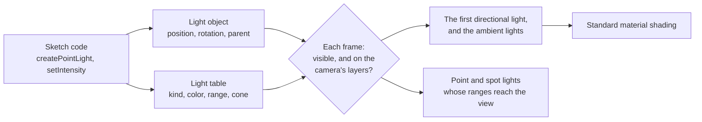

# Lighting and environment

> Ships in null3D 0.1. The API is experimental, so it can still change between versions. Clustered lighting is not built yet, so point, spot and hemisphere lights do not light surfaces, and surfaces show one directional light. Environment maps and spherical harmonics come in null3D 0.2. Coding agents must not rely on these parts.



Every light is a scene object with a row in the engine's light table. The object holds what every object holds: where the light is, which way it faces, its parent, whether it is visible, and its layers. The light table holds the rest: the light's kind, its colors, its intensity, and for point and spot lights their range, decay and cone.

Setters change the engine's memory at once, and they allocate nothing except those that convert a color. Each frame, after the engine updates transforms, it reads every light:

1. It skips a light that is hidden by itself or a parent, or whose layer mask shares no bit with the camera's.
2. The first directional light created that remains, and the sum of the ambient lights, become the light that standard materials reflect.
3. It tests the sphere of each point and spot light's range against the camera's view, and lists the lights whose spheres reach into it.

## Kinds of light and their units

Units follow three.js since r155, which dropped its legacy light mode. A scene tuned for three.js's current units needs the same intensities in null3D.

| Light | What it models | Intensity |
| --- | --- | --- |
| Directional | The sun or the moon: parallel light from one direction | The light that reaches a surface facing it |
| Point | A bulb: light from a point in every direction | Candela |
| Spot | A torch or a stage light: light from a point in a cone | Candela |
| Hemisphere | Sky and ground: light that fades from one color to the other with the way a surface faces | A factor on both colors |
| Ambient | Light that bounces everywhere, from no direction | A factor on its color |

A standard material reflects light with three.js's `MeshLambertMaterial` formula: the surface color divided by π, times the light that reaches it. A white directional light with an intensity of π therefore shows a white surface that faces it as white.

Point and spot lights fade with distance by their `decay`. A decay of 2, the default, fades light with the square of the distance, as real light fades. Each also ends at its `range`, because the engine finds the lights near each surface by their ranges. three.js's `distance` of 0, a light with no end, has no equivalent.

```ts
import { defineSketch } from '@null3d/engine';

export default defineSketch(({ scene }) => {
  // A late-afternoon sun, a blue sky over brown ground, and a warm lamp.
  scene.createDirectionalLight({ direction: [-1, -0.6, -0.4], color: '#ffd9a8', intensity: 2.5 });
  scene.createHemisphereLight({ skyColor: '#9ec5ff', groundColor: '#5a4632', intensity: 0.8 });
  scene.createPointLight({ position: [2, 1.5, 0], color: '#ffb46b', intensity: 12, range: 6 });
});
```

## Lights as objects

Because each light is an object, it moves, turns, hides and has a parent the way a mesh does. A lamp that is the child of a car moves with the car. Directional and spot lights send their light along their -Z axis, as a camera looks, so `lookAt` aims them. A hemisphere light's sky lies along its +Y axis.

Point and spot lights that move in most frames should be dynamic, with `dynamic: true`, as any object that moves in most frames should be. [Static and dynamic objects](static-dynamic.md) explains the choice.

## Lights far from the origin

The engine keeps each object's position relative to a grid cell, a cube of space about 1 km wide. Scenes far from the origin then stay precise. Lights take part too. Each frame the engine finds every point and spot light's position relative to the camera, with the offset between their cells in 64-bit floats. A lamp 1,000 km from the origin is then as precise, next to the camera, as a lamp at the origin.

## Related pages

- [Lights](../api/lights.md): the calls and options of each kind of light.
- [Objects and transforms](../api/objects.md): the calls that lights share with every object.
- [Render layers](render-layers.md): which cameras a light lights.
- [Materials](../api/materials.md): the standard material, which lights shade.
