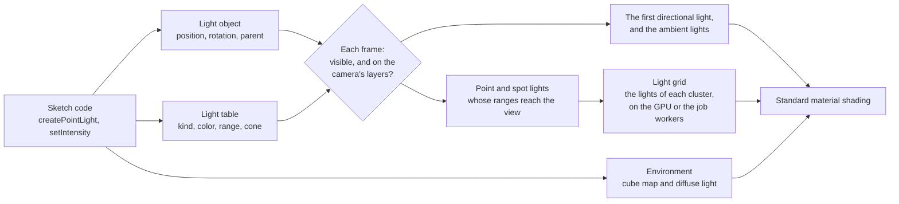
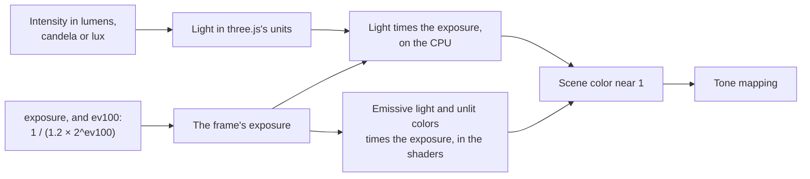
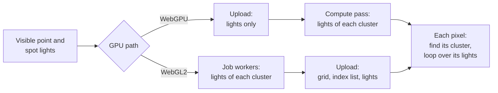

# Lighting and environment

> Ships in null3D 0.1, with environment maps, backgrounds, fog, light units, the sky's light and time of day from 0.2. The API is experimental, so it can still change between versions. Hemisphere lights do not light surfaces yet, and surfaces show one directional light. The quality presets do not set the light limits yet. Coding agents must not rely on these parts.



Every light is a scene object with a row in the engine's light table. The object holds what every object holds: where the light is, which way it faces, its parent, whether it is visible, and its layers. The light table holds the rest: the light's kind, its colors, its intensity, and for point and spot lights their range, decay and cone.

Setters change the engine's memory at once, and they allocate nothing except those that convert a color. Each frame, after the engine updates transforms, it reads every light:

1. It skips a light that is hidden by itself or a parent, or whose layer mask shares no bit with the camera's.
2. The first directional light created that remains, the sum of the ambient lights, and the scene's environment become the light that standard materials reflect.
3. It tests the sphere of each point and spot light's range against the camera's view, and lists the lights whose spheres reach into it.
4. Each listed light goes into the clusters of the view that its sphere reaches. On WebGPU the GPU does this work, and on WebGL2 the job workers do it, as [Clustered forward shading](#clustered-forward-shading) explains.

## Kinds of light and their units

Units follow three.js since r155, which dropped its legacy light mode. A scene tuned for three.js's current units needs the same intensities in null3D.

| Light | What it models | Intensity | `intensityUnit` |
| --- | --- | --- | --- |
| Directional | The sun or the moon: parallel light from one direction | Lux: the light that reaches a surface facing it | `'lux'` |
| Point | A bulb: light from a point in every direction | Candela | `'lumen'`: divided by 4π |
| Spot | A torch or a stage light: light from a point in a cone | Candela | `'lumen'`: divided by π at any cone angle |
| Hemisphere | Sky and ground: light that fades from one color to the other with the way a surface faces | Lux, on both colors | `'lux'` |
| Ambient | Light that bounces everywhere, from no direction | Lux | `'lux'` |

A standard material reflects light with the formulas of three.js's `MeshStandardMaterial`. A rough surface that is not a metal reflects close to its color divided by π, times the light that reaches it. A white directional light with an intensity of π therefore shows a white, rough surface that faces it as nearly white.

Point and spot lights fade with distance by their `decay`. A decay of 2, the default, fades light with the square of the distance, as real light fades. Each also ends at its `range`, because the engine finds the lights near each surface by their ranges. three.js's `distance` of 0, a light with no end, has no equivalent.

```ts
import { defineSketch } from '@null3d/engine';

export default defineSketch(({ scene }) => {
  // A late-afternoon sun, a blue sky over brown ground, and a warm lamp.
  scene.createDirectionalLight({ direction: [-1, -0.6, -0.4], color: '#ffd9a8', intensity: 2.5 });
  scene.createHemisphereLight({ skyColor: '#9ec5ff', groundColor: '#5a4632', intensity: 0.8 });
  scene.createPointLight({ position: [2, 1.5, 0], color: '#ffb46b', intensity: 12, range: 6 });
});
```

## Units and exposure



A scene can keep three.js's units, as most scenes and ports do, or use real units. A real sun gives about 100,000 lux, an 800-lumen bulb lights a room, and a camera's exposure brings that light to the screen. In null3D, `intensityUnit` gives a light its real unit, and `post.set({ ev100 })` sets the camera's exposure value at ISO 100, as in Filament and Bevy. The exposure is 1 / (1.2 × 2^ev100): about 1 / 39,000 at 15, a sunny day.

The engine multiplies the exposure into each light at its source, as Filament does, not into the finished picture. On the CPU it scales each light, the background color and the fog color. In the shaders it scales emissive light, light maps, unlit colors and background textures. Everything before the tone mapping is linear, so the picture is the same as with the exposure at the end. But the scene's colors stay near 1, so a 16-bit float holds them. With the exposure at the end, a sun of 100,000 lux gives a smooth metal a highlight above 65,504. That is the largest 16-bit float, so the highlight loses its color.

```ts
import { defineSketch } from '@null3d/engine';

export default defineSketch(({ scene, post }) => {
  // A sunny day in real units: the sun in lux, a lamp in lumens, and a camera at EV100 15.
  post.set({ ev100: 15 });
  scene.createDirectionalLight({ direction: [-1, -2, -1], intensity: 100_000, intensityUnit: 'lux' });
  scene.createAmbientLight({ intensity: 20_000, intensityUnit: 'lux' });
  scene.createPointLight({ position: [0, 1, 0], range: 10, intensity: 1_000_000, intensityUnit: 'lumen' });
});
```

Colors that you set in the scene's units take the exposure too: a background color, an unlit material's color and an emissive color. At EV100 15 a background color of white draws black, as it does in three.js at the same exposure. Give emissive light in nits instead, through `emissiveIntensity`, such as 40,000 for about white at EV100 15. [Post-processing API](../api/post.md#lights-in-real-units) gives the settings.

## Clustered forward shading

A scene can hold hundreds of point and spot lights, but a surface only needs the few whose ranges reach it. The engine therefore cuts the camera's view into clusters. The screen splits into 16 tiles across and 9 up, and the depth splits into 24 slices. Slices grow with distance, from the near plane out to where the farthest light ends. Near the camera, where each meter covers more of the screen, slices are thin.

Each frame the engine lists, for each cluster, the lights whose range spheres reach it. Each pixel of a standard material then finds its cluster and loops over that cluster's lights alone. The test is conservative: a cluster may list a light that ends just before it, but never misses a light that reaches it. Each light fades smoothly to nothing at its range, so a listed light that does not reach a pixel adds nothing.



Where the lists come from depends on the GPU path:

- On WebGPU, a compute pass on the GPU lists each cluster's lights, before the scene draws. The CPU only picks the frame's lights, cuts the view into slices and uploads the light list. Its work per frame stays small with hundreds of lights.
- On WebGL2, which has no compute shaders, the job workers list them on the CPU, and the frame uploads the lists as data textures.

Both paths use the same tests in the same order, so they list the same lights in each cluster.

The engine shades each surface in the pass that draws it. A deferred renderer would light the whole screen in a later pass instead. Forward shading favors phones and tablets:

- A deferred renderer writes several full-screen buffers in every frame, and on the tile-based GPUs of phones that memory traffic is the main cost.
- Forward shading works with MSAA directly, where deferred shading needs extra passes.
- Transparent surfaces use the same lighting code as opaque ones.

Both GPU paths light a scene the same way. WebGPU reads the lists from storage buffers, and WebGL2 from small data textures. In this version the camera lists up to 1,024 point and spot lights in a frame, the ones nearest to it. Each cluster lists up to 128. [Performance guide](../guides/performance.md#point-and-spot-lights) gives the cost of lights.

## Lights as objects

Because each light is an object, it moves, turns, hides and has a parent the way a mesh does. A lamp that is the child of a car moves with the car. Directional and spot lights send their light along their -Z axis, as a camera looks, so `lookAt` aims them. A hemisphere light's sky lies along its +Y axis.

Point and spot lights that move in most frames should be dynamic, with `dynamic: true`, as any object that moves in most frames should be. [Static and dynamic objects](static-dynamic.md) explains the choice.

A glTF file's lights (`KHR_lights_punctual`) become directional, point and spot lights in each copy of the model, in the same units. A light on a node that a clip moves is left out ([Animation](../api/animation.md#models-from-gltf-files)).

## Lights far from the origin

The engine keeps each object's position relative to a grid cell, a cube of space about 1 km wide. Scenes far from the origin then stay precise. Lights take part too. Each frame the engine finds every point and spot light's position relative to the camera, with the offset between their cells in 64-bit floats. A lamp 1,000 km from the origin is then as precise, next to the camera, as a lamp at the origin.

## Fog

Fog fades objects toward one color with their distance from the camera, as air does over a landscape. A sketch sets it with `scene.setFog`, and [Scene](../api/scene.md#fog) lists the options. The distance is the straight line from the camera to each point. A point therefore keeps its fog as the camera turns, and fog at the screen's edges does not shift. In three.js, fog follows the depth along the camera's view instead. Its fog thins toward the screen's edges and moves as the camera turns.

A curve sets how the fog thickens. The default, exponential fog, follows light through an even haze: each unit of distance hides the same share of what is left. Exponential squared fog and linear fog give three.js's `FogExp2` and `Fog` curves.

Real mist lies low and thins with height. With a `heightFalloff`, the fog's density falls by a factor of e every 1 / `heightFalloff` units up. The engine sums that density along each line of sight with an exact formula, as Filament does. A view down into the mist then sees thick fog, and a view across its top sees thin fog. With a `sunGlow`, the fog toward the main directional light takes some of that light's color, as haze around a low sun does. The glow follows the light and its intensity. Shadows do not block it.

The engine mixes the fog into each pixel's color as it shades the pixel, after lighting and before the tone mapping. Fog therefore needs no pass and no texture. It costs about 15 arithmetic operations and one or two exponentials per pixel, and nothing in a scene without fog. The mix happens in linear color, as in three.js's WebGPURenderer and in WebGLRenderer with a half-float target. The background takes no fog, so scenes with fog usually give the background the fog's color. A material created with `fog: false` keeps its color at every distance.

## Environment maps

An environment map holds the light that reaches a point from every direction, such as a sky, a street or a room. Metal and glossy surfaces reflect it, and every surface takes some of it as diffuse light. Metals need it most, since they have almost no diffuse color and show only what they reflect.

```ts
import { defineSketch } from '@null3d/engine';

export default defineSketch(async ({ scene, assets, materials, geometry }) => {
  // The room of three.js's RoomEnvironment: soft, neutral light, with no file of your own.
  scene.setEnvironment(await assets.builtinEnvironment('room'));
  // Or a file that `bunx @null3d/cli assets env` made from an HDR image, turned and dimmed:
  // scene.setEnvironment(await assets.loadEnvironment('/env/sunset.ktx2'), { intensity: 0.8, rotation: [0, Math.PI / 2, 0] });
  // Or the HDR image itself, which the GPU filters at load:
  // scene.setEnvironment(await assets.loadEnvironment('/hdri/sunset_2k.hdr'));
  // Or the sky that `scene.setBackground({ sky })` draws, which follows its sun:
  // scene.setEnvironment(await assets.skyEnvironment());
  const chrome = materials.standard({ color: '#d8d8d8', metalness: 1, roughness: 0.1 });
  scene.createMesh({ mesh: geometry.sphere(), material: chrome });
  return {};
});
```

The fast path is one KTX2 file, which `bunx @null3d/cli assets env` makes from an HDR image before you publish:

- A cube map with one level for each step of roughness. Level 0 holds the light itself, for mirrors. Each smaller level holds the light blurred as a rougher surface reflects it, with the GGX distribution of the standard material.
- Nine spherical harmonics coefficients, the diffuse light from each direction in a few numbers, as three.js's `LightProbe` holds it.

three.js builds the same data in the browser on every visit with `PMREMGenerator`. The engine reads the finished file, so a page does no prefiltering before it draws. [The asset pipeline](../guides/assets-pipeline.md#environment-maps) gives the command's options and the file's sizes.

The engine also reads the HDR image itself, a Radiance (`.hdr`) or OpenEXR (`.exr`) file, as three.js's `HDRLoader` and `EXRLoader` do with `PMREMGenerator`. A worker reads the file, and the GPU filters it at load with the asset tool's steps. On every GPU path, the map lies on average within a tenth of a step of 255 of the tool's map of the same file. As in the tool's map, light past the 16-bit float limit, such as an unclipped sun, keeps its share of the rough levels.

The built-in room needs no file. The GPU draws three.js's room into a cube map and filters it for each roughness when a sketch first asks for it, as three.js's `PMREMGenerator.fromScene` does. It follows the asset tool's steps, so it gives the same map as `bunx @null3d/cli assets env --builtin room`.

The sky's environment needs no file either. The GPU draws the sky that `scene.setBackground({ sky })` shows into a cube map, and filters it for each roughness. three.js makes the same light with `PMREMGenerator.fromScene` on a scene that holds its `Sky`. It makes it again with another call after each change. The engine's map follows the sky by itself: when the sun moves, the map refreshes over the next frames. [Sky and backgrounds](#sky-and-backgrounds) says how.

### How an environment lights a surface

The standard material takes the environment's light as three.js's `MeshStandardMaterial` takes it from `scene.environment`:

- Specular light comes from the cube map, along the view's reflection about the surface's normal. A rough surface reads a smaller, blurrier level.
- Diffuse light comes from the nine coefficients, along the surface's normal.
- The split-sum terms of three.js's table weigh the two by the view's angle, the roughness and the metalness, with three.js's energy compensation.
- The occlusion map darkens the diffuse light, and darkens the specular light as three.js's `computeSpecularOcclusion` does.

three.js's PMREM blurs its levels a little less than the GGX distribution of its own materials. The engine therefore reads each roughness from the level that matches three.js's light best, from a table that compares the two. A port keeps its look: the spheres of the engine's parity scenes match three.js under three.js's own image rule.

`scene.setEnvironment(environment, { intensity, rotation })` sets the scene's environment, and `scene.setEnvironment(null)` removes it. `intensity` scales the light, as three.js's `scene.environmentIntensity` does. `rotation` turns the environment by Euler angles in radians, as `scene.environmentRotation` does. The call allocates nothing, so a sketch can turn the environment in every frame. A material's `envIntensity` scales the environment's light on that material alone.

| Call | Gives |
| --- | --- |
| `assets.loadEnvironment(url)` | An environment from a file of `bunx @null3d/cli assets env`, or from a Radiance or OpenEXR file that the GPU filters at load |
| `assets.builtinEnvironment('room')` | The room that three.js's `RoomEnvironment` builds: a white room with six boxes and glowing panels. It is blurred as three.js's examples blur it, with `fromScene(room, 0.04)`. The GPU makes it, so no file downloads |
| `assets.skyEnvironment()` | The light of the scene's sky, which follows the sky background. The GPU makes it, so no file downloads |
| `scene.setEnvironment(environment, options)` | Nothing: it lights the scene with the environment from the next frame |
| `environment.destroy()` | Nothing: it frees the cube map's GPU memory |

### Cost

- A page downloads the file reader, under 1 KB after Brotli, with its first environment file.
- An HDR file loads the HDR reader and its worker, about 6.5 KB after Brotli, and the code and shaders that make the room. They load while the file downloads. The worker reads a 2K file in about 100 ms on a MacBook Pro, outside the sketch's frames. The GPU then filters the map in the next frame, before that frame draws, in about the room's time. So no frame shows the scene without the file's light. Load HDR files while the scene loads, as you would ask for the room.
- An HDR map keeps its panorama on the thread that draws, up to 8 MB for an image of 2,048 x 1,024 texels or more. A new GPU device makes the map again from it. `environment.destroy()` frees both.
- The built-in room downloads no file. Its first use loads the code and the shaders that make it, about 8 KB after Brotli. The shaders compile in the background while the scene loads, and `builtinEnvironment` resolves once they are ready. The GPU then makes the whole map in the next frame, before that frame draws. So no frame shows the scene without the room's light. That frame takes longer by the map's GPU time, which the table below gives.
- Ask for the room while the scene loads. A call during play makes one long frame: on a phone, the time of 3 to 7 frames at 60 frames per second.
- The sky's environment loads the same code and shaders as the room. The GPU makes its whole map in the next frame, in about 10 ms on a MacBook Pro. After each change of the sky, it makes the map again in 7 steps, one a frame. Each step takes under 1.1 ms on a MacBook Pro. The scene draws with the old map until the last step, so no frame waits for a whole map. A sky that changes in every frame pays one step in every frame.
- A map of the default size takes 2 MB of GPU memory. The sky's environment keeps about 9 MB more for its steps. A file's map uploads in the frames after the load, within the frame's upload budget. The scene draws without an environment until its map is on the GPU.
- The environment is a value of each frame, not a build of the shaders. So setting one builds no pipeline, and each pixel of a standard material pays one branch while the scene has none.
- With an environment, each pixel of a standard material reads the cube map once and adds up the nine coefficients.
- On WebGL2 a fragment shader may use 16 texture units. The standard material uses at most 12 of them, the cube map included, so four stay free. A material's maps share six units. A material with more maps than that leaves out its specular intensity map first, then its specular color map, then its light map. WebGPU has no such limit.

The tests of the room's generator measured these times in Chrome. The phones ran in a device cloud, on a page with no shader cache. On WebGPU the map's time is the GPU's own. On WebGL2 it runs from the call until the GPU has finished.

| Device | Shaders, in the background | The whole map, in one frame |
| --- | --- | --- |
| MacBook Pro (Apple M5 Max), WebGPU | 8 to 14 ms, once 300 ms | 20 to 21 ms, then about 9 ms for each later map |
| MacBook Pro (Apple M5 Max), WebGL2 | 9 to 15 ms | 20 to 27 ms, of which 16 to 17 ms on the GPU |
| Galaxy S25, Pixel 9, Pixel 10 and Pixel 11, WebGPU | 93 to 129 ms | 48 to 100 ms |
| The same phones, WebGL2 | 100 to 226 ms | 58 to 107 ms |

### Differences from three.js

- three.js takes `scene.environmentIntensity` in place of a material's `envMapIntensity` when the material has no map of its own. The engine multiplies the two, so `envIntensity` keeps its meaning with a scene environment.
- Each material can have its own `envMap` in three.js. The engine has one environment per scene.

## Sky and backgrounds

The background is what the camera shows behind every object. `scene.setBackground` takes a color, a texture, an environment, a cube map, or three.js's analytic sky. [Scene](../api/scene.md#environments-cube-maps-and-the-sky) gives the options.

```ts
import { defineSketch } from '@null3d/engine';

export default defineSketch(async ({ scene, assets }) => {
  // A low sun over a hazy sky, as three.js's sky example draws it.
  scene.setBackground({ sky: { sunPosition: [0, 0.07, -1], turbidity: 10, rayleigh: 3 } });
  // Light from an environment, which the sky does not give.
  scene.setEnvironment(await assets.builtinEnvironment('room'));
  return {};
});
```

The engine draws a background after the opaque objects, at the far plane, with the depth test. So it shades only the pixels that no object covers, and transparent objects draw over it. While an opaque material has `depthWrite: false` or `depthTest: false`, the background draws before the objects instead, without the depth test, as three.js draws `scene.background`. That material then still shows over the background. A texture fills the view as one triangle. An environment, a cube map and the sky draw as a box around the camera, as three.js draws them. So each pixel takes its color from its own direction. Their light goes into the scene's color like an object's, so exposure and tone mapping change them too.

- An environment's background reads the environment's cube map at the level of the blur's roughness, as three.js reads its PMREM texture with `backgroundBlurriness`. The levels hold the blur already, so a blurred background costs no more than a sharp one.
- A cube map reads its six images as three.js's `CubeTextureLoader` maps them: seen from inside the cube, mirrored across x.
- The sky is three.js's `Sky`, the Preetham daylight model, with its sun disc and its clouds. Its formulas and constants are three.js's, in their order. The engine's parity scenes compare the sky, a blurred environment background and a cube map with three.js. Each matches under three.js's own image rule, on every GPU path.

The sky lights nothing by itself, as in three.js. For light that matches it, add a directional light along the sun, and light the scene with the sky's environment:

```ts
import { defineSketch } from '@null3d/engine';

export default defineSketch(async ({ scene, assets, time }) => {
  const sunPosition: [number, number, number] = [0, 0.3, -1];
  const settings = { sunPosition, turbidity: 3 };
  const background = { sky: settings };
  scene.setBackground(background);
  scene.setEnvironment(await assets.skyEnvironment(), { intensity: 0.2 });
  const sun = scene.createDirectionalLight({ direction: [0, -0.3, 1], intensity: 3 });
  return {
    onUpdate() {
      // The sun sinks and rises. The environment's light follows with no call.
      sunPosition[1] = 0.2 + 0.15 * Math.sin(time.now * 0.1);
      sun.setDirection(-sunPosition[0], -sunPosition[1], -sunPosition[2]);
      scene.setBackground(background);
    },
  };
});
```

`assets.skyEnvironment()` resolves once the code and the shaders that make the map are ready. The next frame makes the whole map before it draws. From then on the map shows the sky of the last `setBackground({ sky })` call, or the sky's defaults before the first.

- The map shows the same sun, air and clouds as the background. It leaves out the sun's disc: the directional light gives the sun's own light, and a disc in the map would light every surface twice.
- After a change of the sky, the engine makes the map again in 7 steps, one a frame. It draws the sky in the first step and filters one level in each of the next five. The last step puts every new level into the map. The scene draws with the old map until then. The diffuse light changes in the same frame as the reflections.
- So the light follows a moved sun 6 frames after the frame of the move, about 100 ms at 60 frames per second. A change during a refresh waits until it ends: then it takes up to 13 frames.
- The engine works out the diffuse light on the CPU, from the same sky model, in about 0.1 ms on a MacBook Pro.
- three.js's sky is about 5 at the horizon by day, while a sun light of about 3 is bright. Lit by the sky at full intensity, a scene looks brighter than three.js's examples with their exposure of 0.5. Lower the environment's `intensity`, or the exposure. [Time of day](#time-of-day) gives values that match each other.

### Background cost

- Each background is one draw of at most 12 triangles. The sky reads no texture.
- A background costs only the pixels that no object covers. An opaque material with `depthWrite: false` or `depthTest: false` makes the background draw first, and then every pixel of the view pays for it.
- An environment or a cube map reads one texel of its cube map per pixel. The sky computes its light in each pixel, and does more work above the horizon while it draws clouds. `cloudCoverage: 0` skips the clouds.
- The shaders download with the first background of their kind: `'background'` for a texture, an environment or a cube map, and `'sky'` for the sky. A page with neither downloads none of them.
- The settings are a small block of values that the GPU reads, and the engine writes them again only when they change. Setting or moving a background builds no pipeline. The first background of each kind builds one.
- A cube map's six images upload in the frames after the load, within the frame's upload budget. Its faces have one level, so large faces seen small can shimmer.

### Backgrounds beside three.js

- three.js's `Sky` and `SkyMesh` are meshes in the scene. The engine's sky is the scene's background, so it draws behind every object, whatever the camera's far plane.
- three.js's `SkyMesh` moves its clouds by the renderer's clock. The engine's sky moves them by its `time` setting, as three.js's `Sky` does, so a still frame shows the same clouds.
- Only environments blur. three.js blurs a cube texture by turning it into a PMREM texture first. For a background that blurs, load an environment with `assets.loadEnvironment`.
- `WebGLRenderer` draws an sRGB cube texture without exposure and tone mapping. The engine changes every background with them, as three.js's `WebGPURenderer` does.

## Time of day

`timeOfDay` works out the settings that change together through a day, from one value: an hour from 0 to 24, or a preset. They are the sky's sun and air, the main light, the fog's color and glow, an ambient light, the sky's intensity and the exposure. Each comes from the same sky model as the sky background, so the fog fades into the sky's horizon.

```ts
import { defineSketch, timeOfDay } from '@null3d/engine';

export default defineSketch(async ({ scene, assets, post }) => {
  const day = timeOfDay('goldenHour');
  scene.setBackground({ sky: day.sky }, { intensity: day.skyIntensity });
  scene.setEnvironment(await assets.skyEnvironment(), { intensity: day.skyIntensity });
  scene.createDirectionalLight({ ...day.light, castShadows: true });
  scene.setFog({ color: day.fog.color, density: 0.01, sunGlow: day.fog.sunGlow });
  post.set({ exposure: day.exposure });
  return {};
});
```

| Preset | Hour | The sun | The light |
| --- | --- | --- | --- |
| `'afternoon'` | 15:00 | 38 degrees up | A white sun and a blue sky |
| `'goldenHour'` | 17:36 | 5 degrees up | A low orange sun |
| `'blueHour'` | 18:24 | 5 degrees under the horizon | A deep blue sky with the sunset's glow, and the moon |
| `'night'` | 23:00 | Far under the horizon | A dark sky, and the moon |

The sun rises toward +X at 6, stands toward -Z at noon, 60 degrees up, and sets toward -X at 18. The option `heading` turns that path about +Y, in radians, and `noonElevation` sets the noon sun's height.

The result holds plain values. Apply them to your own objects, as above:

| Value | Apply it to |
| --- | --- |
| `sky` | `scene.setBackground({ sky })`. Add the clouds and their `time` of your own: `{ ...day.sky, cloudCoverage: 0.3 }` |
| `skyIntensity` | The sky background's and the sky environment's `intensity` |
| `light` | The main directional light: `direction`, a linear `color` and `intensity`. By day it is the sun. After sunset it is the moon, a cool light at least 25 degrees up |
| `fog` | `scene.setFog`: the `color` of the sky's horizon and the `sunGlow`. Choose the curve and the density for your scene |
| `ambient` | An ambient light's `color` and `intensity`, for a scene without the sky's environment. A scene lit by the sky's environment needs none |
| `exposure` | `post.set({ exposure })`: 1 by day, up to 3.5 at night |

The helper gives values and leaves them to the sketch. A scene keeps its own light, fog curve and density, and post settings, which a call that applied them would overwrite.

- three.js's sky is far brighter than the lights' usual range. By day `skyIntensity` is 0.15, so the sun outshines the sky's diffuse light about two to one, and the fog's color can match the horizon.
- three.js's sky goes dark about 2 degrees after sunset. So after sunset the helper keeps the sky's own sun just under the horizon. Then `skyIntensity` dims the sky to a deep blue, and later to night.
- Each call returns a new object, and `setColor` converts a color. So call `timeOfDay` when the time changes, not in every frame of a still scene. For a day that passes, a few calls a second are enough: the sky's environment takes 7 frames to follow anyway.

## Lights in scene passes

A [scene pass](../api/render.md) draws the scene from another camera into a texture. In this version it lights its objects with the sun, the ambient light, the environment and the fog. It draws the sun's shadows where the camera's cascades reach. It draws no point or spot lights and no sky. Its texture clears to the pass's `clearColor`, which is the scene's background color by default.

## Related pages

- [Lights](../api/lights.md): the calls and options of each kind of light.
- [Shadows](shadows.md): shadow cascades, the shadow atlas of spot and point lights, and cut-out shadows.
- [Scene](../api/scene.md#fog): the fog's options.
- [Objects and transforms](../api/objects.md): the calls that lights share with every object.
- [Render layers](render-layers.md): which cameras a light lights.
- [Materials](../api/materials.md): the standard material, which lights shade.
- [The asset pipeline](../guides/assets-pipeline.md#environment-maps): the command that makes environment maps.
- [Assets](../api/assets.md#environments): the calls that load environments and cube maps.
- [The environment light demo](https://github.com/null3d-engine/null3d/tree/main/examples/environment): rough and smooth spheres in an HDR file's light, an EXR file's light and the built-in room.
