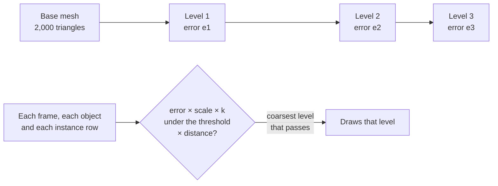

# Levels of detail

> Experimental. Skinned and morphed objects, and materials that blend or let light through, draw their base mesh at every distance. Custom materials switch levels at once, with no fading band.



An object far from the camera covers few pixels. Its full mesh then costs vertex work that no one sees. A level of detail is a simpler copy of the mesh with fewer triangles. The copy differs from the full mesh by a small distance, its error. Where that distance covers less than about a pixel on the screen, the copy looks the same as the full mesh.

A mesh with levels draws one of them per frame in every object and every instance row that uses it. The engine picks the level on the GPU on WebGPU, and on its job workers on WebGL2. Both use the same rule, so a level switches in at the same distance on every GPU path.

## Give a mesh its levels

`mesh.setLevels` takes the lower levels, from the most detailed down. Each level is another mesh with the base mesh's vertex attributes. Each has an error: the largest distance between its surface and the base mesh's. The error is in the units of the base mesh's positions.

```ts
const tree = geometry.fromArrays(treeArrays(64));
tree.setLevels([
	{ mesh: geometry.fromArrays(treeArrays(24)), error: 0.02 },
	{ mesh: geometry.fromArrays(treeArrays(8)), error: 0.1 },
]);
// Every object and instance batch that draws the tree picks its level.
scene.createInstances(tree, 20_000, { material: bark });
```

Errors grow from level to level. The asset tool works out each level's error for you, as the next section shows.

## Levels from the asset tool

`bunx @null3d/cli assets optimize --lod` adds levels to each mesh of 64 triangles or more, as [the asset pipeline](../guides/assets-pipeline.md#levels-of-detail) explains:

```sh
bunx @null3d/cli assets optimize models/ public/models/ --lod
```

Each level has about half the triangles of the level above, and shares the mesh's vertices. Each level stores its error in the units of the mesh's own positions. The tool stores the levels with the `MSFT_lod` glTF extension. Each node with levels keeps their errors in its extras, as `NULL3D_lod_error`. `assets.loadGltf` gives each mesh its levels. So a model's copies and its instance batches pick their levels with no code. Other glTF loaders draw the full mesh. Another tool may store screen coverage alone, in `MSFT_screencoverage`. The loader then works out each error from the coverage, for a screen 1,080 pixels high.

## How the engine picks a level

A level's error in pixels follows from the object's scale and distance, the camera's field of view and the height that the scene draws at:

```text
pixels = error × scale × render height / (2 × distance × tan(field of view / 2))
```

Each object and each instance row draws the coarsest level whose error covers fewer pixels than the `lodThreshold` quality setting. The setting is 1 pixel from Medium up, and 2 on Low. The render height includes the render scale. So on a taller screen, or at a higher render scale, each level switches in farther away. When the frame-budget governor lowers the render scale, coarser levels draw. When frames still take too long, the governor doubles the threshold, twice at most. An orthographic camera's pixels do not shrink with distance. So its levels follow the object's scale and the camera's zoom alone.

The distance runs from the camera to the centre of the object's bounding sphere, so turning the camera never changes a level. A view with a camera of its own, such as a render pass, picks with that camera. Mirrors and the outline effect pick as the main camera does.

## Fading between levels

A level that switches in at once can pop. Past each switch distance lies a short band, 15% of the distance long, where the old level and the new one both draw. A 4 × 4 dither pattern gives each pixel to one of them, and the share of the new level grows across the band. No pixel draws twice, and nothing sorts.

`setLevels(levels, { fade: false })` switches a mesh's levels at once. The `lodFade` quality setting turns every band off on Low. The fragments that the dither drops cost a tile GPU, such as a phone's or an Apple GPU's, its hidden-surface removal. So only the objects inside a band draw with the dither. The shader builds of the bands download with the first mesh whose levels fade.

## Shadows

The shadow maps pick each caster's level by the main camera's distance too. Their threshold is the camera's times the `lodShadowFactor` quality setting: 2 from Medium up, and 4 on Low. So shadows draw a coarser level than the camera sees, and the shadow passes cost less. The shadows' softness hides the difference. Shadow maps draw no fading band.

Far shadow cascades and the shadow tiles of point and spot lights keep their depth between draws. A level that changes as the camera moves shows in them when they next draw.

## From three.js

| three.js | null3D |
| --- | --- |
| `const lod = new LOD(); lod.addLevel(high, 0); lod.addLevel(low, 50)` | `highMesh.setLevels([{ mesh: lowMesh, distance: 50 }])`, then draw `highMesh` |
| `lod.addLevel(object, distance, hysteresis)` | `{ mesh, distance }`. The bands replace hysteresis |
| `lod.autoUpdate`, `lod.update(camera)` | None: the engine picks levels in every frame |
| `lod.getCurrentLevel()` | None |

A three.js `LOD` holds whole objects. In null3D the levels belong to the mesh, and every object and instance batch that draws it picks its own level. A level given by its distance switches in at that distance for an object of scale 1. That holds on a screen 1,080 pixels high, at a field of view of 50 degrees, three.js's default. The `fov` option of `setLevels` names another field of view. On other screens the level switches by its error, as every level does.

## API reference

`mesh.setLevels` and the options it takes are on the [geometry page's reference](../api/reference/geometry.md). The quality settings are on [the quality page](../api/quality.md).
