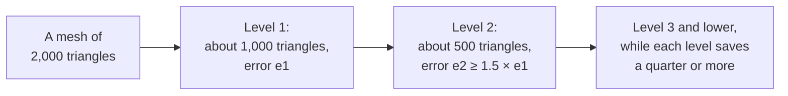

# Levels of detail

> Experimental. The asset tool makes levels of detail for a model's meshes, and stores each level's error. Not built yet: the engine draws only the full mesh, LOD groups made in code, and the choice of a level for each object. Coding agents must not use these parts.



An object far from the camera covers few pixels. Its full mesh then costs vertex work that no one sees. A level of detail is a simpler copy of the mesh with fewer triangles. The copy differs from the full mesh by a small distance, its error. Where that distance covers less than one pixel on the screen, the copy looks the same as the full mesh.

## Levels from the asset tool

`bunx @null3d/cli assets optimize --lod` adds levels to each mesh of 64 triangles or more, as [the asset pipeline](../guides/assets-pipeline.md#levels-of-detail) explains:

```sh
bunx @null3d/cli assets optimize models/ public/models/ --lod
```

Each level has about half the triangles of the level above, and shares the mesh's vertices. Each level stores its error in the units of the mesh's own positions. An object's scale multiplies the error. A level's error in pixels then follows from the object's distance, the camera's field of view and the screen's height:

```text
pixels = error × scale × screen height / (2 × distance × tan(field of view / 2))
```

So one file suits every screen. On a taller screen, or at a higher render scale, each level switches in farther away.

The tool stores the levels with the `MSFT_lod` glTF extension, and the errors in the extras of each node with levels, as `NULL3D_lod_error`. Other glTF loaders draw the full mesh.
