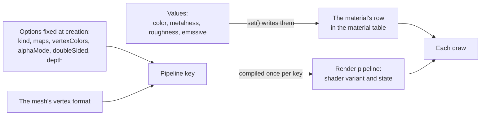

# Materials and pipelines

> Ships in null3D 0.1. The API is experimental, so it can still change between versions. The `blend` alpha mode is not built yet, and custom materials take a surface function, a vertex offset and their uniforms, or a full shader, without texture maps. Coding agents must not use the parts that are not built.



A material has two parts. Its values, such as its color and roughness, sit in one row of a table that every shader reads. Its kind and its fixed options choose the render pipeline that draws it. The GPU compiles a pipeline once for each combination of its shader variant, its state and the mesh's vertex format. A new combination therefore costs a compile, while a new value costs almost nothing.

## The built-in materials

| Material | Model | three.js |
| --- | --- | --- |
| `materials.standard` | glTF's metallic-roughness model, lit by the scene's lights | `MeshStandardMaterial` |
| `materials.unlit` | Its color alone, without lights | `MeshBasicMaterial` |
| `materials.shader` | The standard model, with a WGSL surface function that changes the look | `ShaderMaterial`, `onBeforeCompile` |

The standard material uses the same formulas as three.js's `MeshStandardMaterial`. It also reads three.js's own table of specular terms, so its highlights and its energy match three.js's. [Materials](../api/materials.md) lists every option.

## Values cost almost nothing

`set()` writes a material's values into its row, and the next frame uploads the rows that changed. No pipeline changes, so no shader compiles, and every object that uses the material changes with it.

```ts
// sketch.ts
const paint = materials.standard({ color: '#e8554e', roughness: 0.6 });
// Later, from any frame: a cheap change.
paint.set({ roughness: 0.2, emissive: '#ff4000', emissiveIntensity: 0.5 });
```

## Fixed options choose the pipeline

A feature that changes what a shader costs is a variant of the shader, which the engine compiles only for the materials that need it. Other options change the pipeline's state. Either way, the option is fixed when you create the material.

| Option | Where it goes |
| --- | --- |
| The kind: standard, unlit or custom | The shader |
| Texture maps | A shader variant that samples maps, and another for a normal map on a mesh with tangents |
| `vertexColors` | A shader variant that reads the mesh's colors, on meshes that have them |
| `alphaMode: 'mask'` | A shader variant that drops the fragments whose alpha is below the cutoff |
| `doubleSided` | The pipeline's state: it culls no faces |
| `depthWrite`, `depthTest`, `depthBias` | The pipeline's depth state |
| `flatShading` | The material's row: every standard shader can light with face normals |

three.js compiles a new program when `material.needsUpdate` is set after such a change. null3D has no `needsUpdate`: create one material for each combination in the setup instead.

```ts
// sketch.ts: two variants, made once in the setup.
const faceted = materials.standard({ color: '#8098d0', flatShading: true });
const cloth = materials.standard({ color: '#8098d0', doubleSided: true });
```

## Alpha modes

A material's `alphaMode` says what its alpha does. The default, `opaque`, ignores it. The `mask` mode draws nothing where the alpha is below the material's `alphaCutoff`, as three.js's `alphaTest` does. A masked surface is opaque where it draws, so it hides what lies behind it, and its objects draw in any order.

The shader that drops fragments costs more than one that never does: a GPU cannot always test depth before it runs such a shader. So only masked materials draw with that variant. The cutoff is a value, and `set({ alphaCutoff })` changes it at no cost. [Materials](../api/materials.md#alpha-modes) shows both modes.

## Custom materials share shaders

A custom material's WGSL becomes a shader of its own: the standard material's shader with the surface function in it. Every material made from the same WGSL shares that shader, and its pipelines, whatever its values. Its uniforms are values too: they sit beside the material's row, so `set()` changes them without a compile. The fixed options above choose its variants and states, as they do for a standard material. Each new WGSL therefore costs its own pipeline compiles, so reuse one WGSL for materials that differ only in their values.

## Why a new combination can make a frame late

A pipeline compiles the first time a frame draws a combination of shader variant, state and vertex format that no earlier frame drew. The GPU driver can take many milliseconds for that, on a phone above all. So an object that appears in play with a new combination can make that frame late. Create every material in the setup, and use its combinations in the first frames, so the compiles happen before play starts.

## Related pages

- [Materials](../api/materials.md): every option of each material.
- [Surface functions](../shaders/surface-functions.md): the WGSL of a custom material.
- [Lights](../api/lights.md): what lights a standard material.
- [Color management](color-management.md): how colors turn into linear values.
