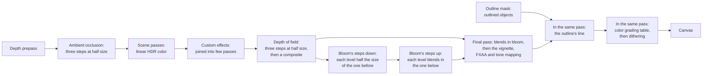

# The post-processing chain

> Ships in null3D 0.2. The API is experimental, so it can still change between versions. The chain has HDR scene color, ambient occlusion, custom effects, depth of field, bloom and outlines. The final pass adds color grading, the vignette and custom tone curves.



Ambient occlusion runs before the scene's opaque objects shade. It reads the depth that the depth prepass draws first, and the opaque pass darkens its ambient light with the result. The scene passes draw linear color with no upper limit into a float target, the scene color. The exposure scales each light and each color as it enters the scene, so the scene color holds exposed color. Effects that need that range, such as the sketch's custom effects, depth of field and bloom, read it before the final pass, in that order. The final pass then does all of its work for each pixel in one pass. It smooths edges with FXAA, adds the effects' results, darkens the edges with the vignette and applies the tone mapping. Then it encodes sRGB, draws the outline's line, and grades the display color with a color grading table, when the sketch sets one. Last, it dithers.

Every full-screen pass reads and writes the whole screen once more. On a phone at its full resolution that is tens of megabytes per frame, so the engine keeps such passes few. Bloom's passes draw small levels of a fixed size. The outline draws only a mask of the outlined meshes. The final pass reads their results without a pass of its own.

Turn effects on with `post.set` in the sketch:

```ts
import { defineSketch } from '@null3d/engine';

export default defineSketch(({ scene, geometry, materials, post }) => {
  post.set({ bloom: { intensity: 0.2, threshold: 1 } });
  scene.setBackground('#06080c');
  const camera = scene.createPerspectiveCamera({ position: [0, 1, 6], target: [0, 0, 0] });
  scene.setActiveCamera(camera);
  // Emissive light above 1 is brighter than white, so it passes the threshold and glows.
  const lamp = materials.standard({ color: '#000000', emissive: '#ffd080', emissiveIntensity: 8 });
  scene.createMesh({ mesh: geometry.sphere({ radius: 0.5 }), material: lamp });
  return {};
});
```

## Bloom

Bloom spreads light from the bright parts of the scene into their surroundings, as a camera lens does. It draws a chain of levels, each half the size of the one before, as Bevy, Filament and Unity draw bloom:

1. Steps down. The first step reads the scene color into the largest level, the base. It keeps the light that passes `threshold`, and limits each color to what a 16-bit float holds. Each later step reads the level above into the next level.
2. Each step down reads 13 texels around each texel, with the weights of Call of Duty: Advanced Warfare's bloom. The first step also takes a Karis average: a very bright group of texels counts less. So a small bright point does not flicker as it moves.
3. Steps up. From the smallest level back to the base, each step blurs the level below with a 3 x 3 tent filter. It blends the result into its own level. The base then holds the light of every level, each with its share of the glow.
4. The final pass reads the base once for each pixel, and blends it into the scene color before the tone mapping.

| Setting | Values | Default |
| --- | --- | --- |
| `intensity` | 0 or more. With the `'mix'` blend, the glow's share of each pixel, at most 1. With `'add'` and `'screen'`, a factor on the glow. | 0.15 |
| `threshold` | A luminance from 0 up, in linear color before the exposure. The first step reads exposed color, so it scales the threshold and its soft edge by the exposure, and a threshold keeps its meaning at any exposure. | 0 |
| `knee` | The width of the threshold's soft edge, in luminance: 0 or more. | 0.1 |
| `blend` | `'mix'`, `'add'` or `'screen'`. | `'mix'` |
| `weights` | Up to 10 numbers of 0 or more: each level's share of the glow, from the narrowest level to the widest. Not all 0. | Shares for 8 levels |

- The `'mix'` blend moves each pixel's color toward the glow by the intensity, so the image keeps its total light. A lit wall keeps its brightness and turns softer. `'add'` adds the glow, as three.js's `UnrealBloomPass` does, and `'screen'` screens it, as pmndrs's `BloomEffect` does.
- At a threshold of 0, all light glows a little, as in a real lens. At 1, only light brighter than white glows, such as an emissive material with an `emissiveIntensity` above 1.
- The levels have the canvas's shape and a fixed number of texels on its shorter side. So the glow keeps its size as a share of the screen at any pixel ratio, render scale and screen orientation.
- Each level spreads light twice as far as the one before. The eighth spreads it over about a quarter of the canvas's shorter side, and the tenth over all of it. The engine divides the weights by their sum. The default gives eight levels a share, most to the narrow ones, for a soft glow that keeps the shape of the light.
- Levels past the last one with a weight do not draw, so they cost nothing.
- Bloom works before the tone mapping, so it never clips at white on its own. On a transparent canvas it also adds coverage, so the glow shows over the page.
- `post.set({ bloom: false })` turns bloom off. The settings keep their values, so `post.set({ bloom: {} })` turns it on again with them.

### The size of the base

The quality setting `bloomSize` sets the base's texels on the canvas's shorter side. It is 512 on the Medium, High and Ultra presets, and 128 on Low, which phones run. A smaller base has fewer levels. Its finest levels fold into the base with their shares, so the glow keeps its size, with a softer core. The base never takes more than half the canvas's shorter side.

```ts
quality.set({ bloomSize: 256 });
```

A new `bloomSize` makes bloom's targets again. When frames take too long and bloom is on, the frame-budget governor halves the base once, after its shadow steps. Each level then draws into a corner of its target, so that step makes no target. [Quality presets](quality-presets.md) lists the governor's steps.

### Cost

With the default weights, bloom draws 15 small passes: 8 steps down and 7 steps up. The final pass reads one texture for it.

- The chain's work does not follow the render scale. A lower scale changes only where the first step reads, and a new scale makes no new target.
- At 1920 x 1080, with a base of 512, bloom reads about 7.6 texels for each pixel of the canvas, over all its passes. On a phone's canvas of 540 x 932 at Low's base of 128, it reads about 2.7.
- Its levels hold 16-bit floats, whatever the scene color's format. In a smaller float format the rounding of the chain's many steps adds up, and the glow loses light. At 1920 x 1080 with a base of 512, the levels take about 5 MB.
- The bloom scene of the engine's effect cost test ran on a MacBook Pro in Chrome, with WebGPU at 1920 x 1080. Bloom added 0.79 to 0.85 ms of GPU time per frame at a render scale of 1, and 0.79 ms at 0.5. A base of 128 added 0.52 to 0.66 ms.
- Phone GPUs pay a fixed cost for each pass, so a smaller base, with fewer levels, saves the most there. Each halving of the base removes two passes.
- The targets exist only while bloom is on.

## Depth of field

Depth of field blurs what lies in front of and behind the focus distance, as a camera lens does. Each pixel's blur is the circle of confusion of a thin lens, from the pixel's depth, the focal length, the aperture and the focus distance. The near field, what lies in front of the focus, and the far field, what lies behind it, blur apart:

1. The setup step reads four pixels of the scene's color and depth for each texel of a target at half the render size. It finds each pixel's blur, and writes their color with the smallest blur. In-focus color counts less in the average, so sharp detail does not bleed into the blur.
2. The gather reads a spiral of taps over a disk around each texel, or over a polygon when the aperture has blades. A tap adds to the far field only where both its own blur and the texel's reach it. It adds to the near field wherever its own blur reaches the texel.
3. A small tent filter smooths the gather.
4. The composite mixes the blur into each pixel of the scene's color at the render size. The pixel's own blur, read from the full-size depth, decides how much, and so does how much of it the near field covers.

```ts
camera.setFocalLength(85);
post.set({ dof: { aperture: 1.8, focusPoint: [0, 1, 0] } });
```

[The post-processing API](../api/post.md#depth-of-field) lists the settings, and [Cameras](../api/cameras.md#focal-length) the focal length.

- A sharp object in front of a blurred background keeps its edges, and its color never spreads into the background as a halo. A blurred object in front spreads over a sharp one behind it, as a lens shows it.
- With MSAA, the composite reads each pixel's nearest depth sample. An edge pixel's color is mostly the object in front, so where that object is sharp, its smoothed edge stays.
- Out-of-focus highlights draw as disks, or as polygons with `blades`. A round aperture turns its taps by a different angle at each texel. A small highlight then fills its disk with a fine grain, which more taps smooth.
- It runs after the custom effects and before bloom. Bloom then glows from the blurred image, and the final pass tone maps it. The outline's line stays sharp, as it draws in the final pass.
- Custom effects that would fold into the final pass draw in passes of their own while it is on, as while bloom is on.

### Where depth of field draws

The quality setting `dofSamples` sets the taps of the gather: 22 on Medium, 43 on High and 71 on Ultra. On Low, which phones run, it is 0, so depth of field draws nothing there even when the sketch turns it on. A sketch that wants it on every device sets the taps too:

```ts
quality.set({ dofSamples: 16 });
post.set({ dof: { aperture: 2 } });
```

WebGL2 and WebGPU's compatibility mode run Medium at most, so they draw 22 taps. More taps cost more and fill a wide blur more smoothly. A new tap count changes only the gather's settings, so it makes no GPU object.

### Cost

Depth of field adds three passes at half the render size and one at the render size. The engine's effect cost test timed its scene on a MacBook Pro in Chrome, at 1920 x 1080. With WebGL2, depth of field added about 0.6 ms of GPU time per frame at 22 taps, and 0.9 ms at 43. With WebGPU and MSAA it added about 0.85 ms at 22 taps, and 1.3 ms at 43. Bloom costs about 0.8 ms on the same Mac.

- The gather reaches only as far as the frame's largest blur. A lens closed down to an aperture of 16 reads a smaller disk than one wide open.
- The scene's render pass keeps its depth for the setup and the composite, where it could be thrown away before.
- Its half-size targets take 8 bytes per texel. The setup's and the tent's share one texture, so the three take about 4 bytes per pixel of the canvas. The composite's target takes 8 bytes per pixel. They exist only while it draws.
- While it is off, it costs nothing: none of its passes run, and its shaders do not download until the first `post.set({ dof })`.

## Custom effects and tone curves

A sketch adds effects of its own with `post.addEffect`. Each is a WGSL function that the engine calls for each pixel, in a full-screen pass of its own. [Custom passes](../guides/custom-passes.md) shows how to write one.

```ts
const warm = /* wgsl */ `
fn effect(input: EffectInput) -> vec4f {
    return vec4f(input.color.rgb * vec3f(1.1, 1.0, 0.9), input.color.a);
}
`;

post.addEffect({ wgsl: warm });
```

- Effects run after the scene passes and before depth of field and bloom, on linear HDR color after the exposure. Light that an effect adds can glow, and the tone curve maps it with the rest.
- Each effect reads the color that the effect before it wrote. It can read any pixel, and the scene's depth on every GPU path.
- Effects run from the lowest `order` to the highest, at most 8 at once.
- Two targets of the render size serve all the effects. The render graph lets them share memory, because each effect's target lives only until the next effect has read it.
- A full-screen pass reads and writes 8 bytes per pixel. The engine joins an effect that reads only its own pixel into the pass of the effect before it. With bloom and FXAA off, the last of these passes folds into the final pass. [Custom passes](../guides/custom-passes.md#cost) gives the rules.

A custom tone curve replaces the built-in curves. Its WGSL declares `fn toneCurve(color: vec3f) -> vec3f`, and `post.set({ toneMapping })` takes it. The final pass calls it in place of the built-in curve, after bloom and before FXAA and dithering.

## Ambient occlusion

Ambient occlusion darkens the light that comes from all around where nearby surfaces hide a surface from it. That happens in corners, in creases and under objects that rest on the ground. It follows three.js's `GTAOPass` step by step, at half the render size:

1. The depth prepass draws the opaque objects' depth. Ambient occlusion turns the prepass on while it draws.
2. A first step copies the depth of one pixel under each texel.
3. The horizon step rebuilds each surface's normal from the depth around it. Then it searches 3 slices around the view for the surfaces that hide the sky, and finds how open the surface is.
4. A blur over a disk of 16 taps smooths the result along each surface, and keeps it apart from other surfaces.
5. The opaque pass reads the four texels around each pixel, and darkens its ambient light. The texels whose depth lies near the pixel's own get the most weight.

```ts
post.set({ ao: { radius: 0.5, intensity: 1 } });
```

| Setting | Values | Default |
| --- | --- | --- |
| `radius` | How far from a surface the search reaches, in world units: 0 or more. | 0.25 |
| `thickness` | How far in front of a surface, along the view, an object still hides it: 0 or more. | 1 |
| `distanceExponent` | Above 0. Higher values gather the search's steps near the surface. | 1 |
| `distanceFalloff` | From 0 to 1: how much less the farther steps count. | 1 |
| `scale` | The power that the occlusion is raised to: above 1 darkens it. | 1 |
| `samples` | The depth samples of each pixel's search, a whole number from 1 to 64: 3 directions below 30, and 5 from 30. | 16 |
| `intensity` | From 0 to 1: how much of the occlusion reaches the ambient light. | 1 |

- The settings mean what `GTAOPass`'s settings mean, with the same search and blur. In the engine's parity tests, with `GTAOPass`'s defaults, null3D's image differs from three.js's in under 0.1% of the pixels on every GPU path. With a wider, darker search, under 1% differ, along the soft edges of the darkened areas.
- `GTAOPass` darkens the whole image, direct light and highlights included. null3D darkens only the ambient light, and the light that light maps add. A surface in the sun keeps its sunlight in a corner, as it would in the real world. In a scene that only ambient light lights, the two give the same image.
- Blended objects draw over the surfaces that ambient occlusion saw, so they take none.
- `post.set({ ao: false })` turns ambient occlusion off. The settings keep their values, so `post.set({ ao: {} })` turns it on again with them.

### Where ambient occlusion draws

The quality setting `aoScale` sets the size of ambient occlusion's targets, as a share of the render size each way. The High and Ultra presets, which desktops start with, draw at half size. Low and Medium, which phones and tablets start with, set 0, so ambient occlusion draws nothing there even when the sketch turns it on. A sketch that wants it on every device sets the scale too:

```ts
quality.set({ aoScale: 0.5 });
post.set({ ao: {} });
```

Ambient occlusion needs no HDR color, so it draws on the 8-bit path too. Its targets hold floats, which WebGL2 draws into only with the `EXT_color_buffer_float` extension. On a WebGL2 device without it, ambient occlusion stays off, and development builds warn once in the console.

### Cost

Ambient occlusion adds the depth prepass and three small passes at half the render size. It also adds four texture reads to each pixel that the opaque pass shades. The engine's ambient occlusion scene ran on a MacBook Pro in Chrome, at 3,024 x 1,518 pixels. There it added 2.42 ms of GPU time per frame. three.js's `GTAOPass` added about 5.3 ms to the same scene and canvas. At a render scale of 0.5 it added 1.18 ms.

- Its targets follow the render scale, so a lower scale costs less, and a new scale makes no new target. They take 20 bytes per texel at half size, 5 bytes per pixel of the canvas. They exist only while ambient occlusion draws.
- The depth prepass costs a second pass over the opaque objects' vertices. In a scene with many vertices it adds time of its own. [Quality presets](quality-presets.md#the-depth-prepass) says when the prepass pays.
- `aoScale: 0.25` draws at a quarter of the render size each way, with softer occlusion. Its steps then find a quarter as many texels. When frames take too long, the frame-budget governor takes that step last.
- Turning ambient occlusion on or off adds or removes passes. The last image stays on screen while the new pipelines build, which takes a few frames.

## Outlines

Outlines draw a crisp line around the meshes that `setOutlined(true)` marks:

1. The mask pass draws the outlined meshes from the camera into a mask of the render size. Its depth test reads the depth that the scene passes drew, so it knows which parts other objects hide. Each mesh draws twice: once to mark all of it, and once to mark the parts that nothing hides.
2. The final pass reads the mask at each pixel and at 8 places on a circle of the line's width around it. Outside the outlined meshes, a pixel near a marked part is on the line. The line takes `color` beside a part that nothing hides, and `hiddenColor` where every part beside it is hidden.
3. The final pass paints the line after the tone mapping and before the color grading, so the line shows its colors exactly.

[The post-processing API](../api/post.md#outlines) lists the settings.

- The line has no blur, so it ends as sharply as the meshes' own edges. Its width counts pixels of the canvas, so it stays sharp at every pixel ratio and render scale.
- The mask pass culls the outlined meshes with the camera's view on its own, so outlined meshes out of view cost nothing.
- three.js draws every other object's depth again for its hidden parts. The mask pass reads the depth that the scene passes drew instead.
- The 8-bit path draws the same line as the HDR path.
- While nothing is outlined, the mask pass and the mask are off, so turning outlines on costs nothing until a mesh is outlined.

### Cost

Outlines draw the outlined meshes twice into the mask, which takes 4 bytes per pixel of the render size. The final pass then reads the mask once at each pixel, and 8 more times outside the outlined meshes. No other pass runs. The scene's depth stays in memory after the scene's render pass, where it could be thrown away before. On a phone's GPU, which keeps the depth on chip, that costs a write of the depth to memory.

## Color grading and the vignette

A color grading table, from a `.cube` or a `.3dl` file through `assets.loadLut` or from numbers through `assets.lutFromData`, maps each display color to a graded color, as three.js's `LUTPass` does after its `OutputPass`. The vignette darkens the picture toward its edges. [The post-processing API](../api/post.md#color-grading) lists their settings.

- The vignette multiplies HDR color before the tone mapping, as Filament, Unity's URP, Bevy and Babylon.js do. Bright corners then darken as dark corners do. three.js's `VignetteShader` blends display color toward a gray after the tone mapping, which turns bright corners gray.
- The table works on display color, after the tone mapping. Grading tools make tables for display color, so they look as their authors made them.
- Both draw on every GPU path. On the 8-bit path there is no HDR color, so the vignette multiplies the linear value of the display color there.
- They are settings of the final pass, not passes of their own. Turning one on builds no pipeline, so the picture changes in the next frame with no pause.
- The table is a 3D texture, read with one filtered texture read per pixel. The vignette costs a few operations per pixel.
- The engine's parity test compares a `.cube` table alone with three.js's composer. It matches in all but under 0.1% of the pixels on every GPU path. With the vignette too, mapped from `VignetteShader`'s settings, about 1.1% of the pixels differ, all in the outer corners. There three.js's darkness of 1.1 passes black sooner.

## Dithering

An 8-bit canvas holds 256 steps of each color, and a smooth gradient between two close colors shows as bands. The final pass adds noise of up to one step to each pixel, so the bands break up into fine grain. This is dithering. It runs last, after the table and the vignette.

- The noise has the shape of a triangle: values near 0 come most often. Its strength is then the same at every brightness. Noise of even spread still shows bands at some brightness levels, as Mikkel Gjoel showed in "Banding in Games" (2016). Filament and Unity's URP dither with triangle noise too.
- The noise is the same in every frame, so a still picture does not shimmer.
- The dither comes after every other step, so no later step shrinks it. In the dark corners of a vignette, where bands show first, it keeps its full step.
- On the 8-bit path the scene's shaders dither as they draw. The final pass then dithers again only where it changes the color, with a table or the vignette.

## Effects on devices without HDR color

Bloom, custom effects and custom tone curves need the scene's linear color. Two kinds of device draw it with no float target at first, on the 8-bit path that [color management](color-management.md#the-8-bit-path) describes:

- WebGPU in compatibility mode with MSAA: this mode cannot multisample a float target. Bloom, a custom effect or a custom tone curve moves the engine to HDR color with FXAA, for the rest of its life. Meanwhile the last image stays on screen until the new pipelines are built. On a desktop that takes two or three frames. `engine.capabilities.hdr` reports the path that the engine started on.
- WebGL2 devices whose float targets fail the engine's test. They have no HDR target, so bloom and custom effects stay off, and the built-in tone curve stays. Development builds warn once in the console.

The devices that the engine was tested on all draw HDR color with WebGL2, and with core WebGPU.

## Porting from three.js

- Delete `EffectComposer`, `RenderPass` and `OutputPass`. The scene pass and the final pass are built in.
- `new UnrealBloomPass(resolution, strength, radius, threshold)` becomes `post.set({ bloom })` with `blend: 'add'`, the same `threshold` and a `knee` of 0.01. The intensity is about 8.8 times `strength`, and `radius` becomes the `weights`. The `null3d-port-threejs` skill holds a table of weights by radius, and a script that maps the settings for a canvas size. The resolution is the canvas's, so it needs no setting.
- three.js's glow spans a number of pixels, and null3D's a share of the screen. So a mapping matches at one canvas size, 1080 pixels on the shorter side by default. On a larger screen null3D's glow looks wider than three.js's.
- A strong bloom spreads a little wider at the edges of the frame than three.js's. three.js's faint haze fades toward the corners, and null3D's keeps its light there. To soften it, lower `strength` or `radius` before you map the settings, or lower `intensity`.
- pmndrs's `BloomEffect` maps the same way, with `blend: 'screen'`: its `intensity` stays, `luminanceThreshold` becomes `threshold`, and `luminanceSmoothing` becomes `knee`. three.js's `bloom()` node maps as `UnrealBloomPass` does, at a third of the intensity.
- `new BokehPass(scene, camera, { focus, aperture, maxblur })` becomes `post.set({ dof: { focusDistance: focus, maxBlur } })`, with the lens's `aperture` as an f-number. `BokehPass`'s aperture scales its blur with the distance from the focus. null3D's lens blurs as a camera does, so set `camera.setFocalLength` and pick an f-number by eye, such as 2.8.
- The `maxblur` of `BokehPass` is a share of the canvas's width, and `maxBlur` is a share of its height. Multiply it by the aspect ratio. In one pass, `BokehPass` blurs each pixel by its own depth, so a sharp object spreads a halo into a blurred background. null3D's near and far fields spread no halo.
- `new GTAOPass(scene, camera, width, height)` becomes `post.set({ ao: {} })`. Its `updateGtaoMaterial({ radius, thickness, distanceExponent, distanceFallOff, scale, samples })` settings keep their names, with `distanceFalloff` spelled so, and `blendIntensity` becomes `intensity`. Set `quality.set({ aoScale: 0.5 })` too where phones and tablets should draw it.
- `SSAOPass`, `SAOPass` and the N8AO library also become `post.set({ ao })`. Their settings have other meanings, so start from the defaults and tune `radius` and `scale` by eye.
- `new OutlinePass(resolution, scene, camera, selectedObjects)` becomes `post.set({ outline: { color, hiddenColor, width } })`, from `visibleEdgeColor` and `hiddenEdgeColor`. `OutlinePass` draws its edge at half size, so a `width` of twice its `edgeThickness` gives about the same line. three.js draws a dark brown line around hidden parts by default, and null3D draws none until `hiddenColor` is set. Each selected mesh calls `setOutlined(true)`. A selected model's copy from `scene.instantiate` calls it once for all of its meshes.
- `OutlinePass` blurs its edge, and `edgeStrength`, `edgeGlow` and `pulsePeriod` set how bright it is, how far it glows and how fast it pulses. null3D's line is crisp and opaque, so it has none of these settings. To pulse the line, change its color or width every frame.
- `renderer.toneMapping` and `toneMappingExposure` become `post.set({ toneMapping, exposure })`. three.js applies no tone mapping by default, and null3D applies ACES. The exposure gives the same picture: null3D applies it to each light rather than at the end, and bloom's threshold keeps its meaning.
- `new LUTPass({ lut: result.texture3D, intensity })` after a `LUTCubeLoader` or `LUT3dlLoader` becomes `post.set({ lut: await assets.loadLut(url), lutIntensity: intensity })`. A `Data3DTexture` that code fills becomes `await assets.lutFromData({ size, data })`.
- A `ShaderPass(VignetteShader)` with its `offset` and `darkness` uniforms becomes `post.set({ vignette: { size: offset, intensity: darkness } })`. The default falloff gives a close match. With a `darkness` below 1, three.js also lifts dark corners toward a gray, and null3D does not.
- Any other `ShaderPass` becomes `post.addEffect` with the shader rewritten in WGSL. A pass after `OutputPass` saw display color, and an effect sees linear HDR color. Numbers that assume colors from 0 to 1 may need changes. `ReinhardToneMapping`, `CineonToneMapping` and `CustomToneMapping` become a custom tone curve. [Porting post-processing](../porting/threejs-postprocessing.md) shows both.

## Related pages

- [Post-processing API](../api/post.md): `post.set` and its settings, and `post.addEffect`.
- [Custom passes](../guides/custom-passes.md): how to write custom effects and tone curves.
- [Objects and transforms](../api/objects.md#mesh-calls): `setOutlined`.
- [Color management](color-management.md): HDR color, the final pass and the 8-bit path.
- [The render graph](render-graph.md): how the passes of a frame are declared and ordered.
- [Quality presets](quality-presets.md): `bloomSize`, `aoScale`, `dofSamples`, the depth prepass and the frame-budget governor.
