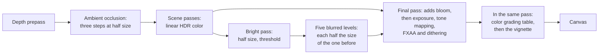

# The post-processing chain

> Ships in null3D 0.2. The API is experimental, so it can still change between versions. In this version the chain has HDR scene color, ambient occlusion, bloom, and the final pass with color grading and the vignette. Outlines and custom effects are not built yet. Coding agents must not use them.



Ambient occlusion runs before the scene's opaque objects shade. It reads the depth that the depth prepass draws first, and the opaque pass darkens its ambient light with the result. The scene passes draw linear color with no upper limit into a float target, the scene color. Effects that need that range, such as bloom, read it before the final pass. The final pass then does all of its work for each pixel in one pass. It adds the effects' results and applies the exposure and the tone mapping. Then it smooths edges with FXAA, encodes sRGB and dithers. Last, it grades the display color with a color grading table and the vignette, when the sketch sets them.

Every full-screen pass reads and writes the whole screen once more. On a phone at its full resolution that is tens of megabytes per frame, so the engine keeps such passes few. Bloom's passes draw at half the render size and below, and the final pass reads their results without a pass of its own.

Turn effects on with `post.set` in the sketch:

```ts
import { defineSketch } from '@null3d/engine';

export default defineSketch(({ scene, geometry, materials, post }) => {
  post.set({ bloom: { strength: 0.8, radius: 0.4, threshold: 1 } });
  scene.setBackground('#06080c');
  const camera = scene.createPerspectiveCamera({ position: [0, 1, 6], target: [0, 0, 0] });
  scene.setActiveCamera(camera);
  // Emissive light above 1 is brighter than white, so it passes the threshold and glows.
  const lamp = materials.standard({ color: '#000000', emissive: '#ffd080', emissiveIntensity: 8 });
  scene.createMesh({ mesh: geometry.sphere({ radius: 0.5 }), material: lamp });
  return {};
});
```

## Bloom

Bloom spreads light from the brightest parts of the scene into their surroundings, as a camera lens does. It follows three.js's `UnrealBloomPass` step by step:

1. The bright pass reads the scene color at half size. It keeps each pixel whose luminance reaches `threshold`, and turns the others black.
2. Five levels blur the bright pass, each with a Gaussian blur across and then down. Each level has half the size of the level before it and a wider blur, so the levels spread the light ever further.
3. The final pass adds the levels to the scene color before the tone mapping. The strength scales their sum. The radius moves weight from the narrow levels to the wide ones.

| Setting | Values | Default |
| --- | --- | --- |
| `strength` | A number from 0 up. | 1 |
| `radius` | A number from 0 to 1. | 0.5 |
| `threshold` | A luminance from 0 up, in linear color before the exposure. | 1 |

- The settings mean what `UnrealBloomPass`'s settings mean, with the same kernels and weights. In the engine's parity tests, null3D's bloom matches three.js's in all but under 0.1% of the pixels on every GPU path.
- At a threshold of 1, only light brighter than white glows. An emissive material with an `emissiveIntensity` above 1 gives such light, and so does a strong light on a bright surface. At a threshold of 0, every pixel glows a little.
- Bloom adds light before the tone mapping, so it never clips at white on its own. On a transparent canvas it also adds coverage, so the glow shows over the page.
- `post.set({ bloom: false })` turns bloom off. The settings keep their values, so `post.set({ bloom: {} })` turns it on again with them.

### Cost

Bloom draws eleven small passes and adds five texture reads to each pixel of the final pass. Its targets take about 0.66 times the scene color's memory at full resolution, in the scene color's format. They follow the render scale, so a lower scale costs less, and a new scale makes no new target. The targets exist only while bloom is on.

The `bloomSamples` quality setting is the share of `UnrealBloomPass`'s texture reads that each blur makes: 1, 0.5 or 0.25. A lower share reads the same blur in fewer, coarser steps, so the glow keeps its size. When frames take too long and bloom is on, the frame-budget governor halves the share, after its other steps. [Quality presets](quality-presets.md) lists the governor's steps.

## Ambient occlusion

Ambient occlusion darkens the light that comes from all around where nearby surfaces hide a surface from it. That happens in corners, in creases and under objects that rest on the ground. It follows three.js's `GTAOPass` step by step, at half the render size:

1. The depth prepass draws the opaque objects' depth. Ambient occlusion turns the prepass on while it draws.
2. A first step copies the depth of one pixel under each texel.
3. The horizon step rebuilds each surface's normal from the depth around it. Then it searches 3 slices around the view for the surfaces that hide the sky, and finds how open the surface is.
4. A blur over a disk of 16 taps smooths the result along each surface, and keeps it apart from other surfaces.
5. The opaque pass reads the four texels around each pixel, and darkens its ambient light. The texels whose depth lies near the pixel's own get the most weight.

```ts
post.set({ ao: { radius: 0.5, intensity: 1 } });
```

| Setting | Values | Default |
| --- | --- | --- |
| `radius` | How far from a surface the search reaches, in world units: 0 or more. | 0.25 |
| `thickness` | How far in front of a surface, along the view, an object still hides it: 0 or more. | 1 |
| `distanceExponent` | Above 0. Higher values gather the search's steps near the surface. | 1 |
| `distanceFalloff` | From 0 to 1: how much less the farther steps count. | 1 |
| `scale` | The power that the occlusion is raised to: above 1 darkens it. | 1 |
| `samples` | The depth samples of each pixel's search, a whole number from 1 to 64: 3 directions below 30, and 5 from 30. | 16 |
| `intensity` | From 0 to 1: how much of the occlusion reaches the ambient light. | 1 |

- The settings mean what `GTAOPass`'s settings mean, with the same search and blur. In the engine's parity tests, with `GTAOPass`'s defaults, null3D's image differs from three.js's in under 0.1% of the pixels on every GPU path. With a wider, darker search, under 1% differ, along the soft edges of the darkened areas.
- `GTAOPass` darkens the whole image, direct light and highlights included. null3D darkens only the ambient light, and the light that light maps add. A surface in the sun keeps its sunlight in a corner, as it would in the real world. In a scene that only ambient light lights, the two give the same image.
- Blended objects draw over the surfaces that ambient occlusion saw, so they take none.
- `post.set({ ao: false })` turns ambient occlusion off. The settings keep their values, so `post.set({ ao: {} })` turns it on again with them.

### Where ambient occlusion draws

The quality setting `aoScale` sets the size of ambient occlusion's targets, as a share of the render size each way. The High and Ultra presets, which desktops start with, draw at half size. Low and Medium, which phones and tablets start with, set 0, so ambient occlusion draws nothing there even when the sketch turns it on. A sketch that wants it on every device sets the scale too:

```ts
quality.set({ aoScale: 0.5 });
post.set({ ao: {} });
```

Ambient occlusion needs no HDR color, so it draws on the 8-bit path too. Its targets hold floats, which WebGL2 draws into only with the `EXT_color_buffer_float` extension. On a WebGL2 device without it, ambient occlusion stays off, and development builds warn once in the console.

### Cost

Ambient occlusion adds the depth prepass and three small passes at half the render size. It also adds four texture reads to each pixel that the opaque pass shades. The engine's ambient occlusion scene ran on a MacBook Pro in Chrome, at 3,024 x 1,518 pixels. There it added 2.42 ms of GPU time per frame. three.js's `GTAOPass` added about 5.3 ms to the same scene and canvas. At a render scale of 0.5 it added 1.18 ms.

- Its targets follow the render scale, so a lower scale costs less, and a new scale makes no new target. They take 20 bytes per texel at half size, 5 bytes per pixel of the canvas. They exist only while ambient occlusion draws.
- The depth prepass costs a second pass over the opaque objects' vertices. In a scene with many vertices it adds time of its own. [Quality presets](quality-presets.md#the-depth-prepass) says when the prepass pays.
- `aoScale: 0.25` draws at a quarter of the render size each way, with softer occlusion. Its steps then find a quarter as many texels. When frames take too long, the frame-budget governor takes that step last.
- Turning ambient occlusion on or off adds or removes passes. The last image stays on screen while the new pipelines build, which takes a few frames.

## Color grading and the vignette

A color grading table, from a `.cube` or a `.3dl` file through `assets.loadLut`, maps each display color to a graded color. The vignette darkens the picture toward its edges. Both follow three.js: `LUTPass` and `VignetteShader`, placed after its `OutputPass`. [The post-processing API](../api/post.md#color-grading) lists their settings.

- They work on display color, after the tone mapping, so they draw on every GPU path, the 8-bit path included.
- They are settings of the final pass, not passes of their own. Turning one on builds no pipeline, so the picture changes in the next frame with no pause.
- The table is a 3D texture, read with one filtered texture read per pixel. The vignette costs a few operations per pixel.
- The engine's parity tests compare two scenes with three.js's composer: a `.cube` table alone, and a table at 0.7 of its intensity with the vignette. Both match in all but under 0.1% of the pixels on every GPU path.

## Effects on devices without HDR color

Bloom needs the scene's linear color. Two kinds of device draw it with no float target at first, on the 8-bit path that [color management](color-management.md#the-8-bit-path) describes:

- WebGPU in compatibility mode with MSAA: this mode cannot multisample a float target. When a sketch turns bloom on, the engine moves to HDR color with FXAA for the rest of its life. Meanwhile the last image stays on screen until the new pipelines are built. On a desktop that takes two or three frames. `engine.capabilities.hdr` reports the path that the engine started on.
- WebGL2 devices whose float targets fail the engine's test. They have no HDR target, so bloom stays off. Development builds warn once in the console.

The devices that the engine was tested on all draw HDR color with WebGL2, and with core WebGPU.

## Porting from three.js

- Delete `EffectComposer`, `RenderPass` and `OutputPass`. The scene pass and the final pass are built in.
- `new UnrealBloomPass(resolution, strength, radius, threshold)` becomes `post.set({ bloom: { strength, radius, threshold } })`. The resolution is the canvas's, so it needs no setting.
- `new GTAOPass(scene, camera, width, height)` becomes `post.set({ ao: {} })`. Its `updateGtaoMaterial({ radius, thickness, distanceExponent, distanceFallOff, scale, samples })` settings keep their names, with `distanceFalloff` spelled so, and `blendIntensity` becomes `intensity`. Set `quality.set({ aoScale: 0.5 })` too where phones and tablets should draw it.
- `SSAOPass`, `SAOPass` and the N8AO library also become `post.set({ ao })`. Their settings have other meanings, so start from the defaults and tune `radius` and `scale` by eye.
- `renderer.toneMapping` and `toneMappingExposure` become `post.set({ toneMapping, exposure })`. three.js applies no tone mapping by default, and null3D applies ACES.
- `new LUTPass({ lut: result.texture3D, intensity })` after a `LUTCubeLoader` or `LUT3dlLoader` becomes `post.set({ lut: await assets.loadLut(url), lutIntensity: intensity })`.
- A `ShaderPass(VignetteShader)` with its `offset` and `darkness` uniforms becomes `post.set({ vignette: { offset, darkness } })`.

## Related pages

- [Post-processing API](../api/post.md): `post.set` and its settings.
- [Color management](color-management.md): HDR color, the final pass and the 8-bit path.
- [The render graph](render-graph.md): how the passes of a frame are declared and ordered.
- [Quality presets](quality-presets.md): `bloomSamples`, `aoScale`, the depth prepass and the frame-budget governor.
