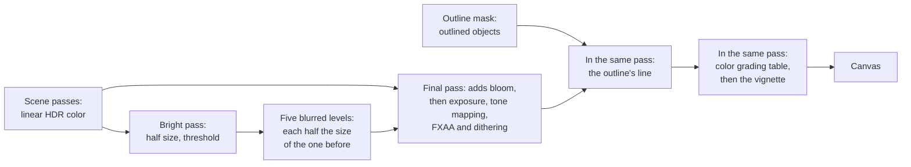

# The post-processing chain

> Ships in null3D 0.2. The API is experimental, so it can still change between versions. In this version the chain has HDR scene color, bloom, outlines, and the final pass with color grading and the vignette. Ambient occlusion and custom effects are not built yet. Coding agents must not use them.



The scene passes draw linear color with no upper limit into a float target, the scene color. Effects that need that range, such as bloom, read it before the final pass. The final pass then does all of its work for each pixel in one pass. It adds the effects' results and applies the exposure and the tone mapping. Then it smooths edges with FXAA, encodes sRGB and dithers. Last, it grades the display color with a color grading table and the vignette, when the sketch sets them.

Every full-screen pass reads and writes the whole screen once more. On a phone at its full resolution that is tens of megabytes per frame, so the engine keeps such passes few. Bloom's passes draw at half the render size and below. The outline draws only a mask of the outlined meshes. The final pass reads their results without a pass of its own.

Turn effects on with `post.set` in the sketch:

```ts
import { defineSketch } from '@null3d/engine';

export default defineSketch(({ scene, geometry, materials, post }) => {
  post.set({ bloom: { strength: 0.8, radius: 0.4, threshold: 1 } });
  scene.setBackground('#06080c');
  const camera = scene.createPerspectiveCamera({ position: [0, 1, 6], target: [0, 0, 0] });
  scene.setActiveCamera(camera);
  // Emissive light above 1 is brighter than white, so it passes the threshold and glows.
  const lamp = materials.standard({ color: '#000000', emissive: '#ffd080', emissiveIntensity: 8 });
  scene.createMesh({ mesh: geometry.sphere({ radius: 0.5 }), material: lamp });
  return {};
});
```

## Bloom

Bloom spreads light from the brightest parts of the scene into their surroundings, as a camera lens does. It follows three.js's `UnrealBloomPass` step by step:

1. The bright pass reads the scene color at half size. It keeps each pixel whose luminance reaches `threshold`, and turns the others black.
2. Five levels blur the bright pass, each with a Gaussian blur across and then down. Each level has half the size of the level before it and a wider blur, so the levels spread the light ever further.
3. The final pass adds the levels to the scene color before the tone mapping. The strength scales their sum. The radius moves weight from the narrow levels to the wide ones.

| Setting | Values | Default |
| --- | --- | --- |
| `strength` | A number from 0 up. | 1 |
| `radius` | A number from 0 to 1. | 0.5 |
| `threshold` | A luminance from 0 up, in linear color before the exposure. | 1 |

- The settings mean what `UnrealBloomPass`'s settings mean, with the same kernels and weights. In the engine's parity tests, null3D's bloom matches three.js's in all but under 0.1% of the pixels on every GPU path.
- At a threshold of 1, only light brighter than white glows. An emissive material with an `emissiveIntensity` above 1 gives such light, and so does a strong light on a bright surface. At a threshold of 0, every pixel glows a little.
- Bloom adds light before the tone mapping, so it never clips at white on its own. On a transparent canvas it also adds coverage, so the glow shows over the page.
- `post.set({ bloom: false })` turns bloom off. The settings keep their values, so `post.set({ bloom: {} })` turns it on again with them.

### Cost

Bloom draws eleven small passes and adds five texture reads to each pixel of the final pass. Its targets take about 0.66 times the scene color's memory at full resolution, in the scene color's format. They follow the render scale, so a lower scale costs less, and a new scale makes no new target. The targets exist only while bloom is on.

The `bloomSamples` quality setting is the share of `UnrealBloomPass`'s texture reads that each blur makes: 1, 0.5 or 0.25. A lower share reads the same blur in fewer, coarser steps, so the glow keeps its size. When frames take too long and bloom is on, the frame-budget governor halves the share, after its other steps. [Quality presets](quality-presets.md) lists the governor's steps.

## Outlines

Outlines draw a crisp line around the meshes that `setOutlined(true)` marks:

1. The mask pass draws the outlined meshes from the camera into a mask of the render size. Its depth test reads the depth that the scene passes drew, so it knows which parts other objects hide. Each mesh draws twice: once to mark all of it, and once to mark the parts that nothing hides.
2. The final pass reads the mask at each pixel and at 8 places on a circle of the line's width around it. Outside the outlined meshes, a pixel near a marked part is on the line. The line takes `color` beside a part that nothing hides, and `hiddenColor` where every part beside it is hidden.
3. The final pass paints the line after the tone mapping and before the color grading, so the line shows its colors exactly.

[The post-processing API](../api/post.md#outlines) lists the settings.

- The line has no blur, so it ends as sharply as the meshes' own edges. Its width counts pixels of the canvas, so it stays sharp at every pixel ratio and render scale.
- The mask pass culls the outlined meshes with the camera's view on its own, so outlined meshes out of view cost nothing.
- three.js draws every other object's depth again for its hidden parts. The mask pass reads the depth that the scene passes drew instead.
- The 8-bit path draws the same line as the HDR path.
- While nothing is outlined, the mask pass and the mask are off, so turning outlines on costs nothing until a mesh is outlined.

### Cost

Outlines draw the outlined meshes twice into the mask, which takes 4 bytes per pixel of the render size. The final pass then reads the mask once at each pixel, and 8 more times outside the outlined meshes. No other pass runs. The scene's depth stays in memory after the scene's render pass, where it could be thrown away before. On a phone's GPU, which keeps the depth on chip, that costs a write of the depth to memory.

## Color grading and the vignette

A color grading table, from a `.cube` or a `.3dl` file through `assets.loadLut`, maps each display color to a graded color. The vignette darkens the picture toward its edges. Both follow three.js: `LUTPass` and `VignetteShader`, placed after its `OutputPass`. [The post-processing API](../api/post.md#color-grading) lists their settings.

- They work on display color, after the tone mapping, so they draw on every GPU path, the 8-bit path included.
- They are settings of the final pass, not passes of their own. Turning one on builds no pipeline, so the picture changes in the next frame with no pause.
- The table is a 3D texture, read with one filtered texture read per pixel. The vignette costs a few operations per pixel.
- The engine's parity tests compare two scenes with three.js's composer: a `.cube` table alone, and a table at 0.7 of its intensity with the vignette. Both match in all but under 0.1% of the pixels on every GPU path.

## Effects on devices without HDR color

Bloom needs the scene's linear color. Two kinds of device draw it with no float target at first, on the 8-bit path that [color management](color-management.md#the-8-bit-path) describes:

- WebGPU in compatibility mode with MSAA: this mode cannot multisample a float target. When a sketch turns bloom on, the engine moves to HDR color with FXAA for the rest of its life. Meanwhile the last image stays on screen until the new pipelines are built. On a desktop that takes two or three frames. `engine.capabilities.hdr` reports the path that the engine started on.
- WebGL2 devices whose float targets fail the engine's test. They have no HDR target, so bloom stays off. Development builds warn once in the console.

The devices that the engine was tested on all draw HDR color with WebGL2, and with core WebGPU.

## Porting from three.js

- Delete `EffectComposer`, `RenderPass` and `OutputPass`. The scene pass and the final pass are built in.
- `new UnrealBloomPass(resolution, strength, radius, threshold)` becomes `post.set({ bloom: { strength, radius, threshold } })`. The resolution is the canvas's, so it needs no setting.
- `new OutlinePass(resolution, scene, camera, selectedObjects)` becomes `post.set({ outline: { color, hiddenColor, width } })`, from `visibleEdgeColor` and `hiddenEdgeColor`. `OutlinePass` draws its edge at half size, so a `width` of twice its `edgeThickness` gives about the same line. three.js draws a dark brown line around hidden parts by default, and null3D draws none until `hiddenColor` is set. Each selected mesh calls `setOutlined(true)`. A selected model's copy from `scene.instantiate` calls it once for all of its meshes.
- `OutlinePass` blurs its edge, and `edgeStrength`, `edgeGlow` and `pulsePeriod` set how bright it is, how far it glows and how fast it pulses. null3D's line is crisp and opaque, so it has none of these settings. To pulse the line, change its color or width every frame.
- `renderer.toneMapping` and `toneMappingExposure` become `post.set({ toneMapping, exposure })`. three.js applies no tone mapping by default, and null3D applies ACES.
- `new LUTPass({ lut: result.texture3D, intensity })` after a `LUTCubeLoader` or `LUT3dlLoader` becomes `post.set({ lut: await assets.loadLut(url), lutIntensity: intensity })`.
- A `ShaderPass(VignetteShader)` with its `offset` and `darkness` uniforms becomes `post.set({ vignette: { offset, darkness } })`.

## Related pages

- [Post-processing API](../api/post.md): `post.set` and its settings.
- [Objects and transforms](../api/objects.md#mesh-calls): `setOutlined`.
- [Color management](color-management.md): HDR color, the final pass and the 8-bit path.
- [The render graph](render-graph.md): how the passes of a frame are declared and ordered.
- [Quality presets](quality-presets.md): `bloomSamples` and the frame-budget governor.
