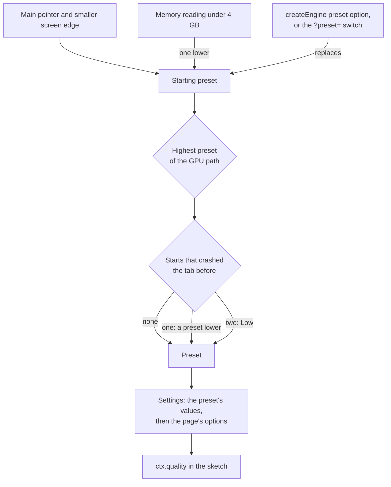
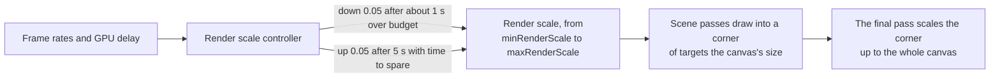

# Quality presets, dynamic resolution and frame budgets

> Ships in null3D 0.1. The API is experimental, so it can still change between versions. The engine chooses a preset, applies its pixel ratio cap, its render scale range, its texture settings, its anti-aliasing mode and its memory maximum, and reports it. Dynamic resolution moves the render scale during play. The settings that the table below marks as planned are not built yet. Neither are the frame-budget governor, the warm-up check that lowers a preset on a slow GPU, or `quality.setPreset`. Coding agents must not use them.



A quality preset is one row of settings: the pixel ratio cap, anti-aliasing, shadows, texture filtering and uploads, light limits and memory. null3D has four presets, from the lightest to the heaviest: Low, Medium, High and Ultra. The engine chooses one when it starts, from facts about the device and never from browser or GPU names. Each setting then starts at that preset's value.

Your sketch reads the preset and the settings from `ctx.quality`. Keep your own choices for each device in a table keyed by preset, as the engine does. Never check the device type in your own code.

```ts
import { defineSketch } from '@null3d/engine';

// Particles per preset, in one table, like the engine's own settings.
const PARTICLES = { low: 500, medium: 2000, high: 5000, ultra: 10000 };

export default defineSketch(({ quality }) => {
  let particles = PARTICLES[quality.preset];
  quality.onChange(() => {
    particles = PARTICLES[quality.preset];
  });
  return {
    onUpdate(dt) {
      // Move `particles` particles.
    },
  };
});
```

## How the engine chooses a preset

The engine starts from the kind of device. A coarse main pointer, as on a touch screen, marks a phone or a tablet, and the screen's smaller edge tells them apart. That edge stays the same when the device turns and when the browser's address bar hides.

<!-- null3d:preset-devices:start -->

| Device | Main pointer | Smaller screen edge | Starting preset |
| --- | --- | --- | --- |
| Phone | coarse | under 600 CSS pixels | Low |
| Tablet | coarse | 600 CSS pixels or more | Medium |
| Desktop or laptop | fine | any | High |

A memory reading under 4 GB lowers the starting preset by one.

<!-- null3d:preset-devices:end -->

Only Chromium browsers report the device's memory, and they report at most 8 GB. So memory can lower a preset, but it never raises one. The engine picks Ultra only when a page asks for it.

The GPU path then caps the preset, because WebGL2 and WebGPU's compatibility mode lack features that the heavier presets use. For example, compatibility mode cannot draw multisampled float targets.

<!-- null3d:preset-ceilings:start -->

| GPU path | Highest preset |
| --- | --- |
| WebGPU | Ultra |
| WebGPU's compatibility mode | Medium |
| WebGL2 | Medium |

<!-- null3d:preset-ceilings:end -->

A page can name a preset instead, such as a preset that a player picked in a menu. The GPU path still caps it:

```ts
const engine = await createEngine({ canvas, sketch, preset: 'high' });
console.log(engine.mode.preset); // 'medium' on WebGL2
```

A name that is not `auto`, `low`, `medium`, `high` or `ultra` fails the start with [E1213](../errors/E1213.md). The `?preset=low` switch in the page's address fixes the preset for tests, and wins over the option.

## Starts that crashed the tab

A phone closes a tab that uses too much memory, and the page gets no event for it. So while the engine starts, it keeps a note in the page's `localStorage`. It removes the note once the engine has drawn for its first few seconds, or when the page stops the engine or leaves before then. A note that the next start finds means that the tab crashed during that start:

- After one crashed start, the engine starts one preset lower than it would.
- After two in a row, it starts at Low. If the start that crashed drew with WebGPU, it draws with WebGL2, unless the page names a GPU path.

This also applies to a preset that the page names, so a device that crashed at the player's choice can start again. The page can read the count in `engine.mode.crashedStarts` and tell the player. When the browser refuses the storage, as in a sandboxed frame, each start counts as a normal one. Hold mode and the `?preset=` switch leave the note alone. The note belongs to one sketch module and one origin.

## The settings of each preset

Each value is a starting point, which measurements on phones, tablets and desktops tune from release to release. A setting that changes "during play" takes a new value at any time. One that changes "at the start" is fixed once the preset starts. The memory maximum is fixed before the engine loads. "Planned" settings belong to features that are not built yet.

<!-- null3d:preset-settings:start -->

| Setting | Low | Medium | High | Ultra | Changes | Status |
| --- | --- | --- | --- | --- | --- | --- |
| Pixel ratio cap (`maxPixelRatio`) | 1.5 | 2 | 2 | none | during play | built |
| Lowest render scale (`minRenderScale`) | 0.5 | 0.6 | 0.75 | 1 | during play | built |
| Highest render scale (`maxRenderScale`) | 1 | 1 | 1 | 1 | during play | built |
| Anti-aliasing (`antialias`) | FXAA | MSAA 4x | MSAA 4x | MSAA 4x | at the start | built |
| Shadow cascades (`shadowCascades`) | 1 | 2 | 3 | 4 | at the start | planned |
| Shadow map size in texels (`shadowMapSize`) | 1024 | 2048 | 2048 | 4096 | at the start | planned |
| Shadow filter (`shadowFilter`) | 3 x 3 taps | 3 x 3 taps | 5 x 5 taps | 5 x 5 taps | at the start | planned |
| Far cascade updates (`farCascadeInterval`) | every 4th frame | every 3rd frame | every 2nd frame | every 2nd frame | during play | planned |
| Point light shadows (`pointLightShadows`) | no | no | yes | yes | at the start | planned |
| Depth prepass (`depthPrepass`) | no | no | yes | yes | at the start | planned |
| Anisotropic filtering cap (`maxAnisotropy`) | 2x | 4x | 8x | 16x | during play | built |
| Texture uploads per frame (`uploadBytesPerFrame`) | 2 MiB | 4 MiB | 8 MiB | 16 MiB | during play | built |
| Point and spot lights per frame (`maxLights`) | 256 | 256 | 512 | 1024 | at the start | planned |
| Lights per cluster (`maxLightsPerCluster`) | 32 | 64 | 64 | 128 | at the start | planned |
| Texture memory budget (`textureMemoryMiB`) | 256 MiB | 512 MiB | 1024 MiB | 2048 MiB | at the start | planned |
| Engine memory maximum (`memoryMaximumMiB`) | 1024 MiB | 1024 MiB | 1024 MiB | 1024 MiB | before loading | built |

<!-- null3d:preset-settings:end -->

The pixel ratio cap is the cheapest large saving on phones. The GPU fills each device pixel, and a screen's device pixels grow with the square of its ratio. So a ratio of 3 fills 2.25 times the pixels of a ratio of 2. The `maxPixelRatio` option of `createEngine` replaces the preset's cap, and `quality.set({ maxPixelRatio })` changes it during play.

The anisotropic filtering cap limits the `anisotropy` option of every texture, so surfaces seen at a slant cost fewer texture reads on the lighter presets. The upload budget limits the texel bytes that one frame sends to the GPU, so loading many textures does not make one frame slow. A larger texture goes up over several frames. `quality.set({ maxAnisotropy, uploadBytesPerFrame })` changes either during play.

Low smooths edges with FXAA, and the other presets with MSAA. MSAA draws 4 samples per pixel, which costs a phone's GPU memory and bandwidth. FXAA draws one sample and smooths edges in the final pass, at a small cost in sharpness. The `antialias` option of `createEngine` replaces the preset's mode. The mode then stays fixed while the engine runs, because the scene's targets and pipelines depend on it. [GPU tiers and backends](backends.md#color-and-anti-aliasing-on-each-tier) compares the modes.

The engine makes its memory while it tests the GPU paths. So the memory maximum follows the starting preset and the crashed starts, and the GPU path does not cap it. The `memory` option of `createEngine` replaces it: [Page API](../api/engine.md#memory).

## Dynamic resolution



The engine can draw the scene at a render scale below the canvas's size. Its final pass then scales the image up to the canvas. The render scale is a part of the canvas's width and height. At 0.5, the scene fills a quarter of the canvas's pixels. Most of a frame's GPU work grows with the pixels that it fills. So a lower scale keeps the frame rate on a GPU that falls behind, and the image gets softer.

During play, the engine moves the scale between the `minRenderScale` and `maxRenderScale` settings:

- It watches how often frames reach the screen and how often the GPU finishes one. It also watches how long the GPU takes to finish each frame.
- Frames are over budget when they come at least 10% slower than the target rate. They are also over budget when the GPU finishes each one two frames late or later. The target is the display's refresh rate, at most 60 frames per second.
- After about a second over budget, the scale drops by 0.05. The engine then waits a second, so it judges frames at the new scale.
- After 5 seconds at the target rate, with the GPU done with each frame within about one frame, the scale rises by 0.05. A rise that takes the frames over budget again doubles the wait before the next rise, up to 80 seconds. So the scale settles below the point where frames fall behind.
- It takes no step in the first 2 seconds of play, and it starts to judge the frames again after a pause.

The scene's render targets keep the canvas's size at every scale, and the scene draws into their top-left corner. So a new scale makes no GPU object and allocates no memory. `engine.measure()` counts the GPU objects that the engine made, in `gpuObjects`.

A sketch reads the scale in `quality.renderScale`, and changes the range with `quality.set`:

```ts
import { defineSketch } from '@null3d/engine';

export default defineSketch(({ quality, page }) => {
  page.onMessage((type, data) => {
    // A menu fixes the scale, or gives the range back to the engine.
    if (type === 'resolution' && data === 'half') quality.set({ minRenderScale: 0.5, maxRenderScale: 0.5 });
    if (type === 'resolution' && data === 'auto') quality.set({ minRenderScale: 0.5, maxRenderScale: 1 });
  });
  return {
    onUpdate() {
      // quality.renderScale is the scale of the frame being drawn.
    },
  };
});
```

A `minRenderScale` of 1 keeps the whole canvas. Hold mode draws at `maxRenderScale`, so tests draw the same image on every run. Some GPU paths draw the scene's color in 8 bits: WebGPU's compatibility mode, and WebGL2 devices that cannot draw multisampled float targets. There, with MSAA, a lowest scale below 1 adds the final pass, which copies the image to the canvas. At a lowest scale of 1, the scene's render pass writes straight to the canvas. Below a scale of 1, the final pass scales the image up instead of running FXAA: the scaling softens edges already.

## Related pages

- [Quality API](../api/quality.md): `ctx.quality`, its settings and its errors.
- [Phones and tablets](../guides/phones.md): pixel ratios, memory and testing on real devices.
- [GPU tiers and backends](backends.md): how the engine picks the GPU path.
- [Page API: createEngine](../api/engine.md): the `preset`, `maxPixelRatio` and `memory` options, and `engine.mode`.
